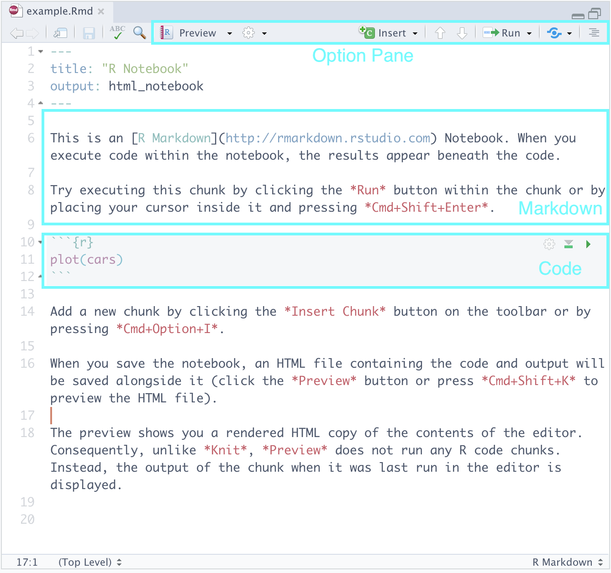

# (PART) Introduction {-} 

# What Is Data Science?

Data science is a field of science that aims at discovering patterns and extracting knowledge through analysis of data and developing methods to support such investigation. The field is rooted in mathematics, statistics, computer science, and vision science and has contributed to a wide array of disciplines, e.g.,  biology, chemistry, economics, literary studies, medicine, physical sciences, and psychology. 

What does data science look like? Here is a short list of some examples, followed by a discipline that appears most relevant to the problem. 

* Tracking places where crimes occur in cities for crime prevention (criminology)
* Tracking social media postings to understand changes in public opinion (political science)
* Dynamically changing advertisements in search engines based on browsing history and query terms (marketing)
* Predicting trajectories of hurricanes (physical sciences)
* Finding genetic factors contributing diseases (medicine)
* Differentiating among novelists based on their writing styles (literary studies)
* Winnowing an enormous candidate list of chemicals for a target effect based on their known properties (chemistry)
* Diagnosing pulmonary diseases based on patient X ray images (medicine)
* Identifying students that are at-risk (education)

The prominence of data science comes from the fact that the means for collecting, sharing and analyzing data have become widely accessible thanks to the rise of computers. In many disciplines, research by way of data science has received a formidable status. It is thus important for new generations of professionals (educators, scientists, engineers, doctors, etc.) to understand data science fundamentals and know how to start explorations using data science. The objective of this course is to introduce the basics of data science and to teach data science tools and concepts that have immediate practical value to the students' field of interest.  

One such tool that we will study is the programming language R. R has its roots in statistics and has a wide variety of tools that make it easy for R programmers to conduct statistical analysis and visualization. While R is certainly not the only programming language data scientists use -- you may have heard about Python or Julia -- we identify some key reasons for designating it as the language for this course. 

* The syntax (i.e., the rules for writing code in a programming language) is easier to digest and understand for newcomers to programming. 
* R is not just a language, but an interactive environment for doing data science. This makes R much more flexible than many other programming languages, and helps focus on specific parts of the data science process. 
* R allows the use of "notebooks" that allow programmers to interleave code with prose in an intuitive manner. This is a great way for data scientists to explain and share their work with peers. 

After completing the course, students will be able to keep running and modifying their notebooks with new data sources and ideas.

## Enter the `tidyverse`

The bare-bones version of R, sometimes called *base* R, is complete but requires a bit more effort to write code for data analysis. People have developed code in R for serving certain purposes and have shared it as *packages*. Using packages is key to successful application of R; you can load a package someone else has written into your R programming environment and use it for your coding.

A nonprofit organization promoting R, [CRAN](https://cran.r-project.org/) (the **c**omprehensive **R** **a**rchive **n**etwork), maintains packages researchers have developed. The majority of the packages we will be studying in this course are part of the *tidyverse*, which is actually a collection of packages that are useful for data analysis and visualization; they are designed to work together with ease.  

The tidyverse can be installed with just a single line of code. 

```{r eval=FALSE}
install.packages("tidyverse")
```

Type the above in the console, and press "Enter" to run it. R will download the packages from CRAN and install them on to your computer. 

Let us see an example of how to plot some data using the `tidyverse`. 

### The World's Telephones

R ships with a number of off-the-shelf data sets you can play with. One of them is `WordPhones`, which provides the number of telephones in some large geographical regions of the world in 1951 and 1956-1961.

The analysis begins by loading the package into your programming environment.

```{r message = FALSE, warning = FALSE}
library(tidyverse)
```

This dataset is a 7x7 table of numbers where the rows correspond to years and the columns correspond to seven geographical areas: North America, Europe, Asia, South America, Oceania, Africa, and Middle America (meaning Central America).

We can inspect the table contents by typing its name into the console. 

```{r eval = FALSE}
WorldPhones
```

```{r echo = FALSE}
as.data.frame(WorldPhones)
```

Run your eye down the table and observe that the number of telephones in each region increases, some by much more than others.  

Suppose our goal is to plot the trend in the seven regions over the years. To accomplish this, we need to do some *data tidying*. Namely, we need the region and the number of telephones to appear as column pairs; we also give the year its own column. 

```{r}
transformed <- WorldPhones %>%
  as.data.frame() %>%
  rownames_to_column("Year") %>% 
  pivot_longer(cols = 2:8, names_to = "Area", values_to = "Count")
```

Here is how the new dataset looks like. We see that there are seven rows for each year and the regions and their counts appear vertically as a pair of columns.

```{r}
transformed
```

Don't worry if the code above seems overwhelming. We will go over each piece in great detail during the course. For now, just pay attention to what the dataset looks like after the transformation, and how it differs from the original. 

We can now plot the number of telephones with the year as the horizontal axis and the count as the vertical axis. We assign a different color to each of the seven regions.

```{r}
ggplot(transformed, aes(x = Year, y = Count)) +
  geom_point(aes(color = Area))
```

We call this a *scatter plot*, which we will see later in the course. This scatter plot tells us that the numbers steadily increased in North America, Europe, and Asia.

We can also plot the changes as bars where color denotes a certain region.

```{r}
ggplot(transformed) +
  geom_bar(aes(x = Year, y = Count, fill = as.factor(Area)),
           stat = "identity", position = "fill") +
  labs(fill = "Area")
```

We call this one a *stacked bar chart*, which we will also see later. Every plot tells a different story. This one signals to us how the *proportion* of telephones changes across each region.     

Can you spot some more differences between the two plots, especially in regards to what they say about the data?

## Processing Text 

Here is another example where we play with a textual dataset. As before, do not pay attention to the details of the code and what it is doing. Rather, familiarize yourself with the output of each code "block" and observe how it builds up toward accomplishing the goal. 

### The Classics: Herman Melville's Moby Dick  

[The Gutenberg Project](http://www.gutenberg.org/) is an international project to provide literary texts in a variety of formats for public use. One of the main literary works the site offers is "Moby Dick" by Herman Melville. You can download from the website by providing its link.

As before, we need `tidyverse`. We will also use another package called `readtext`.

```{r message=FALSE, warning = FALSE}
library(tidyverse)
library(readtext)
```

We load the data from the Gutenberg Project and remove any preface or introductory material; we designate the loaded text with the name `moby`, so that we can refer to it again later on. 
```{r}
url <- "https://www.gutenberg.org/files/2701/2701-0.txt"
moby <- readtext(url) %>%
  str_sub(27780)
```

The current version of the text is what data scientists call "dirty." To make it tidy, we trim whitespaces and newline characters from the text, and lowercase all characters.   

```{r}
moby_chapters <- unlist(str_split(moby, fixed("CHAPTER"))) %>%
  str_trim() %>%
  str_replace_all("\\s+", " ") %>%
  str_to_lower()
```

We store the text in a table called `moby_df`. 

```{r, results='hide'}
moby_df <- tibble("chapters" = moby_chapters) %>% 
  slice(-1)
```

Here are what the first five chapters of Moby Dick look like after tidying. 

```{r eval = FALSE}
slice_head(moby_df, n = 5)
```

```{r warning = FALSE, message = FALSE, echo = FALSE}
library(kableExtra)

moby_chapters_tmp <- unlist(str_split(moby, fixed("CHAPTER"))) %>% 
  str_trim() %>%
  str_replace_all("\\s+", " ") %>%
  str_to_lower() %>%
  str_sub(end = 200) 
disp_df <- data.frame("chapters" = moby_chapters_tmp)


knitr::kable(
  head(disp_df, 5), booktabs = TRUE) %>%
  kable_styling(bootstrap_options = "striped", full_width = F) %>%
  column_spec(1, width = "30em")
```


### Plotting Word Relationships 

Now that we have the main text stored in tabular form, we are ready to do some analysis. Let us look at some associations between words in the text, for instance, between "ship" and "sea", and between "god" and "sea".

We compute in each chapter how many times each of the words occur: "ship", "sea", and "god". The results are stored as new columns appended to the table `moby_df`.

```{r}
moby_df <- moby_df %>%
  mutate(
    chapter_num = row_number(),
    ship = str_count(chapters, "ship"),
    sea = str_count(chapters, "sea"),
    god = str_count(chapters, "god")
  ) 
```

Here is what those new columns look like. 

```{r}
moby_df %>%
  select(chapter_num, ship, sea, god)
```

We draw a scatter plot showing the relationships between the pairs "ship" and "sea", and "god" and "sea". The former is shown in cyan and the latter in red. 

```{r message = FALSE}
ggplot(moby_df) +
  geom_point(aes(x = sea, y = ship, color = "ship")) + 
  geom_point(aes(x = sea, y = god, color = "god")) + 
  ylab("count")
```

We see a strong association between "sea" and "ship" since chapters that mention the word "sea" a lot tend to also mention "ship" a whole lot as well. The relationship between "sea" and "god" is less apparent. There is one chapter where "god" and "sea" both occur frequently, but overall it seems that the occurrences of "god" have nothing to do with occurrences of "sea". 

Indeed, word counts can only take us so far. But they are a first step in the interpretative process. For instance, why does it seem that there is no relationship between the sea, where most of the action takes place, and religion, as exemplified by the occurrences of the word "god"? Machine-assisted analysis of texts in this manner, which extends well beyond word counts, has become so popular that an interdisciplinary field called [Digital Humanities](https://en.wikipedia.org/wiki/Digital_humanities)  has become dedicated to its study. 

### A Rough Outline

Our two introductory examples have hopefully shown you a glimpse of what data science looks like. Here is the plan for the course. 

* We begin with a coverage of the fundamentals of R programming.
* We will move on to learning how the `tidyverse` can be used for data tidying and visualization.
* We then study how to extract *insights* from our data using statistical techniques.
* We end with some special topics, e.g., making *predictions* about data using regression analysis.  

We hope that you will find the journey interesting.

## Setting up a workflow 

In this course we will be using RStudio. RStudio is an integrated development environment (also known as an IDE) popularly used among data scientists for writing R code. It is a powerful tool that can be used to write and debug code, view visualizations, pull up documentation, write "notebooks", and much more which we will probably not get to see! In this section we will go over setting up RStudio on your machine, and discuss how we will use it in this course.

### Some prerequisites

First, you will need to install R and RStudio Desktop from the web. They can be found at the following links. 

* R: https://cloud.r-project.org
* RStudio: https://rstudio.com/products/rstudio/download/#download

### Meet RStudio 

Assuming you have successfully installed both, launch RStudio. There may be some "getting started" help guides that you are presented with, which you can ignore for now. Your next step will be to create a __R project__ for this course by going to: `File > New Project...`. 

```{r, echo=FALSE, fig.align="center", out.width='60%', fig.asp=1/2}
knitr::include_graphics('images/project_wizard.png')
```

From the options that are presented, select `New Directory > New Project`. This should bring up the following screen. 

```{r, echo=FALSE, fig.align="center", out.width='60%', fig.asp=1/2}
knitr::include_graphics('images/project_wizard2.png')
```

In the input box that asks for a "Directory name", you can name it whatever you like; however, you should use something informative -- like "CSC100" -- which we will name ours for this example. The default directory for this project is fine, but do make a note of it; also, do not worry about any of the check boxes and leave those unchecked. 

When you are ready, go ahead and select `Create Project`. This should present you with what will be our editing environment for the semester.   

```{r, echo=FALSE, fig.align="center", out.width='80%', fig.asp=1/2}
knitr::include_graphics('images/rstudio_environment.png')
```

Let us go over each of the labeled parts. 

* __Console.__ This is a great place to get started coding in R! It isn't fully featured like a R markdown notebook is (which we will see in a moment) and you wouldn't want to put anything important here as it will be lost as soon as you exit RStudio. However, it can be useful for checking small things, e.g. as a built-in calculator. Try out `2 + 2` and see what you get! You can also check the current "working directory" by typing `getwd()`. This will pull up the directory/folder on your machine where you created this project. Ours says: `"/Users/jerrybonnell/Documents/csc100"`. 

* __Environment.__ This is where RStudio keeps track of "objects" that R has created during your session. We haven't learned what these are yet, but you can revisit this part of the notes again to make sense of what is going on here. 

To demonstrate this, let us create an object `my_value` that holds the value 5. The benefit of the environment view is that it reminds us of the current value held by the object. Run this cell in the "Console" area of RStudio and then glance over at the "Environment" view.   

```{r}
my_value <- 5
```

Note what happens in the environment view if we were to change the value. As before, copy the following line of code into your console. 

```{r}
my_value <- "hello data science!"
```


* __File Explorer/Plots/Help.__ This area is actually a "three-in-one". At the moment, it presents you the files and folders that currently exist inside your project -- which is practically nothing at the moment. We will create some directories in just a moment. 

The __plots view__ reveals itself when you have created a visualization on the console. Here is an example. You need not understand what this code does; simply copy and paste into the console, and run. 

```{r eval = FALSE}
plot(cyl ~ mpg, mtcars)
```

Let us navigate to the __help tab__, which should be one or two tabs down from the "Plots" tab. Here, we can look up documentation about functions or datasets we would like to learn more about. For instance, in the search bar, we can type `plot` to look up information for the function `plot` we just used earlier. 

An equivalent, and perhaps more straightforward, way of looking up documentation is right from the console. Just type in `?plot`, hit enter, and on you go.  

### Organizing Your Work 

Let us create some folders in our project to organize our work for the semester. We recommend the following structure. You can use the `New Folder` button in the file explorer view to create these directories. 

```{r, echo=FALSE, fig.align="center", out.width='60%', fig.asp=1/2}
knitr::include_graphics('images/file_directory.png')
```

The folder names should be self-explanatory, but here is a brief explanation: 

* `labs`, for working on lab assignments. 
* `hw`, for working on homework assignments.
* `notes`, for your own notes, say, from lecture. 
* `project`, for working on the project. 

What files will we be writing in each of these folders? Let us turn to the next section and find out!  

### R Markdown Notebooks 

All of the assignments in this course will be distributed as *R markdown notebooks*, which allows users to intersperse code with prose in an intuitive manner; this is great to use in practice for sharing and communicating your work to peers.

We can try playing with an example notebook that RStudio automatically generates when creating a notebook. Let us try it. 

Navigate to `File > New File > R Notebook`. Save this notebook somewhere appropriate, say, in your `notes` directory. Here is what you should be seeing: 

```{r, echo=FALSE, fig.align="center", out.width='60%', fig.asp=1/2}

```

Let us go over the parts.  

* __Markdown.__ Here you can type text as you would normally in text processing software like Notepad++, TextEdit, or Word. The cool feature is that the text can be marked up using a language called *markdown*. [Here is a cheat sheet](https://github.com/adam-p/markdown-here/wiki/Markdown-Cheatsheet) that you can use as reference.

* __Code__. Here is where we will be writing most of our R code. We may also call these code "cells" or "blocks". When you are ready to run a code block, you can press the green "play" button that appears toward the top right of the block. Observe how it produces output in-line just below the code -- neat, right?     

* __Option Pane__. There are some features here you may wish to explore like the `Run` button which allows you to run all the code blocks in a notebook at once, etc. The feature we would like to draw your attention to is something called *knitting*, which can be found after pressing the downward arrow next to `Preview`. This should show several options, one of which is `Knit to PDF`. Go ahead and select it. 

If you navigate to the `notes` directory in the File Explorer (or wherever you created this notebook), you should see a PDF file that has been generated. Clicking on it in the File Explorer should present you with a PDF version of the notebook. 

What RStudio did was take our R markdown file and convert it to a PDF using [LaTeX](https://en.wikipedia.org/wiki/LaTeX). Beneath each code block is the corresponding output, interspersed neatly with the surrounding prose -- all formatting taken care of for you :-) 

When you are done with weekly labs and assignments, you will *knit* your notebook to a LaTeX PDF file and submit that to Blackboard. 

### Final touches 

Before we end this tutorial, we need to set two RStudio settings. This will help to  avoid any heartache throughout the course. 

Open up `Preferences` in RStudio. Do the following in the `General` tab:

* Uncheck the box that says "Restore .RData into workspace at startup"
* Following the text that says "Save workspace data to .RData on exit:", select `Never`. 

We are done with our setup!


