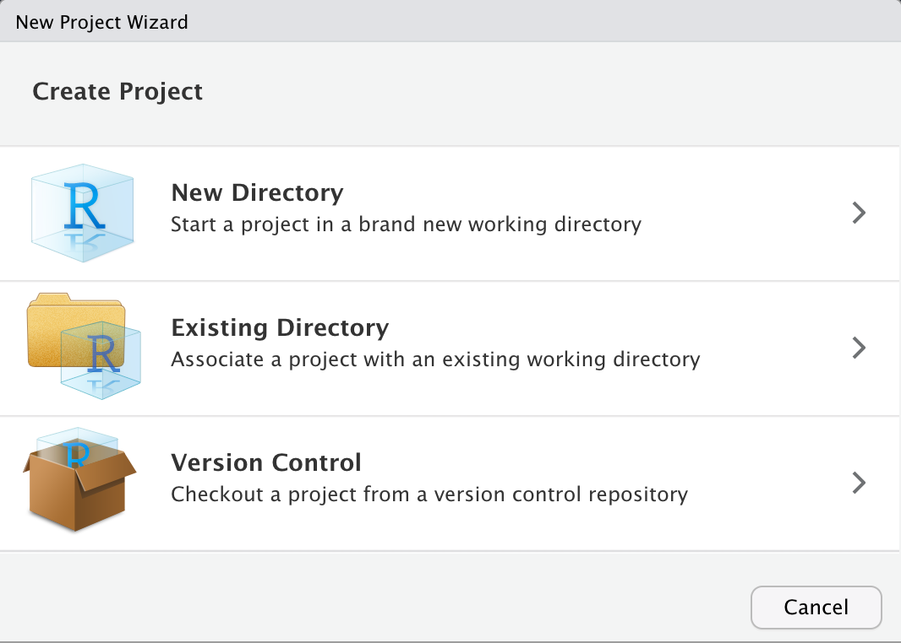
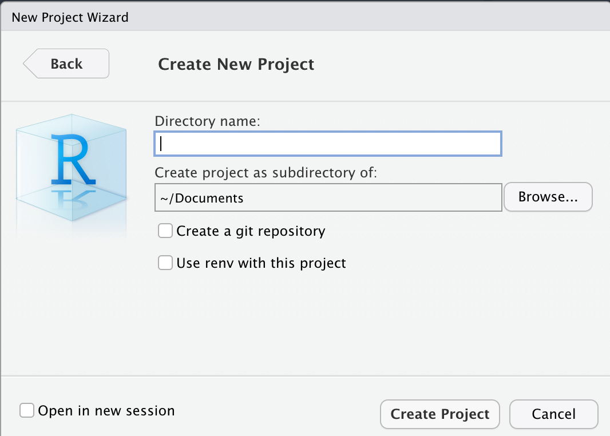
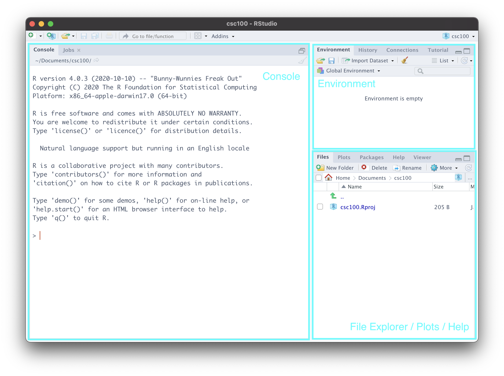
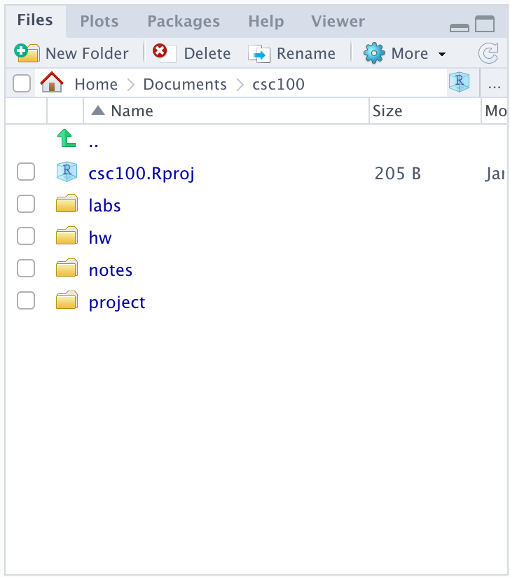
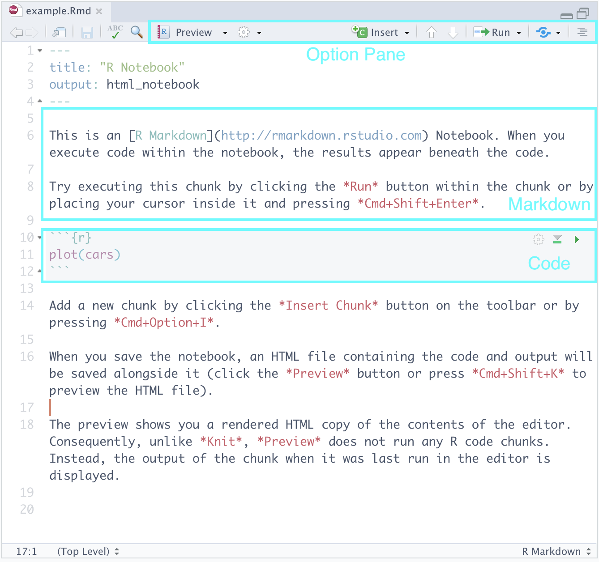

---
output:
  pdf_document: default
  html_document: default
---

\mainmatter

# (PART) Introduction {-} 

# Getting Started

```{r echo=FALSE, message=FALSE, warning=FALSE}
library(webshot)
options(tinytex.clean = FALSE)
```

Data science is a field of science that aims at discovering patterns and extracting knowledge through analysis of data and developing methods to support such investigation. The field is rooted in mathematics, statistics, computer science, and vision science and has contributed to a wide array of disciplines, e.g.,  biology, chemistry, economics, literary studies, medicine, physical sciences, and psychology. 


## Game of the Name 

What does data science look like? Here is a short list of some examples, followed by a discipline that appears most relevant to the problem. 

* Tracking places where crimes occur in cities for crime prevention (criminology)
* Tracking social media postings to understand changes in public opinion (political science)
* Dynamically changing advertisements in search engines based on browsing history and query terms (marketing)
* Predicting trajectories of hurricanes (physical sciences)
* Finding genetic factors contributing diseases (medicine)
* Differentiating among novelists based on their writing styles (literary studies)
* Winnowing an enormous candidate list of chemicals for a target effect based on their known properties (chemistry)
* Diagnosing pulmonary diseases based on patient X ray images (medicine)
* Identifying students that are at-risk (education)

The prominence of data science comes from the fact that the means for collecting, sharing and analyzing data have become widely accessible thanks to the rise of computers. In many disciplines, research by way of data science has received a formidable status. It is thus important for new generations of professionals (educators, scientists, engineers, doctors, etc.) to understand data science fundamentals and know how to start explorations using data science. The objective of this text is to introduce the basics of data science and to teach data science tools and concepts that have immediate practical value to the students' field of interest.  

One such tool that we will study is the programming language R. R has its roots in statistics and has a wide variety of tools that make it easy for R programmers to conduct statistical analysis and visualization. While R is certainly not the only programming language data scientists use -- you may have heard about Python or Julia -- we identify some key reasons for designating it as the language for this textbook. 

* The syntax (i.e., the rules for writing code in a programming language) is easier to digest and understand for newcomers to programming. 
* R is not just a language, but an interactive environment for doing data science. This makes R much more flexible than many other programming languages, and helps focus on specific parts of the data science process. 
* R allows the use of "notebooks" that allow programmers to interleave code with prose in an intuitive manner. This is a great way for data scientists to explain and share their work with peers. 

After completing the text, students will be able to keep running and modifying their notebooks with new data sources and ideas.

## Package Installation

The bare-bones version of R, sometimes called *base* R, is complete but requires a bit more effort to write code for data analysis. People have developed code in R for serving certain purposes and have shared it as *packages*. Using packages is key to successful application of R; you can load a package someone else has written into your R programming environment and use it for your coding.

A nonprofit organization promoting R, [CRAN](https://cran.r-project.org/) (the **c**omprehensive **R** **a**rchive **n**etwork), maintains packages researchers have developed. The majority of the packages we will be studying in this text are part of the *tidyverse*, which is actually a collection of packages that are useful for data analysis and visualization; they are designed to work together with ease.  

The tidyverse can be installed with just a single line of code. 

```{r eval=FALSE}
install.packages("tidyverse")
```

Type the above in the console, and press "Enter" to run it. R will download the packages from CRAN and install them on to your computer. 

Sharing code through CRAN is the best way to make your package discoverable by the R community and give your package a "stamp of authenticity." However, publishing to CRAN can be a frustrating (and sometimes long) process. To make package development easier, authors can first release their R package as a [GitHub](https://github.com/) repository. Users can then download and install the package to their system using a package called `devtools`. 

Many of the book's datasets are made available through a package called `edsdata` which, at the time of this writing, is available only as a GitHub repository. The package can be installed using `devtools`. First, make sure you have `devtools` installed.

```{r eval=FALSE}
install.packages("devtools")
```

The `edsdata` package can then be installed using `devtools` as follows:

```{r eval=FALSE}
devtools::install_github("jerrybonnell/edsdata")
```

We will see examples that use the `edsdata` package later in the text. For now, let us see an example of how to plot some data using code from the `tidyverse`. 

### The world's telephones

Base R ships with a number of off-the-shelf data sets you can play with. One of them is `WordPhones`, which provides the number of telephones in some large geographical regions of the world in 1951 and 1956-1961.

The analysis begins by loading the package into your programming environment.

```{r message = FALSE, warning = FALSE}
library(tidyverse)
```

This dataset is a 7x7 table of numbers where the rows correspond to years and the columns correspond to seven geographical regions: North America, Europe, Asia, South America, Oceania, Africa, and Middle America (meaning Central America).

We can inspect the table contents by typing its name into the console. 

```{r eval = FALSE}
WorldPhones
```

```{r echo = FALSE}
as_tibble(WorldPhones)
```

Run your eye down the table and observe that the number of telephones in each region increases, some by much more than others.  

Suppose our goal is to plot the trend in the seven regions over the years. To accomplish this, we need to do some *data tidying*. Namely, we need the region and the number of telephones to appear as column pairs; we also give the year its own column. 

```{r}
transformed <- WorldPhones |>
  as_tibble() |>
  rownames_to_column("Year") |> 
  pivot_longer(cols = 2:8, names_to = "Region", values_to = "Count")
```

Here is how the new dataset looks like. We see that there are seven rows for each year and the regions and their counts appear vertically as a pair of columns.

```{r}
transformed
```

Don't worry if the code above seems overwhelming. We will go over each piece in great detail in this text. For now, just pay attention to what the dataset looks like after the transformation, and how it differs from the original. 

We can now plot the number of telephones with the year as the horizontal axis and the count as the vertical axis. We assign a different color to each of the seven regions.

```{r}
ggplot(transformed, aes(x = Year, y = Count)) +
  geom_point(aes(color = Region))
```

We call this a *scatter plot*, which we will see later in the text. This scatter plot tells us that the numbers steadily increased in North America, Europe, and Asia.

We can also plot the changes as bars where color denotes a certain region.

```{r}
ggplot(transformed) +
  geom_bar(aes(x = Year, y = Count, fill = as.factor(Region)),
           stat = "identity", position = "fill") +
  labs(fill = "Region")
```

We call this one a *stacked bar chart*, which we will also see later. Every plot tells a different story. This one signals how the *proportion* of telephones changes across each region. For instance, the stacked bar chart makes it easier to see how the Asia and Africa regions gradually increase its share of telephone usage when compared to the scatter plot.       

Can you spot some other differences between the two plots, especially in regards to what the visualizations say about the data?

## Processing Text 

Here is another example where we play with a textual dataset. As before, do not pay attention to the details of the code and what it is doing. Rather, familiarize yourself with the output of each code "block" and observe how it builds up toward accomplishing the goal. 

### The classics: Herman Melville's Moby Dick  

[The Gutenberg Project](http://www.gutenberg.org/) is an international project to provide literary texts in a variety of formats for public use. One of the main literary works the site offers is "Moby Dick" by Herman Melville. You can download from the website by providing its link.

As before, we need `tidyverse`. We will also use another package called `readtext`.

```{r message=FALSE, warning = FALSE}
library(tidyverse)
library(readtext)
```

We load the data from the Gutenberg Project and remove any preface or introductory material; we designate the loaded text with the name `moby`, so that we can refer to it again later on. 

```{r}
url <- "https://www.gutenberg.org/files/2701/2701-0.txt"
moby <- readtext(url) |>
  str_sub(27780)
```

The current version of the text is what data scientists call "dirty." To make it tidy, we trim whitespaces and newline characters from the text, and lowercase all characters.   

```{r}
moby_chapters <- unlist(str_split(moby, fixed("CHAPTER"))) |>
  str_trim() |>
  str_replace_all("\\s+", " ") |>
  str_to_lower()
```

We store the text in a table called `moby_df`. 

```{r, results='hide'}
moby_df <- tibble("chapters" = moby_chapters) |> 
  slice(-1)
```

Here are what the first five chapters of Moby Dick look like after tidying. 

```{r eval = FALSE}
slice_head(moby_df, n = 5)
```

```{r warning = FALSE, message = FALSE, echo = FALSE}
library(kableExtra)

moby_chapters_tmp <- unlist(str_split(moby, fixed("CHAPTER"))) |>
  str_trim() |>
  str_replace_all("\\s+", " ") |>
  str_to_lower() |>
  str_sub(end = 200) 
  

disp_df <- tibble("chapters" = moby_chapters_tmp) |>
  slice(-1)

knitr::kable(
  head(disp_df, 5), booktabs = TRUE) |>
  kable_styling(bootstrap_options = "striped", full_width = F) |>
  column_spec(1, width = "30em")
```


### Plotting word relationships 

Now that we have the main text stored in tabular form, we are ready to do some analysis. Let us look at some associations between words in the text, for instance, between "ship" and "sea", and between "god" and "sea".

We compute in each chapter how many times each of the words occur: "ship", "sea", and "god". The results are stored as new columns appended to the table `moby_df`.

```{r}
moby_df <- moby_df |>
  mutate(
    chapter_num = row_number(),
    ship = str_count(chapters, "ship"),
    sea = str_count(chapters, "sea"),
    god = str_count(chapters, "god")
  ) 
```

Here is what those new columns look like. 

```{r}
moby_df |>
  select(chapter_num, ship, sea, god)
```

We draw a scatter plot showing the relationships between the pairs "ship" and "sea", and "god" and "sea". The former is shown in cyan and the latter in red. 

```{r message = FALSE}
ggplot(moby_df) +
  geom_point(aes(x = sea, y = ship, color = "ship")) + 
  geom_point(aes(x = sea, y = god, color = "god")) + 
  ylab("count")
```

We see a strong association between "sea" and "ship" since chapters that mention the word "sea" a lot tend to also mention "ship" a whole lot as well. The relationship between "sea" and "god" is less apparent. There is one chapter where "god" and "sea" both occur frequently, but overall it seems that the occurrences of "god" have nothing to do with occurrences of "sea". 

Indeed, word counts can only take us so far. But they are a first step in the interpretative process. For instance, why does it seem that there is no relationship between the sea, where most of the action takes place, and religion, as exemplified by the occurrences of the word "god"? Machine-assisted analysis of texts in this manner, which extends well beyond word counts, has become so popular that an interdisciplinary field called [Digital Humanities](https://en.wikipedia.org/wiki/Digital_humanities)  has become dedicated to its study. 

### A rough outline

Our two introductory examples have hopefully shown you a glimpse of what data science work looks like. Here is an outline of what you will learn in this textbook: 

* We begin with a coverage of the fundamentals of R programming.
* We will move on to learning how the `tidyverse` can be used for data tidying and visualization.
* We then study how to extract *insights* from our data using statistical inferencing technioques. 
* We end with generating *models* from data. We then use these to make *predictions* about possible outcomes for "unknown" observations using regression and text analysis techniques.  

We hope that you will find the journey interesting.

## Setting Up a Workflow 

RStudio is an integrated development environment (also known as an IDE) popularly used among data scientists for writing R code. It is a powerful tool that can be used to write and debug code, view visualizations, pull up documentation, write "notebooks", and much more which we will probably not get to see! In this section we will go over setting up RStudio on your machine. 

### Posit Cloud and RStudio 

There are two ways to work with R. The first option is Posit Cloud, a lightweight and cloud-based interface to RStudio. If you use Posit Cloud, you can code right from your favorite browser! However, because Posit Cloud is cloud-based, the code you write is not executed on your machine and, instead, uses someone else's computational resources. Posit Cloud offers a "free tier" that gives access to limited resources (1GB memory and 1 CPU per project) with 25 project hours/month. This should be sufficient for the examples and exercises covered in this text, but you may run up against the project hour quota. A paid tier is available that gives more project hours and computational power. We recommend Posit Cloud to students with older machines and anyone who prefers a zero-installation setup for getting started. Posit Cloud is available here:

* Posit Cloud: https://posit.cloud/ 

The second option is to install R and RStudio Desktop directly to your system. They can be found at the following links: 

* R: https://cloud.r-project.org
* RStudio: https://posit.co/download/rstudio-desktop/#download

### Creating a RStudio Project 

If you are working on Posit Cloud, navigate to your workspace and create a new RStudio project by clicking "New Project" and then "New RStudio Project". This should bring you into a RStudio environment. Once there, feel free to skip to the next section.  

If you are working with a local installation, launch the RStudio application. There may be some "getting started" help guides that you are presented with, which you can ignore for now. Your next step will be to create a __R project__ by going to: `File > New Project...`. 

```{r, echo=FALSE, fig.align="center", out.width='60%', fig.asp=1/2}

```

From the options that are presented, select `New Directory > New Project`. This should bring up the following screen. 

```{r, echo=FALSE, fig.align="center", out.width='60%', fig.asp=1/2}

```

In the input box that asks for a "Directory name", you can name it however you like. For instance, we named ours "CSC100". The default directory for this project is fine, but do make a note of it; also, do not worry about any of the check boxes and leave those unchecked. 

When you are ready, go ahead and select `Create Project`. 

### Meet RStudio 

You should now be presented with a view that looks like the following: 

```{r, echo=FALSE, fig.align="center", out.width='80%', fig.asp=1/2}

```

Let us go over each of the labeled parts. 

* __Console.__ This is a great place to get started coding in R! It isn't fully featured like a R markdown notebook is (which we will see in a moment) and you wouldn't want to put anything important here as it will be lost as soon as you exit RStudio. However, it can be useful for checking small things, e.g. as a built-in calculator. Try out `2 + 2` and see what you get! You can also check the current "working directory" by typing `getwd()`. This will pull up the directory/folder on your machine where you created this project.  

* __Environment.__ This is where RStudio keeps track of "objects" that R has created during your session. We haven't learned what these are yet, but you can revisit this part of the notes again to make sense of what is going on here. 
To demonstrate this, let us create an object `my_value` that holds the value 5. The benefit of the environment view is that it reminds us of the current value held by the object. Run this cell in the "Console" area of RStudio and then glance over at the "Environment" view.   

```{r}
my_value <- 5
```

Note what happens in the environment view if we were to change the value. As before, copy the following line of code into your console. 

```{r}
my_value <- "hello data science!"
```

* __File Explorer/Plots/Help.__ This area is actually a "three-in-one". At the moment, it presents you the files and folders that currently exist inside your project -- which is practically nothing at the moment. We will create some directories in just a moment. 

The __plots view__ reveals itself when you have created a visualization on the console. Here is an example. You need not understand what this code does; simply copy and paste into the console, and run. 

```{r eval = FALSE}
plot(cyl ~ mpg, mtcars)
```

Let us navigate to the __help tab__, which should be one or two tabs down from the "Plots" tab. Here, we can look up documentation about functions or datasets we would like to learn more about. For instance, in the search bar, we can type `plot` to look up information for the function `plot` we just used earlier. 

An equivalent, and perhaps more straightforward, way of looking up documentation is right from the console. Just type in `?plot`, and hit enter.  

### Organizing your work 

We can create folders in our project to better organize our work. We recommend the following structure. You can use the `New Folder` button in the file explorer view to create these directories. 

```{r, echo=FALSE, fig.align="center", out.width='60%', fig.asp=1/2}

```

This folder structure can be useful if you are taking a course that requires using RStudio. The folder names should be self-explanatory, but here is a brief explanation: 

* `labs`, for working on lab assignments. 
* `hw`, for working on homework assignments.
* `notes`, for your own notes. 
* `project`, for working on projects.  

### R markdown notebooks 

R markdown notebooks allow users to intersperse code with prose in an intuitive manner. This is great to use in practice for sharing and communicating your work to peers.

We can try playing with an example notebook that RStudio automatically generates when creating a notebook. Let us try it. 

Navigate to `File > New File > R Notebook`. Save this notebook somewhere appropriate, say, in your `notes` directory. Here is what you should be seeing: 

```{r, echo=FALSE, fig.align="center", out.width='60%', fig.asp=1/2}

```

Let us go over the parts.  

* __Markdown.__ Here you can type text as you would normally in text processing software like Notepad++, TextEdit, or Word. The cool feature is that the text can be marked up using a language called *markdown*. [Here is a cheat sheet](https://github.com/adam-p/markdown-here/wiki/Markdown-Cheatsheet) that you can use as reference.

* __Code__. Here is where we will be writing most of our R code. We may also call these code "cells" or "blocks". When you are ready to run a code block, you can press the green "play" button that appears toward the top right of the block. Observe how it produces output in-line just below the code -- neat, right?     

* __Option Pane__. There are some features here you may wish to explore like the `Run` button which allows you to run all the code blocks in a notebook at once, etc. The feature we would like to draw your attention to is something called *knitting*, which can be found after pressing the downward arrow next to `Preview`. This should show several options, one of which is `Knit to PDF`. Go ahead and select it. 

If you navigate to the `notes` directory in the File Explorer (or wherever you created this notebook), you should see a PDF file that has been generated. Clicking on it in the File Explorer should present you with a PDF version of the notebook. 

What RStudio did was take our R markdown file and convert it to a PDF using [LaTeX](https://en.wikipedia.org/wiki/LaTeX). Beneath each code block is the corresponding output, interspersed neatly with the surrounding prose -- all formatting taken care of for you :-)

### Preferences settings 

Before we end this tutorial, we also need to set two RStudio settings. This will help to avoid any heartache when working through this text. 

Open up `Preferences` in RStudio. Do the following in the `General` tab:

* Uncheck the box that says "Restore .RData into workspace at startup"
* Following the text that says "Save workspace data to .RData on exit:", select `Never`. 

This completes the setup! 

## Exercises 

Be sure to install and load the following packages into your R environment before beginning this exercise set.

```{r eval=FALSE}
library(tidyverse)
library(edsdata)
library(gapminder)
library(emojifont)
```

**Question 1** The goal of this question is to develop familiarity with R, RStudio, and installing/loading packages into a RStudio environment. All work for this question can be done using the Console window inside RStudio or, preferably, by creating code chunks inside a R markdown notebook (see Section 1.4).  

* **Question 1.1** Install the packages `tidyverse`, `emojifont`, `devtools`, and `edsdata` on your system. Recall that the `edsdata` package is not available on CRAN and must be installed using `install_github` from the `devtools` package. Then load these packages into your environment.  

* **Question 1.2** `emoji()` is a *function* from the package `emojifont` which converts an emoji alias to its "unicode" representation. The following expression gives an example. Type and run the following code chunk: 

  ```{r eval=FALSE}
  emoji("star")
  ```

  Try converting another emoji alias name to its "unicode" representation.

* **Question 1.3** There are actually a lot of emojis with stars. Use the function `search_emoji()` to find all aliases for "star". How many are there? __Hint:__ use `?search_emoji` to pull up the help documentation for this function. That is always a good idea when you are in doubt of how to use a function.  

* **Question 1.4**  We have made a coding blunder in the next chunk. Type the following and run this code chunk to see what happens. Then fix the code so that you can run the chunk without error and see the intended message.

  ```{r eval=FALSE}
  print("what is missing?
  ```

* **Question 1.5** What happens if we try `print`ing a name that has not been assigned anything? Try to display the value for the name `bubble` or `tea`. What message is produced? Are you surprised? 

  ```{r eval=FALSE}
  bubble
  tea
  ```


**Question 2** We saw in the textbook that we can visualize word relationships in Moby Dick using `tidyverse` and the R programming language. In this part we will continue exploring these relationships and answer some questions about what is being represented. Be sure you have also read Section 1.3 of the textbook. 

Run the following chunk to produce the visualization we will examine for this question. You do __NOT__ need to understand what is happening in the following code!

```{r eval=FALSE}
library(edsdata)
ggplot(moby_dick_counts) + 
  geom_point(aes(x = whale, y = sea, color = "sea")) + 
  geom_point(aes(x = whale, y = ahab, color = "ahab")) + 
  ylab("count")
```

* **Question 2.1** What is being represented by this visualization? What is shown on the x-axis? On the y-axis? Please explain your answer. 

* **Question 2.2** About how many times did the word "whale" occur in the chapter that contained the most number of occurrences of the word "ahab"? Assign either 1, 2, 3, 4, or 5 to the name `moby_q2` below.

|       1. 20
|       2. 30 
|       3. 35
|       4. 55
|       5. 60 

* **Question 2.3** It seems that the occurrences of "whale" are not as closely associated with "ahab" as it is with "sea". Is this a fair observation? Explain why or why not.


**Question 3** According to the textbook, which of the following, if any, are data science tasks? Explain why or why not.

* An intern examines performance at a company by computing mean and median quarterly earnings using spreadsheet software (e.g., Microsoft Excel, Numbers, etc).
* A learning management system (LMS) collects large volumes of data on user activity patterns, module interactions, and diagnostics.
* A research cohort explores issues of authorship in a collection of classic English works by using various text analysis tools (e.g., frequency analysis, sentiment analysis, etc).
* A colleague reports results from a statistical analysis on an Alzheimer's disease study using line charts, "box-and-whisker" plots, and histograms.


**Question 4** The textbook lists some examples of what work in data science looks like. Can you come up with two or three additional examples of data science? Why do your examples fall within the boundaries of "data science", as defined by the textbook? 


**Question 5** Following are steps in a data science workflow that are out-of-order.

|   1. collecting data
|   2. communicating the results to the management
|   3. assembling the results into a report
|   4. transforming the data to determine the method for analysis
|   5. determining the data sources
|   6. "tidying" the data, including filling in missing values
|   7. performing the analysis  

* **Question 5.1** Put the above steps in the correct order.

* **Question 5.2** Data science work is often an iterative and cyclical process that repeats until enough insight can be gleaned from the data. From the workflow outlined in **Question 5.1**, explain which of the steps may be repeated multiple times.


