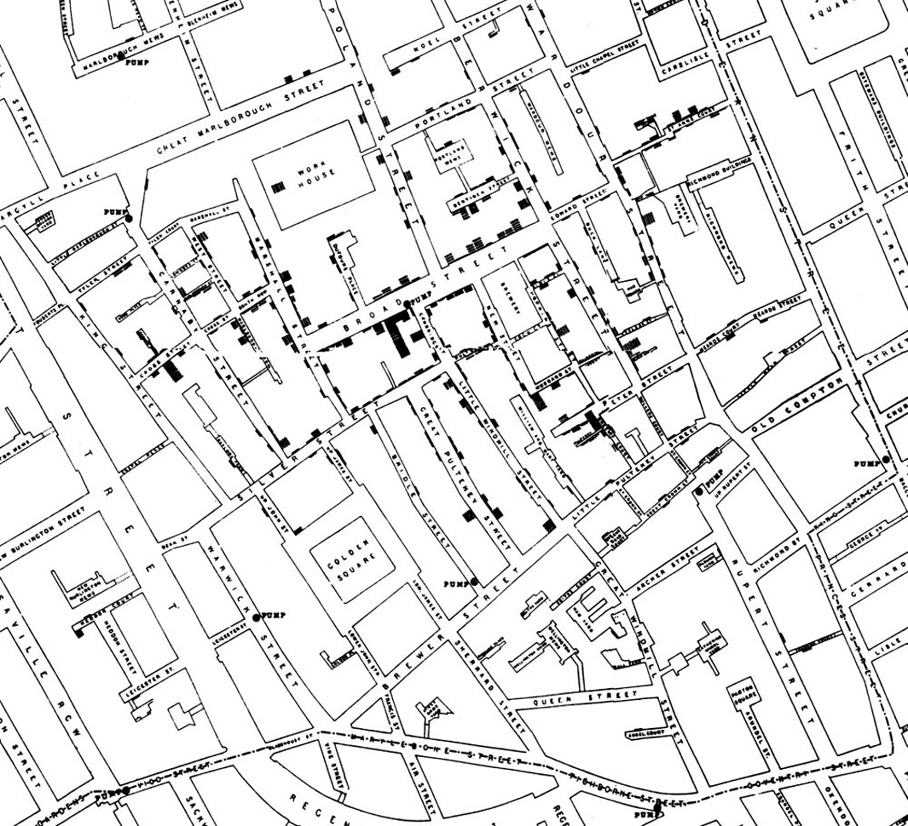
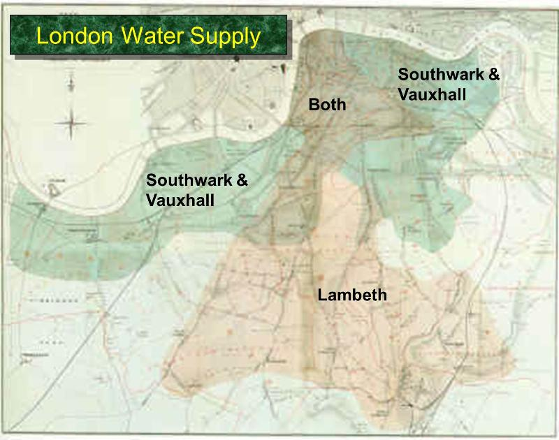

# Causality and Experiments

> *"These problems are, and will probably ever remain, among the inscrutable secrets of nature. They belong to a class of questions radically inaccessible to the human intelligence."*
—The Times of London, September 1849, on how cholera is contracted and spread

Does the death penalty have a deterrent effect? Is chocolate good for you? What causes breast cancer?

All of these questions attempt to assign a cause to an effect. A careful examination of data can help shed light on questions like these. In this section you will learn some of the fundamental concepts involved in establishing causality.

Observation is a key to good science. An observational study is one in which scientists make conclusions based on data that they have observed but had no hand in generating. In data science, many such studies involve observations on a group of individuals, a factor of interest called a treatment, and an outcome measured on each individual.

It is easiest to think of the individuals as people. In a study of whether chocolate is good for the health, the individuals would indeed be people, the treatment would be eating chocolate, and the outcome might be a measure of heart disease. But individuals in observational studies need not be people. In a study of whether the death penalty has a deterrent effect, the individuals could be the 50 states of the union. A state law allowing the death penalty would be the treatment, and an outcome could be the state’s murder rate.

The fundamental question is whether the treatment has an effect on the outcome. Any relation between the treatment and the outcome is called an association. If the treatment causes the outcome to occur, then the association is causal. Causality is at the heart of all three questions posed at the start of this section. For example, one of the questions was whether chocolate directly causes improvements in health, not just whether there there is a relation between chocolate and health.

The establishment of causality often takes place in two stages. First, an association is observed. Next, a more careful analysis leads to a decision about causality.

## John Snow and the Broad Street Pump

One of the most powerful examples of astute observation eventually leading to the establishment of causality dates back more than 150 years. To get your mind into the right timeframe, try to imagine London in the 1850’s. It was the world’s wealthiest city but many of its people were desperately poor. Charles Dickens, then at the height of his fame, was writing about their plight. Disease was rife in the poorer parts of the city, and cholera was among the most feared. It was not yet known that germs cause disease; the leading theory was that “miasmas” were the main culprit. Miasmas manifested themselves as bad smells, and were thought to be invisible poisonous particles arising out of decaying matter. Parts of London did smell very bad, especially in hot weather. To protect themselves against infection, those who could afford to held sweet-smelling things to their noses.

For several years, a doctor by the name of John Snow had been following the devastating waves of cholera that hit England from time to time. The disease arrived suddenly and was almost immediately deadly: people died within a day or two of contracting it, hundreds could die in a week, and the total death toll in a single wave could reach tens of thousands. Snow was skeptical of the miasma theory. He had noticed that while entire households were wiped out by cholera, the people in neighboring houses sometimes remained completely unaffected. As they were breathing the same air—and miasmas—as their neighbors, there was no compelling association between bad smells and the incidence of cholera.

Snow had also noticed that the onset of the disease almost always involved vomiting and diarrhea. He therefore believed that the infection was carried by something people ate or drank, not by the air that they breathed. His prime suspect was water contaminated by sewage.

At the end of August 1854, cholera struck in the overcrowded Soho district of London. As the deaths mounted, Snow recorded them diligently, using a method that went on to become standard in the study of how diseases spread: he drew a map. On a street map of the district, he recorded the location of each death.

Here is Snow’s original map. Each black bar represents one death. When there are multiple deaths at the same address, the bars corresponding to those deaths are stacked on top of each other. The black discs mark the locations of water pumps. The map displays a striking revelation—the deaths are roughly clustered around the Broad Street pump.

```{r, echo=FALSE, fig.align="center", out.width='60%'}

```


Snow studied his map carefully and investigated the apparent anomalies. All of them implicated the Broad Street pump. For example:

* There were deaths in houses that were nearer the Rupert Street pump than the Broad Street pump. Though the Rupert Street pump was closer as the crow flies, it was less convenient to get to because of dead ends and the layout of the streets. The residents in those houses used the Broad Street pump instead.
* There were no deaths in two blocks just east of the pump. That was the location of the Lion Brewery, where the workers drank what they brewed. If they wanted water, the brewery had its own well.
* There were scattered deaths in houses several blocks away from the Broad Street pump. Those were children who drank from the Broad Street pump on their way to school. The pump’s water was known to be cool and refreshing.

The final piece of evidence in support of Snow’s theory was provided by two isolated deaths in the leafy and genteel Hampstead area, quite far from Soho. Snow was puzzled by these until he learned that the deceased were Mrs. Susannah Eley, who had once lived in Broad Street, and her niece. Mrs. Eley had water from the Broad Street pump delivered to her in Hampstead every day. She liked its taste.

Later it was discovered that a cesspit that was just a few feet away from the well of the Broad Street pump had been leaking into the well. Thus the pump’s water was contaminated by sewage from the houses of cholera victims.

Snow used his map to convince local authorities to remove the handle of the Broad Street pump. Though the cholera epidemic was already on the wane when he did so, it is possible that the disabling of the pump prevented many deaths from future waves of the disease.

The removal of the Broad Street pump handle has become the stuff of legend. At the Centers for Disease Control (CDC) in Atlanta, when scientists look for simple answers to questions about epidemics, they sometimes ask each other, “Where is the handle to this pump?”

Snow’s map is one of the earliest and most powerful uses of data visualization. Disease maps of various kinds are now a standard tool for tracking epidemics.

__Towards Causality__

Though the map gave Snow a strong indication that the cleanliness of the water supply was the key to controlling cholera, he was still a long way from a convincing scientific argument that contaminated water was causing the spread of the disease. To make a more compelling case, he had to use the method of *comparison*.

Scientists use comparison to identify an association between a treatment and an outcome. They compare the outcomes of a group of individuals who got the treatment (the *treatment group*) to the outcomes of a group who did not (the *control group*). For example, researchers today might compare the average murder rate in states that have the death penalty with the average murder rate in states that don’t.

If the results are different, that is evidence for an association. To determine causation, however, even more care is needed.

## Snow’s “Grand Experiment”

Encouraged by what he had learned in Soho, Snow completed a more thorough analysis. For some time, he had been gathering data on cholera deaths in an area of London that was served by two water companies. The Lambeth water company drew its water upriver from where sewage was discharged into the River Thames. Its water was relatively clean. But the Southwark and Vauxhall (S&V) company drew its water below the sewage discharge, and thus its supply was contaminated.

The map below shows the areas served by the two companies. Snow honed in on the region where the two service areas overlap.

```{r, echo=FALSE, fig.align="center", out.width='50%'}

```

Snow noticed that there was no systematic difference between the people who were supplied by S&V and those supplied by Lambeth. “Each company supplies both rich and poor, both large houses and small; there is no difference either in the condition or occupation of the persons receiving the water of the different Companies … there is no difference whatever in the houses or the people receiving the supply of the two Water Companies, or in any of the physical conditions with which they are surrounded …”

The only difference was in the water supply, “one group being supplied with water containing the sewage of London, and amongst it, whatever might have come from the cholera patients, the other group having water quite free from impurity.”

Confident that he would be able to arrive at a clear conclusion, Snow summarized his data in the table below.

```{r, echo=FALSE}
# knitr::kable(
#   head(mtcars[, 1:8], 10), booktabs = TRUE,
#   caption = 'A table of the first 10 rows of the mtcars data.'

```


