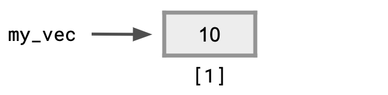
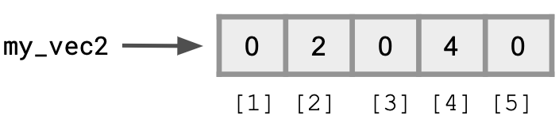
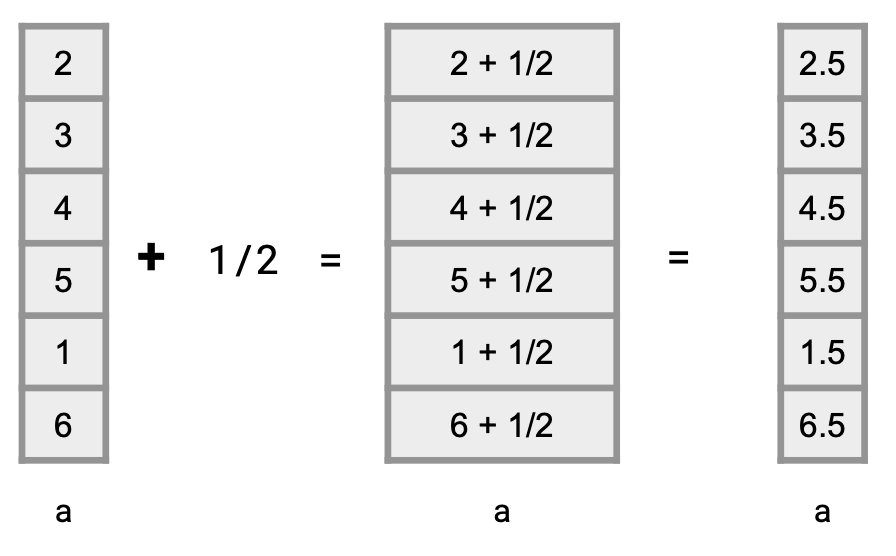
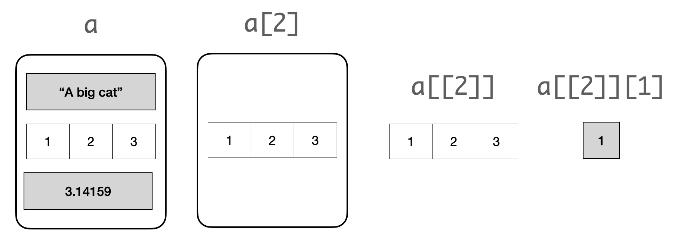

---
output:
  pdf_document: default
  html_document: default
editor_options: 
  markdown: 
    wrap: sentence
---

# Data Types

Data scientists work with different kinds of data.
We have already seen two different types in the previous chapters: *numerical* data (e.g., `14` or `1.5` ) and *text* data (e.g., `"you found yourself in a wide, low, straggling entry with old-fashioned wainscots"`).

These different representations of data are often referred to as *data types*.
In this chapter we will learn about four fundamental data types in R and how the `tidyverse` can be used for working with them.
They are:

-   a whole number, which we call the *integer* type
-   a real number, which we call the *double* type
-   a truth value representing TRUE or FALSE, which R calls the *logical* type. These are also often called the *boolean* type, especially in other programming languages.
-   a character sequence, which R calls the *character* type. These are commonly referred to as the *string* type.

We will also study two important structures for *storing* data known as the *vector* and the *list*.

## Integers and Doubles

In this section, we turn to our first two principal data types: the *integer* and the *double*.

### A primer in computer architecture

The vacuum tubes we mentioned earlier as one of the principal ideas in the early modern computers had the role of regulating flow of electricity.
The architects of the machines used two conditions, the existence of current and the non-existence of current, for information coding.

We used the word *bit* to present the dichotomy, 1 for having the current and 0 for not having the current.
All the computer models that followed used the principle.

An *integer* type consists of some fixed number of (for example, 32) bits.
In its simplest representation, one of the bits is used to represent the sign (1 for negative numbers and 0 for non-negative numbers) and the rest are to represent the absolute value of the number with the power-of-2 denominations.

The power-of-2 denominations consist of the powers of 2 in increasing order starting from the 0-th power (which is equal to 0): $2^0 = 1, 2^1 = 2, 2^2 = 4, 2^3 = 8, 2^4 = 16, \ldots$.

We call this the *binary representation* as opposed to the *decimal representation* as we write numbers in our daily life.

For example,

$$
0 \cdots 0 1 1 1 0 1
$$ 
in the representation is to represent by reading the bits from right to left,

$$
1 \cdot 2^0 + 0 \cdot 2^1 + 1 \cdot 2^2 + 1 \cdot 2^3 + 1 \cdot 2^4
$$ 

which is equal to $1 + 4 + 8 + 16 = 29$.

This implies that there is a limit to how large a positive whole number or how small a negative whole number R can accurately represent.
If a number should go out of the range of accurately-presentable whole numbers, R switches to a double number using some approximation.

To represent a *double* number, computers split the number of bits it can use to three parts: the sign (1 bit), the *significand*, and the *exponent*.
How R uses the significand and exponents in representing a real number is beyond the scope of this text.

$$
(\mathrm{sign}) ~(\mathrm{number~significand~represents}) \cdot (\mathrm{base})^{\mathrm{number~exponent~represents}}
$$

The representation in the significand part uses the inverse powers of 2: 1/2, 1/4, 1/8, $\ldots$, down to a certain value $1/2^m$, where $m$ is the length of the significand part.

By combining these fractional quantities, we can obtain an approximation for a number between 1 and 2.
Like integer, the double type thus has a range of numbers it can record an approximation.

If you are interested in learning more about digital representations of numbers, sign up for a course in computer organization and architecture!

### Specifiying integers and doubles in R

Our brief dive into how integers and doubles are represented boils down to two basic ideas:

-   Integers are called `integer` values in R. They can only represent whole numbers (e.g., positive, negative, or zero).
-   Real numbers are called `double` values in R. They can represent whole numbers and fractions but there are limitations by how well it approximates some values.

Here are some examples of `double` values.

```{r}
1.2
```

```{r}
3.0
```

```{r}
1.5 + 2.2
```

We can confirm these are doubles using the `typeof` function.

```{r}
typeof(3.0)
```

However, for numbers without a decimal point, i.e. integers, R will still treat them as `double`.

```{r}
3  # here is a value that looks like an integer
typeof(3) # ..but is actually a double!
```

Hence, to create an integer, we must specify this explicitly by placing an `L` directly after the number.
Here are some examples.

```{r}
# Some integer values
2L
```

```{r}
1L + 3L
```

```{r}
-123456789L
```

We can confirm these are integers using the `typeof` function.

```{r}
typeof(-123456789L)
```

Check out what happens when we try placing an `L` after a decimal value!

```{r}
3.2L
```

When a mathematical expression contains a double and an integer, the result is always a double.
The third expression `4L + 1` adds an integer 4 and a double together and so is double.
In the fourth one, 1 is also an integer, and so the result is an integer.

```{r}
3.5 + 1.2
3L + 1.3
4L + 1
4L + 1L
```

We can confirm the types using `typeof()`.

```{r}
typeof(3.5 + 1.2)
typeof(3L + 1.3)
typeof(4L + 1)
typeof(4L + 1L)
```

### Finding the size limit

How big numbers (or negative with big absolute value) can a double represent?
To specify a double number with a large absolute value, we can use the `e` expression.
If you type a literal that goes beyond the range, R gives you `Inf` or `-Inf` to mean that the number is out of range.

Let's start with `e1000`.

```{r, error=TRUE}
-1.0e1000
1.0e1000
```

So, using whether the result is `Inf` or not, we can explore around where between the boundary from the presentable numbers and the non-presentable numbers are:

```{r, error=TRUE}
1.0e500
1.0e400
1.0e300
1.0e310
1.0e305
1.0e306
1.0e307
1.5e308
1.6e308
1.7e308
1.8e308
1.790e308
```

So, around `1.79e308` is the limit.
The quantity is large enough so as to accommodate the computation we will do in this text.

How about integers?
We can do the same exploration, this time appending the character `L` at the end of each number literal.
We leave this as an exercise for the reader.
Keep in mind that if you supply an integer that is too big, R will present a warning that the value must be converted to a double.

<!-- exercise solution: Around 2,147,000,000 (2 billions and 247 millions), the boundary exists. -->

## Strings

A *string* is a sequence of characters, which takes its place as our third principal data type. Formally, R calls such sequences *character vectors*, where the word "vector" should seem like gibberish jargon at this point. In this section, we examine the string type.

### Prerequisite

There is a variety of operations that are available in base R for manipulating strings. A part of the `tidyverse` super-library is the `stringr` library. We will use a few functions from `stringr` here, so let us load this package. 

```{r echo=FALSE, warning=FALSE, message=FALSE}
library(tidyverse)
```

### Strings in R

We use a matching pair of double quotations or a matching pair of single quotation marks (a matching pair of apostrophes) to mark the start and the end of the character sequence we specify as its contents.
An advantage of using the double quotation marks is that single quotation marks can appear in the character sequence.

Here are some examples of strings.

```{r}
"This is my first string."
"We love R!"
'"Data Science" is a lot of fun :-)'
```

Notice that the R substituted the single quotation marks we used for the last literal with double quotation marks.
We can inspect these types as well.

```{r}
typeof("We love R!")
```

### Conversions to and from numbers

First of all, characters are not compatible with numbers.
You cannot apply mathematical operations to strings even if their character contents are interpret-able as numbers.

In other words, `"4786"` is *not* the number 4786, but a character sequence with the four characters, `"4"`, `"7"`, `"8"`, and `"6"`.
Knowing that the string can mean the number, we can generate an integer representing the number using the function `as.integer`.

```{r}
as.integer("4786")
```

The `as` functions are useful also when you want to interpret a string as a double and when you want to interpret a number as a string.

The functions `as.double` and `as.character` convert a string to a double number and a number to a string, respectively.

```{r}
as.double("3.14")
as.double("456")
as.character(3.14159265)
as.character(-465)
```

### Length of strings

If you know the contents of the string, you can count the characters in the sequence to obtain its length.
However, if you do not know or if the string is very long, you can rely on R to do the counting for you using `str_length` from the `stringr` package.

```{r}
str_length("310A Ungar Building, 1365 Memorial Drive, Coral Gables, Florida 33146")
```

### Substrings

A string is a sequence of characters.
Each character composing a string receives a unique position.
Let us consider the following string.

```{r}
my_string <- "song"
```

The positioning starts from the left end of the sequence.

-   The first position has value 1.
-   The four characters of the string, `"s"`, `"o"`, `"n"`, and `"g"`, have positions 1, 2, 3, and 4, respectively.
-   You can specify a string and two positions and obtain a new string consisting of the characters between the two positions.

For example, the substring from position 2 to position 3 of the string "song" is "on". We can use the function `str_sub` from `stringr` to retrieve substrings.

```{r}
str_sub("song", 2, 3)
```

The syntax is `str_sub(some_string, start, end)` where `some_string` from which we will build a substring, `start` is the staring position, and `end` is the ending position.

You can omit the ending position if it is the last position of the string.

```{r}
str_sub("song", 2)
```

You can also retrieve substrings by searching from the *right*. If the starting number is less than -1, R looks at the index starting from the right. For instance, the following extracts the substring from the third-to-last to last position. 

```{r}
str_sub("song", -3, -1)
```

If the ending position is smaller than the starting position, the substring is the empty.

```{r}
str_sub("song", 2, 0)
```

### String concatenation

We may want to combine multiple strings into a single string. We call such action *concatenation*.

Let us consider three strings.

```{r}
str1 <- "data"
str2 <- "science"
str3 <- "rocks"
```

There are two types of concatenation. One type connects strings with no gap, the other connects strings with on white space inserted in between. We can perform these actions using the `str_c` function from `stringr`. 

Below, we think of concatenating three strings `"data"`, `"science"`, and `"rocks"` with the two functions individually.

```{r}
str_c(str1, str2, str3)
str_c(str1, str2, str3, sep = " ")
```

In the second, we provide a whitespace character `" "` to the argument `sep`. The effect obtained is that each individual word is separated by a space. 

## Logical Data

As we stated before, boolean is the data type for logical values, true and false. `TRUE` is the value representing true and `FALSE` is the one representing false. When you use a number where R is expecting to see a boolean, it interprets 0 as `FALSE` and any non-zero as `TRUE`.

Here are the two values.

```{r}
TRUE
FALSE
```

### Comparisons

While we can specify a boolean value with a boolean literal, we can use comparisons to generate boolean values. In the case of numbers, we can compare the values of two mathematical expressions. Here is an example. 

```{r}
1 + 4 > 7 - 4
```

This asks if the value of `1 + 4` is strictly greater than the value of `7 - 4`. The former is 5 and the latter is 3, and so the answer to the comparison is in the affirmative. Therefore, the value of the comparison expression is `TRUE`.

They represent "is equal to", "is not equal to", "is greater than", "is greater than or equal to", "is smaller", and "is smaller than or equal to".

There are six possible types of comparisons. We will define these in the following table using an example with the numbers `6` and `3`. Before looking, can you try to guess them all? Compare your guesses against the table.  

| Operator               | Meaning | True example | False Example |
|--------------------------|----------|--------------|---------------|
|     \<          |  Smaller than     | 3 \< 6       | 6 \< 3        |
|     \>          |  Greater than      | 6 \> 3       | 3 \> 3        |
|     \<=         |  Smaller than or equal to   | 3 \<= 3      | 6 \<= 3       |
|     \>=         |  Greater than or equal to    | 6 \>= 6      | 3 \>= 6       |
|      ==         |  Equal to       | 3 == 3       | 6 == 3        |
|      !=         |  Not equal to     | 6 != 3       | 3 != 3        |

An expression can chain together multiple comparisons with the AND operator `&`, and they all must hold in order for the whole expression to be `True`.

For example, we can express that `1+1` is between `1` and `3` using the following expression.

```{r}
1 < (1 + 1) & (1 + 1) < 3
```

You may recall the functions `max` and `min` for obtaining the maximum and the minimum from a group of numbers, respectively.
One thing to remember is that the minimum is greater than or equal to the average, and the maximum is greater than or equal to the average.
The equality holds when the two numbers in the group are all identical.
Let us set some numbers to variables `x` and `y` and see what the maximum and the minimum functions produce.

```{r}
x <- 12
y <- 5
min(x, y) <= (x + y)/2
max(x, y) >= (x + y)/2
```

How about the equality?
Assuming that we have executed the previous section of the code, we can reuse `x` and `y` in the following computation.

```{r}
x <- 17
y <- 17
min(x, y) == (x + y)/2
max(x, y) == (x + y)/2
```

### Boolean operations

There are three fundamental boolean operations.
They are *negation*, *disjunction*, and *conjunction*.
Negation flips the value of a boolean.
Disjunction tests if at least one of boolean values appearing on a list is true and conjunction tests if all values appearing on a list are.
R uses symbols `!`, `|`, and `&` for them.
Here are some examples of using the boolean operations.

```{r}
a <- TRUE
b <- FALSE
c <- TRUE
!a
a | b | c
a & b & c
```

The roles these operations play are analogous to the roles $-$, $+$, and $*$ play in the numbers.

### Comparing strings

R can compare strings for equality and non-equality using `==` and `!=`.
R can also compare two to see if one is greater than the other and if one is smaller than the other.
To compare two strings, R compares their characters position-wise, starting from the beginning.
The position-wise comparison continues until it reaches a position where no comparison is possible because either at least one string has no characters remaining or the two strings showing non-identical pair of characters.

* In the first case, if R has run out of characters on both sides, it asserts that the two strings are equal to each other, otherwise, the one that has just run out of characters is smaller than the other.
* In the second case, R examines the *character code* of the two characters.

R (and any programming language) uses a table of characters where each character has a unique number.
The result of comparing two characters is that if the two characters are not equal to each other, then the character with at a lower position than the other is smaller than the other as character.

```{r}
print("Bach" > "Back")
print("Darth Vader" > "Dark Chocolate")
print("09:00 AM" > "Nine in the morning")
print("data science" > "Data Science")
print("abc" > "ABC" )
```

<!---
```{r eval=FALSE}
a <- "Jason"
b <- "Bourne"
c <- "Matt"
d <- "Damon"
a < b
a > b & c > d
a > b | d < c
!(a < b)
```
---> 

The examples below show how R interprets numbers to boolean values.

```{r}
3.0 == TRUE
-5 == FALSE
0 == TRUE
0 == FALSE
```

## Vectors

You might have been wondering about the meaning of the `[1]` that appears when you inquire about the value of an expression.
The square brackets `[]` in R means the position in a series of distinct elements known as a *vector*.

### Sequences

The `[1]` indicates that the value that follows is the first element of a sequence that contains the value.
Meaning, the value is not a standalone value "per se" but appears as an element in a sequence.
Encompassing a value in a sequence is a distinctive feature of R.
In more technical terms, R uses *vectorization* to put objects in vectors.
Let us see an example of this in action.

Suppose we have assigned a value of 10 to an object `my_vec`.

```{r}
my_vec <- 10
```

Then `a` is a *vector* containing one element, whose value is 10.

```{r}
my_vec
```

The `[1] 10` appearing as the output states exactly that.
Visually, this looks like:

```{r, echo=FALSE, fig.align="center", out.width='60%', fig.asp=1/2}

```

The way we access an element of a vector is to state the position of the element in the sequence comprising the vector inside square brackets and attach it after the name of the vector.
So, let us see what `my_vec[1]` returns.
The expression means to refer to the first element of `my_vec`, which we know to be 10.

```{r}
my_vec[1]
```

Wait a second, it still says `[1] 10`!
Because a vector is the most primitive information structure that R uses, there is no smaller structure.
This means that you can apply `[1]` as many times you want to `a`.

```{r}
my_vec[1][1]
my_vec[1][1][1]
my_vec[1][1][1][1]
my_vec[1][1][1][1][1]
```

Since the number inside the brackets specifies a position, you can try a number other than 1.
It is only that in the case of `a`, positions other than 1 do not exist.

```{r}
my_vec[2]
my_vec[0]
```

What are these?
`NA` is short-hard for "not available" and means that there is no such thing.
`numeric(0)` means that it is a vector with no elements.
Once you get to length 0, `[1]` becomes `NA` but `[0]` produces `numeric(0)`.

`numeric(N)` with `N` produces a sequence having length `N` where each element is 0.
Here is an example which creates a vector of six 0s.

```{r}
my_vec2 <- numeric(5)
```

We can examine its contents and even change the values.
Below we change the values of `my_vec2` at positions 2 and 4 to 2 and 4, respectively.

```{r}
my_vec2[2] <- 2
my_vec2[4] <- 4
my_vec2
```

Here is a visualization of the situation.

```{r, echo=FALSE, fig.align="center", out.width='60%', fig.asp=1/2}

```

Let's play with these vectors a bit more.
In addition to specify a single position, you can give a range of positions, "from here to there".
The syntax for a range specification is `FROM:TO` where `FROM` is the starting position and `TO` is the ending position.

The code below changes the values for the 5 positions of `series_n` and then provides examples of some range indexing.

```{r}
my_vec2[1] <- 1
my_vec2[3] <- 3
my_vec2[5] <- 5
my_vec2[1:5]
my_vec2[2:4]
my_vec2[2:2]
```

If the `END` value is smaller than the `START` value, the elements appear in the reverse order.

```{r}
my_vec2[4:1]
```

You can use the negative sign in the range and position specification.
The `-` sign means "all positions other than".
If the negative sign appears with the `FROM` or the `TO` index, then the other index must have the negative sign.
In the case of the negative ranging, the order between `FROM` and `TO` does not matter.

```{r}
my_vec2
my_vec2[-3]
my_vec2[-2:-4]
my_vec2[-4:-2]
```

### The `c`ombine function

We can create sequences with element specification.
The creation of this uses the function `c`, which means to "combine".

The syntax is quite simple.
Within the parentheses following the initial `c`, state the elements of the series with a comma in between.

```{r}
c(6, 2, 3)
c("data", "science", "rocks", "my", "socks")
c(3.0, 4.0, 2.0, 2.2, -4.5, -25.7)
```

Using the `c` construction, you can obtain a subseries of a mother sequence with specific positions.

```{r}
my_vec2[c(1,3,4)]
my_vec2[c(4,4,3,3,5,3,5,3)]
```

R retrieves the elements individually, and whether the numbers repeat or whether the numbers are in order do not matter.

### Element-wise operations

Let us look at the combine function more closely.
We can define two sequences having the same lengths using the combine function.

```{r}
a <- c(2, 3, 4, 5, 1, 6)
b <- c(9, 8, 7, 1, 2, 1)
```

A very common and useful set of operations when working with vectors are known as *element-wise* operations, which work on each element of a vector.
Here is an example with element-wise addition.

```{r}
a + 1/2
```

To explain what happened, here is a visualization.

```{r, echo=FALSE, fig.align="center", out.width='60%', fig.asp=1/2}

```

We can also apply element-wise subtraction, multiplication, division, and remainder.

```{r}
a - 7
a * 3
b / 2
b %% 3
```

These element-wise operations can be applied to two sequences that have the same length.

```{r}
a + b
a - b
a * b
a / b
a %% b
```

You can access some properties of the vector.
`length`, `max`, and `min` provide the legnth of a vector, the maximum among the elements in a vector, and the minimum among the elements in it, respectively.

```{r}
length(a)
max(a)
min(a)
```

In the case of numbers, the summation of all elements is possible.

```{r}
sum(a)
```

Another important feature of the function `c` is you can connect two vectors with `c`.
Here we recall the vectors `a` and `b` from earlier and then present the difference between the component-wise addition `a + b` and the sequence connection `c(a, b)`.

```{r}
c(a, b)
```

Since a single value is a vector, connecting a vector with a conspicuously single value are actually vector concatenation.

```{r}
c(a, 10)
c(78, a)
```

You can connect more than two elements.

```{r}
c(79, a, 17)
```

### Booleans and element-wise operations

Not only can we apply mathematical operations but also we can apply comparisons.

```{r}
a > b
a >= 3
```

Once you have a sequence of boolean whose length is equal to the vector at hand, you can use that boolean sequence (or vector) to select elements to generate subvectors.

```{r}
a[a > b]
a[a >= 3]
```

We can also use element-wise comparisons to count the number of occurrences of a certain element in a vector. For instance, consider this vector of greetings. 

```{r}
greetings <- c("hello", "goodbye", "hello", "hello", "goodbye")
```

We can count the number of `hello`'s that occur as follows. 

```{r}
greetings == "hello"
```

```{r}
sum(greetings == "hello")
```

### Functions on vectors

R provides programmers with convenient and powerful functions for creating and manipulating vectors.

The `mean` of a collection of numbers is its average value: the sum divided by the length.
Each of the examples below performs a computation on the vector called `temps`.

```{r}
temps <- c(87.5, 87.5, 66.5, 90.0, 65.5, 71.0)
length(temps)
```

```{r}
sum(temps)
```

```{r}
mean(temps)
```

The `diff` function computes the difference between each adjacent pair of elements in an array.
The first element of the `diff` is the second element minus the first.

```{r}
diff(temps)
```

Following are some more commonly used functions that work over vectors.
The list includes many functions that we have not gone over yet, especially those that work on *character* vectors.
Learning this vocabulary is an important part of learning R, so refer to this list often as you work through examples and problems.

Please note: you **do NOT need to memorize these**!

Each of these functions takes some vector `x` as an argument and returns a single value.

| **Function**  | Description                               |
|---------------|-------------------------------------------|
| `sum(x)`      | Add elements together                     |
| `prod(x)`     | Multiply elements together                |
| `all(x)`      | Test whether all elements are true values |
| `any(x)`      | Test whether any elements are true values |
| `sum(x != 0)` | Number of non-zero elements               |

Each of these functions takes some vector `x` as an argument and returns a vector of values.

+---------------+---------------------------------------------------------------------+
| **Function**  | Description                                                         |
+===============+=====================================================================+
| `diff(x)`     | Difference between adjacent elements                                |
+---------------+---------------------------------------------------------------------+
| `round(x)`    | Round each number to nearest integer                                |
+---------------+---------------------------------------------------------------------+
| `cumprod(x)`  | For each element, multiply all elements so far (cumulative product) |
+---------------+---------------------------------------------------------------------+
| `cumsum(x)`   | For each element, add all elements so far (cumulative sum)          |
+---------------+---------------------------------------------------------------------+
| `exp(x)`      | Computes the exponential function                                   |
+---------------+---------------------------------------------------------------------+
| `log(x)`      | Computes the natural logarithm of each element                      |
+---------------+---------------------------------------------------------------------+
| `sqrt(x)`     | Computes the square root of each element                            |
+---------------+---------------------------------------------------------------------+
| `sort(x)`     | Sort the elements                                                   |
+---------------+---------------------------------------------------------------------+

The `stringr` package from the tidyverse provides us a collection of useful functions for working with character vectors.
A full cheat sheet can be found [here](https://evoldyn.gitlab.io/evomics-2018/ref-sheets/R_strings.pdf), but listed here are some of the commonly used ones.
Following are functions that take a character vector `x` as an argument and return a vector.

| **Function**      | **Description**                                           |
|-------------------|-----------------------------------------------------------|
| `str_to_lower(x)` | Lowercase each element                                    |
| `str_to_upper(x)` | Uppercase each element                                    |
| `str_trim(x)`     | Remove spaces at the beginning and/or end of each element |

The following function takes a character vector `x` with additional arguments, but also returns a vector.

+------------------------------+----------------------------------------------------------------------------+
| **Function**                 | **Description**                                                            |
+==============================+============================================================================+
| `str_sub(x, start, end)`     | Extracts a substring from `x` given by `start` position and `end` position |
+------------------------------+----------------------------------------------------------------------------+
| `str_detect(x, "[:alpha:]")` | Whether each element is only letters (no numbers or symbols)               |
+------------------------------+----------------------------------------------------------------------------+
| `str_detect(x, "[:digit:]")` | Whether each element is only numeric (no letters)                          |
+------------------------------+----------------------------------------------------------------------------+

The following functions take both a character vector `x` and a *pattern string* to search for.
Pattern strings can be more general like `"[:alpha:]"` or `"[:digit:]"` from the above list (these are also called [regular expressions](https://rstudio.com/wp-content/uploads/2016/09/RegExCheatsheet.pdf) or regexp for short, which we won't cover in detail :-).
Each of these functions returns a vector.

+-------------------------------+----------------------------------------------------------------------------+
| **Function**                  | **Description**                                                            |
+===============================+============================================================================+
| `str_count(x, pattern)`       | Count the number of times a pattern appears among the elements of an array |
+-------------------------------+----------------------------------------------------------------------------+
| `str_which(x, pattern)`       | The indexes of vector `x` where the pattern is found                       |
+-------------------------------+----------------------------------------------------------------------------+
| `str_replace_all(x, pattern)` | Replace all matched patterns in each string                                |
+-------------------------------+----------------------------------------------------------------------------+
| `str_detect(x, ^pattern)`     | Whether each element starts with the pattern                               |
+-------------------------------+----------------------------------------------------------------------------+

The following function also takes a vector `x` of strings and a pattern string.
However, unlike the above table, this function returns a *list*.
We will cover lists in the next section.

+------------------------------+-----------------------------------------------------------+
| **Function**                 | **Description**                                           |
+==============================+===========================================================+
| `str_locate_all(x, pattern)` | The positions within each element that a pattern is found |
+------------------------------+-----------------------------------------------------------+

The following function is a helpful diagnostic tool to view matched patterns.

| **Function**               | **Description**                              |
|----------------------------|----------------------------------------------|
| `str_view_all(x, pattern)` | Visualizes all pattern matches in vector `x` |

## Lists

Like vectors, lists also group values together.
However, unlike vectors, lists can hold values that are of *different* types.
For instance:

```{r}
mixed <- list("apple", 1.5, 2L, TRUE)
mixed
```

It can be helpful to examine the structure inside the list.
We use `str` for this.

```{r}
str(mixed)
```

Lists hold just about anything; they can even contain vectors...

```{r}
mixed2 <- list(c("asparagus", "arrowroot", "tomato"), c("mango", "kumquat"), 3.14159)
str(mixed2)
```

...or more lists!

```{r}
omg <- list(list(1,1), list(2,2,2), "hello world")
str(omg)
```

### Working with lists

Let's examine the `mixed2` list more closely.

```{r}
mixed2
```

`[` extracts a sub-list.
The result is always a list.

```{r}
str(mixed2[2])
```

We can also *subset* a list the same way we do with vectors.
Remember that the result is still a list.

```{r}
str(mixed2[1:2])
```

If we wish to extract the vector *inside* `mixed2[2]`, we must use `[[`.
This extracts a single component from a list.
We can use it to retrieve, for example, the vector of fruits:

```{r}
mixed2[[2]]
```

What if we only wanted the mango?

```{r}
mixed2[[2]][1]
```

Yum!

### Visualizing lists

The difference between `[` and `[[` is important, but too easy to confuse.
The following visual will clarify the point.

Suppose that we have the following list `a`.

```{r}
a <- list("A big cat", c(1,2,3), 3.14159)
```

Then we can imagine operations on `a` as the following:

```{r, echo=FALSE, fig.align="center", out.width='80%'}

```

* `a` is a list
* `a[2]` is also a list, this time containing a single element\
* `a[[2]]` is the second component of the list, a vector
* `a[[2]][1]` is the first element of that vector

Groovy! The ["pepper shaker photos" in R for Data Science](https://r4ds.had.co.nz/vectors.html#lists-of-condiments) provides another nice visualization of the different ways we can extract pieces from a list.

## `stringr` Operations

As we mentioned earlier, `tidyverse` is a collection of packages.
One of the packages `tidyverse` contains is `stringr`, which offers a variety of methods for manipulating strings.
Like numbers, a string is a vector of strings with just one string.
So, applying a function to a string is the same as applying a function to a string vector.

Depending on what we are interested in doing, we can classify the functions in `stringr` into the following categories:

-   Detect Matches: finding and locating matches of a pattern in each string in a string vector
-   Subset Strings: Extracting subtrings and subvectors from a string vector matching a pattern
-   Manage Lengths: Inquiring about the lengths and padding/trimming the strings
-   Mutate Strings: Mutating the strings appearing in a string vector
-   Join and Split: Changing the structure of a vector
-   Order Strings: Sorting

Be sure to bookmark the `stringr` [cheatsheet](https://github.com/rstudio/cheatsheets/blob/master/strings.pdf).

### Prerequisites

To set up, let us load the `tidyverse`.

```{r, message = FALSE, warning = FALSE}
library(tidyverse)
```

### Regular expressions

The pattern matching functions of `stringr` accept *regular expressions*.

A regular expression is a string that specifies a collection of strings in a possibly compact manner.
Here are some examples of regular expressions and how one of the `stringr` functions `str_detect` uses it find patterns in string vector `c("May 17, 2019", "Certified mail", "FL 33333", "Oppa Locka", "to Mr. Haan", "arrived")`.
The function `str_detect` receives two arguments.
The first is a string (or a string vector) and the second is the pattern.
The function returns for each element in the vector, whether the pattern appears.
Let us first define a string vector with the five elements.

```{r}
s <- c("May 17, 2019", "Certified mail", "FL 33333", "Oppa Locka", "to Mr. Haan", "arrived")
s
```

Now you see a bracket with a number other than 1.
The `[5]` states that "to Mr. Haan" is the fifth element of the vector.

The pattern strings appearing in the following have the following meaning

| pattern             | meaning                                                 |
|---------------------|---------------------------------------------------------|
| `"a"`               | any appearance of "a"                                   |
| `"a[iy]"`           | any "a" then one of "i" or "y"                          |
| `"a$"`              | "a" at the end of string                                |
| `"^a"`              | "a" at the start of string                              |
| `"^a.*d$"`          | "a" at the start, any string, and then a "d" at the end |
| `"ppa"`             | "ppa"                                                   |
| `"3{4}"`            | "3" repeated four times in sequence                     |
| `"[aeiou].[aeiou]"` | one from "aeiou", some character, and one from "aeiou"  |

```{r}
s
str_detect(s, "a")
str_detect(s, "a[iy]")
str_detect(s, "a$")
str_detect(s, "^a")
str_detect(s, "^a.*d$")
str_detect(s, "ppa")
str_detect(s, "3{4}")
str_detect(s, "[aeiou].[aeiou]")
```

So, the syntax is:

* use the square brackets to specify a list of characters
* use the curly brackets to specify the number of repetitions
* use the period to specify any character
* use the caret `"\^"` and the dollar sign to specify the start and the end of string, respectively
* use `\*` to specify any number of repetitions, including 0 repetitions.

A useful diagnostic tool to visualize matches against a pattern is the function `str_view_all`, which highlights any matches hit by the regular expression. For instance: 

```{r warning=FALSE, message=FALSE}
str_view_all(s, "[aeiou].[aeiou]", html = TRUE)
```

In the square brackets you can specify a range using a dash and the caret to mean "not".
By putting a pair of numbers inside a pair of curly brackets, you can specify a permissible range of the number of repetitions.

The patterns below mean the following:

| pattern        | meaning                               |
|----------------|---------------------------------------|
| `"[a-z]"`      | "a" through "z" at least one          |
| `"[A-Z]{2,5}"` | "A" through "Z" between 2 and 5 times |
| `"[^a-zA-Z]"`  | a non-alphabet                        |
| `"[0-9]"`      | a numeral                             |

```{r}
s
str_detect(s, "[a-z]")
str_detect(s, "[A-Z]{2,5}")
str_detect(s, "[^a-zA-Z]")
str_detect(s, "[0-9]")
```

### Detect matches 

There are functions in this category.

-   `str_detect(STRING, PATTERN)`: As we have seen previously, the function returns a vector of boolean representing whether the elements of `STRING` matching `PATTERN`.
-   `str_which(STRING, PATTERN)`: The function works like `str_detect` but instead of boolean vector, returns the indexes at which the pattern appears; in other words, at which indexes, the value of `str_detect(STRING, PATTERN)` is true.
-   `str_count(STRING, PATTERN)`: The function returns for each element of `STRING`, at how many different positions the pattern aligns.
-   `str_locate(STRING, PATTERN)`: The function finds for each element of `STRING`, the first (or the closest to the start of string) match of the pattern and provides the start and end character positions of the first match as a pair of integers (that is, a length-2 vector of integers). If there are no matches for an element of `STRING`, the function returns a pair of `NA`.

Let us recall `s`.

```{r}
s
```

Here is the result of finding "[0-9]" in the strings.

```{r}
str_which(s, "[0-9]")
```

Here is finding one of "aeiou" and any alphabet and counting the occurrences.
Note that in "to Mr. Haan" there are two places that match the pattern `"[aeiou][A-Za-z]"`, that is "aa" and "an".
The pattern counting goes by repeating the action of finding the first match and then asserting the characters leading to the end of the match unusable for finding matches.
With the feature, after finding the first, "aa", the prefix "to Mr. Haa" is no longer available, and so "an" does not qualify as a match.

```{r}
str_count(s, "[aeiou][A-Za-z]")
```

So, if we find three numerals in sequence with no gap, the elements 1 and 3 have exactly one match each, though there are multiple possibilities for aligning the pattern.

```{r}
str_count(s, "[0-9]{3}")
```

<!--Here is the result of locating the pattern of any alphabet then a sequence of letters from "aeiou" at least one in sequence.

```{r eval=FALSE}
str_locate(s, "[A-Za-z][aeiou]+")
```

What does the comma appearing in the six rows represent?
The comma represents that the output of the function is actually is a data table and the series appearing after the comma is a row of the table whose row index is the number appearing before the comma.
In the case of our experiment at hand, `[4,] 3 4` means that row 4 of the table has 3 and 4 as elements.
To access the row at a specific position, we use the row index and then a comma, and to access the column at a specific position, we use a comma and then the column index.

```{r eval=FALSE}
x <- str_locate(s, "[A-Za-z][aeiou]+")
x
x[,1]
x[,2]
x[1,]
x[2,]
```

There is an extension of `str_locate_all` which finds all the matches constructs a two-dimensional table for each element.
What function returns is thus a three-dimensional table.

```{r eval=FALSE}
str_locate_all(s, "[A-Za-z][aeiou]+")
```
--> 

### Subset strings

Here are the functions in this category.

-   `str_sub(STRING, START, END)`: Creates a new vector consisting of the substrings of the elements of `STRING` with `START` and `END` as the staring and ending positions, respectively.
-   `str_subset(STRING, pattern)`: Creates a new vector keeping only those elements in `s` matching the pattern.
-   `str_extract(STRING, pattern)`: The same as `str_subset` concerning what to find, but the function returns a table not a one-dimensional vector. See the examples below to examine the differences among `str_subset`, `str_extract`, and `str_match`.

```{r}
str_sub(s, 4, 7)
str_subset(s, "[a-zA-Z][^a-zA-Z]+[a-zA-Z]")
str_extract(s, "[a-zA-Z][^a-zA-Z]+[a-zA-Z]")
str_match(s, "[a-zA-Z][^a-zA-Z]+[a-zA-Z]")
```

Both `str_extract` and `str_match` have their version for "apply to all matches", like `str_locate_all`. Their names are `str_extract_all` and `str_match_all`.

### Manage lengths

The following functions belong to this category.

-   `str_length(STRING)`: Returns the length of each element.
-   `str_pad(STRING, WIDTH, side=OPTION, pad=X)`:Appends the string `X` to both or either side of each element of `STRING` as many times as necessary so as to inflate the length of element to at least `WIDTH`. The `OPTION` is one of `"left"`, `"right"`, and `"both"` to indicate where the padding should occur. They respectively represent "the left side only", "the right side only", and "both sides so as to center the original". If the original has length greater than or equal to `WIDTH` no padding occurs. In the case of "both", if the number of necessary padding is an odd number to make the length equal to `WIDTH`, the right side receives one more than the left side. The padding sTring `X` must be a single character. You may omit the specification part `pad=` in `pad=X`.
-   `str_trunc(STRING, WIDTH, side=OPTION, ellipsis=E)`: This is in some sense at the opposite of `str_pad`. The function shrinks each string to length `WIDTH` with the single-character string `E` for replacement. The `side=` specification states where the replacement occurs and should be one of `"left"`, `"right"`, and `"center"`. You may omit the `ellipsis=` prefix.
-   `str_trim(STRING, side=OPTION)`: Trims the white space at the end. The option value is one of `"left"`, `"right"`, and `"both"`, which correspond to "the left side only", "the right side only", and "both sides".

```{r}
str_length(s)
str_pad(s, 11, side="both", pad=".")
str_pad(s, 10, side="left", ".")
str_trunc(s, 3, side="right", ellipsis="_")
str_trunc(s, 5, side="center", "#")
str_trim("   abc    ", side="right")
str_trim("   abc    ", side="both")
```

### Mutate strings

The first three functions execute substitutions to parts of each string.

-   `str_sub() <- VALUE`: Here the `str_sub()` part follows the syntax of the method we earlier discussed - the substrings with specific range of indexes inside strings. After this action, each substring will become `VALUE`.

```{r}
s <- c("May 17, 2019", "Certified mail", "FL 33333", "Oppa Locka", "to Mr. Haan", "arrived")
```

Since the `str_sub() <- VALUE` modifies the original, let us copy `s` to `scopy` and then execute the action on the copy, not the original.
In that manner, we can preserve the original.
Note the use of 0 and 0 in the second instance, the position range of 0 through 0 corresponds to the part before the start of the string.

```{r}
scopy <- s
str_sub(scopy, 1, 3) <- "I am "
scopy
scopy <- s
str_sub(scopy, 0, 0) <- "I am "
scopy
s
```

-   `str_replace(STRING, PATTERN, REPLACEMENT)`: Replaces the first occurrence of `PATTERN` with `REPLACEMENT`.
-   `str_replace_all(STRING, PATTERN, REPLACEMENT)`: Replaces all occurrences of `PATTERN` with `REPLACEMENT`. Like `str_locate_all` the function finds a set of non-overlapping occurrences and then replaces all the occurrences it has identified.

Both functions return the vector resulting from their action.
The original remains intact.

```{r}
t <- s
str_replace(t, "a", "oo")
t <- s
str_replace_all(s, "a", "oo")
t <- s
str_replace_all(s,"[0-9][0-9]", "##")
```

There are three more string mutation functions.

-   `str_to_lower(STRING)`: This converts each uppercase letter to its corresponding lowercase letter.
-   `str_to_upper(STRING)`: This converts each lowercase letter to its corresponding uppercase letter.
-   `str_to_title(STRING)`: This converts each string to a title-like format.

Each fo the three methods returns a new vector.

```{r}
t <- s
str_to_lower(s)
t <- s
str_to_upper(s)
t <- s
str_to_title(s)
```

### Join and split

We only show two functions in this category.

-   `str_dup(STRING, TIMES)`: Create from a vector `STRING`, a new vector where each element appears consecutively, without a gap, `TIMES` times.
-   `str_c(STRING)`: Collpoase the elements column-wise into a single dimensional vector.
-   `str_c(STRING, collapse=X)`: Concatenate the elements column-wise with `X` in between and then concatenate the elements row-wise with `X` in between, thereby generating a single-element vector.

Below are examples.

```{r}
t <- s
str_dup(t, 3)
```


```{r}
str_c(t)
str_c(t, collapse=":")
```

### Sorting

There are two functions.

-   `str_sort(STRING,decreasing=X,na_last=Y,numeric=Z)`: Sorts the elements as the string. The arguments after the first one are optional. `X`, `Y`, and `Z` are boolean. With `decreasing=TRUE` the ordering is reverse. The `na_last=FALSE`, all `NA` move to the start. With `numeric=TRUE`, the function treats numerical sequences as numbers; otherwise, it treats them as character sequences.
-   `str_order(...)`: The same arguments as `str_sort`, but instead of actually sorting, returns the sequence of indexes such that ordering the elements according to the index list produces the same result as `str_sort`.

```{r}
u <- str_c(t)
str_sort(u)
u <- str_c(t)
str_sort(u, decreasing=TRUE)
u <- str_c(t)
str_order(u, decreasing=TRUE)
```

### An example: `stringr` and lists

We end this section with an educational example of when you might need to work with the `stringr` package.

Recall that `str_locate_all` is a method for working with strings; it returns the positions within each element that a pattern string is found as a *list*.
Let's try to use what we know to extract common bird names.

```{r}
birds <- c("Black-crowned Night-Heron-Nycticorax", "Little-egret-Egretta garzetta")
```

The common names are `Black-crowned Night-Heron` and `Little-egret`.
We can extract this by looking for the *last* occurrence of the dash (`-`).
Here they are:

```{r warning=FALSE, message=FALSE}
str_view_all(birds, "-", html=TRUE)
```

The `str_locate_all` function can tell us the starting and ending positions of all occurrences of the dash.

```{r}
dash_positions <- str_locate_all(birds, "-")
dash_positions
```

As expected, we have a list.

Let's first examine the results for the Night Heron, which are stored at index 1 of this list.
We now know that to pluck out these results we must use `[[`.

```{r}
dash_positions[[1]]
```

Congrats -- we're out of the list! What we have now is three vectors sandwiched together into one, one for each occurrence of the dash. We are only interested in the last one.

`tail` is a handy function for extracting the last value of a vector.

```{r}
tail(dash_positions[[1]], n=1) # why n = 1? why not 2?
```

Technically, we only care about the ending position of the dash (at index 2) but either value will do.

```{r}
last_dash <- tail(dash_positions[[1]], n=1)[1]
last_dash
```

We're almost done: we now know that the common name occurs between positions 1 and 25 (why not 26?). We can use `str_sub` to extract the substring.

```{r}
str_sub(birds[1], end = last_dash - 1)
```

Here is everything together:

```{r}
dash_positions <- str_locate_all(birds, "-")
last_dash <- tail(dash_positions[[1]], n=1)[1]
str_sub(birds[1], end = last_dash - 1)
```

What would the answer be for extracting `Little-egret`? Try it out!

## Exercises 

Be sure to install and load the following packages into your R environment before beginning this exercise set.

```{r eval=FALSE}
library(tidyverse)
library(edsdata)
library(gapminder)
```

**Question 1.** Let us explore the limit of the double data type. According to the textbook, the largest double value is greater than or equal to `1.79e+308`. Can you find the largest digit $d$ (d must be one of $\{0..9\}$) such that `1.79de+308` is not `Inf`? Let us do this with a simple trial. Type `1.79de+308` with the `d` substituted with the values $0, 1, 2, 3, ...$ in this order, and stop when the value presented after pressing the return key becomes `Inf`.

After examining the values, store in a variable `the_digit` the value of `d` you have found.

**Question 2.** Let us learn how to convert data types. Recall `as.character`, `as.double`, and `as.integer` convert a given value to a string, a double, and an integer, respectively. We can also test to see if a value is a certain data type by replacing `as` with `is`. Recall also that to specify a string with its character sequence we can use either a matching pair of double quotation marks or a matching pair of single quotation marks sandwiching the sequence.

Following is a string called `a_happy_string` and a double named `double_trouble`: 

```{r warning=FALSE, message=FALSE}
a_happy_string <- "-4.5"
double_trouble <- 81.9
```

Here are some findings based on the above functions. Which of the following statements are `TRUE`? 

1. `as.double(a_happy_string)` produces an error because we cannot covert a string to a double. 
2. `as.integer(a_happy_string)`  returns the value $-4.5$. 
3. `as.character(double_trouble)` returns the value $"81.9"$. 
4. `is.integer(1)` returns `TRUE`. 

**Question 3.** Let us extract some information from strings. Following are three strings stored in three separate names. 

```{r warning=FALSE, message=FALSE}
str1 <- "State"
str2 <- "Department"
str3 <- "Office"
```

Do the following three tasks with these three strings:

* Inquire the length of each string, and store the three length values to `l1`, `l2`, and `l3`, respectively.
* Connect the three strings in the order of `str1`, `str2`, and `str3` using `paste` and `paste0`, and store the two results in `join1` and `join2`.
* Obtain the substrings of `join1` between position pairs $(4,10)$, $(-7, -1)$, and $(8, 8)$. Store the substrings in `sub1`, `sub2`, and `sub3`, respectively.


**Question 4.** Let us execute some operations to generate Boolean values. Use two variables `val1` and `val2` and assign them to the values `12.3` and `45.6`, respectively. Then put the two values in the six comparisons "equals", "not equals", "greater than", "greater than or equal to", "less than", and "less than or equal to". Store the six results in the variables `test1`, `test2`, `test3`, `test4`, `test5`, and `test6`, respectively.

**Question 5.** Let us play with Boolean operations. Let `str4` be a string variable. Assign the value of `hammerhead` to `str4`. Then create three Boolean variables `check1`, `check2`, and `check3` and assign, to these variables, the results of testing if the length of `str4` is equal to 10, if the length of `str4` is less than 5, and if the substring of `str4` from positions 10 to 10 is equal to `"a"`. Print the three Boolean value, and then compute the "or" of the three values and the "and" of the three values, and store these results in the names `the_OR` and `the_AND`, respectively.

**Question 6.** Suppose we have three Boolean names `tf1`, `tf2`, and `tf3`. Suppose we assign the following eight value pairs to them.

* `FALSE`, `FALSE`, and `FALSE`
* `FALSE`, `FALSE`, and `TRUE`
* `FALSE`, `TRUE`, and `FALSE`
* `FALSE`, `TRUE`, and `TRUE`
* `TRUE`, `FALSE`, and `FALSE`
* `TRUE`, `FALSE`, and `TRUE`
* `TRUE`, `TRUE`, and `FALSE`
* `TRUE`, `TRUE`, and `TRUE`

Answer the value of `tf1 | !tf2 & tf3` in the four combinations, and store them in eight names `bool1`, `bool2`, ..., `bool8`.

**Question 7.** Following are three Boolean expressions that evaluate to either `TRUE` or `FALSE`. Explain every step in the evaluation process before `TRUE` or `FALSE` is ultimately returned. 

```{r warning=FALSE, message=FALSE}
(2 - 1) == ((TRUE == TRUE) != FALSE)
(10 - (FALSE/2 + max(TRUE, FALSE))) >= (TRUE + 1)
(Inf > 5) == ((Inf > Inf) | (Inf >= Inf))
```

**Question 8.**  A student is diligently studying Boolean data types and is stumped by the following: 

> I don't understand why `"Zoo" > "Napping"` is `TRUE` when "Napping" has more characters than "Zoo". But when I do `"ZZZ" > "ZZZping"`, it returns `FALSE` which makes sense because "ZZZping" has more characters than "ZZZ". So shouldn't the first expression evaluate to `FALSE` as well for the same reason `2 > 5` is `FALSE`? 

What would you tell this student? Should we file a bug report to the R maintainers? 

**Question 9.** Suppose we have four names `s1`, `s2`, `s3`, and `s4` that are defined as follows:

```{r warning=FALSE, message=FALSE}
s1 <- "Fine"
s2 <- "Dine"
s3 <- "Sine"
s4 <- "Wine"
```

We then apply the following function and store the result in the name `snew`:

```{r warning=FALSE, message=FALSE}
snew <- paste(s1, s2, s3, s4)
snew
```

* **Question 9.1**  What is the length of `snew`? Do not compute this manually! Use an R function. Store your answer in the name `snewlen`.

* **Question 9.2**  How many times does `"in"` appear in `snew`? You may find this manually or by using an R function. Assign your answer to the name `intimes`.

* **Question 9.3** Recall `str_sub( snew, a, b)` from `stringr` produces the substring of `snew` from position `a` to position `b`. Answer the combination of `a` and `b` that produces `"in"` such that `a` is the largest. This is also sometimes called a "right find" because the search is done from the right rather than the left. Store the combination of `a` and `b` you found in the names  `a` and `b`.

**Question 10: Vector manipulations.** In this exercise we practice some basic construction and manipulation of vector data types.  

* **Question 10.1.** Form a vector that contains the numbers 3, $\pi$, 4, 9, and $e$ (Euler's constant), in that order. Your solution should reference the constants $\pi$ and $e$ without having to define them explicitly. Assign it to the name `vec1`.

* **Question 10.2.** Form a vector that contains the nine strings `"Dear"`, `"string"`, `","`, `"this"`, `"is"`, `"much"`, `"ado"`, `"about"`, and `" "`. Note that the last element is a string containing a single whitespace. Name this `vec2`.

* **Question 10.3.** Form a vector that *appends* `vec2` after `vec1`. Call it `vec3`. What is the data type of this new vector `vec3`? Use an R function to determine this and assign that answer to the name `vec3_type`. Then observe the difference in data types between `vec1`, `vec2`, and `vec3`. 

**Question 11: Sequences.** This exercise explores the use of vectors to form various sequences using the `seq()` function. Each of these questions should require only one line of code to compute the answer.

* **Question 11.1** Form a vector that generates a sequence of numbers from 0 to 20 in steps of 2, e.g., 0, 2, 4, 6, 8, ..., 20. Assign this vector to the name `steps2`. 

* **Question 11.2** Form a vector that generates a sequence containing multiples of 11 from 0 up to and including 1221. Assign this vector to the name `mult11`. 

* **Question 11.3**  Form a vector that generates a sequence containing the first 20 powers of 4, e.g., $4^0 = 1$, $4^1 = 4$, $4^2 = 16$, etc. Assign your answer to the name `powers4`. 

**Question 12: Element-wise operations.** A benefit of working with vectors is that we can use vectors to accomplish *element-wise* operations, that is, some operation that is applied to every element of a vector. What makes element-wise operations attractive to use is that they can be applied with a single line of code. This exercise explores some element-wise operations.  

* **Question 12.1**  Let us compute the interest on several loans at once. 

    - **Question 12.1.1** The vector `bank_loans` from the package `edsdata` contains 100,000 different loans. Here are the first few:  

      ```{r eval=FALSE, warning=FALSE, message=FALSE}
      bank_loans[1:14]
      ```
    - __Question 12.1.2__ Assuming an annual simple interest rate of 4%, compute the amount each borrower would owe after one year if no payments were made during that time toward the loan. That means we can multiply the loan amount by $1.04$ to get the amount owed after one year. Compute the amount owed for each loan in `bank_loans` after one year. Assign your answer to the name `amount_owed`.

    - __Question 12.1.3__ What is the total amount of *interest* collected by the bank from all these loans after one year? Assign your answer to `total_interest_amount`. 

* **Question 12.2** Suppose the population of Datatopia is growing steadily at 3% annually. On 1/1/2021, Datatopia had 1,821,411,277 people. Calculate the expected population of the country for the next 20 years. 

    * **Question 12.2.1** Compute the expected population for the next 20 years as a 20-element vector, and store it in `p`. You can do this by first creating a sequence of 20 values `1..20`, powering 1.03 with the 20 values, and multiplying it by the initial population.

    * **Question 12.2.2** Set `pop_2025` and `pop_2040` to the population estimates for 2025 and 2040, respectively. Then set `pop_2025_to_2040` to a vector containing the estimates from 2025 to 2040 (the years 2025 and 2040 are both inclusive). 

    * **Question 12.2.3** What happens when you try to access the following element in the vector `pop_2025_to_2040`? 

      ```{r eval=FALSE, warning=FALSE, message=FALSE}
      pop_2025_to_2040[17]
      ```
    Are you surprised by the result? Should you expect an error when trying this? Why or why not? 
    * **Question 12.2.4** Set `pop_2025_to_2040_reverse` to a vector containing the populations in `pop_2025_to_2040`, but in reverse order. That is, starting first from 2040 and ending with 2025. To do this, use an index sequence. 

    * **Question 12.2.5**  Suppose that our population estimates for the years 2033 and 2034 are too unreliable to be useful and we would like to raise this error somehow. Flag this error in `pop_2025_to_2040` by setting the appropriate indices in `pop_2025_to_2040` to `NA`. `NA` is a special name that stands for "not a number". 

    * **Question 12.2.6** The numbers in `pop_2025_to_2040` are large, which can sometimes be hard to interpret. Report the figures as *numbers in billions* instead. Accomplish this work using element-wise operation using a single line of R code and assign your answer to the name `pop_2025_to_2040_billions`.

    * **Question 12.2.7** How many years had a population exceeding 3 billion? Use your vector `pop_2025_to_2040_billions` to answer this. You will need to use another element-wise operation. Assign the number to the name `more_than_3_bill`. If your answer is coming out as `NA`, be sure to read the help and look at any arguments you can use. 


**Question 13: Exploring `stringr`.**  We have already learned how to do basic tasks with strings like inquiring about the number of characters in the string and finding substrings. But data science work often involves doing much more advanced tasks, e.g., splitting strings, replacing certain characters that match some pattern, etc. The `stringr` package from the tidyverse brings a suite of modern tools to use for working with strings in data science. Let's explore some of them in this second part. Be sure to bookmark [its cheatsheet for reference](https://github.com/rstudio/cheatsheets/blob/master/strings.pdf). 

`bands` is a character vector in the package `edsdata` that contains some band names:  

```{r warning=FALSE, message=FALSE}
library(edsdata)
bands
```

* **Question 13.1**  Obtain two copies of `bands`, one with every character in uppercase (e.g., LIKE THIS) and another with every character in lowercase (e.g., like this). Store the results in `upper` and `lower`, respectively. Use a `stringr` function. 

* **Question 13.2** Here is another character vector, `bird_in_a_hand` , that looks a bit different from `bands`. Even though both are seen as *character vectors* in R, what is the difference between `bird_in_a_hand` and `bands`? 

  ```{r warning=FALSE, message=FALSE}
  bird_in_a_hand <- c("b","i","r","d",
                      "","i","n","","a","",
                      "h","a","n","d")
  bird_in_a_hand
  ```

* **Question 13.3**  Repeat **Question 17.1**, but for `bird_in_a_hand`. Assign your answers to the names `upper_bird` and `lower_bird`, respectively.  

* **Question 13.4** The `stringr` function `str_remove_all()` can be used to remove matched patterns in a string. For instance, we could remove all lowercase a's and b's from the character vector `bird_in_a_hand` as follows: 

  ```{r warning=FALSE, message=FALSE}
  str_remove_all(bird_in_a_hand, "[ab]")
  ```

Now take `bands` and modify it by removing each occurrence of a vowel in lowercase (`'a', 'e', 'i', 'o', 'u'`). Store the result in `devoweled`.

**Question 14: Lists.** This exercise gives practice with the `list` data type. 

* **Question 14.1** Using the function `list` create a list `courses` whose elements are `"MTH118"`, `"GEG2490"`, `"CSC160"`, `"CSC353"`, `"ACC419"`, `"PSC356"`, and `"BIL155"`. Then:

* Sort the list using the function `str_sort()` and store the result in `courses_sorted`.
* Apply `str_sub` from position 4 to position 6 to the elements of `courses` and apply `str_sort` to the result. Store it in `numbers_sorted`.

* **Question 14.2** The name `fruits` is a character vector with some fruits.  

  ```{r warning=FALSE, message=FALSE}
  fruits <- c(
    "apples and oranges and pears and bananas",
    "pineapples and mangos and guavas"
  )
  ```

  * **Question 14.2.1** Accomplish the following tasks: 

    * Create a list `fruits_list` from `fruits` using the `list` function.
    * Create a vector `fruits_unlisted` by applying `unlist` to `fruits_list`.
    * Try executing:
    
      ```{r eval=FALSE}
      str_split(fruits, "[and]")
      str_split(fruits_list, "[and]")
      str_split(fruits_unlisted, "and")
      ```
      The middle one presents a warning message. Store the last result in `split_fruits`.
    * Print `split_fruits`.
  
  * **Question 14.2.2** Let's recap what just happened: 

    * What is the difference between `fruits`, `fruits_list`, `fruits_unlisted`, and `split_fruits`? Note the data type stored in each of these names (e.g., list, character vector, integer, etc.). 
    * Why did you get a warning when trying `str_split(fruits_list, "[and]")`? Read the help for `str_split` to help you answer this. 
    * Why does the word "and" no longer appear in the elements inside `split_fruits`?  


**Question 15: More `stringr`.** Let's return to `stringr` again, this time looking at a few more functions that work with *regular expressions*. We actually saw one already when we worked on "devoweling" band names. Be sure you have read the textbook section on `stringr` before continuing with this part.  

As a real-world example, here is a string about the ["Band of the Hour"](https://en.wikipedia.org/wiki/Band_of_the_Hour) at the University of Miami. The string is available in the `edsdata` package.

* **Question 15.1**   The function `str_match( s, p )` finds the first occurrence of the pattern `p` in the string `s`. Find the following patterns in `band_of_the_hour` using `str_match` and store the results in variables `m1`, ..., `m3`: 

1. any uppercase alphabet `"[A-Z]"`, 
2. any series of lowercase alphabetical characters `"[a-z]+"`,
3. any numeral `"[0-9]"`.

* **Question 15.2**   Now use `str_match_all()` to find the occurrences of the following two patterns and store them in `ma1` and `ma2`: (a) any series of numerals and (b) any word that begins with an uppercase letter (e.g., "Fiesta", "Band", "University", etc.). Verify your answer by examining the contents of `ma1` and `ma2`.

* **Question 15.3**  Now use `str_count()` to count the occurrences of `"Arrow"` and store in `arrow_count` and then use `str_split()` to split `band_of_the_hour` at each white space and store it in `band_of_the_hour_split`.

* **Question 15.4**  The `stringr` function `str_subset()` keeps strings that match a pattern. For example:

```{r warning=FALSE, message=FALSE}
str_subset(c("x", "y", "xx", "yy"), "x")
```

Now answer how you might obtain the elements in the list `band_of_the_hour_split` that have 
a `"0"` in it. Store the result in `zero_elements`.

**Question 16.** Suppose we have a vector of course IDs:

```{r warning=FALSE, message=FALSE}
badly_formed_ids <- c("CSC_100", "BIO 111", "MTH161H", 
                      "ECO--220", "MUS..160A")
badly_formed_ids
```

The school codes their IDs as follows:

* An ID starts with three uppercase letters.
* An ID has three numerals after the uppercase letters.
* Between the letters and the numerals, an ID may contain symbols that are neither letters nor numerals.
* An ID may have an additional alphabet character at the end.

Unfortunately, this format is not very good for data science. While it allows for a wide range of possible IDs, the flexibility is an obstacle to any analysis using R, e.g., how to tell which courses are offered through Computer Science (CSC)? How to find how many 200-level courses the school offers? 

Let us "standardize" these course IDs into a uniform format consisting solely of the initial three letters followed by three numerals. After application of the function, the above IDs should look like:

```{r warning=FALSE, message=FALSE}
c("CSC100", "BIO111", "MTH161", "ECO220", "MUS160")
```

Answer how you might obtain this with a single line of R code using a *single* `stringr` function. 
