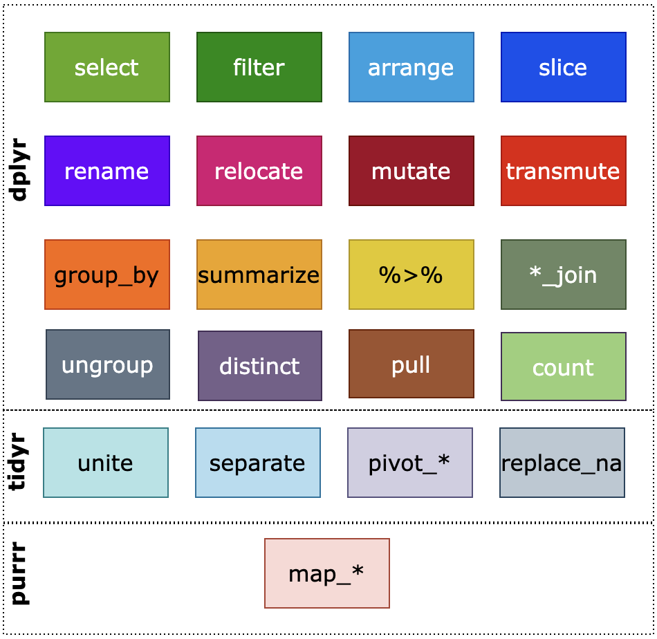
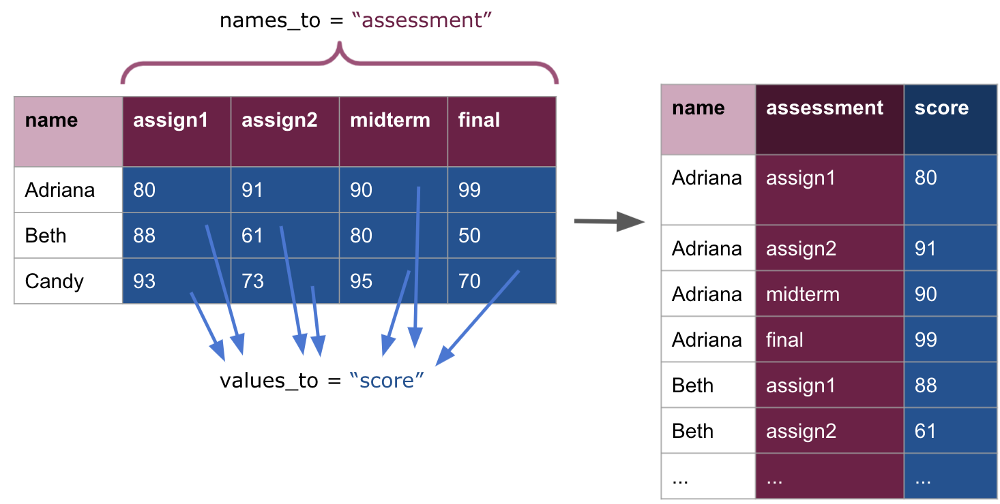
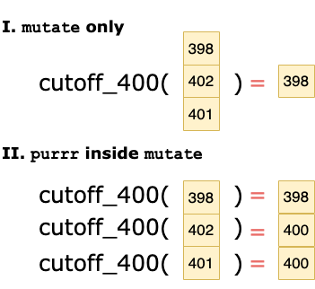
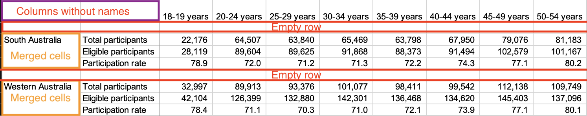

---
output:
  pdf_document: default
  html_document: default
---

# Data Transformation

The work of data science begins with a dataset. These datasets can be so large that any manual inspection or review of them, say using editing software like TextEdit or Notepad++, becomes totally infeasible. To overcome this, data scientists rely on computational tools like R for working with datasets. Learning how to use these tools well lies at the heart of data science and what data scientists do daily at their desks.

A part of what makes these tools so powerful is that we often need to apply a series of actions to a dataset. Data scientists talk a lot about the importance of data cleaning, stating that without data cleaning no data analysis results are meaningful. Some go further to say that the most important step in the data science life cycle is data cleaning because, from their point of view, the analysis process following data cleaning is a routine to a great degree. As such, another important aspect of working with datasets is *transforming* data, i.e., rendering data suitable for analysis. When data is made into an analysis-ready form, we call such data *tidy data*. Transforming data to become tidy data is the focus of this chapter.    

The tools we will cover in this chapter to accomplish this goal are also key members of the `tidyverse`. One is called `tibble`, which is a data structure for managing datasets, and another is called `dplyr`, which provides a grammar of data manipulation for acting upon datasets stored as tibbles. We will also learn about a third called `purrr` to help with the data manipulations, e.g., say when a column of data is in the wrong units.    

## Datasets and Tidy Data 

Data scientists prefer working with data that is *tidy* because it facilitates data analysis. In this section we will introduce a vocabulary for working with datasets and describe what *tidy data* looks like. 

### Prerequisites

As before, let us load `tidyverse`. 

```{r, message = FALSE, warning = FALSE}
library(tidyverse)
```

The `tidyverse` package comes with scores of datasets. By typing `data()` you can see a list of data sets available in the RStudio environment you are in. Quite a few data come with `tidyverse`. If your session has not yet loaded `tidyverse`, the list can be short.

### A "hello world!" dataset 

A dataset is a collection of *values*, which can be either a number or string. Let us begin by looking at our first dataset. We will examine the _Motor Trend Car Road Test_ dataset which is made available through `tidyverse`. It was extracted from the 1974 *Motor Trend* US magazine, and contains data about fuel consumption and aspects of automobile design for 32 car models. 

We can inspect it simply by typing its name. 

```{r eval=FALSE}
mtcars
```

```{r echo=FALSE}
mtcars |>
  slice_head(n=3)
```

Only the first few rows are shown here. You can pull up more information about the dataset by typing the name of it with a single question mark in front of it.

```{r eval = FALSE}
?mtcars
```

Datasets like these are often called *rectangular* tables. In a rectangular table, the rows have an identical number of cells and the columns have an identical number of cells, thus allowing access to any cell by specifying a row and a column together.

A conventional structure of rectangular data is as follows:

* The rows represent individual objects, whose information is available in the data set. We often call these *observations*.
* The columns represent properties of the observations. We often call these properties *variables* or *attributes*.
* The columns have unique names. We call them *variables names* or *attribute names*. 
* Every value in the table belongs to some *observation* and some *variable*.  

This dataset contains 352 values representing 11 variables and 32 observations. Note how it explicitly tells us the definition of an observation: a "car model" observation is defined as a combination of the variables that are present above, e.g., `mpg`, `cyl`, `disp`, etc. 

### In pursuit of tidy data

We are now ready to provide a definition of tidy data. We defer to [Hadley Wickham (2014)](https://vita.had.co.nz/papers/tidy-data.pdf) for a definition. We say that data is "tidy" when it satisfies four conditions: 

|       1. Each *variable* forms a column. 
|       2. Each *observation* forms a row. 
|       3. Each value must have its own cell.
|       4. Each type of observational unit forms a table. 

Data that exists in any other arrangement is, consequently, *messy*. A critical aspect in distinguishing between tidy and messy data forms is defining the __observational unit__. This can look different depending on the statistical question being asked. In fact, defining the observational unit is so important because data that is "tidy" in one application can be "messy" in another.  

The goal of this chapter is to learn about methods for *transforming* "messy" data into "tidy" data, with some help from R and the tidyverse. 

With respect to the `mtcars` dataset, we can glean the observational unit from its help page: 

> Fuel consumption and 10 aspects of automobile design and performance for 32 automobiles (1973–74 models).

Therefore, we expect each row to correspond to exactly one of the 32 different car models. With one small exception that we will return to later, the `mtcars` dataset fulfills the properties of tidy data. Let us look at other examples of datasets that fulfill or violate these properties. 

### Example: is it tidy? 

Suppose that you are keeping track of weekly sales of three different kinds of cookies at a local Miami bakery in 2021. By instinct, you decide to keep track of the data in the following table.    

```{r echo = FALSE}
bakery1 <- tribble(~week, ~gingerbread, ~`chocolate peppermint`, ~`macadamia nut`,
                  1, 10, 23, 12,
                  2, 16, 21, 16,
                  3, 25, 20, 24,
                  4, 12, 18, 20,
                 )
```

```{r}
bakery1
```

Alternatively, you may decide to encode the information as follows. 

```{r echo = FALSE, warning = FALSE, message = FALSE}
bakery2 <- as_tibble(t(bakery1), rownames = "week") |>
  slice(-1)
colnames(bakery2) <- c("week", 1,2,3,4)
```

```{r}
bakery2
```

Do either of these tables fulfill the properties of tidy data? 

First, we define the observational unit as follows:

> A weekly sale for one of three different kinds of cookies sold at a Miami bakery in 2021. Three variables are measured per unit: the week it was sold, the kind of cookie, and the number of sales. 

In `bakery1`, the variable we are trying to measure -- *sales* -- is actually split across three different columns and multiple observations appear in each row. In `bakery2`, the situation remains bad: both the *cookie type* and *sales* variables appear in each column and, still, multiple observations appear in each row. Therefore, neither of these datasets are *tidy*.    

A tidy version of the dataset appears as follows. Compare this with the tables from `bakery1` and `bakery2`. Do not worry about the syntax and the functions used; we will learn about what these mean and how to use them in a later section. 

```{r}
bakery_tidy <- bakery1 |>
  pivot_longer(gingerbread:`macadamia nut`, 
               names_to = "type", values_to = "sales")
bakery_tidy
```

When a dataset is expressed in this manner, we say that it is in *long* format because the number of rows is comparatively larger compared to `bakery1` and `bakery2`. Admittedly, this form can make it harder to identify patterns or trends in the data by eye. However, tidy data opens the door to more efficient data science so that you can rely on existing tools to proceed with next steps. Without a standardized means of representing data, such tools would need to be developed from scratch each time you begin work on a new dataset.   

Observe how this dataset fulfills the four properties of tidy data. The fourth property is fulfilled because the observational unit we are measuring is a weekly cookie sale, and we are measuring three variables -- `week`, `type`, and `sales` -- per observational unit. The detail of the observational unit description is important: these variables do not refer to measurements on some sale or bakery store; they refer specifically to measurements on a given weekly cookie sale for one of three kinds of cookies ("gingerbread", "chocolate peppermint", and "macadamia nut") sold at a local Miami bakery in 2021. If this dataset were to contain sales for a different year or cookie type not specified in our observational unit statement, then said observations would need to be sorted out into a different table.  

A possible scenario in violation the third property might look like the following: the bakery decides to record sale *ranges* instead of a single estimate, e.g., in the case of making a forecast on future sales. 

```{r echo=FALSE}
forecast_sales <- tibble(
  week          = c(1, 2, 3),
  forecast = c("200-300", "300-400", "200-500")
) |> 
  print()
```


In the next section we turn to the main data structures in R we will use for performing data transformations on datasets. 

## Working with Datasets 

In this section we dive deeper into datasets and learn how to do basic tasks with datasets and query information from them.  

### Prerequisites

As before, let us load `tidyverse`. 

```{r, message = FALSE, warning = FALSE}
library(tidyverse)
```

### The data frame 

Let us recall the `mtcars` dataset we visited in the last section. 

```{r eval=FALSE}
mtcars
```

```{r echo=FALSE}
mtcars |>
  slice_head(n=3)
```

*Data frame* is a term R uses to refer to data formats like the `mtcars` data set.
In its simplest form, a data frame consists of vectors lined up together where each vector has a name. 

How do we know how many rows and columns in the data as well as the names of the variables? The following functions answer those questions, respectively.

```{r}
nrow(mtcars) # how many rows in the dataset?
ncol(mtcars) # how many columns? 
colnames(mtcars) # what are the names of the columns? 
```

We noted earlier that this dataset is tidy with one exception. Observe that the leftmost column in the table does not have the column header or the type designation. The strings appearing there are what we call *row names*; we learn of the existence of row names when we see that R prints the data without a column name for the row names.

The problem with row names is that a variable, here the name of the car model, is treated as a special attribute. The objective of tidy data is to store data consistently and this special treatment is, according to tidyverse, a violation of the principle. 

### Tibbles 

An alternative to the data frame is the tibble which upholds best practices for working with data frames. It does not store row names as special columns like data frames do and the presentation of the table can be visually nicer to inspect than data frames when examining a dataset at the console. 

To transform the `mtcars` data frame to a tibble is easy. We simply call the function `tibble`. 

```{r}
mtcars_tibble <- tibble(mtcars)
mtcars_tibble
```

The designation `<dbl>` appearing next to the columns indicates that the column has only double values. Observe that the names of the car models are no longer present. However, we may wish to keep the names of the models as it can bring useful information. `tibble` has thought of a solution to this problem for us: we can add a new column with the row name information. The required function is `rownames_to_column`.  

```{r}
mtcars_tibble <- tibble(rownames_to_column(mtcars, var = "model_name"))
mtcars_tibble
```

Throughout the text, we will store data using the `tibble` construct. However, because `tibbles` and data frames are close siblings, we may use the terms *tibble* and *data frame* interchangeably when talking about data that is stored in a rectangular format.       

### Accessing columns and rows

You can access an individual column in two ways: (1) by attaching the dollar sign to the name of the data frame and then the attribute name, and (2) using the function `pull`. We prefer to use the latter because of the `|>` operator which we will see later. Here are some example usages. 

```{r}
mtcars_tibble$cyl
```

```{r}
pull(mtcars_tibble, cyl)
```

The result returned is the entire sequence for the column `cyl`.

If you know the position of a column in the dataset, you can use the function `select()` to get to the vector. The `cyl` is at position 3 of the data, so we obtain the following. 

```{r}
select(mtcars_tibble, 3)
```

Similarly, if we know the position of a row in the dataset, we can use `slice()`. The following will return all the associated information for the second row of the dataset. 

```{r}
slice(mtcars_tibble, 2)
```

### Extracting basic information from a tibble

You can use the function `unique` to obtain unique values in a column. Let us see the possible values for the number of cylinders. 

```{r}
unique(pull(mtcars_tibble, cyl))
```

We find that there are three possibilities: 4, 6, and 8 cylinders. 

We already know how to inquire about the maximum, minimum, and other properties of a vector. Let us check out the `mpg` attribute (miles per gallon) in terms of the maximum, the minimum, and sorting the values in the increasing order.

```{r}
max(pull(mtcars_tibble, mpg))
min(pull(mtcars_tibble, mpg))
sort(pull(mtcars_tibble, mpg))
```


### Creating tibbles

Before moving on to `dplyr`, let us see how we can create a dataset. The package `tibble` offers some useful tools when you are creating data.

Suppose you have tests scores in Chemistry and Spanish for four students, Gail, Henry, Irwin, and Joan. You can create three vectors, `names`, `Chemistry`, and `Spanish` each representing the names, the scores in Chemistry, and the scores in Spanish. 

```{r}
students <- c("Gail", "Henry", "Irwin", "Joan")
chemistry <- c( 99, 98, 80, 92 )
spanish <- c(87, 85, 90, 88)
```

We can assemble them into a tibble using the function `tibble`. The function takes a series of columns, expressed as vectors, as arguments. 

```{r}
class <- tibble(students = students, 
                chemistry_grades = chemistry, 
                spanish_grades = spanish)
class
```

The data type designation `<chr>` means "character" and so indicates that the column consists of strings.

__Pop quiz:__ is the tibble `class` we just created an example of tidy data? Why or why not? If you are unsure, revisit the examples from the previous section and compare this tibble with those. 

Let us see how we can query some basic information from this tibble. 

```{r}
pull(class, chemistry_grades) # all grades in chemistry
min(pull(class, chemistry_grades))  # minimum chemistry score
```

For small tables of data, we can also create a `tibble` using an easy row-by-row layout.  

```{r}
class <- tribble(~student,~chemistry_grades,~spanish_grades,
        "Gail",   99, 87,
        "Henry",  98, 85,
        "Irwin",  80, 90,
        "Joan",   92, 88)
class
```

We can also form tibbles using sequences as follows. 

```{r}
tibble(x=1:5, 
       y=x*x, 
       z = 1.5*x - 0.2)
```

The `seq` that is native of R allows us to create a sequence. The syntax is `seq(START,END,GAP)`, where the sequence starts from `START` and then adds `GAP` to the sequence until the value exceeds `END`. We can create the sequence with the name "x", and then add three other columns based on the value of "x".

Here is another example. 

```{r}
tibble(x = seq(1,4,0.5), 
       y = sin(x), 
       z = cos(x), 
       w = x^3 - 10*x^2 + x - 2)
```


### Loading data from an external source

Usually data scientists need to load data from files. The package `readr` of `tidyverse` offers ways for that.With the package `readr` you can read from, among others, comma-separated files (CSV files) and tab-separated files (TSV files).

To read files, we specify a string the location of the file and then use the function for reading the file, `read_csv` if it is a CSV file and `read_tab` if it is a TSV file. If you have a file that uses another delimiter, a more general `read_delim` function exists as well.  
Here is an example of reading a CSV file from a URL available on the internet.

```{r eval=FALSE, message=FALSE, warning = FALSE}
path <- str_c("https://data.bloomington.in.gov/",
              "dataset/117733fb-31cb-480a-8b30-fbf425a690cd/",
              "resource/2b2a4280-964c-4845-b397-3105e227a1ae/",
              "download/pedestrian-and-bicyclist-counts.csv")
bloom <- read_csv(path)
```

```{r echo=FALSE, message=FALSE, warning=FALSE}
bloom <- read_csv("data/sneaky_bloom.csv")
```

The data set shows the traffic in the city of Bloomington, the hometown of the Indiana University at Bloomington, Indiana.

We can inspect the first few rows of the tibble using the function `slice_head`.

```{r}
slice_head(bloom, n = 3)
```

Note that some columns have spaces in them. To access the column corresponding to the attribute, we cannot simply type the column because of the white space. To access these columns, we surround the attribute with backticks (`). 

```{r eval = FALSE}
pull(bloom, `N College and RR`)
```

### Writing results to a file 

Saving a tibble to file is easy. You use `write_csv(DATA_NAME,PATH)` where `DATA_NAME` is the name of the data frame to save and `PATH` is the "path name" of the file. 

Below, the action is to store the tibble `bloom` as "bloom.csv" in the current working directory. 

```{r eval=FALSE}
write_csv(bloom, "bloom.csv")
```

## `dplyr` Verbs

The past section showed two basic data structures -- data frames and tibbles -- that can be used for loading, creating, and saving datasets. We also saw how to query basic information from these structures. In this section we turn to the topic of data *transformation*, that is, actions we can apply to a dataset to transform it into a new, and hopefully more useful, dataset. Recall that data transformation is the essence of achieving tidy data. 

The `dplyr` packages provides a suite of functions for providing such transformations. Put another way, `dplyr` provides a *grammar* of data manipulation where each function can be thought of as the *verbs* that act upon the subject, the dataset (in tibble form). In this section we study the main `dplyr` verbs. 

### Prerequisites

As before, let us load `tidyverse`. 

```{r, message = FALSE, warning = FALSE}
library(tidyverse)
```

Let us load `mtcars` as before and call it `mtcars_tibble` and then, as before, convert the row names to a column. Call the new attribute "model_name".

```{r}
mtcars_tibble <- tibble(rownames_to_column(mtcars, "model_name"))
mtcars_tibble
```

### A fast overview of the verbs

The main important verbs from `dplyr` that we will cover are shown in the following figure.

```{r, echo=FALSE, fig.align="center", out.width='70%', fig.asp=1/2}

```

This section will cover the following:

* `select`, for selecting or deselecting columns 
* `filter`, for filtering rows 
* `arrange`, for reordering rows
* `slice`, for selecting rows with criteria or by row numbers
* `rename`, for renaming attributes
* `relocate`, for adjusting the order of the columns 
* `mutate` and `transmute`, for adding new columns 
* `group_by` and `summarize`, for grouping rows together and summarizing information about the group 

We will also discuss the `|>` operator to coordinate multiple actions seamlessly. 

Be sure to bookmark the `dplyr` [cheatsheet](https://rstudio.com/wp-content/uploads/2015/02/data-wrangling-cheatsheet.pdf) which will come in handy and useful for exploring more verbs available. 

### Selecting columns with `select`

The selection of attributes occurs when you want to focus on a subset of the attributes of a dataset at hand. The function `select` allows the selection in multiple possible ways.

In the simplest form of `select`, we list the attributes we wish to include in the data with a comma in between. For instance, we may only want to focus on the model name, miles per gallon, the number of cylinders, and the engine design. 

```{r}
select(mtcars_tibble, model_name, mpg, cyl, vs)
```

Alternatively, we may want the model name and all the columns that appear between `mpg` and `wt`. 

```{r}
select(mtcars_tibble, model_name, mpg:wt)
```

We can also provide something more complex. `select` can receive attribute matching options like `starts_with`, `ends_with`, and `contains`. The following example demonstrates the use of some of these. 

```{r}
select(mtcars_tibble, cyl | !starts_with("m") & contains("a"))
```

The criterion for selection here: in addition to`mpg` and `cyl`, any attribute whose name starts with some character other than "m" and contains "a" somewhere.

Going one step further, we can also supply a regular expression to do the matching. Recall that `^` and `$` are the start and end of a string, respectively, and `[a-z]{3,5}` means any lowercase alphabet sequence having length between 3 and 5. Have a look at the following example.

```{r}
select(mtcars_tibble, matches("^[a-z]{3,5}$"))
```

The regular expression here means return any columns that have "lowercase name with length between 3 and 5".

### Filtering rows with `filter`

Let us turn our attention now to the rows. The function `filter` allows us to select rows using some criteria. The syntax is to provide a Boolean expression for what should be included in the filtered dataset. 

We can select all car models with 8 cylinders. Note how `cyl == 8` is an expression that evalutes to either `TRUE` or `FALSE` depending on whether the the attribute `cyl` of the row has a value of `8`. 

```{r}
filter(mtcars_tibble, cyl == 8)
```

We could be more picky and refine our search by including more attributes to filter by. 

```{r}
filter(mtcars_tibble, cyl == 8, am == 1, hp > 300)
```

Here, we requested a new tibble that contains rows with 8 cylinders, a manual transmission, and a gross horsepower over 300.  

We may be interested in fetching a particular row in the dataset, say, the information associated with the car model "Datsun 710". We can also use `filter` to achieve this task. 

```{r}
filter(mtcars_tibble, model_name == "Datsun 710")
```

### Re-arranging rows with `arrange`

It may be necessary to rearrange the order of the rows to aid our understanding of the meaning of the dataset. The function `arrange` allows us to do just that.

To arrange rows, we state a list of attributes in the order we want to use for re-arranging. For instance, we can rearrange the rows by gross horsepower (`hp`). 

```{r}
arrange(mtcars_tibble, hp)
```

By default, `arrange` will reorder in ascending order. If we wish to reorder in descending order, we put the attribute in a `desc` function call. While we are at it, let us break ties in `hp` and order by miles per gallon (`mpg`).

```{r}
arrange(mtcars_tibble, desc(hp), mpg)
```

### Selecting rows with `slice`

The function is for selecting rows by specifying the rows position. You can specify one row with its row number, a range of rows with a number pair `A:B` where you can have an expression involving the function `n` to specify the number of rows in the data.

The following use of `slice()` uses the range `(n()-10):(n()-2)` is the range starting from the tenth row from the last and ending at the second to last row. 

```{r}
slice(mtcars_tibble, (n()-10) : (n()-2))
```

We can also use `slice_head(n = NUMBER)` and `slice_tail(n = NUMBER)` to select the top `NUMBER` rows and the last `NUMBER` rows, respectively.

```{r}
slice_head(mtcars_tibble, n = 2)
slice_tail(mtcars_tibble, n = 2)
```

If we are interested in some particular row, we can use `slice` for that as well.

```{r}
slice(mtcars_tibble, 3)
```

We can also select a *random* row by using `slice_sample`. In this example, each row has an equal chance of being selected. 

```{r}
slice_sample(mtcars_tibble)
```

### Renaming columns with `rename`

This function allows you to rename a specific column. The syntax is `NEW_NAME = OLD_NAME`. Below, we replace the name `wt` with `weight` amd `cyl` with `cylinder`.

```{r}
rename(mtcars_tibble, weight = wt, cylinder = cyl)
```

### Relocating column positions with `relocate`

Sometimes you may want to change the order of columns by moving a column from the present location to another. We can relocate a column using the `relocate` function by specifying which column should go where. The syntax is `relocate(DATA_NAME,ATTRIBUTE,NEW_LOCATION)`.

The specification for the new location is either by `.before=NAME` or by `.after=NAME`, where `NAME` is the name of a column.

```{r}
relocate(mtcars_tibble, am, .before = mpg)
```

Here we moved the column `am` to the front, just before `mpg`. 

### Adding new columns using `mutate`

The function `mutate` can be used for modification or creation of a new column using some function of the values of existing columns. Let us see an example before getting into the details.  

Suppose we are interested in calculating the ratio between the numbers of cylinders and forward gears for each car model. We can do this by appending a new column with the calculated ratios using `mutate`. 

```{r}
mtcars_with_ratio <- mutate(mtcars_tibble, 
                            cyl_gear_ratio = cyl / gear)
mtcars_with_ratio
```

Unfortunately, the new column appears at the very end which may not be desirable. We can fix this with the following adjustment.  

```{r}
mtcars_with_ratio <- mutate(mtcars_tibble, 
                            cyl_gear_ratio = cyl / gear,
                            .before = mpg)
mtcars_with_ratio
```

By specifying an additional `.before` argument with the value `mpg`, we inform `dplyr` that the new column `cyl_gear_ratio` should appear before the column `mpg`, which is the first column in the dataset. 

Generally speaking, the syntax for `mutate` is: 

> `mutate(DATA_SET_NAME, NEW_NAME = EXPRESSION, OPTION)`

where:

* The `NEW_NAME = EXPRESSION` specifies the name of the new attribute and how to compute it, and `OPTION` is an option to specify the location of the new attribute relative to the existing attributes.
* The position option is either of the form `.before=VALUE` or of the form `.after=VALUE` with `VALUE` specifying the name of the column where the new column will appear before or after; it can also receive a number indicating the position for the newly inserted column.  
* The `EXPRESSION` can be either a mathematical expression or a function call.

Let us see another example. In addition to calculating the ratio from before, we will create another column containing the make of the car. We will do this by extracting the first word from `model_name` using a regular expression. Let us amend our `mutate` code from before to include the changes. 

```{r}
mtcars_mutated <- mutate(mtcars_tibble, 
                         cyl_gear_ratio = cyl / gear,
                         make = str_replace(model_name, " .*", ""),
                         .before = mpg)
mtcars_mutated
```

To form the `make` column, we use the function `str_replace`; we look for substrings that match the pattern `" .*"` (one white space and then any number of characters following it) and replace it with an empty string `""`, leaving only the first word, as desired. String operations are applicable to strings, which is what appears in the column `make`. 

Note that the original dataset, before mutation, remains unchanged in `mtcars_tibble`. 

```{r}
mtcars_tibble
```

How many different makes are there? We can use `unique` for removing duplicates to find out.

```{r}
unique(pull(mtcars_mutated, make))
```

When an existing column is given in the specification, no new column is created and the existing column is modified instead. For instance, the following rounds `wt` to the nearest integer value. 

```{r}
mutate(mtcars_tibble, wt = round(wt))
```

We can also modify multiple columns in a single pass, say, `wt`, `mpg`, and `qsec` should all be rounded to the nearest integer. We can accomplish this using a combination of `mutate` with the helper `dplyr` verb `across`.

```{r}
mutate(mtcars_tibble, 
       across(c(mpg, wt, qsec), round))
```

### The function `transmute`

The function `transmute` is a variant of `mutate` where we keep only the new columns generated.

```{r}
only_the_new_stuff <- transmute(mtcars_tibble, 
                          cyl_gear_ratio = cyl / gear,
                          make = str_replace(model_name, " .*", ""))
only_the_new_stuff
```

### The pair `group_by` and `summarize`

Suppose you are interested in exploring the relationship between the number of cylinders in a car model and the miles per gallon it has. One way to examine this is to look at some summary statistic, say the *average*, of the miles per gallon for car models with 6 cylinders, car models with 7 cylinders, and car models with 8 cylinders.

When thinking about the problem in this way, we have effectively divided up all of the rows in the dataset into three groups, where the group a car model will belong to is determined by the number of cylinders it has. 

`dplyr` accomplishes this using the function `group_by()`. The syntax for `group_by()` is simple: simply list the attributes with which you want to build groups. Let us give an example on how to use it. 

```{r}
grouped_by_cl <- group_by(mtcars_tibble, cyl)
slice_head(grouped_by_cl, n=2) # show 2 rows per group
```

We can spot two rows shown per each `cyl` group. `group_by()` alone is often not useful. To make something out of this, we need to *summarize* some piece of information using these groups, e.g. the average `mpg` per group as is needed for our task. 

The summary function is called `summarize()`. Let us amend our above grouping code to include the summary.  

```{r message = FALSE}
grouped_by_cl <- group_by(mtcars_tibble, cyl)
summarized <- summarize(grouped_by_cl, 
          count = n(),
          avg_mpg = mean(mpg))
summarized
```

This table looks more like what we would expect. Our `summary` calculates two summaries, each reflected in a column in the above table:

* `count`, the number of car models belonging to the group 
* `avg_mpg`, the average miles per gallon of car models in the group

The summary results make sense. More cylinders translates to more power, but it also means more moving parts which can hurt efficiency. Therefore, it seems an association exists where the more cylinders a car has, the lower its miles per gallon.   

These functions come handy when you want to examine data by grouping rows and summarize some information with respect to each group.

<!-- More cylinders potentially means more power, but it also means more moving parts. More moving parts means there's more friction to overcome, impacting efficiency.  --> 
 
<!-- Generally speaking, the higher an engine’s displacement the more power it can create, while the lower the displacement the less fuel it can consume. --> 
 
### Coordinating multiple actions using `|>`

Let us revise a bit our previous study. Curious about the joint effect of the numbers of cylinders and the transmission of the car, you decide to group by both `cyl` and `am`. After summarizing the groups, you calculate the counts in each group and the average `mpg`. Finally, after the summary is done, you would like to remove any groups from the summary that have less than 2 cars. 

Your analysis pipeline, then, would be composed of three steps: 

|       1. Group rows by `cyl` and `am`, the number of cylinders. 
|       2. Summarize to calculate the average miles per gallon per group. 
|       3. Filter out rows that are below the average miles per gallon. 

A first solution for this task might look like the following. 

```{r message = FALSE}
# step 1
grouped_by_cl <- group_by(mtcars_tibble, cyl, am)
# step 2
summarized <- summarize(grouped_by_cl, 
          count = n(),
          avg_mpg = mean(mpg))
# step 3
avg_mpg_counts <- filter(summarized, count > 2)
avg_mpg_counts
```

Observe how the code we have just written is quite cumbersome. It introduces several intermediate products that we do not need, namely, the names `grouped_by_cl` and `summarized`. It can also be difficult to come up with descriptive names.  

Conveniently, there is a construct from base R called the "pipe" which allows us to pass the results from one function as input to another. The way to use piping is simple.

* You start by stating the initial dataset. 
* For each operation to form, you append `|>` and then the operation, where you omit the dataset name part.
* If you need to save the result in a data set, you use the assignment operator `<-` at the beginning as usual.

Thus, we can rewrite our first solution as follows. 

```{r message = FALSE}
avg_mpg_counts <- mtcars |>
  group_by(cyl, am) |>
  summarize(count = n(), 
            avg_mpg = mean(mpg)) |>
  filter(count > 2)
```

This solution is much easier to read than our first; we can clearly identify the transformations being performed on the data. It is good to read `|>` as "then". 

Note that there is not much mystery with `|>`. All the pipe operator does is place an object into the first argument of a function. So, when we say `mtcars |> group_by(cyl, am)`, the pipe changes this to `group_by(mtcars, cyl, am)`. Or, more generally, if we have `x |> func(y)`, this is changed to `func(x, y)`.   

Here is another use of the pipe, using our `mtcars_mutated` tibble from earlier. 

```{r}
mtcars_mutated |>
  pull(make) |>
  unique()
```

Neat! This one demonstrates some of the usefulness of `pull` over the traditional `$` for accessing column data. 

### Practice makes perfect! 

This section has covered a lot of `dplyr` functions for transforming datasets and, despite our best efforts, understanding what these functions are doing can quickly become overwhelming. The only way to truly understand these functions -- and which ones should be used when confronted with a situation -- is to practice using them. 

Begin with the `mtcars` dataset from this section and run through each of the functions and the examples discussed here on your own. Observe what the dataset looks like before and after the transformation and try to understand what the transformation is.

Once you develop enough familiarity with these functions, try making small changes to our examples and coming up with your own transformations to apply. Be sure to include the `|>` operator whenever possible. 

You may also wish to look at some of the datasets available to you when running the command `data()`. 

## Tidy Transformations 

In this section we turn to transformation techniques that are essential for achieving tidy data. 

### Prerequisites

As before, let us load `tidyverse`. 

```{r, message = FALSE, warning = FALSE}
library(tidyverse)
```

### Uniting and separating columns 

The third tidy data guideline states that each value must have its own cell. Sometimes this value may be split across multiple columns or merged in a single column. 

In the case of the Miami bakery example, we saw that when the bakery records sale forecasts, the lower and upper bounds of the range are fused in a single cell. This makes extraction and analysis of these values difficult, especially when R treats the `forecast` column as a character sequence. 

```{r}
forecast_sales <- tibble(
  week          = c(1, 2, 3),
  forecast = c("200-300", "300-400", "200-500")
)
forecast_sales
```

A solution would be to *split* `forecast` into multiple columns, one giving the lower bound and the other the upper bound. The `tidyr` function `separate` accomplishes the work. 

```{r}
forecast_sales |>
  separate(forecast, c("low", "high"), "-", convert = TRUE)
```

We separate the columns based on the presence of the `"-"` character. The `convert` argument is set so that the lower and upper values can be treated as proper integers. 

The tibble `table5` displays the number of TB cases documented by the World Health Organization in Afghanistan, Brazil, and China between 1999 and 2000. The "year", however, is a single value that has been split across a `century` and `year` column.

```{r}
table5
```

The `unite` function can be used to merge a split value. Its functionality is similar to `separate`.  

```{r}
table5 |>
  unite("year", century:year, sep="")
```

We specify an empty string (`""`) in the `sep` argument to indicate no character delimiter should be used when merging the values. 

Note also that the `rate` column needs tidying. We leave the tidying of this column as an exercise for the reader. 

### Pulling data from multiple sources

The fourth principle of tidy data stated that an observational unit should form a table. However, often times the observational unit we are measuring is split across multiple tables.  

Let us suppose we are measuring student assessments in a class. The data is given to us in the form of two tables, one for exams and the other for assignments. We load the scores into our R environment with tibble. 

```{r}
exams <- tibble(name = c("Adriana", "Beth", "Candy", "Emily"), 
                midterm = c(90, 80, 95, 87), 
                final = c(99, 50, 70, 78))
assignments <- tibble(name = c("Adriana", "Beth", "Candy", "Florence"), 
                assign1 = c(80, 88, 93, 88), 
                assign2 = c(91, 61, 73, 83))
exams
assignments
```

If the observational unit is an *assessment* result, then some assessments are in one table and some assessments are in another. Therefore, according to this definition, the current arrangement of the data is *not* tidy. The data should be kept together in a single table.  

You can combine two tibbles using a common attribute as the key for combining; that is, finding values appearing in both tibbles and then connecting rows having the names in common. In general, if there are multiple matches between the two tibbles concerning the attribute, each possible row matches will appear.

The construct for stitching together two tibbles together in this manner is called the *join*.  The general syntax is: 

> `JOIN_METHOD_NAME(DATA1, DATA2, by="NAME")`.

Here `DATA1` and `DATA2` are the names of the tibbles and `NAME` is the name of the key attributes. There are four types of join functions. The differences among them are in how they treat non-matching values.

* `left_join`: Exclude any rows in `DATA2` with no matching values in `DATA1`.
* `right_join`; Exclude any rows in `DATA1` with no matching values in `DATA2`.
* `inner_join`: Exclude any rows in `DATA2` and `DATA1` with no matching values in the other data frame.
* `full_join`: No exclusions.

The example below shows the results of four join operations.

```{r}
scores_left <- left_join(assignments, exams, by="name")
scores_left
scores_right <- right_join(assignments, exams, by="name")
scores_right
scores_inner <- inner_join(assignments, exams, by = "name")
scores_inner
scores_full <- full_join(assignments, exams, by="name")
scores_full
```

The results of the join reveal some anomalies in our data. Namely, we see that Emily does not have any assignment scores nor does Florence have any exam scores. Hence, in the left, right, and full joins, we see values labeled `NA` appear where they would have those values. We call these missing values, which can be thought of as "holes" in the data. We will return to missing values in a later section. 

An alternative to the join is to stack up the rows using `bind_rows`. 

```{r}
bind_rows(assignments, exams)
```

Observe how this one does not join values where possible, and so there is redundancy in the rows that appear, e.g., Adriana appears twice. As a result, many missing values appear in the resulting table. 

### Pivoting

Let us return to the resulting table after the inner join. 

```{r}
scores_inner
```

The third property of tidy data is fulfilled now that the observational unit forms a single table. However, the joined table is still messy. The grades are split across four different columns and, therefore, multiple observations occur at each row. 

To remedy this, we use *pivot* and, in terms of R, the function `pivot_longer` from the `tidyr` package. The syntax for `pivot_longer` can be complex, and so we do not go over it in detail. Here is how we can use it.   
```{r}
scores_long <- scores_inner |>
  pivot_longer(c(assign1, assign2, midterm, final), 
               names_to = "assessment", values_to = "score")
scores_long
```

The usage above takes `scores_inner`, merges all the assessment columns, creates a new column with name `assessment`, and presents the corresponding values under the column `score`. Graphically, this is what a pivot longer transformation computes. 

```{r, echo=FALSE, fig.align="center", out.width='70%', fig.asp=1/2}

```

Observe how we can easily read off the three variables from this table: `name`, `assessment`, and `score`. We can be confident in knowing that this is tidy data.

If we wish to go in the other direction, we can use `pivot_wider`. The function `pivot_wider` grabs a pair of columns and spreads the pair into a series of columns. One column of the pair serves as the source for the new column names after spreading. For each value appearing in the source column, the function creates a new column by the name. The value appearing opposite to the source value appears as the value for the column corresponding to the source.

```{r}
scores_long |>
  pivot_wider(names_from = assessment, values_from = score)
```

Here is a visual demonstrating the pivot wider transformation:

```{r, echo=FALSE, fig.align="center", out.width='70%', fig.asp=1/2}
knitr::include_graphics('images/pivot_wider.png')
```

Note how this simply undoes what we have done, returning us to the original `scores_inner` table. We can also prefix each of the new columns with `assess_`. 

```{r}
scores_long |>
  pivot_wider(names_from = assessment, 
              values_from = score, names_prefix = "assess_")
```

There are two details to note when working with the pivot functions. 

* `pivot_wider` should not be thought of as an "undo" operation. Like `pivot_longer` its primary purpose is also to make data tidy. Consider the following table and observe how each observation is scattered across two rows. The appropriate means to bring this data into tidiness is through an application of `pivot_wider`.   

```{r}
slice_head(table2, n = 5)
```

* `pivot_longer` and `pivot_wider` are not perfectly symmetrical operations. That is, there are cases where applying `pivot_wider`, followed by `pivot_longer`, will not reproduce the exact same dataset. Consider such an application on the following dataset. Keep in mind the column names and how the column data types change at each pivot step.

```{r}
sales <- tibble(
  year     = c(2020, 2021, 2020, 2021),
  quarter  = c(1, 2, 1, 2),
  sale     = c(70, 80, 62, 100)
)
```

## Applying Functions to Columns 

Situations can arise where we need to apply some function to a column. In this section we learn how to apply functions to columns using a construct called the `map`. 

### Prerequisites

As before, let us load `tidyverse`. 

```{r, message = FALSE, warning = FALSE}
library(tidyverse)
```

We will use the `mtcars` tibble again in this section so let us prepare the tibble by migrating the row names to a dedicated column. Note how the pipe operator can be used to help with the work. 

```{r}
mtcars_tibble <- mtcars |>
  rownames_to_column("model_name") 
```


### What is a `function` anyway? 

We have used several times by now the word "function". Here are some basic rules about functions.

* _A function is a block of code with a name that allows execution from other codes._ This mean that you can take any part of a working (i.e., all parentheses and brackets in the part have matching counterparts in the same part) and specify it to be a function.
* _If the function is active in the present run of R, each time a code call the function, the code of the function runs._ This means that R suspends the execution of the present code and processes the execution of the code of the function. When it finishes running the code of the function, it returns to the execution of the one it has suspended.
* _A function may take upon the role of computing a value._ You can design a function so that it uses a special function `return` at the end so as to specify the value it has computed. Note that the use of `return` is __optional__ and, by default, R returns the last line of computation performed in the function. 
* _If a function has the role of returning a value, the call itself represents the value it computes._ So you store the value the function computes in a variable using an assignment.
* _A function may require some number of values to use in its calculation._ We call them *arguments*. When using a function that requires arguments, the arguments must appear in the call.

### A very simple function

Here is a very simple function, `one_to_ten`, which prints the sequence of integers from 1 to 10. The definition of the function takes the form `one_ten <- function() { ... }`.

```{r, error = TRUE}
one_to_ten <- function() { 
  print(1:10) 
}
```

Here is what happens when you call the function.

```{r}
one_to_ten()
```

Note that the call stands alone, i.e., you can use it without anything else but its name and a pair of parentheses. By replacing the code appearing inside the curly brackets, you can define a different function with the same name `one_to_ten`. 

Let us reverse the order in which the numbers appear.

```{r, error = TRUE}
one_to_ten <- function() { 
  print(10:1) 
}
```

Here is what happens when you call the function.

```{r}
one_to_ten()
```

The new behavior of `one_to_ten` substitutes the old one, and you cannot replay the behavior of the previous version (until, of course, you modify the function again). 

### Functions that compute a value

To make a function compute a value, you add a line `return(VALUE)` at the end of the code in the brackets. The function `my_family` returns a list of names for persons. 

Remember the `c` function? The function creates a vector with 19 names as strings and returns the vector.

```{r}
my_family <- function() {
  c("Amy", "Billie", "Casey", "Debbie", "Eddie", "Freddie", "Gary",
    "Hary", "Ivy", "Jackie", "Lily", "Mikey", "Nellie", "Odie",
    "Paulie", "Quincy", "Ruby", "Stacey", "Tiffany")
}
```

The call for the function produces the list that the function returns.

```{r}
a <- my_family()
a
```

Now whenever you need the 19-name list, you can either call the function or refer to the variable `a` that holds the list.

### Functions that take arguments

To write a function that takes arguments, you determine how many arguments you need and determine the names you want to use for the arguments during the execution of the code for the function.

The `function` declaration now has the names of the arguments. You put them in the order you want to use with a comma in between. Below, we define a function that computes the max between 100 and the argument received. The function returns the argument so long as it is larger than 100. 

```{r}
passes_100 <- function(x) {
  max(100, x)
}
```

Here is a demonstration of how the function works.

```{r}
passes_100(50)  # a value smaller than 100
passes_100(2021)  # a value larger than 100
```


### Applying functions using `mutate`

Let us now return to the discussion of how we can *apply* functions to a column. The meaning of apply is particular. What we mean by this is that we wish to run some function (which can receive an argument and return a value) to each row of a column. This can be useful if, say, some column is given in the wrong units or if the values in a column should be "cut off" at some threshold point.  

Recall the tidied tibble `mtcars_tibble`. 

```{r echo=FALSE}
mtcars_tibble <- mtcars |>
  as_tibble()
```

```{r}
mtcars_tibble
```

We can spot two areas that require transformation: 

* Convert the `wt` column from pounds to kilograms.  
* Cut off the values in `displ` so that no car model has a value larger than `400`.

We can address the first one by writing a function that multiples each value in the argument received by the conversion factor for kilograms. Let us test it out first with a simple vector.

```{r}
wt_conversion <- function(x) {
  x * 0.454
}

wt_conversion(100:105)
```

To incorporate this into the tibble, we make a call to `mutate` using our function `wt_conversion`, which *modifies* the column `wt`. 

```{r}
mtcars_transformed <- mtcars_tibble |>
  mutate(wt = wt_conversion(wt))
mtcars_transformed
```

We have successfully applied a function we wrote to a column in a tibble! 

The second task is peculiar. As with the first example, we can define a function that computes the minimum between the argument and the value `400`. 

```{r}
cutoff_400 <- function(x) {
  min(400, x)
}
```

We could then apply the function to the column `disp` using a similar approach.

```{r}
mtcars_transformed <- mtcars_tibble |>
  mutate(disp = cutoff_400(disp))
mtcars_transformed
```

That didn't work out so well. The new `disp` column contains the same value `71.1` for every row in the tibble! Did `dplyr` make a mistake? Is the function we wrote just totally wrong? 

The error, actually, is not in anything we wrote *per se*, but in how R *processes* the function `cutoff_400` during the mutate call. We expect to pass one number to the function `cutoff_400` so that we can compare it against 400, but our function instead receives a *vector* of values when used inside a `mutate` verb. That is, the entire `disp` column of values is passed as an argument to the function `cutoff_400`.   

While this was no problem for the `wt_conversion` function, `cutoff_400` is not capable of handling a *vector* as an argument *and* returning a *vector* back. 

To clarify the point, compare the result of these two functions after receiving the vector `395:410`. 

```{r}
wt_conversion(399:405)
```

```{r}
cutoff_400(398:405)
```

`wt_conversion` performs an element-wise operation to each element of the sequence and, therefore, the first example works as intended. In the second, `cutoff_400` computes the minimum of the vector (398) and returns the result of just that computation; no element-wise comparison is made. 

To make `cutoff_400` work as intended, we turn to a new programming construct called the *map*, prepared by the package [purrr](https://github.com/rstudio/cheatsheets/blob/master/purrr.pdf). 

### `purrr` maps

The main construct we will be using from `purrr` is called the *map*. A map applies a function, say the `cutoff_400` function we just wrote, to __each element__ of a vector or list. 

`purrr` offers many flavors of map, depending on what the output vector should look like:  

* `map_lgl()` outputs a logical vector.
* `map_int()` outputs an integer vector.
* `map_dbl()` outputs a double vector.
* `map_chr()` outputs a character vector.
* `map()` outputs a list.

Here are some more examples of using map. Let us apply the `wt_conversion` to an input vector containing a sequence of values from 95 to 105. 

```{r}
map_dbl(399:405, wt_conversion)
```

Observe how this resulting vector is the same one we obtained when applying `wt_conversion` without a map. 

We can also define functions and pass it in on the spot. We call these *anonymous functions*. The following is an *identity function*: it simply outputs what it takes in. 

```{r}
map_int(1:5, function(x) x)
```

> A catch here is that the code after the comma, i.e., `function(x) x` specifies *in place* the function to apply to each element of the series preceding the comma `1:5`. The function in question `function(x) x` specifies that the function will receive a value named `x` and *returns* the value of `x` without modification. Thus we call it an identity function. The external function `map_int` states that the result of applying the identify function thus specified with `function(x) x` to each element of the sequence `1:5` will be presented as an integer.

We could write the above anonymous function more compactly. 

```{r}
map_int(1:5, \(x) x)
```

The next one is perhaps more useful than the identify function. It computes the square of each element, i.e., $x^2$. 

```{r}
map_dbl(1:5, \(x) x ** 2)
```

> __Why use map_dbl() instead of map_int()?__ By default, R treats numbers as doubles. While `1:5` is a vector of integers, each element is subject to the expression `x ** 2`, where `x` is an integer and `2` is a double. To make this operation compatible, R will "promote" `x` to a double, making the output of this expression a double as well.  

The next one will always return a vector of 5's, regardless of the input. Can you see why? Do you also see why there are six elements, unlike five elements in the previous examples?

```{r}
map_dbl(1:6, \(x) 5)
```

### `purrr` with `mutate`

By now we have seen enough examples of how to use `map` with a vector. Let us return to the issue of applying the function `cutoff_400` to the `disp` variable. 

To incorporate this into a tibble, we encase our `map` inside a call to `mutate`, which modifies the column `disp`.

```{r}
mtcars_transformed <- mtcars_tibble |>
  mutate(disp = map_dbl(disp, cutoff_400))
mtcars_transformed
```

We can inspect visually to see if there are any repeating values in `disp` or if any of those values turn out larger than 400 -- there shouldn't be! 

The following graphic illustrates the effect of the `purrr` map inside the mutate call.  

```{r, echo=FALSE, fig.align="center", out.width='40%', fig.asp=1/2}

```

Note that the use of map allows a vector to be returned by the `cutoff_400` function, which can then be used as a column in the `mutate` call. 

__Pop quiz:__ In our two examples of applying a function to `wt` and `disp`, the new tibble (stored in `mtcars_transformed`) lost information about the values of `wt` and `disp` before the transformation. How could we amend our examples to still preserve the old information in case we would like to make comparisons between the before and after?  

## Handling Missing Values

In the section on joining tables together we saw a special value called `NA` crop up when rows did not align during the matching. We call these special quantities, as you might expect, *missing values* since they are "holes" in the data. In this section we dive more into missing values and how to address them in your datasets.  

### Prerequisites

As before, let us load the `tidyverse`. 

```{r, message = FALSE, warning = FALSE}
library(tidyverse)
```

### A dataset with missing values 

The tibble `trouble_temps` contains temperatures from four cities across three consecutive weeks in the summer.

```{r}
trouble_temps <- tibble(city = c("Miami", "Boston", 
                                 "Seattle", "Arlington"),
                        week1 = c(89, 88, 87, NA), 
                        week2 = c(91, NA, 86, 75), 
                        week3 = c(88, 85, 88, NA))
trouble_temps
```

As you might expect, this tibble contains missing values. We can see that Boston is missing a value from `week2` and Arlington is missing values from both `week1` and `week3`, possibly due to some faulty equipment. 

### Eliminating rows with missing values 

If you need to get rid of all rows with `NA`, you can use `drop_na` which is part of `dplyr`.

```{r}
temps_clean <- trouble_temps |> 
  drop_na()
temps_clean
```

### Filling values by looking at neighbors  

There is a way to fill missing values by dragging the non-`NA` value immediately below an NA to its position. In this manner, all `NA`'s after the first non-`NA` will acquire a value. This works when the bottom row does not have an `NA`. 

Let us fill the values using this setting.

```{r}
trouble_temps |>
  fill(week1:week3, .direction = "up")
```

Note how the temperatures for Arlington remain unfilled.  

In the case where the bottom row has an `NA` and the top row does not have an `NA`, you can drag the values upwards instead.

We can also combine the two actions in a bidirectional manner, either going down and then up or going up and then down.

```{r}
trouble_temps |>
  fill(week1:week3, .direction = "updown")
```

The directional specifications are: "up", "down", "updown", and "downup". The default direction is "down", and so you do not have state it.

### Filling values according to a global constant 

If you want to make an across-the-board replacement of NA with a specific value, you can use the function `replace_na` from `tidyr`. For instance, the following replaces missing values in `week1` with the value 70.

```{r}
trouble_temps |>
  mutate(week1 = replace_na(week1, 70))
```

If you wish to apply this for all columns in the dataset, we can use provide `replace_na` as an anonymous function in a combination of `mutate` with `across`.

```{r}
trouble_temps |>
  mutate(across(week1:week3, function(x) replace_na(x, 70)))
```

Note that if your dataset contains a mixture of strings and numbers, then a straightforward application like this will not work. Instead, you will need to split the process into two steps: first handling missing values in the strings columns and then, afterwards, taking care of the missing values in the numeric columns.  

Alternatively, you can use `replace_na` to give an instruction how to handle NA appearing in specific columns. 

The syntax for the instruction is simple. For each attribute you make a placement, state its name, add an equal sign, and then add the value you want to use for replacement. The replacement instructions must appear in a list, even if there is only one replacement instruction.

Below, we fill any `NA` in `week1` with 89, in `week2` with 91, and in `week3` with 88. 

```{r}
trouble_temps |> 
  replace_na(list(week1 = 89, week2 = 91, week3 = 88))
```


## Case Study: Tidy Assessments

In this section, we present a larger dataset and apply transformations that are necessary to bring it into tidy data to facilitate further analysis. The goal of this exercise is to demonstrate how the transformations we have learned in this chapter are not tools meant to be used in isolation, but work best when used together to fulfill a complex goal.  

### Prerequisites

As always, we will need the `tidyverse` to accomplish our task. We will also load in the `edsdata` package that contains the datasets we will be working with. 

```{r, message = FALSE, warning = FALSE}
library(tidyverse)
library(edsdata)
```

### The tibbles `csc_course_lab`, `csc_course_hw`, and `csc_course_qz`

We will examine three datasets that contain assessment results from a hypothetical introductory course in Computer Science. These datasets come from the `edsdata` package.

```{r message = FALSE, warning = FALSE}
csc_course_lab
csc_course_hw
csc_course_qz
```

Following is some information about the dataset:

* The `number` column gives a unique number of each student enrolled in the course.
* There are ten `labXX` attributes (for labs), eleven `hwXX` attributes (for homeworks), and three `qzXX` scores (for quizzes).
* The dataset is split across three different tables: one for lab scores, a second for homework scores, and a third for quiz scores. 
* The data abounds with missing values. The missing values in this dataset have a clear explanation: some students did not turn in all of the labs and/or assignments.  

Let us state the __observational unit__ to be an individual student assessment and we would like to measure the following variables: 

* *number*, a unique number of each student 
* *assessment*, the kind of assessment, e.g., lab01, hw01, qz01 
* *score*, the received score on the assessment 

We can see the current format of the dataset violates all three principles of tidy data. Those problems being: 

* The observational unit is the *student* which is spread across three different tables.
* There is missing data present which, by definition, is not tidy.
* We would like to keep the scale of the scores the same for each assessment, i.e., labs, homeworks, and quizzes should all be on a 100 point scale. 
* Both the student *number* and *score* appears in each column and multiple observations appear in each row. 

Once we have tided the data, we would like to answer the following questions:  

* What is average lab, homework, and quiz score for each of the students? What are the overall averages for the class? 
* Which students performed poorly in the course? 

We will address each of these in turn. 

### Joining like data together 

To resolve the first problem, we should merge the data from each of the three tibbles into one single tibble. We know how to do this using the *join* operation.

We are quite fortunate because each table shares a common attribute which we can use as a key in the join: `number`. We will coordinate the join by first merging the homework and lab tibbles together, and then merging the resulting tibble with the quiz tibble.  

```{r}
csc_course_merged <- csc_course_hw |>
  inner_join(csc_course_lab, by = "number") |>
  inner_join(csc_course_qz, by = "number")
csc_course_merged
```

Note that even though we used `inner_join` here, the resulting tibble would have been the same if we had used any of the other styles of join. Why might that be? 

### Addressing missing data 

Now that we have the data in a single table, we can address the problem of missing data. As we noted earlier, the missing values have a meaning in the dataset: the student did not turn in the associated assessment. The appropriate way to handle this is to substitute each missing value with a 0 -- sorry folks!  

We can accomplish this using the `replace_na` function. We express the anonymous function that uses `replace_na` with formula notation. 

```{r}
csc_course_merged <- csc_course_merged |>
  mutate(across(everything(), \(x) replace_na(x, 0)))
csc_course_merged
```

Missing values, begone! 

### Scaling scores to the same point scale 

Next, we turn to scaling the points so that everything is on the 100 point scale. To accomplish this, we need to convert all of the labs and homeworks column from a 10 point to a 100 point scale. 

To do this, we will apply a function to each of the labs and homeworks columns. Here is the function we will apply. 

```{r}
convert_to_100_points <- function(x) {
  return((x / 10) * 100)
}
```

We could apply a `mutate` for each of the eleven homeworks and twelve labs, but this can be quite cumbersome to type. The function `across` allows us to mutate multiple columns at once. Here is how we can put everything together. 

```{r}
csc_course_merged <- csc_course_merged |>
  mutate(across(matches("lab"), convert_to_100_points),
         across(matches("hw"), convert_to_100_points))
csc_course_merged
```

Note that the function `matches("lab")` looks for all columns that have the name `"lab"` in it, which will return the twelve lab columns. Ditto `matches("hw")` and the homework columns. 

### Pivoting 

We will now resolve our fourth stated problem. To overcome this, we can use the *pivot* transformation so that the three variables become apparent in the table: `number`, `assessment`, and `score`. 

```{r}
csc_course_merged <- csc_course_merged |>
  pivot_longer(starts_with("hw") | 
                 starts_with("lab") | starts_with("qz"), 
               names_to = "assessment", values_to = "score")
csc_course_merged
```

The one bit of machinery we added here is the Boolean expression `starts_with("hw") | starts_with("lab") | starts_with("qz")` so that we are able to select all of the homework, lab, and quiz columns at once. The meaning of this expression should be straightforward. 

This data is just about tidied. The difference between the individual assessments, e.g., "hw01" versus "hw03", does not concern us for this analysis, so let us tidy the values in the `assessment` column so that only three values appear: `hw`, `lab`, and `qz`.   

We can use a regular expression in a call to `str_replace` to do the work for us. Here is an example of the regular expression in action. 

```{r message=FALSE}
str_view_all("hw05", "[0-9]+")
```

Once we have matched any of the numerical characters, we can replace them with an empty string `""`. For instance: 

```{r}
str_replace("hw05", "[0-9]+", "")
```

We can now pull everything together using a call to `mutate`.  

```{r}
csc_course_merged <- csc_course_merged |>
  mutate(assessment = str_replace(assessment, "[0-9]+", ""))
csc_course_merged
```

Looks great! Let us finish by answering some questions about the data. 

### The good stuff: summarizing information  

We are now ready to answer some of the questions we proposed at the outset of this section. Our first question: what is average lab, homework, and quiz score for each of the students; what are the overall averages for the class? 

We can answer this using a combination of the `group_by` and `summarize` verbs. We will group by the variables `number` and `assessment` and then summarize the grouped means for each group.  

```{r message=FALSE, warning=FALSE}
csc_course_merged |>
  group_by(number, assessment) |>
  summarize(mean_score = mean(score))
```

Compare this table with the previous and note how there is only one `hw`, `lab`, and `qz` assessment for each student. The reported value that you see is the *mean* score for all of the assessments in that category for the student, e.g., the first row shows their average homework score over the eleven homeworks. 

Let us go further and report the overall assessment averages. 

```{r message=FALSE, warning=FALSE}
csc_course_merged |> 
  group_by(assessment) |>
  summarize(mean_score = mean(score))
```

Neat! Users of Excel or spreadsheet software might find a result like this familiar. 

Assuming that each assessment is weighted equally, let us find the mean score for each of the students. 

```{r message=FALSE, warning=FALSE}
csc_summary <- csc_course_merged |> 
  group_by(number) |>
  summarize(mean_overall_score = mean(score))
csc_summary
```

Now let us zoom in on those that are performing less than, say, 70.  

```{r message=FALSE, warning=FALSE}
csc_summary |>
  filter(mean_overall_score < 70)
```

You can imagine how such an analysis could be useful when used mid-semester -- we could check in with those students to investigate further.

## Case Study: Exploring the College Scorecard

Before closing the chapter, we present one more application of data transformation techniques in a real-world setting. This time, we turn to a much larger dataset and appeal to the [annual College Scorecard](https://collegescorecard.ed.gov) published by the Department of Education on recent institution-level data. We will use this dataset to explore the average annual cost of attending public and private institutions in the Miami area. 

### Prerequisites

As before, let us load `tidyverse`. 

```{r, message = FALSE, warning = FALSE}
library(tidyverse)
library(edsdata)
```

The full data is available for download [here](https://collegescorecard.ed.gov/data), however, we have already done some basic preprocessing of this dataset by including only Florida-based institutions. This tibble is available in `scorecard_fl` from the `edsdata` package. Let us have a look at the data:

```{r}
scorecard_fl
```

The information is divided into small specific categories. Have a look at the [accompanying glossary](https://collegescorecard.ed.gov/data/glossary/) and [data dictionary](https://collegescorecard.ed.gov/data/documentation/) to learn more about the variables in the dataset. You can also download it to learn about what each variable represents and the corresponding data types.

Indeed, the number of variables present in this dataset is very large (2,989) and certainly beyond any inspection we could accomplish by hand.

### Net Tuition of Four-Year Institutions in Miami

We will concentrate specifically on variables that correspond to the average *net price* for students who receive some kind of financial aid for one year of academic study. Therefore, we will collect the following from the large number of variables present in the dataset: 

* Institution name (`INSTNM`)
* City of location (`CITY`)
* State of location (`STABBR`)
* Zipcode (`ZIP`)
* Number of undergraduate students (`UGDS`)
* Four-year net tuition in the case of a public institution (`NPT4_PUB`)
* Four-year net tuition in the case of a private institution (`NPT4_PRIV`)

Note that the last two variables have different names, but they both represent the net tuition. We drill down the tibble to contain just these variables: 

```{r}
scorecard_relevant <- scorecard_fl |>
  select(INSTNM:NPT4_PRIV) 
scorecard_relevant
```

For the purposes of this analysis, we would like to perform the following to bring this data into tidy format:

* Form a single representation of the net tuition where the distinction between a "public" tuition and a "private" tuition does not matter. At the moment, this variable is split across two columns. 
* Standardize the ZIP codes so that it contains only the first five digit specification and not the ZIP+4 specification. 
* Filter down the institutions to those that are based in Miami. 
* Create a dedicated column that expresses whether the institution is private or public. 

### Handling missing values 

We would like to focus only on those institutions that have a recorded four-year net tuition (public or private). We would expect, then, to be able to eliminate the observations that do not by keeping only those observations where a missing value is *not* present in one of the two net tuition variables (`NPT4_PUB` and `NPT4_PRIV`). 

```{r}
scorecard_relevant |>
  filter(!is.na(NPT4_PUB) | !is.na(NPT4_PRIV)) 
```

It would seem all is well and that the data we have is indeed complete. However, a closer look at one of the institutions tells all: 

```{r eval=FALSE}
scorecard_relevant |>
  filter(INSTNM == "Florida Institute of Ultrasound Inc")
```

```{r echo=FALSE}
scorecard_relevant |>
  filter(INSTNM == "Florida Institute of Ultrasound Inc") |>
  relocate(c(NPT4_PUB, NPT4_PRIV), .before = CITY)
```

The College Scorecard chooses to present missing values in a non-standard form using the special string `"NULL"`. While human users of this table will have no trouble understanding the meaning of this keyword, R is unable to distinguish `"NULL"` from any other string that may be present. Therefore, as far as our `dplyr` code is concerned, there are no "missing values" in this dataset.  

We can remedy the problem by converting all instances of `"NULL"` to proper missing values so that these can be detected appropriately by our `dplyr` verbs. The function we use is `na_if`, which is similar to the `replace_na` function shown earlier. 

```{r}
scorecard_relevant <- scorecard_relevant |>
  mutate(across(everything(), \(x) na_if(x, "NULL")))
```

By running our prior code chunk again, the irrelevant institutions are now properly removed. 

```{r}
scorecard_relevant |>
  filter(!is.na(NPT4_PUB) | !is.na(NPT4_PRIV)) 
```

We can combine our steps to form a strategy for handling missing values in this dataset. While we are at it, we will convert the net tuition columns to *double* columns as these express numerical quantities and not strings. 

```{r}
with_net_tuition <- scorecard_relevant |>
  mutate(across(everything(), \(x) na_if(x, "NULL"))) |> 
  filter(!is.na(NPT4_PUB) | !is.na(NPT4_PRIV)) |>
  mutate(NPT4_PUB = as.double(NPT4_PUB),
         NPT4_PRIV = as.double(NPT4_PRIV))
with_net_tuition
```

### ZIP code information 

We turn to cleaning the ZIP code information in the dataset. Let us examine some of these ZIP codes in `ZIP`: 

```{r}
with_net_tuition |>
  select(ZIP)
```

As the table snippet shows, some of the ZIP codes are given using the 5 digit specification (e.g., `32440`) and others using the ZIP+4 specification (e.g., `33063-3902`). 

We can standardize the ZIP codes using functionality from `stringr`. The following extracts just the 5 digit specification from representations that may be present: 

```{r}
str_replace(c("33172-2209", "34474"), "\\-[:number:]+", "")
```

We replace the column `ZIP` with the cleaned zip code format.  

```{r}
with_net_tuition |> 
  mutate(ZIP5 = str_replace(ZIP, "\\-[:number:]+", "")) |>
  relocate(ZIP5, .before = CITY)
```

We add a step to this sequence where we zoom in on institutions that are Miami-based. We can accomplish this by filtering ZIP codes that begin with `"331"`.

```{r}
with_clean_zip <- with_net_tuition |>
  mutate(ZIP = str_replace(ZIP, "\\-[:number:]+", "")) |>
  relocate(ZIP, .before = CITY) |>
  filter(str_starts(ZIP, "331")) 
with_clean_zip
```

### Uniting the tuition columns  

Next, we unite the net tuition columns together into a single new column named `NPT4`. We can accomplish this work using the `tidyr` verb `unite`.

```{r}
with_clean_zip |>
  unite("NPT4", NPT4_PUB:NPT4_PRIV, na.rm = TRUE) 
```

However, before uniting we would like to form a new column named `ISPUB` that indicates whether a given institution is a public or private entity. Moreover, the tuition amounts are currently expressed as character sequences in R (observe the `chr` data type associated with this column) when these are actually integer quanities. We should convert the newly created `NPT4` to an integer column by using `as.integer`. 

Thus, we have the following steps to bring the tuition amounts into a tidy format:   

```{r}
tuition_tidy <- with_clean_zip |>
  mutate(ISPUB = !(is.na(NPT4_PUB))) |>
  unite("NPT4", NPT4_PUB:NPT4_PRIV, na.rm = TRUE) |>
  mutate(NPT4 = as.integer(NPT4))
tuition_tidy
```


### ZIP code versus net tuition 

With our tibble in tidy format, we are ready to use it for data analysis. We are interested in learning more about the following:

* What is the average net tuition for public and private institutions in each zip code area? Which ZIP codes see the highest average net tuition?
* Are private institutions more expensive to attend in the Miami area? 
* Which institutions are below the average net tuition for that ZIP code area? 

The first two points can be addressed using the following `dplyr` work. We group observations by ZIP code and type of institution, compute the mean net tuition for each group, and sort the table according to these values.

```{r}
tuition_tidy |>
  group_by(ZIP, ISPUB) |>
  summarize(NPT4_AVE = mean(NPT4)) |>
  ungroup() |>
  arrange(desc(NPT4_AVE)) 
```

Indeed, the top ranking ZIP code areas are dominated by private entities. We can also see that the most expensive area is 33146, where the authors' home institution resides.  

```{r}
tuition_tidy |>
  filter(ZIP == "33146")
```

For the third point, we can compute the difference of an institution's net tuition from the mean net tuition in that ZIP code area. We accomplish the work using a grouped mutate. 

```{r}
tuition_tidy |>
  group_by(ZIP) |>
  mutate(NPT4_avg = mean(NPT4),
         tuition_diff = NPT4 - NPT4_avg) |>
  ungroup() |>
  arrange(tuition_diff) |>
  relocate(ISPUB, .before = ZIP)
```

We can see that a public institution, Miami Dade College, appears toward the top of this ranking. 

Because ZIP codes correspond to geographic locations, a possibility for further study would be to overlay the net tuition dataset with spatial information. We could then plot a map of the South Florida and Miami areas and see if the plot reveals any "hot spots", i.e., areas with unusually high annual costs relative to neighboring ZIP codes. This would add a geographical context for our data points which could suggest new questions for data exploration.  

Learning how to plot maps and generate visualizations of tibbles is the subject of the next chapter. 

## Exercises 

Be sure to install and load the following packages into your R environment before beginning this exercise set.

```{r eval=FALSE}
library(tidyverse)
library(edsdata)
library(gapminder)
```

**Question 1** Recall from the textbook that data is *tidy* when it satisfies four conditions:

|         1.  Each variable forms a column.
|         2.  Each observation forms a row.
|         3.  Each value must have its own cell.
|         4.  Each type of observational unit forms a table.

```{r warning=FALSE, message=FALSE}
is_it_tidy <- list(table5, table1, table3, table2)
```

`is_it_tidy` is a list containing 4 tibbles, with each dataset showing the same values of the four variables *country*, *year*, *population*, and *cases*, but each dataset organizing the values in a different way. All display the number of Tuberculosis (TB) cases documented by the World Health Organization in Afghanistan, Brazil, and China between 1999 and 2000.

**Table 1**

```{r eval=FALSE}
is_it_tidy[[1]]  # Table 1 
```

**Table 2**

```{r eval=FALSE}
is_it_tidy[[2]] # Table 2
```

**Table 3**

```{r eval=FALSE}
is_it_tidy[[3]] # Table 3
```

**Table 4**

```{r eval=FALSE}
is_it_tidy[[4]] # Table 4
```

* **Question 1.1** Have a look at each of the four tibbles. What is the observational unit being measured?

* **Question 1.2**  Using the observational unit you have defined, which of these tibbles, if any, fulfills the properties of *tidy data*? For this question, it is enough to state simply whether each tibble is tidy or not.  

* **Question 1.3** Select one of the tibbles you found not to be tidy and explain which of the tidy data guidelines are violated.

**Question 2**  Gapminder is an independent educational non-profit project that identifies systematic misconceptions about important global trends. In this question we will explore an excerpt of the Gapminder data on life expectancy, GDP per capita, and population by country. This data is available in the tibble `gapminder` from the library `gapminder`. 

Let us have a look at the data. We will make an explicit copy of the data called `gap` to prevent any worry of modifying the original data.

```{r eval=FALSE, warning=FALSE, message=FALSE}
gap <- gapminder
gap
```

* **Question 2.1** Create a new variable called `gdp` that gives each country's GDP. This can be accomplished by multiplying the figures in population (`pop`) with GDP per capita (`gdpPercap`). Assign the resulting new tibble to the name `gap`.

* **Question 2.2** It can be helpful to report GDP per capita relative to some benchmark. Because the United States is the country where the authors reside, let us choose this as the reference country.

  Filter down `gap` to rows that pertain to United States. Extract the `gdpPercap` variable from the resulting tibble as a *vector* and assign it to a name called `usa_gdpPercap`. 

* **Question 2.3** Obtain a tibble of unique country names that are in the variable `country`. We can accomplish this using the `dplyr` verb `distinct()`. Pipe your `gap` tibble into this function and store the resulting *tibble* into a name called `countries`. 

* **Question 2.4** Replicate `usa_gdpPercap` once per each unique country in the dataset and store the resulting *vector* into a name called `usa_gdpPercap_rep`. Use the function `rep()`. 

* **Question 2.5** Add a new column to `gap` called `gdpPercap_relative` which divides `gdpPercap` by this United States figure. Store the resulting tibble into the name `gap`. 

* **Question 2.6** Relative to the United States, which country had the highest GDP per capita? And, in what year? Assign your answers to the names `highest_gdp_rel_to_us` and `year`, respectively. You should use a `dplyr` verb to help you answer this; do not attempt to find the answer manually. 

* **Question 2.7** The last question made it seem that a majority of countries have a higher GDP per capita relative to the U.S. But that is just a tiny slice of the data and intuition may tell us otherwise. The *median* is a good measure for the central tendency of the data. Find the median of the variable `gdpPercap_relative` and assign your answer to the name `the_median`. Your answer should be a single double value. 

* **Question 2.8** Think about the value of the median you just found and give an interpretation for it when compared to the bulk of the data. Is it true that the majority of countries have a higher GDP per capita compared to the United States?

  __HINT:__ Remember that the median is the GDP per capita *relative to the United States*. If the median value was 1, what would that mean? If it was *greater* than 1? How about *less* than 1? 

**Question 3** In this question we will continue exploring the `gapminder` data to further practice `dplyr` verbs. As before, we will keep an explicit copy of the Gapminder data in a variable called `gap`. 

```{r eval=FALSE, warning=FALSE, message=FALSE}
gap <- gapminder
```

* **Question 3.1** How many observations are there __per continent__? Store the resulting tibble in a name called `continent_counts` with two variables: `continent` (the continents) and `n` (the counts). 

* **Question 3.2**  Let's have a look at the life expectancy in the continent Africa. What is the minimum, maximum, and average life expectancy in each year? You will need to use the pair `group_by()` and `summarize()` to answer this. Store the resulting tibble in a variable called `summarized_years`. 

  The first few rows of this tibble should look like:
  
  | year   | min_life_exp | max_life_exp | avg_life_exp |
  |--------|--------------|--------------|--------------|
  | 1952   |     30.0     |   52.724     | 39.13550     |
  | 1957   |     31.57    |   58.089     | 41.26635     |
  | ...    |      ...     |    ...       | ...          |


* **Question 3.3** From `gap`, create a new variable named `amount_increase` which gives the amount life expectancy increased by when compared to 1952, __for each country.__ Select only the variables `country`, `year`, `lifeExp`, and `life_exp_gain`. Store the resulting tibble into a name `from_1952`. 

  __HINT:__ Recall the *grouped mutate* construct discussed in the textbook: sometimes we wish to keep the groups after a `group_by()` and compute *within* them. Moreover, don't forget to `ungroup()` when you are done. Finally, the function `first()` can be used to extract the first value from something, e.g.,

  ```{r eval=FALSE, warning=FALSE, message=FALSE}
  first(c(10, 4, 9, 42, -2))
  ```

* **Question 3.4**  Which country had the *highest* life expectancy when compared to 1952 and in what year? Which country had the *lowest* and, similarly, what year did that occur? Use a `dplyr` verb to help you answer this. Assign your answers to the names `highest_country`, `highest_year`, `lowest_country`, and `lowest_year`.

**Question 4** The Connecticut Department of Housing (DOH) publishes data about affordable housing. We've obtained data on affordable housing by town from 2011-2020 and collected this into a tibble named `affordable`, available in the `edsdata` package. Pull up the help for information about this dataset.  

```{r warning=FALSE, message=FALSE}
affordable
```

* **Question 4.1**  Sort the data in *increasing* order by percent affordable, naming the sorted tibble `by_percent`.  Create another tibble called `by_census` that is sorted in *decreasing* order by number of 2010 census units instead.

* **Question 4.2** Let us define "most affordable housing" as towns with housing affordability at least 30%. Create a tibble named `most_affordable` that gives the most affordable towns in the year 2020. 

* **Question 4.3** Create a tibble named `affordable_by_year` that gives the number of towns with "most affordable housing" broken down by year. For instance, three towns had most affordable housing in the year 2015. This tibble should contain two variables named `Year` and `Number of Towns`.  

* **Question 4.4** Based on this tibble, what would you say to the statement: 

  > "It appears that the percent of most affordable housing in Connecticut towns, as defined as towns with housing affordability at least 30%, decreases over time when compared to 2011."

  Is this a fair claim to make? Why or why not? 

* **Question 4.5** It is usually a good idea to perform "sanity" checks on your data to make sure the data follows your intuition (or doesn't). For instance, we expect that by summing the variables `Government Assisted`, `Tenant Rental Assistance`, `Single Family CHFA/ USDA Mortgages`, and `Deed Restricted Units`, and then dividing this figure by the total number of 2010 census units, the percentage should equal the value in `Percent Affordable`. 

  Let us create two new columns in `affordable` that give: 

  * Our own percent affordability variable named `my_affordable` that reports the above figure, *rounded to two decimal places*.  
  * A variable named `equal_figures` that reports whether the two figures, `my_affordable` and `Percent Affordable` are equal. 

Name the resulting tibble `with_my_affordable`. 

* **Question 4.6** Do any of these figures differ? Form a tibble named `is_equal` using `with_my_affordable` that contains one row and one variable named `all_equal`. The single value in this tibble is a Boolean expressing whether there are any differences between the percent affordability figures. 

**Question 5** The [U.S. Department of Agriculture (USDA) Economic Research Service](https://www.ers.usda.gov/data-products/county-level-data-sets/) publishes data on unemployment rates in the USA. The data is available in `unemp_usda` from `edsdata`, and gives county-level socioeconomic indicators from 2000 to 2020. We will use this dataset to examine the average yearly unemployment rate in each state in the USA during the recorded years. 

* **Question 5.1** Select the state (`State`) and county (`Area_name`) columns and then only those columns that pertain to unemployment rate, that is, columns of the form `Unemployment_rate_X`, where `X` is some year. Store the resulting tibble in the name `unemp_usda_relevant`.

* **Question 5.2** If our statistical question is about the average yearly unemployment rate in the USA from 2000 to 2020, does the data in `unemp_usda_relevant` fulfill the properties of tidy data? If so, why? If not, what tidy data principles are violated? Then, in English, describe what a tidy representation of the data would look like.   

* **Question 5.3** Apply a pivot transformation to `unemp_usda_relevant` so that the four variables appear in the transformed table: `State`, `Area_name ` (the county), `year`, and `unemployment_rate`. Store the resulting tibble in the name `unemp_usda_tidy`.

* **Question 5.4** The current form of the `year` variable in `unemp_usda_tidy` is awkward because we expect "year" to be a number, but "year" is prefixed by some string; this may be surprising to potential customers of this tibble. Tidy the column `year` by extracting only the year, e.g., `"2008"` from `"Unemployment_rate_2008"`. You will need to combine a function from `stringr` with a `dplyr` verb to accomplish this. Then convert `year` to a numerical column using `as.double()`. Store the resulting tibble in `unemp_usda_tidy`.

  __HINT:__ A prerequisite to answering this question is to first write `stringr` code that can extract the string "2009" from the string "Unemployment_rate_2009". Once you have figured this sub-problem, then incorporate your `stringr` work into a `dplyr` verb.  

* **Question 5.5** Form a tibble named `top_unemp_by_state` that gives the year with the highest unemployment rate for each state that appears in `unemp_usda_tidy`. This tibble should contain three columns (the state, the average unemployment rate, and the year where that unemployment rate occurred) and a single observation for each state reporting the figure.

  __HINT:__ You will need to aggregate the county-level figures in order to compute a state-level average unemployment rate. Moreover, if you find `NA` in your solution, be sure to filter any missing values before computing the mean. Check the documentation for `mean` for hints on how to accomplish this. 

* **Question 5.6** Based on these figures, can you say which year(s) saw the highest unemployment rates? Use a `dplyr` verb to help you answer this. 

**Question 6.** Let's practice how to write and use functions. 

* **Question 6.1**  Complete the function below that converts a proportion to a percentage. For example, the value of `to_percent(0.5)` should be 50, i.e., 50%. 

  ```{r eval=FALSE, warning=FALSE, message=FALSE}
  to_percent <- function(prop) {
    scale <- 100
  
  }
  ```

* **Question 6.2** Try referring to the value of `scale` (1) inside the function and (2) outside the function by printing its value. For each case, what value is shown? Is an error produced? Why or why not? 

* **Question 6.3** Consider the vowels in the English language. These are the five characters "a", "e", "i", "o", and "u".

  * **Question 6.3.1** Define a function called `vowel_remover`.  It should take a single string as its argument and return a copy of that string, but with all vowels removed. You should use a `stringr` function to help you accomplish this. 

  * **Question 6.3.2**  Write a function called `num_non_vowels`. It should take a string as its argument and return a number. The number should be the number of characters in the argument string that are not vowels. One way to do that is to remove all the vowels and count the size of the remaining string.

* **Question 6.4** Recall that an important use of functions is that we can use it in a `purrr` *map*. Suppose that we have the following vector of fruits: 

  ```{r warning=FALSE, message=FALSE}
  fruit_basket <- c("lychee", "banana", "mango")
  ```

Using a call to a `purrr` map function with the vector `fruit_basket`, create a copy of the vector `fruit_basket`, but with all the characters that are vowels removed from each element. Assign your answer to the vector `fruit_basket_nonvowels`. 

**Question 7**  Let us examine annual compensation data reported by New York Local Authorities, available in `nysalary` from `edsdata`. Public authorities are required to regularly report salary and compensation information. This data is published through [Open Data NY](https://data.ny.gov/Transparency/Salary-Information-for-Local-Authorities/fx93-cifz). We have subsetted the data to include salary information for employees where the fiscal year ended on 12/31/2020. Let us have a look at this data.

```{r warning=FALSE, message=FALSE}
nysalary
```

* **Question 7.1** We tried to compute the average annual compensation like this:

  ```{r eval=FALSE, warning=FALSE, message=FALSE}
  nysalary |>
    summarize(avg_compensation = mean(`Total Compensation`))
  ```

Explain why this does not work. It may be helpful to inspect some values in the `Total Compensation` column.

* **Question 7.2** Extract the first value in the "Total Compensation" variable corresponding to Ellen Addington's annual compensation in the 2020 fiscal year. Call it `addington_string`.

* **Question 7.3** Convert `addington_string` to a number in *tens of thousands*. The `stringr` function `str_remove_all()` will be useful for removing non-numerical characters. For example, the value of `str_remove_all("$100", "[$]")` is the string `"100"`. You will also need the function `as.double()`, which converts a string that looks like a number to an actual number. Assign the result to a name `addington_number`.

  To compute the average annual compensation, we would need to do this work for every employee in the dataset. This would be incredibly tedious to complete for 1,676  different employees! Instead, we can use functionals and the *map* construct to do the work for us.  

* **Question 7.4** Define a function `string_to_number` that converts pay strings to pay numbers in *tens of thousands*. Your function should convert a pay string like `"$137,000.00` to a number of dollars in tens of thousands, i.e., `13.7`. 

* **Question 7.5** Now apply the function `string_to_number` to every row in the tibble `nysalary`. Using a *map* and a `dplyr` verb, make a new tibble that is a copy of `nysalary` with one more variable called `"Total Compensation ($)"`. It should be the result of applying `string_to_number` to the "Total Compensation" variable. Call this new tibble `nysalary_cleaned`.

* **Question 7.6** Try again to compute the average annual compensation using the cleaned dataset. Assign your answer to the name `average_annual_comp`.

**Question 8** In 2017, the [Australian Bureau of Statistics (ABS)](https://www.abs.gov.au/) published the results of the [Australian Marriage Law Postal Survey](https://www.abs.gov.au/ausstats/abs@.nsf/mf/1800.0) in response to the question: *should the law be changed to allow same-sex couples to marry?* The majority of participating Australians voted in favor of same-sex couples. The ABS released data on responses and participation broken down by various criteria. This exercise will focus on the latter, and examine participation by state and territory, broken down by age. Following is a snapshot of a subset of the data:     

```{r echo=FALSE, out.width="83%"}

```

Unfortunately, as can be seen by the annotations we made, these data are not tidy; we show three different issues with the data. This exercise will practice how to bring this dataset into a tidy format so that it can be subject to analysis. The relevant data is available in the tibble `abs_partp2017` from the `edsdata` package. 

```{r warning=FALSE, message=FALSE}
abs_partp2017
```

* **Question 8.1** If the observational unit is the 2017 participation of an Australian age bracket in a territory and we collect 5 measurements per this unit ("Territory/State", "age group", "total participants", "eligible participants", and "participation rate"), cite at least 2 more violations of the tidy data guidelines. Your answer should note violations other than the missing values caused by the issues raised in the above figure. 

* **Question 8.2** Let us first deal with the missing values. These steps can be followed in order: 

  * The unnamed columns (`...1` and `...2`) should be relabeled to "Territory/State" and "Participation Type", respectively. 
  * For merged cells, missing values should be filled by looking at the first non-`NA` neighbor above, e.g., the second row should take on the value "New South Wales". 
  * Missing rows should be discarded. This is a reasonable strategy based on what we know about the structure of the data. 

  The resulting filled-in tibble should be assigned to a name `abs_partp_filled`. 

* **Question 8.3** Apply pivot transformation(s) to bring `abs_partp_filled` into tidy format; the resulting tibble after this step should fulfill all tidy data guidelines. Assign this tibble to the name `abs_partp_tidy`.

* **Question 8.4** What proportion of results had a participation rate less than 60%?  

* **Question 8.5** Which territory/state had the third smallest eligible voting population in the 18-19 age bracket? 

* **Question 8.6** In the different territories surveyed, what is/are the most frequent age bracket(s) with the lowest participation rates in the survey? Your answer should be expressed as a tibble with two variables named `Age group` and `n`.

**Question 9** This question is a continuation of **Question 8**. We will now analyze the [2017 Australian Marriage Law Postal Survey](https://www.abs.gov.au/ausstats/abs@.nsf/mf/1800.0) another way by looking at the response data. To enrich the analysis, we will overlay the responses with educational qualification data from the [2016 Australian census of population and housing](https://www.abs.gov.au/AUSSTATS/abs@.nsf/Lookup/2071.0Main+Features100012016?OpenDocument), also released through ABS. We have prepared these data for you, available in the tibbles `abs_resp2017` and `abs_census2016` from the `edsdata` package. 

```{r warning=FALSE, message=FALSE}
abs_resp2017
abs_census2016
```

Note that these data are at the Territory/State level, while the participation data in **Question 8** was broken down further into age brackets.  

* **Question 9.1** Let us explore the relationship between education level and survey response. Using the census data, form a tibble that gives the percentage of Australians that hold at least a bachelor's degree, i.e., a qualification level that is either "Bachelor Degree Level", "Graduate Diploma and Graduate Certificate Level", or "Postgraduate Degree Level." These designations are based on the [Australian Standard Classification of Education (ASCED)](https://www.abs.gov.au/ausstats/abs@.nsf/0/F148CC2C8F5EA951CA256AAF001FCA39?opendocument). The resulting tibble should have two variables, `Territory/State` and `At least Bachelor (%)`, and be assigned to a name `bachelor_by_territory`. 

* **Question 9.2** Annotate `bachelor_by_territory` with the survey response data by joining `bachelor_by_territory` with `abs_resp2017`. Assign the resulting joined tibble to the name `with_response`.  

* **Question 9.3** Note briefly the reason for selecting the join function you used. For instance, if you used `inner_join()`, why not `left_join()` or `right_join()`? 

* **Question 9.4** Form a subset of `with_response` that has two rows giving the territory with the highest and lowest support for same-sex couples. Assign this tibble to the name `highest_lowest_support`.   

* **Question 9.5** According to your findings, does there appear to be an association between survey response and territories with larger percentages of advanced degree holders? Why or why not? 

**Question 10**  Consider the tibbles `election` and `unemp_usda` from the `edsdata` package. 

These datasets give county-level results for presidential elections in the USA and the population and unemployment rate of all counties in the US, respectively. The data in `election` was made available by the [MIT Election Data and Science Lab (MEDSL)](https://doi.org/10.7910/DVN/VOQCHQ) and contains county-level returns for presidential elections from 2000 to 2020. The data in `unemp_usda` was prepared by [USDA, Economic Research Service](https://www.ers.usda.gov/data-products/county-level-data-sets/) and gives county-level socioeconomic indicators for unemployment rates. 

An important variable in both datasets is the FIPS code. FIPS codes are numbers which uniquely identify geographic areas. Every county has a unique five-digit FIPS code. For instance, `12086` is the FIPS code that identifies Miami-Dade, Florida. 

* **Question 10.1** Select the relevant unemployment and voting returns data specifically for 2008. The resulting unemployment tibble should contain three columns: FIPS code, state, and the unemployment rate as of 2008. Store these tibbles in the names `election2008` and `unemp2008`.  

* **Question 10.2** Some observations in `election2008` contain a missing FIPS code. Why might that be?

* **Question 10.3**  Locate these rows and then filter them from your `election2008`. Assign the resulting tibble back to `election2008`. 

* **Question 10.4** Suppose that we want to create a new tibble that contains __both__ the election results and the unemployment data. More specifically, we would like to add unemployment information to the election data by *joining* `election2008` with `unemp2008`. Assign the resulting tibble to the name `election_unemp2008`. 

  __HINT:__ What is the key we can use to join these two tables? Note that the column names may be different for the key in each table. For example: we would like to join on the key `student_id` but one table has a column `studentID` and the other `student_id`. In the join function we use, we can say `???_join(tibble_a, tibble_b, by = c("studentID" = "student_id"))`. 

* **Question 10.5** Explain why the join function you selected (e.g., right join, left join, etc.) is appropriate for this problem. Why not choose another join function instead?  

  Let us explore the relationship between candidate votes and unemployment rate for each state. 

* **Question 10.6** Create a tibble from `election_unemp2008` that contains, __for each state__, only the candidate that received the most amount of votes. Assign the resulting tibble to the name `state_candidate_winner2008`. It should contain three variables: `state`, `candidate`, and `votes`. Here is what the first few rows of `state_candidate_winner2008` looks like: 

  | state                 | candidate    | votes            |
  |-----------------------|--------------|------------------|
  | ALABAMA               | JOHN MCCAIN  |  1266546         |       
  | ALASKA                | JOHN MCCAIN  |  193841          |
  | ARIZONA               | JOHN MCCAIN  |  1230111         |
  | ...                   |  ...         |   ...            | 


* **Question 10.7** The following tibble `unemp_by_state2008` gives an average unemployment rate for each state by averaging the unemployment rate over the respective counties. 

  ```{r eval=FALSE, warning=FALSE, message=FALSE}
  unemp_by_state2008 <- election_unemp2008 |>
    group_by(state) |>
    summarize(avg_unemp_rate = mean(Unemployment_rate_2008, na.rm = TRUE))
  unemp_by_state2008
  ```

  Create a new tibble that contains __both__ the candidate winner voting data and the state-level average unemployment data. More specifically, we would like to add the state-level average unemployment data *to* the winner voting data by joining `state_candidate_winner2008` with `unemp_by_state2008`. Assign the resulting tibble to the name `state_candidate_winner_unemp2008`. 

* **Question 10.8** Using `state_candidate_winner_unemp2008`, generate a tibble that gives the top 10 states with the highest average unemployment rate. Assign this tibble to the name `top_10`.

**Question 11** At the College of Pluto, the six most popular majors are Astronomy, Biology, Chemistry, Data Science, Economics, and Finances. The applicants to the college specify their preference for a major, and the college selects the student with some criteria. The tibble `pluto` in the `edsdata` package gives the selection result from one year. 

```{r warning=FALSE, message=FALSE}
pluto
```

* **Question 11.1** Add a new variable `Proportion` that, for each gender, gives the *proportion* of accepted applicants to some major. Assign the resulting tibble to the name `pluto_with_prop`.

* **Question 11.2** Which major saw the highest proportion of accepted *male* applicants? How about accepted *woman* applicants? Use a `dplyr` verb to answer this. Your resulting tibble should have two rows, one for each gender, that gives the corresponding major with the *largest* proportion of accepted applicants. 

* **Question 11.3** Using `pluto_with_prop`, write `dplyr` code that gives the top *two* majors with the largest *gap* in acceptance percentage between men and women. The resulting tibble should have two variables: the major and the quantity of the difference. 

  __HINT:__ The function `diff()` may be helpful for computing the difference within a group. 

**Question 12: Examining racial breakdown in the College Scorecard.**  Section 4.8 presented a case study of how to tidy the College Scorecard dataset. Let us play some more with the dataset. The table is available in the name `scorecard_fl` from the `edsdata` package.

```{r eval=FALSE}
scorecard_fl
``` 

We will be using the variables appearing on `relevant_cols`.

```{r warning=FALSE, message=FALSE}
relevant_cols <- c("INSTNM", "CITY", "ZIP", "UGDS", 
                   "NPT4_PUB", "NPT4_PRIV", 
                   "UGDS_WHITE", "UGDS_BLACK", 
                   "UGDS_HISP", "UGDS_ASIAN", "UGDS_AIAN")
```

* **Question 12.1** First, collect the variables appearing only in `mylist` and store the data in `with_race`. For this action, you can use the dplyr helper function `all_of` together with `select`.

* **Question 12.2** Of the variables we have selected, `UGDS` represents the total number of enrolled students (as a string). We already know what `NPT4_PUB` and `NPT4_PRIV` represent. What do `UGDS_WHITE` and `UGDS_AIAN` refer to? Have a look at the [glossary](https://collegescorecard.ed.gov/data/glossary/) and [data dictionary](https://collegescorecard.ed.gov/data/documentation/) to determine what these variables mean. 

* **Question 12.3** As in the textbook, we will remove the four-digit route number in `ZIP` by replacing the part with the empty string. Call the new variable `ZIP5` and insert it after the `CITY` variable. Store the new data frame back in the name `with_race`.

* **Question 12.4** In the textbook, we looked at generating a Boolean column representing whether or not a college is a private or public institution. We also looked at generating from a string-valued column representing a number to a new column representing a number using `as.double`.

  Let's perform the following steps: 
  
  * Create a new Boolean variable called `public` that indicates whether or not the college is a public institution, to be added before `ZIP5`. 
  * The variables `UGDS`, `UGDS_WHITE`, `UGDS_BLACK`, `UGDS_HISP`, `UGDS_ASIAN`, and `UGDS_AIAN` are currently expressed as strings. Convert these columns to proper numeric columns using `as.double`. The operation can be performed in one step by using `across` within the `mutate` call. 
  
  Store the resulting data frame in `with_race`.

* **Question 12.5** By multiplying `UGDS` by each of the five ratios, you can calculate the number of students in each of the categories. Call the number  `n_XYZ` where `XYZ` represents the category, and add the five numbers you can calculate from them after `UGDS`. Call the new tibble `student_counts`.

* **Question 12.6** You may observe that the five categories do not cover the entire racial composition. Let's create a new variable `n_others` by subtracting the five numbers from the total (`UGDS`). Add it after `n_aian`. Call the new tibble `student_counts_others`.

* **Question 12.7** Based on what you have calculated, find out which institution has the largest number of ...

  * Black students?
  * Hispanic students?
  * Asian students? 

  You can find the answer by reordering the rows in the descending order of the ethnicity.

* **Question 12.8** Let us see which 5-digit ZIP code corresponds to the institutions with the largest number of White students. Group by ZIP code and compute the total count of `n_white` as `total`. Then form a single row that contains the ZIP code with the largest number of White students, along with the corresponding count. 

* **Question 12.9** Which institution(s) correspond to the ZIP code that you found? Use a `dplyr` verb to help you answer this. 

* **Question 12.10**  Let us write a function `examine_by_zip` that accomplishes the task of finding the schools with the highest number of a student group broken down by some ethnicity (e.g., `n_white`) with the ZIP code aggregation.

  This function: 
  
  * Receives a parameter representing a variable in `student_counts_others` (e.g., `n_white`), generates a summarized table, computes the total, and arranges the rows in the descending order of the total, in the same manner as **Question 12.8**.   
  * The function then examines the first element of the `ZIP5` variable and uses it to obtain the schools whose ZIP matches the ZIP code, in the same manner as **Question 12.9**.
  
  After writing the function, run it with `examine_by_zip(n_white)` to ensure that the result matches the answer you obtained in the previous question.

  __Note:__ Referencing the variable `column_label` requires a double curly-bracketing when used within the function. This is an advanced `dplyr` usage that we will learn more about later. Here is an example usage of the incantation for the purpose of this exercise: 

  ```{r eval=FALSE}
  embraced <- function(column_label) {
    student_counts_others |>
      summarize(mean_num = 
                  mean({{ column_label }}, na.rm=TRUE))
  }
  embraced(n_white)
  embraced(n_others)
  ```

  ```{r eval=FALSE, warning=FALSE, message=FALSE}
  examine_by_zip <- function(column_label) {
  
    
  }
  
  examine_by_zip(n_white)
  ```

<!---
In summary, to access the columns and the rows, here are the rules we should follow:

* We use a pair `DATA_SET_NAME[X,Y]` to access a cell at row position `X` and column position `Y`, where `DATA_SET_NAME` is the name of the data set and `X` and `Y` are positive integers.
* If we omit the X-part, like `DATA_SET_NAME[,Y]`, the expression specifies the entire column at position `Y`. If `S` is the name of the column, we can use an alternate expression `DATA_SET_NAME$S`.
* If we omit the Y-part, like `DATA_SET_NAME[X,]`, the expression specifies the entire row at position `X`. If the data set has row names and `W` is the name of the row at position `X` (that is, it must be a string), we can substitute the index with the name as in `DATA_SET_NAME[W,]`. 

### Rotating Data

Sometimes we want to switch from the row-major view to the column-major by rotating the data.
The rotation is very simple. You have only to use the function `t()`.
Simply applying `t()` does not complete the task of transposition.
Below, we rotate the `mtcars` data set.

```{r eval = FALSE}
t(mtcars)
```


It is imperative that the data you are rotating has row names.
Let us take the following example of data we construct with `tribble`

```{r eval = FALSE}
ddd <- tribble(~Name,~English,~Mathematics,
               "Johnny",100,90,
               "Katy",90,100,
               "Lauren",89,94,
               "Manuel",95,79,
               "Nancy",80,80)
ddd
```

The data does not have row names.
The student names are the values of the attribute "Name".
If we rotate the data using `t`, we get the following.

```{r eval = FALSE}
dddT <- t(ddd)
dddT
```

The three columns of `ddd` become rows and the rows of `ddd` appear as columns `[,1]` through `[,5]`.
These are merely column index specifications.
We can tell R to handle `dddT` as a data frame.

```{r eval = FALSE}
ddd1 <- t(ddd)
dddT <- as.data.frame(ddd1)
dddT
```
The `[,`]` etc. now are now column names "V1" etc., but we still have "Name" as a row.
We thus must turn "Name" as a column name and _then_ rotate.
In the following, we process `ddd` with column conversion of "Name" to row names, then apply `t`.
Voila!

```{r eval = FALSE}
ddd1 <- column_to_rownames(ddd, "Name")
dddT <- t(ddd1)
dddT
```

### Missing values and `dplyr` verbs

those rows whose value for "B" is less than or equal to 90.
The filter function by default, removes all rows for which evaluating the criteria is not possible due to NA.

```{r eval = FALSE}
na_data |> filter(B <= 90)
```

If you have multiple criteria you want to apply conjunctively (meaning all of them have to be true), you can connect the individual criteria with a comma in between.

```{r eval = FALSE}
na_data |> filter(B <= 90, B >= 80)
```

The filtering function has something clever, you can compute some values on the fly using some attributes and feed them into the filtering criterion.
Recall that `min` computes the minimum among the values in a vector.
You can use the function to compute the minimum in "B" ignoring the NA in the attribute.
The filtering function below takes the minimum and then keeps only those rows whose "B" value is less than or equal to the minimum.

```{r eval = FALSE}
na_data |> filter(C <= min(B, na.rm = TRUE))
```

```{r eval = FALSE}
# Load data and replace all NA's with 0
# Save it as `csc0`
read_csv("data/csc_course.csv") |>
  replace(is.na(.), 0) -> csc0
# Create a lab part `csc_lab` by:
# (a) selecting "number" and the ten lab scores,
# (b) pivoting the lab scores into an attribute pair (lab_index,lab_score)
#     while removing "lab" from the attribute names,
#     where selection of the columns for pivoting is by way of specifying all the columns other than "number",
# (c) creating a new attribute "temp_id" by connecting the value appearing in "number",
#     an underscore, and the value appearing in "lab_index"
csc0 |> select(number, lab01:lab10) |>
  pivot_longer(cols = !number, names_to = "lab_index", values_to = "lab_score", names_prefix="lab" ) |>
  mutate(temp_id = str_c(number, "_", lab_index)) -> csc_lab
# Create a homework part `hw_lab` by:
# (a) selecting "number" and the first ten homework scores,
# (b) pivoting the homework scores into an attribute pair (hw_index,hw_score)
#     while removing "hw" from the attribute names,
#     where selection of the columns for pivoting is by way of specifying all the columns other than "number",
# (c) creating a new attribute "temp_id" by connecting the value appearing in "number",
#     an underscore, and the value appearing in "hw_index"
csc0 |> select(number, hw01:hw10) |>
  pivot_longer(cols = !number, names_to = "hw_index", values_to = "hw_score", names_prefix="hw" ) |>
  mutate(temp_id = str_c(number, "_", hw_index)) -> csc_hw
# check the two sub parts
csc_lab
csc_hw
# Create a merger `csc_new` by:
# (a) call `full_join` using "temp_id" as the attribute for connecting
# (b) compute the difference as a new attribute "diff"
# (c) create a new attribute "index" whose values are identical to those of "lab_index"
# (d) select five columns "number", "index", "lab_socre", "hw_score", and "diff" in this order.
full_join(csc_lab, csc_hw, name = temp_id) |> mutate(diff = hw_score - lab_score) |>
  mutate(index = lab_index) |>
  select(number,index,lab_score,hw_score,diff) -> csc_new
csc_new
```

-->


