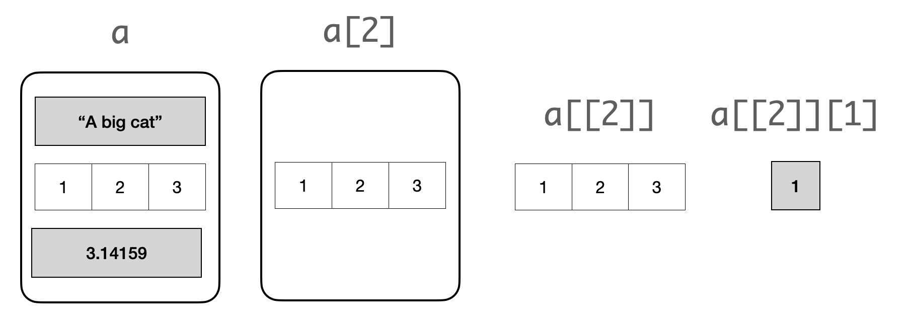

# Vectors

Values can be grouped together into collections, which allows programmers to organize those values and refer to all of them with a single name. By grouping values together, we can write code that performs a computation on many pieces of data at once.

Calling the function `c` on several values places them into what is called a *vector*, which is a kind of sequential collection. Below, we collect four different temperatures into a *vector* called `highs`. These are the [estimated average daily high temperatures](http://berkeleyearth.lbl.gov/regions/global-land) over all land on Earth (in degrees Celsius) for the decades surrounding 1850, 1900, 1950, and 2000, respectively, expressed as deviations from the average absolute high temperature between 1951 and 1980, which was 14.48 degrees.

```{r}
baseline_high <- 14.48
highs <- c(baseline_high - 0.880, baseline_high - 0.093,
           baseline_high + 0.105, baseline_high + 0.684)
highs
```

Collections allow us to pass multiple values into a function using a single name. For instance, the `sum` function computes the sum of all values in a collection, and the `length` function computes its length. (That's the number of values we put in it.) Using them together, we can compute the average of a collection.

```{r}
sum(highs) / length(highs)
```

## Introduction

While there are many kinds of collections in R, we will work primarily with two of them: vectors and lists (which we will see in the next section). We've already seen that the `c` function can be used to create vectors of numbers.

Vectors can also contain strings or other types of values, but a single vector can only contain a single kind of data. (It usually doesn't make sense to group together unlike data anyway.) For example:

```{r}
english_parts_of_speech <- c("noun", "pronoun", "verb", "adverb", "adjective", 
                             "conjunction", "preposition", "interjection")
english_parts_of_speech
```

Formally, R calls strings *character vectors*. We will use *string* and *character vector* interchangeably in the text. 

We access individual elements inside the vector using `[`. For instance, we can extract the "noun" part of speech. 

```{r}
english_parts_of_speech[1]
```

We can also extract a *subset* of a vector, say the first three parts of speech. 

```{r}
english_parts_of_speech[1:3]
```

Returning to the temperature data, we create vectors of average daily [high temperatures](http://berkeleyearth.lbl.gov/auto/Regional/TMAX/Text/global-land-TMAX-Trend.txt) for the decades surrounding 1850, 1900, 1950, and 2000.

```{r}
baseline_high <- 14.48
highs = c(baseline_high - 0.880, 
          baseline_high - 0.093,
          baseline_high + 0.105, 
          baseline_high + 0.684)
highs
```

Vectors can be used in arithmetic expressions to compute over their contents. When a vector is combined with a single number, that number is combined with each element of the array. Therefore, we can convert all of these temperatures to Fahrenheit by writing the familiar conversion formula.

```{r}
(9/5) * highs + 32
```

```{r, echo=FALSE, fig.align="center", out.width='60%'}
knitr::include_graphics('images/vector_arithmetic.png')
```

### Functions on Vectors

R provides programmers with convenient and powerful functions for creating and manipulating vectors. 

The `mean` of a collection of numbers is its average value: the sum divided by the length. Each of the examples below performs a computation on the vector called `highs`.

```{r}
length(highs)
```

```{r}
sum(highs)
```

```{r}
mean(highs)
```

The `diff` function computes the difference between each adjacent pair of elements in an array. The first element of the `diff` is the second element minus the first. 

```{r}
diff(highs)
```

Following are some more commonly used functions that work over vectors.  Learning this vocabulary is an important part of learning the R language, so refer back to this list often as you work through examples and problems. 

However, you **do NOT need to memorize these**.  Use this as a reference.

Each of these functions takes some vector `x` as an argument and returns a single value.

| **Function**       | Description                                                          |
|--------------------|----------------------------------------------------------------------|
| `prod(x)`          | Multiply all elements together                                          |
| `sum(x)`           | Add all elements together                                               |
| `all(x)`           | Test whether all elements are true values (non-zero numbers are true)   |
| `any(x)`           | Test whether any elements are true values (non-zero numbers are true)   |
| `sum(x != 0)`      | Count the number of non-zero elements                                   |

Each of these functions takes some vector `x` as an argument and returns a vector of values.

| **Function**       | Description                                                          |
|--------------------|----------------------------------------------------------------------|
| `diff(x)`          | Difference between adjacent elements                                 |
| `round(x)`         | Round each number to the nearest integer (whole number)              |
| `cumprod(x)`       | A cumulative product: for each element, multiply all elements so far |
| `cumsum(x)`        | A cumulative sum: for each element, add all elements so far          |
| `exp(x)`           | Exponentiate each element                                            |
| `log(x)`           | Take the natural logarithm of each element                           |
| `sqrt(x)`          | Take the square root of each element                                 |
| `sort(x)`          | Sort the elements                                                    |


The `stringr` package from the tidyverse provides us a collection of useful functions for working with character vectors. A full cheat sheet can be found [here](https://evoldyn.gitlab.io/evomics-2018/ref-sheets/R_strings.pdf), but listed here are some of the commonly used ones. Following are functions that take a character vector `x` as an argument and return a vector.  

| **Function**        | **Description**                                              |
|---------------------|--------------------------------------------------------------|
| `str_to_lower(x)`     | Lowercase each element                                       |
| `str_to_upper(x)`     | Uppercase each element                                       |
| `str_trim(x)`       | Remove spaces at the beginning and/or end of each element        |

The following function takes a character vector `x` with additional arguments, but also returns a vector. 

| **Function**        | **Description**                                              |
|---------------------|--------------------------------------------------------------|
|`str_sub(x, start, end)` | Extracts a substring from `x` given by `start` position and `end` position |
| `str_detect(x, "[:alpha:]")`   | Whether each element is only letters (no numbers or symbols) |
| `str_detect(x, "[:digit:]")`  | Whether each element is only numeric (no letters)             |

The following functions take both a character vector `x` and a *pattern string* to search for. Pattern strings can be more general like `"[:alpha:]"` or `"[:digit:]"` from the above list (these are also called [regular expressions](https://rstudio.com/wp-content/uploads/2016/09/RegExCheatsheet.pdf) or regexp for short, which we won't cover in detail :-). Each of these functions returns a vector.

| **Function**         | **Description**                                                                  |
|----------------------|----------------------------------------------------------------------------------|
| `str_count(x, pattern)`     | Count the number of times a pattern appears among the elements of an array |
| `str_which(x, pattern)`      | The indexes of vector `x` where the pattern is found                    |
| `str_replace_all(x, pattern)`| Replace all matched patterns in each string |
| `str_detect(x, ^pattern)` | Whether each element starts with the pattern |

The following function also takes a vector `x` of strings and a pattern string. However, unlike the above table, this function returns a *list*. We will cover lists in the next section. 

| **Function**         | **Description**                                                                  |
|----------------------|----------------------------------------------------------------------------------|
| `str_locate_all(x, pattern)` | The positions within each element that a pattern is found                |


The following function is a helpful diagnostic tool to view matched patterns.  

| **Function**         | **Description**                                                                  |
|----------------------|----------------------------------------------------------------------------------|
| `str_view_all(x, pattern)` | Visualizes all pattern matches in vector `x`                |


## Lists 

Like vectors, lists also group values together. However, unlike vectors, lists can hold values that are of *different* types. For instance:

```{r}
mixed <- list("apple", 1.5, 2L, TRUE)
mixed
```

It can be helpful to examine the structure inside the list. We use `str` for this. 

```{r}
str(mixed)
```

Lists hold just about anything; they can even contain vectors... 

```{r}
mixed2 <- list(c("asparagus", "arrowroot", "tomato"), c("mango", "kumquat"), 3.14159)
str(mixed2)
```

...or more lists! 

```{r}
omg <- list(list(1,1), list(2,2,2), "hello world")
str(omg)
```

### Working with Lists 

Let's examine the `mixed2` list more closely. 

```{r}
mixed2
```

`[` extracts a sub-list. The result is always a list.

```{r}
str(mixed2[2])
```

We can also *subset* a list the same way we do with vectors. Remember that the result is still a list. 

```{r}
str(mixed2[1:2])
```

If we wish to extract the vector *inside* `mixed2[2]`, we must use `[[`. This extracts a single component from a list. We can use it to retrieve, for example, the vector of fruits: 

```{r}
mixed2[[2]]
```

What if we only wanted the mango? 

```{r}
mixed2[[2]][1]
```

Yum!

### Visualizing lists 

The difference between `[` and `[[` is important, but easy to get confused. The following visual will clarify the point. 

Suppose that we have the following list `a`. 

```{r}
a <- list("A big cat", c(1,2,3), 3.14159)
```

Then we can imagine operations on `a` as the following:

```{r, echo=FALSE, fig.align="center", out.width='80%'}

```

* `a` is a list 
* `a[2]` is also a list, this time containing a single element   
* `a[[2]]` is the second component of the list, a vector 
* `a[[2]][1]` is the first element of that vector 

Groovy! The ["pepper shaker photos" in R for Data Science](https://r4ds.had.co.nz/vectors.html#lists-of-condiments) provides another nice visualization of the different ways we can extract pieces from a list. 


### Lists in the wild

We end this section with an educational example of when you might come across a list. First, let's load in the tidyverse. 

```{r warning=FALSE, message=FALSE}
library(tidyverse)
```


Recall that  `str_locate_all` is a method for working with strings; it returns the positions within each element that a pattern string is found as a *list*. Let's try to use what we know to extract common bird names. 

```{r}
birds <- c("Black-crowned Night-Heron-Nycticorax", "Little-egret-Egretta garzetta")
```

The common names are `Black-crowned Night-Heron` and `Little-egret`. We can extract this by looking for the *last* occurrence of the dash (`-`). Here they are: 

```{r}
str_view_all(birds, "-")
```

The `str_locate_all` function can tell us the starting and ending positions of all occurrences of the dash. 
```{r}
dash_positions <- str_locate_all(birds, "-")
dash_positions
```

As expected, we have a list. Let's first examine the results for the Night Heron, which are stored at index 1 of this list. We now know that to pluck out these results we must use `[[`. 

```{r}
dash_positions[[1]]
```

Congrats -- we're out of the list! What we have now is three vectors sandwiched together into one, one for each occurrence of the dash. We are only interested in the last one. `tail` is a handy function for extracting the last value of a vector.

```{r}
tail(dash_positions[[1]], n=1) # why n = 1? why not 2?
```

Technically, we only care about the ending position of the dash (at index 2) but either value will do. 

```{r}
last_dash <- tail(dash_positions[[1]], n=1)[1]
last_dash
```

We're almost done: we now know that the common name occurs between positions 1 and 25 (why not 26?). We can use `str_sub` to extract the substring. 

```{r}
str_sub(birds[1], end = last_dash - 1)
```

Here is everything together: 

```{r}
dash_positions <- str_locate_all(birds, "-")
last_dash <- tail(dash_positions[[1]], n=1)[1]
str_sub(birds[1], end = last_dash - 1)
```

What would the answer be for extracting `Little-egret`? Try it out!

## Sequences

TBA


## More on Vectors

TBA


