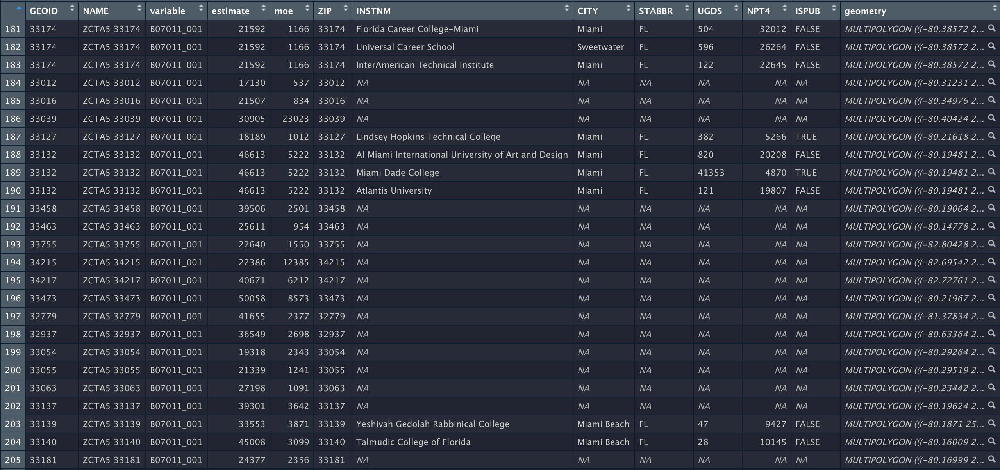
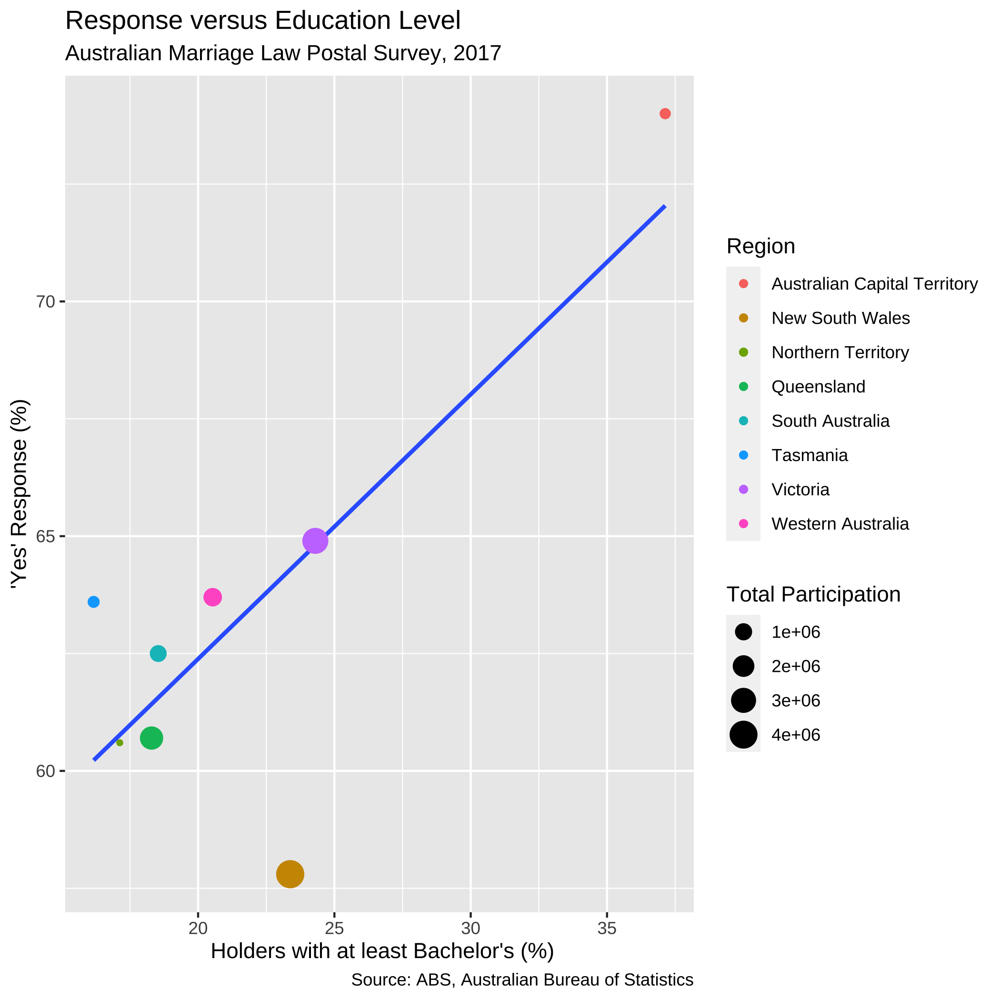
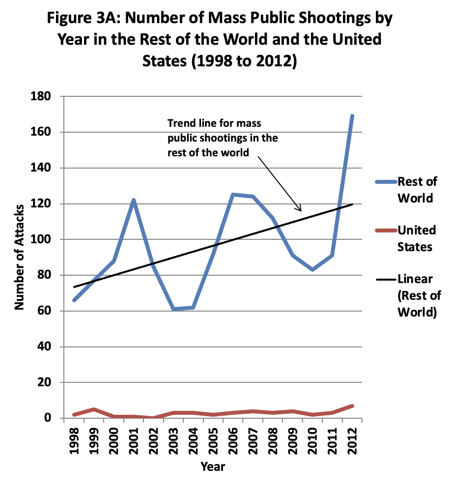

---
output:
  pdf_document: default
  html_document: default
---

# Data Visualization

As you develop familiarity with processing data, you learn how to develop intuition from the data at hand by glancing at its values. Unfortunately, there is only so much you can do with glancing at values. There is a substantial limitation to what you can obtain when the data at hand is so large.

Visualization is a powerful tool in such cases. In this chapter we introduce another key member of the tidyverse, the `ggplot2` package, for visualization.

## Introduction to `ggplot2`

R provides many facilities for creating visualizations. The most sophisticated of them, and perhaps the most elegant, is `ggplot2`. In this section we introduce generating visualizations using `ggplot2`.   

### Prerequisites

We will make use of the tidyverse in this chapter, so let’s load it in as usual.

```{r message = FALSE, warning = FALSE}
library(tidyverse)
```

### The layered grammar of graphics 

The structure of visualization with `ggplot2` is by way of something called the  *layered grammar of graphics* -- a name that will certainly impress your friends! 

The name of the package `ggplot2` is a bit of a misnomer as the main function we call to visualize the data is `ggplot`. As with `dplyr` and `stringr`, the `ggplot2` [cheatsheet](https://rstudio.com/wp-content/uploads/2015/03/ggplot2-cheatsheet.pdf) is quite helpful for quick referencing.

Each visualization with `ggplot` consists of some building blocks. We call these *layers*. There are three types of layers:

* the __base layer__, which consists of the background and the coordinate system,
* the __geom layers__, which consist of individual geoms, and
* the __ornament layers__, which consists of titles, legends, labels, etc.

We call the plot layers `geom` layers because each plot layer requires a call to a function with the name starting with `geom_`. There are many geoms available in `ggplot` and you can think of these as the buildings blocks that compose many of the diagrams you are already familiar with. For instance, *point* geoms are used to create scatter plots, *line* geoms for line graphs, *bar* geoms for bar charts, and *histogram* geoms for histograms -- check out the cheat sheet for many more! We will explore the main geoms in this chapter. 

To specify the base layer, we use the function `ggplot()`. Using the function alone is rather unimpressive.  
```{r dpi=80,  fig.align="center", warning = FALSE}
ggplot()
```

All `ggplot2` has done so far is set up a blank canvas. To make this plot more interesting, we need to specify a dataset and a coordinate system to use. To build up the discussion, let us turn to our first geom: the *point* geom.  

## Point Geoms

Let us begin our exploration with the *point* geom. As noted earlier, point geoms are useful in that they can be used to construct a *scatter plot*. 

### Prerequisites

We will make use of the tidyverse in this chapter, so let us load it in as usual.

```{r message = FALSE, warning = FALSE}
library(tidyverse)
```

### The `mpg` tibble 

We will use the `mpg` dataset as our source for this section. This dataset is collected by the US Environmental Protection Agency and shows information about 38 models of car between 1999 and 2008. We have visited this data in earlier sections. Use `?mpg` to open its help page for more information.

The table `mpg` has 234 rows and 11 columns. Use  Let us have a look at a snapshot of the data again.  

```{r}
mpg
```

Another way to preview the data is using `glimpse`. 

```{r eval=FALSE}
glimpse(mpg)
```

### Your first visualization

We first specify the base layer. Unlike before, this time we specify our intention to use the `mpg` dataset.  
```{r dpi=80,  fig.align="center", warning = FALSE}
ggplot(data = mpg)
```

We are still presented with a profoundly useless plot. Let us amend our code a bit. 

```{r dpi=80,  fig.align="center", warning = FALSE}
ggplot(data = mpg) +
  geom_point(mapping = aes(x = displ, y = hwy))
```

Ta-da, our first visualization! Let us unpack what we just did. 

The first line of this code specifies the __base layer__ with the argument `data = `. The second line describes the __geom layer__ where a point geom is to be used along with some *mapping* from graphical elements in a plot to variables in a dataset. More specifically, we provide the specification for a point geom by calling the function `geom_point`. This geom is passed as an argument a mapping (the value that follows `mapping = `) from the Cartesian `x` and `y` coordinate locations to the variables `displ` and `hwy`. This is materialized by the `aes` function. 

__Aesthetics__ are visual characteristics of observations in a plot. Examples include coordinate positions, shape, size, or color. For instance, a plot will often use [Cartesian coordinates](https://en.wikipedia.org/wiki/Cartesian_coordinate_system) where each axis represents a variable of a tibble and these variables are *mapped* on to the `x` and `y` axes, respectively. In the case of this plot, we map `displ` to the x-axis and `hwy` to the y-axis. 

To round up the discussion, here are the key points from the code we have just written:

* There is one `ggplot` and one `geom_point`.
* The `ggplot` call preceded the `geom_point` call.
* The plus sign `+` connects the two calls.
* A `data` specification appears in the `ggplot` call.
* A `mapping` specification appears in the `geom_point` call.

The semantics of the code is as follows:

* Instruct `ggplot` to get ready for creating plots using `mpg` as the data.
* Instruct `geom_point` to create a plot where `displ` is *mapped* to the x-axis and `hwy` is *mapped* to the y-axis, and `displ` and `hwy` are two variables from the tibble `mpg`.

### Scatter plots 

Our first visualization is an example of a scatter plot. A *scatter plot* is a plot that presents the relation between two numerical variables.

In other words, a scatter plot of variables `A` and `B` draws data from a collection of pairs `(a,b)`, where each pair comes from a single observation in the data set. The number of pairs you plot can be one or more. There is no restriction on the frequencies we observe the same pair, the same `a`, and the same `b`.

We can use a scatter plot to visualize the relationship between the highway fuel efficiency (`hwy`) and the displacement of its engine (`displ`).

```{r dpi=80,  fig.align="center", warning = FALSE}
ggplot(data = mpg) +
  geom_point(mapping = aes(x = displ, y = hwy))
```

Each point on the plot is the pair of values of one car model in the dataset. Note that there are quite a few groups of points that align horizontally and quite a few groups of points that align vertically. The former are groups that share the same (close to the same) `hwy` values with each other, the latter are groups that share the same (close to the same) `displ` values with each other. We can observe a graceful trend downward in the plot -- lower engine displacement is associated with more highway miles per gallon.   

### Adding color to your geoms

It appears that the points are following some downward trend. Let us examine this more closely by using `ggplot` to map colors to its points.

You can specify the attribute for `ggplot` to use to determine the colors, for instance, the `class` attribute. We make the specification in the `aes` of `geom_point`.

```{r dpi=80,  fig.align="center", warning = FALSE}
ggplot(data = mpg) +
  geom_point(mapping = aes(x = displ, y = hwy, color = class))
```

This visualization allows us to make new observations about the data. Namely, it appears that there is a cluster of points from the "2seater" class that veer off to the right and seem to break the overall trend present in the data. Let us set aside these points to compose a new dataset.  

```{r dpi=80,  fig.align="center", warning = FALSE}
no_sports_cars <- filter(mpg, class != "2seater")
ggplot(data = no_sports_cars) +
  geom_point(mapping = aes(x = displ, y = hwy, color = class))
```

After the removal of the "2seater" class, the downward trend appears more vivid.

### Mapping versus setting 

Perhaps the most frequent mistake newcomers to `ggplot` make is conflating aesthetic *mapping* with aesthetic *setting*. 

For instance, you may wish to set all points to a single color instead of coloring points according to the "type" of car. So you devise the following `ggplot` code to color all points in the scatter blue. 

```{r dpi=80,  fig.align="center", warning = FALSE}
ggplot(data = no_sports_cars) +
  geom_point(mapping = aes(x = displ, y = hwy, color = "blue"))
```

This code colors all points *red*, not blue! Can you spot the mistake in the above code? 

When we wish to *set* an aesthetic to some global value (e.g., a "red" color, a "triangle" shape, an alpha level of "0.5"), it __must be excluded from the mapping specification in the `aes` call__. 

By moving the color specification out of the `aes` function we can remedy the problem.

```{r dpi=80,  fig.align="center", warning = FALSE}
ggplot(data = no_sports_cars) +
  geom_point(mapping = aes(x = displ, y = hwy), 
             color = "blue")
```

Observe how the aesthetics `x` and `y` are *mapped* to the variables `displ` and `hwy`, respectively, while the aesthetic `color` is *set* to a global constant value `"blue"`.

When an aesthetic is *set*, we determine a visual property of a point that is *not* based on the values of a variable in the dataset. These will typically be provided as arguments to your `geom_*` function call. When an aesthetic is *mapped*, the visual property is determined based on the values of some variable in the dataset. This must be given within the `aes` function call. 

### Categorical variables 

Coloring points according to some attribute is useful when dealing with *categorical variables*, that is, variables whose values come from a fixed set of categories. For instance, a variable named `ice_cream_flavor` may have values that are from the categories *chocolate*, *vanilla*, or *strawberry*; in terms of the `mpg` data, `class` can have values that are from the categories *compact*, *midsize*, *pickup*, *subcompact*, or *suv*.   

Can we develop more insights from categorical variables?

Using the `mutate` function, we can create a new categorical variable `japanese_make`, which is either `TRUE` or `FALSE` depending on whether the manufacturer is one of Honda, Nissan, Subaru, or Toyota. We create a new dataset with the addition of this new variable. 

```{r}
no_sports_cars <- no_sports_cars |> 
  mutate(japanese_make = 
           manufacturer %in% c("honda", "nissan", "subaru", "toyota"))
```


Let us create a new plot using `japanese_make` as a coloring strategy. 

```{r dpi=80,  fig.align="center", warning = FALSE}
ggplot(data = no_sports_cars) +
  geom_point(mapping = aes(x = displ, y = hwy, color = japanese_make))
```

We can observe a downward trend in the data for cars with a Japanese manufacturer.

Let us try a second categorical variable: `cyl`.

```{r dpi=80,  fig.align="center", warning = FALSE}
ggplot(data = no_sports_cars) +
  geom_point(mapping = aes(x = displ, y = hwy, color = cyl))
```

This one has a striking difference compared to our other visualizations. Can you spot the difference? Try to pick it out before reading on. 

The legend appearing to the right of the dots looks very different. Instead of dots showing the color specification, it uses a bar with a blue gradient. The reason is that `ggplot` treats the `cyl` attribute as a *continuous variable* and needs to be able to select colors for values that are, say, *between* 4 and 5 cylinders or 7 and 8 cylinders. The appropriate way to do this is by means of a gradient.   

This comes as a surprise to us -- there is no such thing as 4 and three quarters of a cylinder because `cyl` is a categorical variable. The only possible values are either 4, 5, 6, 7, or 8, and nothing in between. How to inform `ggplot` of this fact? 

The solution is to treat `cyl` as a *factor*, which is synonymous with saying that a variable is categorical. The function to use is called `as_factor()`. Let us amend our original attempt to include the call. 

```{r dpi=80,  fig.align="center", warning = FALSE}
ggplot(data = no_sports_cars) +
  geom_point(mapping = aes(x = displ, y = hwy, color = as_factor(cyl)))
```

This one bears a resemblance that we are already familiar with. 

Run your eyes from left to right along the horizontal axis. Observe how for a given `hwy` value, say points around `hwy = 20`, there is a clear transition from cars with 4 cylinders (in red) to cars with 6 cylinders (in cyan) and finally to cars with 8 cylinders (in purple). In contrast, if we look at points at, say around `disp = 2`, and run our eyes along the vertical axis, we do not observe such a transition in color -- all the points still correspond to cars with 4 cylinders (in red).  

This tells us that there is a stronger association between the continuous variable `displ` and the categorical variable `cyl` than between `hwy` and `cyl`.   

Here is one more plot. Let us plot `hwy` against `cty` when coloring according to `cyl`. We naturally assume that the higher a car model's highway miles per gallon is (`hwy`), the higher its city miles per gallon (`cty`) is as well, and vice versa.

```{r dpi=80,  fig.align="center", warning = FALSE}
ggplot(no_sports_cars) + 
  geom_point(aes(x = cty, y = hwy, color = as_factor(cyl)))
```

This one reveals a *positive association* in the data, as opposed to the *negative association* that we observed in the downward trend in the plot of `hwy` against `displ`. We can also see a greater transition in color as we move left to right in the plot, suggesting a stronger relationship between `cty`and `cyl`. 

Observe that there are two points that seem to be very far off to the right and one point off to the left. We may call such data points *outliers* meaning that they do not appear to conform to the associations that other observations are following. Let us isolate these points using `filter`. 

```{r}
no_sports_cars |> 
  filter(cty < 10 | cty > 32.5) |> 
  relocate(cty, .after = year) |>
  relocate(hwy, .before = cyl)
```

We see that the four Dodges and one Jeep are the far left points and two Volkswagens are the far right points.

### Continuous variables 

Given what we learned when experimenting with `cyl`, we might be curious as to what can be gleaned when we intend on coloring points according to a *continuous variable*. Let us try it with the attribute `cty`, which represents the city fuel efficiency.

```{r dpi=80,  fig.align="center", warning = FALSE}
ggplot(data = no_sports_cars) +
  geom_point(mapping = aes(x = displ, y = hwy, color = cty))
```

The blue gradient makes it hard to see changes in the color. Can we use a different gradient other than blue?

Yes! The solution is to add a layer `scale_color_gradient` at the end with two colors names of our choice. In the style of art deco, we pick two colors, `yellow3` and `blue`.

```{r dpi=80,  fig.align="center", warning = FALSE}
ggplot(data = no_sports_cars) +
  geom_point(mapping = aes(x = displ, y = hwy, color = cty)) +
  scale_color_gradient(low = "yellow3", high="blue")
```

Contrast this plot with the one we saw just before with `hwy` versus `displ` when coloring according to `cyl`. The situation is reversed here: as we run our eye up and down for some value of `displ`, we see a transition in color; the same is not true when moving along horizontally. Thus, it seems that `cty` is associated more with `hwy` than `displ`. 

By the way, where do we get those color names? There's a [cheatsheet](https://www.nceas.ucsb.edu/sites/default/files/2020-04/colorPaletteCheatsheet.pdf) for that! 

### Other articulations

#### Facets

Instead of using color to annotate points, we can also use something called *facets* which splits the plots into several subplots, one for each category of the categorical variable. Let us use faceting for our last visualization.   

```{r dpi=80,  fig.align="center", warning = FALSE}
ggplot(data = no_sports_cars) +
  geom_point(mapping = aes(x = displ, y = hwy)) + 
  facet_wrap(~ as_factor(cyl), nrow = 2)
```

This one makes it very clear that hardly any car models in the dataset have 5 cylinders! 

#### Shapes

You can use shapes and fill strengths to differentiate between points. The argument for the fill strength is `alpha = X` where `X` is the attribute.

```{r, fig.align="center", dpi=80, warning = FALSE}
ggplot(no_sports_cars) + 
  geom_point(aes(x = cty, y = hwy, alpha = class))
```

You can specify both `alpha` and `color`, even using different variables. See an example below.

```{r, fig.align="center", dpi=80, warning = FALSE}
ggplot(no_sports_cars) + 
  geom_point(aes(x = cty, y = hwy, alpha = displ, shape = class))
```

Welcome to your first 4-D visualization! Note how when we move up and down vertically for some fixed value of `cty`, the shapes do not grow more transparent; this is only observed as we move left and right at some fixed value of `hwy`, suggesting a stronger relationship between `cty` and `displ`. Put another way, we can say that `displ` varies more with `cty` than it does with `hwy`. We do not observe a strong effect with respect to the shapes in `class`. 

Note that by mapping both the `shape` and `color` aesthetics to the same attribute, say, `class`, the legends are collapsed into one.

```{r, fig.align="center", dpi=80, warning = FALSE}
ggplot(no_sports_cars) + 
  geom_point(aes(x = cty, y = hwy, shape = class, color = class))
```

Can you say whether this visualization contains more or less information than our last one? How many dimensions are displayed here?  

### Jittering

You may notice that despite the fact that there are 234 entries in the data set, much fewer points (only 109 to be exact) appears in the initial (before filtering) scatter plot of `mpg`.

This is because many points collide on the plot. We call the phenomenon __overplotting__, meaning one point appearing over another. It is possible to nudge points in a random direction in a small quantity. By making all directions possible, we can make complete overplotting a rare event. We call the random nudging arrangement *jittering*.

To jitter, we add a positional argument `position = "jitter"` to `geom_point`. Note that this is not a part of the aesthetic specification (so is not inside `aes`).

```{r, fig.align="center", dpi=80}
ggplot(no_sports_cars) +
  geom_point(mapping = aes(x = cty, y = hwy, color = class), 
             position = "jitter")
```

### One more scatter plot

In our first visualization of this section, we plotted `hwy` against `displ`.
In that plot, by substituting `cty` for `hwy`, we obtain a similar plot of `cty` against `displ`. 

What if we want to see now both `hwy` and `cty` against `displ`? Is it possible to merge the two plots into one?

Yes, we can do the merge easily using pivoting. Recall that `pivot_longer` combines multiple columns into one. We can create a new data frame that combines the values from `hwy` and `cty` under the name `efficiency` while specifying whether the value is from `hwy` or from `cty` under the name `eff_type`.

```{r}
no_sports_cars_pivot <- no_sports_cars |> 
  pivot_longer(cols = c(hwy,cty), 
               names_to = "eff_type", 
               values_to = "efficiency") 
```

Then we can plot `efficency` against `displ` by showing `eff_type` using the shape and `class` using the color.

```{r warning = FALSE, fig.align="center", dpi=80}
ggplot(no_sports_cars_pivot) +
  geom_point(aes(x = displ, y = efficiency, 
                 alpha = eff_type, shape = class), 
             position = "jitter")
```

The "jitter" option makes the visualization quite busy. Let us take it away.

```{r, warning=FALSE, fig.align="center", dpi=80}
ggplot(no_sports_cars_pivot) +
  geom_point(aes(x = displ, y = efficiency, 
                 alpha = eff_type, shape = class))
```

Note the pattern in the fill strength of points as dictated by `eff_type` -- the upper region of the plot is shaded more boldly and the lower region very lightly. We leave it as an exercise to the reader to come up with some explanations as to why such a visible pattern emerges. 

<!-- you will waste more gallons in the city than highway because you are stopped at traffic signs and going from 0 to 40 many more times, which takes more gallons  --> 

## Line and Smooth Geoms

In the last section we introduced scatter plots and how to interpret them using `ggplot` with the point geom. In this section we introduce two new geoms, the point and smooth geoms, to build another (hopefully familiar) visualization: the line chart.    

### Prerequisites

We will make use of the tidyverse in this chapter, so let us load it in as usual.

```{r message = FALSE, warning = FALSE}
library(tidyverse)
```

We will study a tibble called `airmiles`, which contains data about passenger miles on commercial US airlines between 1937 and 1960.

```{r, echo = FALSE}
df_airmiles <- data.frame(
  miles = as.matrix(airmiles), date = time(airmiles)) |>
  tibble()
df_airmiles
```

We will examine a toy dataset called `df` to use for visualization. Recall that we can create a dataset using `tibble`. 

```{r}
df <- tibble(x = seq(-2.5, 2.5, 0.25), 
             f1 = 2 * x - x * x + 20, 
             f2 = 3 * x - 10, 
             f3 = -x + 50 * sin(x))
df
```

### A toy data frame  

`df` has four variables, `x`, `y`, `z`, and `w`. The range of `x` is [-2.5,2.5] with 0.25 as a step width. The functions for `y`, `z`, and `w` are $2x - x^2 + 20$, $3x - 10$, and $-x+\sin(x)$, respectively. 

To visualize these three functions, we first need to *pivot* the data so that it becomes a long table. The reason for this step should become evident in a moment.  

```{r}
df_long <- df |>
  pivot_longer(c(f1, f2, f3), names_to = "type", values_to = "y") |>
  select(x, y, type)
df_long
```

Note how we have two variables present, `x` and `y`, annotated by a third variable, `type`, designating which function the $(x, y)$ pair belongs to.

### The line geom 

We start with visualizing `y` against `x` for each of the three functions. We can use the same strategy as `geom_point` by simply substituting `geom_line` for `geom_point`. However, we will pass an additional argument `group` to the aesthetic to inform `ggplot` which function a point comes from.   

```{r warning = FALSE, fig.align="center", dpi=80}
ggplot(data = df_long) + 
  geom_line(mapping = aes(x = x, y = y, group = type))
```

This plot is quite dull-looking and it can be hard to tell the lines apart from each other. How about we annotate each line with a color? To do this, we substitute the `group` argument for `color`. 

```{r warning = FALSE, fig.align="center", dpi=80}
ggplot(data = df_long) + 
  geom_line(mapping = aes(x = x, y = y, color = type))
```

A curious phenomenon is the variables `x` and `y` coincide with the argument names `x` and `y` inside the `aes`. So the meaning of `x` and `y` are different depending on which side of the equality sign they fall. The `y` appearing on the side of the plot refers to the attribute.  

If we are not content with the labels on the axes, we can specify an alternative using `xlab` or `ylab`. Moreover, we can further control how the line plot looks by specifying the shape, width, and type of line. The resulting effect depends on whether these arguments are passed to the *aesthetic*, as we did above with `color` and `group`, or to the `geom_line` function directly. Here is an example. 

```{r warning = FALSE, fig.align="center", dpi=80}
ggplot(data = df_long) + 
  geom_line(mapping = aes(x = x, y = y, color = type), 
            size = 2, linetype = "longdash") + 
  xlab("x values") + 
  ylab("y values")
```

Observe how the color is varied for each of the functions, but the size and type of the line is the same across all of the them. Can you tell why? If you think you got it, here is a follow-up question: what would you need to change to make *both* the color and line type different for each of the lines? 

By the way, there are many line types offered by `ggplot`. Available line types are "twodash", "solid", "longdash", "dotted", "dotdash", "dashed", and "blank".

### Combining `ggplot` calls with `dplyr`

Let us turn our attention to the function `f3` and set aside the functions `f1` and `f2` for now. We know how to do this using `filter` from `dplyr`. 

```{r}
only_f3 <- df_long |>
  filter(type == "f3")
```

The object `only_f3` keeps only those points corresponding to the function `f3`. We could then generate the line plot as follows. 

```{r eval = FALSE, warning = FALSE, fig.align="center", dpi=80}
ggplot(data = only_f3) + 
  geom_line(mapping = aes(x = x, y = y)) 
```

However, we have discussed before how naming objects, and keeping track of them, can be cumbersome. Moreover, `only_f3` is only useful as input for the visualization; for anything else, it is a useless object sitting in memory. 

We have learned that the pipe operator (`|>`) is useful for eliminating  redundancy with `dplyr` operations. We can use the pipe again here, this time to "pipe in" a filtered data frame to use as a data source for  visualization. Here is the re-worked code.    

```{r warning = FALSE, fig.align="center", dpi=80}
df_long |>
  filter(type == "f3") |>
  ggplot() + 
  geom_line(mapping = aes(x = x, y = y)) 
```

There is something unfortunate about this code: the pipe operator cannot be used when specifying the `ggplot` layers, so we have a motley mix of `|>` and `+` symbols in the code. Keep this in mind to keep the two straight in your head: use `|>` when working with `dplyr` and use `+` when working with `ggplot`. 

This curve bears the shape of the famous sinusoidal wave true to trigonometry. However, upon closer inspection, you may notice that the curve is actually a concatenation of many straight-line pieces stitched together. Here is another example using `df_airmiles`.

```{r message = FALSE, warning = FALSE, fig.align="center", dpi=80}
ggplot(data = df_airmiles) + 
  geom_line(mapping = aes(x = date, y = miles))
```

Is it possible to draw something smoother? For this, we turn to our next geom: the *smooth* geom. 

<!-- If you wish to show the color specifications as a legend, you can use  `scale_color_manual`.
`scale_color_manual` is a variant of `scale_color_gradient`.
You can specify a series of color names and a series of matching number of color labels and then use the color labels in `aes`.

```{r eval = FALSE}
ggplot(df, aes(x = x)) +
  geom_line(aes(y = y, color = "y(x)"), size = 1, linetype = "solid") +
  geom_line(aes(y = z, color = "z(x)"), size = 1, linetype = "dashed") +
  geom_line(aes(y = w, color = "w(x)"), size = 2, linetype = "dotted") +
  scale_color_manual("",
    breaks = c("y(x)", "z(x)", "w(x)"),
    values = c("blue", "forestgreen", "pink")) +
  xlab("x value") +
  ylab("y(x)|z(x)|w(x)")
``` 
--> 

### Smoothers

We observed in our last plots that while line geoms can be used to plot a line chart, the result may not be as smooth as we would like. An alternative to a line geom is the *smooth* geom, which can be used to generate a *smooth line plot*. 

The way to use it is pretty much the same as `geom_line`. Here is an example using the toy data frame, where the only change made is substituting the geom. 

The argument `se = FALSE` we pass to `geom_smooth` is to disable a feature that displays confidence ribbons around the line. While these are certainly useful, we will not study them in this text.  

```{r message = FALSE, warning = FALSE, fig.align="center", dpi=80}
ggplot(data = df_long) + 
  geom_smooth(aes(x = x, y = y, color = type), 
              se = FALSE)
```

Observe that the piece-wise straight line of the sine function now looks like a proper curved line.

It is possible to mix line and smooth geoms together in a single plot.

```{r message = FALSE, warning = FALSE, fig.align="center", dpi=80}
ggplot(data = df_long) + 
  geom_smooth(mapping = aes(x = x, y = y, color = type), se = FALSE) + 
  geom_line(mapping = aes(x = x, y = y, color = type))
```

Notice the slight deviations along the sine curve. The effect is more apparent when we visualize `airmiles`.

```{r message = FALSE, warning = FALSE, fig.align="center", dpi=80}
ggplot(data = df_airmiles) + 
  geom_point(mapping = aes(x = date, y = miles)) + 
  geom_line(mapping = aes(x = date, y = miles)) + 
  geom_smooth(mapping = aes(x = date, y = miles), 
              se = FALSE)
```

The line geom creates the familiar line graph we typically think of while the smooth geom "smooths" the line to aid the eye in seeing overall patterns; the line geom, in contrast, is much more "ridgy".

`geom_smooth` uses statistical methods to determine the smoother. One of the methods that can be used is *linear regression*, which is a topic we will see study in detail towards the end of the text. Here is an example.

```{r message = FALSE, warning = FALSE, fig.align="center", dpi=80}
ggplot(data = df_airmiles) + 
  geom_point(mapping = aes(x = date, y = miles)) + 
  geom_line(mapping = aes(x = date, y = miles)) + 
  geom_smooth(mapping = aes(x = date, y = miles), 
              method = "lm", se = FALSE)
```

Let us close our discussion of line and smooth geoms using one more example of the smooth geom. 

### Observing a negative trend

The smooth geom can be useful to confirm the negative trend we have observed in the `mpg` data frame.

```{r message = FALSE, warning = FALSE, fig.align="center", dpi=80}
ggplot(data = mpg) + 
    geom_point(mapping = aes(x = displ, y = hwy, color = class)) + 
    geom_smooth(mapping = aes(x = displ, y = hwy), 
                se = FALSE)
```

Here we have layered *two* geoms in the same graph: a point geom and a smooth geom. Note how the outlier points have influenced the overall shape of the curve to bend upward, muddying the claim that there is a strong negative trend present in the data.

Armed with our understanding about sports cars, we can adjust the visualization by setting aside points with `class == "2seater"`.         

```{r message = FALSE, warning = FALSE, fig.align="center", dpi=80}
no_sports_cars <- filter(mpg, class != "2seater")
ggplot(data = no_sports_cars) + 
    geom_point(mapping = aes(x = displ, y = hwy, color = class)) + 
    geom_smooth(mapping = aes(x = displ, y = hwy), 
                se = FALSE)
```

This plot shows a much more graceful trend downward.

### Working with multiple geoms

Before moving to the next topic, we point out some technical concerns when working with multiple geoms. First, in the above code we have written, observe the same mapping for `x` and `y` was defined in two different places.

This could cause some unexpected surprises when writing code: imagine if we wanted to change the y-axis to `cty` instead of `hwy`, but we forgot to change both occurrences of `hwy`. This can be amended by moving the mapping into the `ggplot` function call.     

```{r message = FALSE, warning = FALSE, fig.align="center", dpi=80}
no_sports_cars <- filter(mpg, class != "2seater")
ggplot(data = no_sports_cars, 
       mapping = aes(x = displ, y = hwy)) + 
    geom_point(mapping = aes(color = class)) + 
    geom_smooth(se = FALSE)
```

We can also write this more concisely by omitting some keywords as below, and the result would be the same.

```{r eval = FALSE, message = FALSE, warning = FALSE, fig.align="center", dpi=80}
no_sports_cars <- filter(mpg, class != "2seater")
ggplot(no_sports_cars, 
       aes(x = displ, y = hwy)) + 
    geom_point(aes(color = class)) + 
    geom_smooth(se = FALSE)
```

What if we wanted a smoother for *each* type of car? The `color` aesthetic can also be moved into the `ggplot` function call. While we are it, we set the smoother to use linear regression for the smoothing. 

```{r message = FALSE, warning = FALSE, fig.align="center", dpi=80}
ggplot(no_sports_cars, 
       aes(x = displ, y = hwy, color = class)) + 
    geom_point() + 
    geom_smooth(se = FALSE, method = "lm")
```

It is also possible to specify a different dataset to use at the geom layer. We can take advantage of this feature to give a smoother for only a subset of the data, say, the midsize cars.

```{r message = FALSE, warning = FALSE, fig.align="center", dpi=80}
different_dataset <- mpg |>
  filter(class == "midsize")

ggplot(mpg, aes(x = displ, y = hwy)) + 
    geom_point(aes(color = class)) + 
    geom_smooth(data = different_dataset, se = FALSE, method = "lm")
```


## Categorical Variables

The point, line, and smooth plots are for viewing relations among numerical variables. As you are well aware, numerical variables are not the only type of variables in a data set. There are variables representing categories, and we call them *categorical variables*.

A categorical attribute has a fixed, finite number of possible values, which we call *categories*. The categories of a categorical attribute are distinct from each other.

A special categorical attribute is a *binary category*, where there are exactly two values. A binary category that we are probably the most familiar with is the *Boolean category*, which has "true" and "false" as its values. Because of the familiarity, we often identify a binary category as a Boolean category.

In datasets, categories in a categorical attribute are sometimes called *levels* and we refer to such a categorical attribute as a *factor*. Sometimes, categories are whole numbers 1, 2, ..., representing indexes.
Such cases may require some attention when processing with R, because R may think of the variables as numbers.

We have seen examples of categorical variables before. The `class` attribute in the `mpg` data set is one.

### Prerequisites

As before, let us load `tidyverse`. Moreover, we will make use of datasets that are not available in `tidyverse` but are available in the package `faraway`. So, we load the package too.

```{r, message = FALSE, warning = FALSE}
library(tidyverse)
library(faraway)
happy <- tibble(happy)
```

### The `happy` and `diamonds` data frames

The table `happy` contains data on 39 students in a University of Chicago MBA class. 

```{r}
happy
```

Armed with what we have learned about `ggplot2`, we can begin answering questions about this data set using data transformation and visualization techniques. For instance, which "happiness" scores are the most frequent among the students? Moreover, can we discover an association between feelings of belonging and higher scores of happiness? How about family income?  

Before we inspect the `happy` data set any further, we will also consider another table `diamonds`, which contains data on almost 54,000 diamonds.   

```{r}
diamonds
```

The *values* of the categorical variable *cut* are "fair", "good", "very good", "ideal", and "premium". We can look at how many diamonds are in each category by using `group_by()` and `summarize()`.

```{r, message = FALSE}
diamonds |>
  group_by(cut) |>
  summarize(count = n())
```

The table shows the number of diamonds of each cut. We call this a *distribution*. A distribution shows all the values of a variable, along with the frequency of each one. Recall that the summary does not persist on the `diamonds` data set and so the dataset remains the same after summarization.

### Bar charts

The bar chart is a familiar way of visualizing categorical distributions.
Each category of a categorical attribute has a number it has an association with, and a bar chart presents the numbers for the categories using bars, where the height of the bars represent the numbers.

Typically, the bars in a bar chart appear either all vertically or all horizontally with an equal space in between and with the same height but expanding horizontally (that is, the non-variable dimension of the bars).

```{r, fig.align="center", dpi=80, warning = FALSE}
ggplot(diamonds, aes(x = cut)) + 
  geom_bar()
```

The x-axis displays the values for the *cut* attribute while the y-axis says "count". The label "count" is the result of `geom_bar()` generating bars. Since the number of observations is greater than there are categories, `geom_bar()` decides to count the occurrences of each category.
The word "count" says that it is the result of counting.

We often call the inner working of the `geom_bar()` (and other geom functions) for number generation __stat__. Thus, `ggplot2` transforms the raw table to a new dataset of categories with its corresponding counts. From this new table, the bar plot is constructed by mapping `cut` to the x-axis and `count` to the y-axis. 

The default stat `geom_bar()` uses for counting is `stat_count()`, which counts the number of cases at each `x` position. If the counts are already present in the dataset and we would prefer to instead use these directly  for the heights of the bars, we can set `stat = "identity"`. For instance, consider this table about popular pies sold at a bakery. The "count" is already present in the `sold` variable. 

```{r, fig.align="center", dpi=80, warning = FALSE}
store_pies <- tribble(
  ~pie,             ~sold,
  "Pecan",            906,
  "Key Lime",         620,
  "Pumpkin",          202,
  "Apple",            408,
  "Mississippi mud",  551
)
ggplot(data = store_pies) +
  geom_bar(mapping = aes(x = pie, y = sold), 
           stat = "identity")
```

Note how we provide both `x` and `y` aesthetics when using the `identity` stat. 

### Dealing with categorical variables

Let us turn to the `happy` data frame. We can consider the *categories* to be points on the 10-point scale, and the *individuals* the students in each interval. Let us determine this distribution using `group_by` and `sumarrize`.

Below, we take the `happy` data set and execute grouping by `happy`. The category for the happy value is `happiness` in this new dataset `happy_students`. We summarize in terms of the counts `n()` and we state the count as an attribute `number`.

```{r out.width = "50%", fig.align="default", message = FALSE}
happy_students <- group_by(happy, happiness = happy) |> 
  summarize(number = n())
happy_students
```

We can now use this table, along with the graphing skills that we acquired above, to draw a bar chart that shows which scores are most frequent among the 39 students.

```{r dpi=80, fig.align="center", message = FALSE}
ggplot(happy_students) + 
  geom_bar(aes(x = happiness, y = number), 
           stat = "identity") +
  labs(x = "Happy score", 
       y = "Count")
```

Here R treats the happy score as numerical values. That is the reason that we see 2.5, 5.0, 7.5, and 10.0 on the x-axis. Let us inform R that these are indeed categories by treating `happiness` as a factor. 

```{r dpi=80, fig.align="center", message = FALSE}
ggplot(happy_students) + 
  geom_bar(aes(x = as_factor(happiness), y = number), 
           stat = "identity") +
  labs(x = "Happy score", 
       y = "Count")
```

We can also reorder the bars in the descending order of `number`.

```{r dpi=80, fig.align="center", message = FALSE}
ggplot(happy_students) + 
  geom_bar(aes(x = reorder(happiness, desc(number)), y = number), 
           stat = "identity") +
  labs(x = "Happy score", 
       y = "Count")
```

There is something unsettling about this chart. Though it does answer the question of which "happy" scores appear most frequently among the students, it doesn't list the scores in chronological order.

Let us return to the first plot.

```{r dpi=80, fig.align="center", message = FALSE}
ggplot(happy_students) + 
  geom_bar(aes(x = as_factor(happiness), y = number), 
           stat = "identity") +
  labs(x = "Happy score", 
       y = "Count")
```

Now the scores are in increasing order.

We can attempt an answer to our second question: is there an association between feelings of belonging and "happy" scores? Put another way, what relationship, if any, exists between `love` and `happy`? For this, let us turn to positional adjustments in `ggplot`. 

### More on positional adjustments

With point geoms we saw the usefulness of the "jitter" position adjustment to overcome the problem of overplotting. Bar geoms similarly benefit from positional adjustments. For instance, we can set the `color` or `fill` of a bar plot.

```{r dpi=80, fig.align="center", message = FALSE}
ggplot(happy) +
  geom_bar(aes(x = happy, color = as_factor(happy)))
ggplot(happy) +
  geom_bar(aes(x = happy, fill = as_factor(happy)))
```

The legend that appears says "as_factor(happy)", because we used the value for coloring. We can change the title with the use of `labs(fill = ...)` ornamentation.

```{r eval=FALSE}
ggplot(happy) +
  geom_bar(aes(x = happy, color = as_factor(happy))) + 
  labs(color="happy")
ggplot(happy) +
  geom_bar(aes(x = happy, fill = as_factor(happy))) + 
  labs(fill="happy")
```

To make this code work, note how the parameter passed to the `color` and `fill` aesthetic is converted to a *factor*, i.e., a categorical variable, via `as_factor()`. As discussed, the `happy` variable is treated as numerical by R even though it is meant as a categorical variable in reality. `ggplot2` can only color or fill a bar chart based on a categorical variable.    

Something interesting happens when the fill aesthetic is mapped to another variable other than `happy`, e.g., `love`.

```{r dpi=80, fig.align="center", message = FALSE}
ggplot(happy) +
  geom_bar(aes(x = happy, fill = as_factor(love))) +
  labs(fill = "love")
```

This visualization produces a "stacked" bar chart! Each bar is a composite of both `happy` and `love`. It also reveals something else that is interesting: feelings of belonginess are associated with higher marks on the "happy" scale. While we must maintain caution about making any causative statements at this point, this visualization demonstrates that bar charts can be a useful aid when exploring a dataset for possible relationships.

The stacking is performed by the position adjustment specified by the `position` argument. Observe how the bar chart changes with these other options: 

* `position = "fill"` makes each bar the same height. This way we can compare proportions across groups. 

  ```{r dpi=80, fig.align="center", message = FALSE}
  ggplot(happy) +
    geom_bar(aes(x = happy, fill = as_factor(love)), 
             position = "fill")  +
    labs(fill = "love")
  ```

* `position = "dodge"` places the stacked bars directly *beside* one another. This makes it easier to compare individual values. 

  ```{r dpi=80, fig.align="center", message = FALSE}
  ggplot(happy) +
    geom_bar(aes(x = happy, fill = as_factor(love)), 
             position = "dodge")+
    labs(fill = "love")
  ```

  We can adjust the values of the x-axis to whole numbers using `as_factor` again. We can also the title "relation between happiness and love".

  ```{r dpi=80, fig.align="center", message = FALSE}
  ggplot(happy) +
    geom_bar(aes(x = as_factor(happy), fill = as_factor(love)), 
             position = "dodge") +
    labs(x = "Happy Score", 
         fill = "love",
         title = "relation between happiness and love") 
  ```

Bar charts are intended as visualizations of categorical variables. When the variable is numerical, the numerical relations between its values have to be taken into account when we create visualizations. That is the topic of the next section. Before ending the discussion here, we turn to one more important piece of `ggplot2` magic.  

### Coordinate systems 

We noted earlier that one of the motifs of any `ggplot2` plot is its coordinate system. In all of the `ggplot2` code we have seen so far, there has been no explicit mention as to the coordinate system to use. Why? If no coordinate system is specified, `ggplot2` will default to using the Cartesian (i.e., horizontal and vertical) coordinate system. In Cartesian coordinates, the `x` and `y` coordinates are used to define the location of every point in the dataset, as we have just seen. 

This is not the only coordinate system offered by `ggplot2`, and learning about other coordinate systems that are available can help boost the overall quality of a visualization and aid interpretation. 

* `coord_flip()` flips the `x` and `y` axes. For instance, this can be useful when the x-axis labels on a bar chart overlap each other.  

  ```{r dpi=80, fig.align="center", message = FALSE}
  ggplot(happy) +
    geom_bar(aes(x = happy, fill = as_factor(love))) + 
    coord_flip()
  ```

* `coord_polar()` uses polar coordinates. It is useful for plotting a Coxcomb chart. Note the connection between this and a bar chart.

  ```{r dpi=80,  fig.align="center", message = FALSE}
  ggplot(happy) +
    geom_bar(aes(x = happy, fill = as_factor(love))) + 
    coord_polar()
  ```

* `coord_cartesian(xlim, ylim)` can be passed arguments for "zooming in" the plot. For instance, we may want to limit the height of very tall bars (and, similarly, the effect of very small bars) in a bar chart by passing in a range of possible y-values to `ylim`.   

  ```{r dpi=80,  fig.align="center", message = FALSE}
  ggplot(happy) +
    geom_bar(aes(x = happy, fill = as_factor(love))) + 
    coord_flip() +
    coord_cartesian(ylim=c(1,10))
  ```

  This can also be used as a trick for eliminating the (awkward) gap between the bars and the x-axis. 

* `scale_x_log10()` and `scale_y_log10()` are numeric position scales that can be used to transform an axis on a plot. It can be very useful when you have data spread over a large range and concentrated over a relatively smaller interval. 

  As an example, consider the dataset `and_salamanders` sourced from the package `lterdatasampler` that contains measurements on Coastal giant salamanders.

  ```{r}
  library(lterdatasampler)
  
  and_salamanders <- and_vertebrates |>
    filter(species == "Coastal giant salamander")
  and_salamanders
  ```

  We can plot the relationship between salamander mass and length.  

  ```{r dpi=80,  fig.align="center", message = FALSE, warning=FALSE}
  ggplot(and_salamanders) +
    geom_point(aes(x = length_1_mm, y = weight_g), alpha = 0.4) 
  ```

  As illustrated by the alpha, we can observe most observations are concentrated where length is in the range $[19, 100]$ and that observations are more dispersed in the range $[100, 181]$. A log transformation can help distribute the observations more evenly along the axis. We can apply this transformation to both axes as follows. 

  ```{r dpi=80,  fig.align="center", message = FALSE, warning=FALSE}
  ggplot(and_salamanders) +
    geom_point(aes(x = length_1_mm, y = weight_g), alpha = 0.4) +
    scale_x_log10() + 
    scale_y_log10()
  ```

  Observe how observations are now more evenly distributed across both axes. However, tread carefully when applying transformations (logarithmic or other) to an axis. Moving one unit along the log-axis does __not__ have the same meaning as moving one unit along the original axis!    

## Numerical Variables 

Many of the variables that data scientists study are *quantitative* or *numerical*, like the displacement and highway fuel efficiency, as we have seen before. Let us go back to the `mpg` data set and learn how to visualize its numerical values.

### Prerequisites

As before, let us load `tidyverse`. We also make use of the `patchwork` library in this section to overlay multiple visualizations side-by-side. 

```{r, message = FALSE, warning = FALSE}
library(tidyverse)
library(patchwork)
```

### A slice of `mpg`

In this section we will draw graphs of the distribution of the numerical variable in the column `hwy`, which describes miles per gallon of car models on the highway. For simplicity, let us create a subset of the data frame that includes only the information we need.

```{r}
mpg_sub <- select(mpg, manufacturer, model, hwy) 
mpg_sub
```

### What is a histogram?

A *histogram* of a numerical variable looks very much like a bar chart, though it has some important differences that we will examine in this section. First, let us just draw a histogram of the highway miles per gallon.

The geom histogram generates a histogram of the values in a column. The histogram below shows the distribution of `hwy`. 

```{r dpi=80,  fig.align="center", message = FALSE}
ggplot(mpg_sub, aes(x = hwy)) +
  geom_histogram(fill = "darkcyan", color = "gray")
```

Note that, like bar charts, the mapping for the y-axis in the aesthetic is absent. This time, instead of internally computing a stat *count*, `ggplot` computes a stat *bin* called `stat_bin()`. 

## Histogram shapes and sizes 

Histograms are useful for informing where the "bulk" of the data lies and can have different shapes. Let's have a look at some common shapes that occur in real data. 

```{r dpi=80, fig.asp = 0.4, message=FALSE, echo=FALSE, warning=FALSE, fig.show="hold", out.width="100%", message=FALSE, warning=FALSE, echo=FALSE}
library(tidyverse)
library(faraway)
library(grid)
library(edsdata)
library(gapminder)
library(gridExtra)
library(palmerpenguins)

g1<- penguins |> 
  filter(species == "Adelie") |> 
  ggplot() + 
  geom_histogram(aes(x = flipper_length_mm), 
                 bins = 10, color = "gray", fill="darkcyan") + 
  labs(title = "flipper length (mm)",
       subtitle = "palmerpenguins package") +
  theme(plot.title = element_text(size = 11, colour = 'black'),
        plot.subtitle = element_text(size = 8, colour = 'black'))

g2 <- gapminder |> 
  filter(gdpPercap < 60000) |> 
  ggplot() + 
  geom_histogram(aes(x = gdpPercap), color = "gray",
                 fill="darkcyan", bins = 25) + 
  labs(title = "GDP per capita",
       subtitle = "Gapminder data") +
  theme(plot.title = element_text(size = 11, colour = 'black'),
        plot.subtitle = element_text(size = 8, colour = 'black'))

g3 <- longjump |>
  filter(year == 2012) |>
  ggplot() + 
  geom_histogram(aes(x = distance), bins = 12, 
                 fill = "darkcyan", color = "gray") + 
  labs(title = "Men's Long Jump Results", subtitle = "London Olympics 2012 qualifier") +
  theme(plot.title = element_text(size = 11, colour = 'black'),
        plot.subtitle = element_text(size = 8, colour = 'black'))

g1 + g2 + g3
```

Plotting a histogram for penguin flipper lengths from the `palmerpenguins` package gives rise to a "bell-shaped" or symmetrical distribution that falls off evenly on both sides; the bulk of the distribution is clearly centered at the middle of the histogram, at around 190 mm. 

Plotting GDP per capita data from the `gapminder` package gives rise to a distribution where the bulk of the countries have a GDP per capita less than $20,000 and countries with more are more extreme, especially at very high values of GDP per capita. Because of its distinctive appearance, distributions with this shape are called __right tailed__ because the "mean" GDP per capita is "dragged" to the right in the direction of the tail. 

The opposite is true for results of the men's long jump in the London Olympics 2012 qualifier. This histogram is generated from the `longjump` tibble in the `edsdata` package. In this case, we call such a distribution to be __left tailed__ as the "mean" is pulled leftward.

### The horizontal axis and bar width

In a histogram plot, we group the amounts into groups of contiguous (and thus, non-overlapping) intervals called bins. The histogram function of `ggplot` use the _left-out, right-in_ convention in bin creation. What this means is that the interval between a value $a$ and a value $b$, where $a<b$, includes $b$ but not $a$. The convention does not apply the smallest bin, which has the left-end as well. Let us see an example. 

Suppose we divide the interval from $0$ to $100$ into four bins of an equal size. The end points of the intervals are $0, 25, 50, 75$, and $100$. The following diagram demonstrates the situation: 

```{r, echo=FALSE, fig.align="center", out.width='60%', fig.asp=1/2}
knitr::include_graphics('images/bins-1.png')
```

We can write these intervals more concisely using open/close interval notion as: $[0,25], (25,50], (50,75]$, and $(75,100]$.

Suppose now that we are handed the following values:

\[ \{0.0, 4.7, 5.5, 25.0, 25.5, 49.9, 50.0, 70.0, 72.2, 73.1, 74.4, 75.0, 99.0\} \]

If we filled in the bins with these values, the above diagram would look something like this: 

```{r, echo=FALSE, fig.align="center", out.width='60%', fig.asp=1/2}

```

Histograms are, in some sense, an extended version of the bar plot where the number of bins are adjustable. The heights represent *counts* (or *densities*, which we will see soon) and the widths are either the same or vary for each bar. 

<!--In the above histogram, we see that the leftmost and the rightmost bars encompass 30 bins (some of them are obviously empty). We can also see that no car models had less than 10 or greater than 50 highway miles per gallon. Like the `geom_bar()` function, the `geom_histogram()` computes the largest value and the smallest value appearing in the dataset. --> 

The end points of the bin-defining intervals are difficult to recognize just by looking at the chart. It is a little harder to see exactly where the ends of the bins are situated. For example, it is not easy to pinpoint exactly where the value 19 lies on the horizontal axis. Is it in the interval for the bin that stands on the line 20 on the x-axis or the one immediately to the left of it? 

We can use, for a better visual assessment, a custom set of intervals as the bins. The specification of the bin set is by way of stating `breaks = BINS` as an argument in the call for `geom_histogram()`, where `BINS` is a sequence of breaking points. 

Recall that we can define a numerical series from a number to another with fixed gap amount using function `seq()`. Below, we create a numerical series using `seq()` and then specify to use the sequence in the break points.

The sequence starts at 10 and ends at 50 with the gap of 1. Using the convention of end points in R, the sequence produces 40 intervals, from 10 to 11, from 11 to 12, ..., from 49 to 50, with the right end inclusive and the left end exclusive, except for the leftmost interval containing 10.

```{r dpi=80,  fig.align="center", message = FALSE}
bins <- seq(10,50,1)
ggplot(mpg, aes(x = hwy)) +
  geom_histogram(fill = "darkcyan", color = "gray", breaks = bins)
```

<!--[-->
The tallest histogram bar is the one immediately to the right of the 25 white line on the x-axis, so it corresponds to the bin $(25,26]$. <!--)-->

Let us try using a different step size, say 5.0.

```{r dpi=80,  fig.align="center", message = FALSE}
bins <- seq(10,50,5)
ggplot(mpg, aes(x = hwy)) +
  geom_histogram(fill = "darkcyan", color = "gray", breaks = bins)
```

<!--[[-->
We observe two tall bars at (15,20] and at (25,30]. <!--))-->


### The counts in the bins 

We can record the count calculation that `geom_histogram` carries out using the `cut()` function. The function takes an attribute and the bin intervals as its arguments and generates a table of counts.

The end point convention applies here, but in the data frame presentation, the description does not use the left square bracket for the lowest interval - it uses the left parenthesis like the other intervals.

Below, we create a new attribute `bin` that shows the bin name as its value using the `cut(hwy, breaks = bins)` call, then using `count` compute the frequency of each bin name in the `bin` attribute without dropping the empty bins in the counting result, and print the result on the screen.

```{r}
bins <- seq(10,50,1)
binned <- mpg_sub |>
  mutate(bin = cut(hwy, breaks = bins)) |>
  count(bin, .drop = FALSE)
binned
```

Note that the label for 10 to 11 (appearing at the beginning) has the left parenthesis.

If you want to ignore the empty bins, change the option of `.drop = FALSE` to `.drop = TRUE` or take the option away.

```{r}
bins <- seq(10,50,1)
binned <- mpg_sub |>
  mutate(bin = cut(hwy, breaks = bins)) |>
  count(bin, .drop = TRUE)
binned
```

We can try the alternate bin sequence, whose step size is 5.

```{r}
bins2 <- seq(10,50,5)
binned2 <- mpg_sub |>
  mutate(bin = cut(hwy, breaks = bins2)) |>
  count(bin, .drop = TRUE)
binned2
```


### Density scale 

<!--In the histogram that `ggplot` generates, what the horizontal axis represents, and what the left and right borders of each bar represents, are clear, except that depending on the choices of the bin sequence, the exact values the borders represent may be difficult to discern from the plot. --> 

So far, the height of the bar has been the count, or the number of elements that are found in some bin. However, it can be useful to instead look at the *density* of points that are contained by some bin. When we plot a histogram in this manner, we say that it is in *density scale*. 

In density scale, the height of each bar is the percent of elements that fall into the corresponding bin, _relative to the width of the bin_. Let us explain this using the following calculation.

Let the bin width be 5, which we will refer to as `bin_width`. 

```{r}
bin_width <- 5
```

The meaning of assigning 5 to the bin width is that each bin covers 5 consecutive units of the `hwy` value. Then we create a histogram with unit-size bins, divide the bars into consecutive groups of 5, and then even out the heights of the bars in each group.

More specifically, we execute the following steps.

* Using `bin_width` as a parameter, we create a sequence `bins` of bin boundaries from 10 to 50.

  ```{r}
  bins <- seq(10, 50, bin_width)
  ```

* Like before, when we "cut" the `hwy` values using `bins` as break points, we get the bins and their counts under variables `bin` and `n`, respectively.

  ```{r}
  binned <- mpg_sub |>
    mutate(bin = cut(hwy, breaks = bins)) |>
    count(bin, .drop = TRUE)
  binned
  ```

* We obtain the proportions of the counts in the entire cars appearing in the tibble `mpg_sub` by dividing the counts by `nrow(mpg_sub)`.

  ```{r}
  binned <- binned |>
    mutate(proportion = n/nrow(mpg_sub)) 
  binned
  ```

* For each bin, split the proportion in the bin among the 5 units the bin contains.

  ```{r}
  binned <- binned |>
    mutate(density = proportion/bin_width) 
  binned
  ```

* Plot `density` against `bin`, and done! 

  ```{r dpi=80,  fig.align="center", warning=FALSE, message = FALSE}
  ggplot(binned, aes(x = bin, y = density)) +
    geom_histogram(fill = "darkcyan", color = "gray", 
                   stat = "identity")
  ```

That was a lot of work and, fortunately, `ggplot` can take care of all that for us. The following code is a rewriting of the above where we omit the `identity` stat and instead map `y` onto `density` after being subject to the function `after_stat`. 

```{r dpi=80,  fig.align="center", message = FALSE}
ggplot(mpg, aes(x = hwy)) +
  geom_histogram(aes(y = after_stat(density)), 
                 fill = "darkcyan", color = "gray", breaks = bins)
```


The function call to `after_stat` requires some explanation. In the above code, observe that we mapped `y` onto a variable `density`, but `density` is *not* a variable present in the `mpg` dataset! Histogram geoms, like bar geoms, internally compute new variables like `count` and `density`. By specifying `density` in the function call `after_stat`, we flag to `ggplot` that evaluation of this aesthetic mapping should be deferred until after the stat transformation has been computed.   

Compare this with the density plot crafted by hand. Observe that the density values we have calculated match the height of the bars.

### Why bother with density scale? 

There are some discrepancies to note between a histogram in density scale and a histogram with count scale. While the count scale may be easier to digest visually than density scale, the count scale can be misleading when using bins with different widths. The problem: the height of each bar does *not* account for the difference in the widths of the bins.  

Suppose the values in `hwy` are binned into three uneven categories. 

```{r dpi=80, fig.align="center", message = FALSE}
uneven_bins <- c(10, 15, 30, 45)
ggplot(mpg, aes(x = hwy)) +
  geom_histogram(aes(y = after_stat(density)), 
                 fill = "darkcyan", color = "grey", 
                 breaks = uneven_bins, position = "identity")
```

Here are the counts in the three bins. Observe that the first and last bins have roughly the same number of elements.  

```{r}
mpg_sub |>
  mutate(bin = cut(hwy, breaks = uneven_bins)) |>
  count(bin, .drop = FALSE)
```

<!--Although the ranges (10, 15] and (30, 45] have nearly identical counts, the bar over the former is twice as tall as the latter because it is only half as wide. This is the effect of flattening we have explained previously; that is, we flatten the bar height over the units in each bin. --> 

Let us compare the following two histograms that use `uneven_bins`. 

```{r dpi=80,  fig.align="center", message = FALSE}
g1 <- ggplot(mpg, aes(x = hwy)) +
  geom_histogram(fill = "darkcyan", color = "grey", 
                 breaks = uneven_bins, position = "identity")

uneven_bins <- c(10, 15, 30, 45)

g2 <- ggplot(mpg, aes(x = hwy)) +
  geom_histogram(aes(y = after_stat(density)), 
                 fill = "darkcyan", color = "grey", 
                 breaks = uneven_bins, position = "identity") 

g1 + g2
```

Note how the histogram in count scale *exaggerates* the height of the $(30, 45]$ bar. The height shown is simply the number of car models in that bin with no regard to the width of the bin. While both the $[10, 15]$ and $(30, 45]$ bars may have the same number of car models in the bin, the *density* of the $[10, 15]$ bar is greater because there are more elements contained by a smaller bin width. Put another way, the $(30, 45]$ bar can provide more coverage because it is so "spread out", i.e., its bin width is much larger than that of the $[10, 15]$ bar. 

For this reason, we will prefer to plot our histograms in density scale rather than count scale.

### Density scale makes direct comparisons possible 

Histograms in density scale allow comparisons to be made between histograms generated from datasets of different sizes or make different bin choices. Consider the following two subsets of car models in `mpg`.

```{r}
first_subset <- mpg |>
  filter(class %in% c("minivan", "midsize", "suv"))
second_subset <- mpg |>
  filter(class %in% c("compact", "subcompact", "2seater"))
```

We can generate a histogram in density scale for each subset. Note that both histograms apply the same bin choices given in the following `bin_choices`. 

```{r dpi=80, fig.align="center", message = FALSE}
bin_choices <- c(10, 15, 20, 22, 27, 30, 45)

g1 <- ggplot(first_subset, aes(x = hwy)) +
  geom_histogram(aes(y = after_stat(density)), 
                 fill = "darkcyan", 
                 color = "grey", 
                 breaks = bin_choices) +
  labs(title = "minivan, midsize, suv")

g2 <- ggplot(second_subset, aes(x = hwy)) +
  geom_histogram(aes(y = after_stat(density)), 
                 fill = "darkcyan", 
                 color = "grey", 
                 breaks = bin_choices) +
  labs(title = "compact, subcompact, 2seater")

g1 + g2
```

For instance, we can immediately tell that the density of observations in the $(30, 45]$ bin is greater in the second subset than in the first. We can also glean that the "bulk" of car models in the first subset is concentrated more in the range $[10, 30]$ than in the second subset.

We can confirm this by overlaying a "smoothed" curve atop each of the histograms. Let us add a new geom to our `ggplot` code using a *density* geom. 

```{r dpi=80,  fig.align="center", message = FALSE}
g1 <- ggplot(first_subset, aes(x = hwy)) +
  geom_histogram(aes(y = after_stat(density)), 
                   fill = "white", color = "grey", 
                   breaks = bin_choices) +
  geom_density(adjust = 3, fill = "purple", alpha = 0.3) +
  labs(title = "minivan, midsize, suv")

g2 <- ggplot(second_subset, aes(x = hwy)) +
  geom_histogram(aes(y = after_stat(density)), 
                   fill = "white", color = "grey", 
                   breaks = bin_choices) +
  geom_density(adjust = 3, fill = "purple", alpha = 0.3) + 
  labs(title = "compact, subcompact, 2seater")

g1 + g2
```

The area beneath the curve is a percentage and tells us where the "bulk" of the data is. We can see that the top of the curve is shifted to the left for the first subset when compared to the second subset. Overlaying a density geom over a histogram geom is  possible only when the histograms are drawn in density scale. 

### Histograms and positional adjustments 

As with bar charts and scatter plots, we can use positional adjustments with histograms. 

Below, we use bins of width 5 and then color the portions of the bars according to the classes. To make the breakdown portions appear on top of each other, we use the  `position = "stack"` adjustment. 

```{r dpi=80,  fig.align="center", message = FALSE}
bins <- seq(10,50,5)
ggplot(mpg, aes(x = hwy)) +
  geom_histogram(aes(fill = class), breaks = bins, 
                 position = "stack")
```

Instead of stacking, the bars can be made to appear side by side.

```{r dpi=80,  fig.align="center", message = FALSE}
bins <- seq(10,50,5)
ggplot(mpg, aes(x = hwy)) +
  geom_histogram(aes(fill = class), breaks = bins, 
                 position = "dodge")
```

## Drawing Maps 

Sometimes our dataset contains information about geographical quantities, such as latitude, longitude, or a physical area that corresponds to a "landmark" or region of interest. This section explores methods from `ggplot2` and a new package called `tigris` for downloading and working with *spatial* data.   

### Prerequisites

We will make use of several packages in this section. 

```{r, message = FALSE, warning = FALSE}
library(tidyverse)
library(patchwork)
library(mapview)
library(tigris)
```

We also use `tigris`, `patchwork`, and `mapview`, so we load in these packages as well. 

### Simple maps with polygon geoms

`ggplot2` provides functionality for drawing maps. For instance, the following dataset from `ggplot2` contains longitude and latitude points that correspond to the mainland United States. 

```{r}
us <- map_data("state") |>
  as_tibble() |>
  select(long, lat, group, region)
us
```

We can plot a map of the United States using a polygon geom where the `x` and `y` aesthetics are mapped to the longitude and latitude positions, respectively. We add a coordinate system layer to project this portion of the earth onto a 2D coordinate plane. 

```{r message = FALSE, warning = FALSE, fig.align="center", dpi=80}
us_map <- ggplot(us) +
  geom_polygon(aes(x = long, y = lat, group = group), 
               fill = "white", color = "black") +
  coord_quickmap()
us_map
```

For instance, we can annotate the map with the position track of Atlantic storms in 2006 using the `storms` dataset provided by `dplyr`.  

```{r}
storms2006 <- storms |> 
  filter(year == 2006) 
storms2006
```

Observe how the `storms2006` contains latitude (`lat`) and longitude (`long`) positions. We can generate an overlaid scatter plot using these positions. Note how this dataset is given a specification at the geom layer, which is different from the dataset used for creation of the `ggplot` object in `us_map`.

```{r message = FALSE, warning = FALSE, fig.align="center", dpi=80}
us_map + 
  geom_point(data = storms2006, 
             aes(x = long, y = lat, color = name))
```

The visualization points out three storms (Alberto, Ernesto, and Beryl) that made landfall in the United States.

### Shape data and simple feature geoms

`tigris` is a package that allows users to download TIGER/Line shape data directly from the US Census Bureau website. For instance, we can retrieve shape data pertaining to the United States. 

```{r results='hide'}
states_sf <- states(cb = TRUE)
```

The function defaults to retrieving data from the most recent year available (currently, 2020). The result is a "simple feature collection" expressed as a data frame. 

```{r eval=FALSE}
states_sf
```

```{r echo=FALSE}
states_sf |> slice_head(n=2)
```

The data frame gives one row per state/territory. The shape information in the variable `geometry` is a polygon corresponding to that geographical area. It is a representation of a shape by a clockwise enumeration of the corner location. By drawing a straight line between each pair of neighboring points in the enumeration between the last and the first, you can draw a shape and that shape is an approximation of the region of interest.

Despite the unfamiliar presentation, we can work with `states_sf` using tidyverse tools like `dplyr`. For instance, we can filter the data frame to include just the information corresponding to Florida.  

```{r}
fl_sf <- states_sf |> 
  filter(NAME == "Florida")
fl_sf
```

The shape data in the `geometry` variable can be visualized using a **s**imple **f**eature geom ("sf" for short). The sf geom can automatically detect the presence of a geometry variable stored in a data frame and draw a map accordingly. 

```{r message = FALSE, warning = FALSE, fig.align="center", dpi=80}
fl_sf |>
  ggplot() + 
  geom_sf() + 
  theme_void()
```

We can refine the granularity of the shape data to the county level. Here, we collect shape data for all Florida counties.   

```{r warning=FALSE, message=FALSE, results='hide'}
fl_county_sf <- counties("FL", cb = TRUE)
```

The Census Bureau makes available cartographic boundary shape data, which often look better when doing thematic mapping. We retrieve these data by setting the `cb` flag to `TRUE`.   

Here is a preview of the county-level data. 

```{r eval=FALSE}
fl_county_sf
```

```{r echo=FALSE}
fl_county_sf |>
  slice_head(n=2)
```

This time, the data frame gives one row per Florida county. We can use the same `ggplot` code to visualize the county-level shape data.  

```{r message = FALSE, warning = FALSE, fig.align="center", dpi=80}
fl_county_sf |>
  ggplot() + 
  geom_sf() +
  theme_void()
```


### Choropleth maps

In a *choropleth* map, regions on a map are colored according to some quantity associated with that region. For instance, we can map color to the political candidate who won the most votes in the 2020 US presidential elections in each county. 

The tibble `pres_election` contains county presidential election returns from 2000-2020. Let us filter the data to the 2020 election returns in Florida and, to see how the election map has changed over time, also collect the returns from the 2008 election. 

```{r}
library(edsdata)
fl_election_returns <- election |>
  filter(year %in% c(2008, 2020), state_po == "FL") 
fl_election_returns
```

We apply some `dplyr` work to determine the candidate winner in each county. We convert the `candidate` variable to a *factor* so that the colors appear consistently with respect to political party in the following visualization. 

```{r}
candidates_levels <- c("DONALD J TRUMP", "JOHN MCCAIN", 
                       "BARACK OBAMA", "JOSEPH R BIDEN JR")

fl_county_winner <- fl_election_returns |> 
  group_by(year, county_name) |>
  slice_max(candidatevotes) |>
  ungroup() |>
  mutate(candidate = factor(candidate, 
                            levels = candidates_levels))
fl_county_winner
```

We can join the county shape data with the county-level election returns. 

```{r}
with_election <- fl_county_sf |>
  mutate(NAME = str_to_upper(NAME)) |>
  left_join(fl_county_winner, by = c("NAME" = "county_name")) 
```

We can use the sf geom to plot the shape data and map the `fill` aesthetic to the candidate. 

```{r message = FALSE, warning = FALSE, fig.align="center", dpi=80}
with_election |>
  filter(year == 2020) |>
  ggplot() + 
  theme_void() + 
  geom_sf(aes(fill = candidate)) 
```

How do these results compare with the 2008 presidential election? The `patchwork` library allows us to panel two `ggplot` figures side-by-side. 

```{r mapview2, dpi=80, fig.asp = 0.4, message=FALSE, echo=FALSE, warning=FALSE, fig.show="hold", out.width="100%", message=FALSE, warning=FALSE, echo=FALSE}
election2008_g <- with_election |>
  filter(year == 2008) |>
  ggplot() + 
  theme_void() + 
  geom_sf(aes(fill = candidate)) 

election2020_g <- with_election |>
  filter(year == 2020) |>
  ggplot() + 
  theme_void() + 
  geom_sf(aes(fill = candidate)) 

election2008_g + election2020_g
```

### Interactive maps with `mapview`

`mapview` is a powerful package that can be used to generate an interactive map. We can use it to visualize the county-level data annotated with the 2020 election returns. 

```{r mapview3, message = FALSE, warning = FALSE, fig.align="center", dpi=80}
with_election |>
  filter(year == 2020) |>
  mapview(zcol = "candidate")
```


<br />
Unfortunately, the default color palette used will likely be unfamiliar to users of our visualization who expect the standard colors associated with political affiliation ("red" for Republican party and "blue" for Democratic party). We can toggle the colors used by setting the the `col.regions` argument. 

```{r mapview4, message = FALSE, warning = FALSE, fig.align="center", dpi=80}
political_palette <- colorRampPalette(c('red', 'blue'))

with_election |>
  filter(year == 2020) |>
  mapview(zcol = "candidate", col.regions = political_palette)
```


<br />
We can also zoom in on a particular county and show the results for just those areas. 

```{r mapview5, message = FALSE, warning = FALSE, fig.align="center", dpi=80}
with_election |>
  filter(year == 2020, NAME %in% c("HILLSBOROUGH", "MANATEE")) |>
  mapview(zcol = "candidate", col.regions = political_palette)
```


<br />
For instance, this map reveals election results for the Tampa Bay and Brandenton areas.  

## Case Study: Exploring the US Census 

The [United States Census Bureau](https://www.census.gov/) conducts a survey of the population in the United States called the US Census. The Center for Optimization and Data Science (CODS) in the Bureau supports data scientists by providing access to the survey results. 

In this section, we present a worked example of applying different data transformation and visualization techniques we have learned using the US Census data. We will also overlay this data with the education net tuition data analyzed in Section 4.7. 

As we will see, the difficulty of the work is not the tools themselves, but figuring out how to transform the data into the right forms at each step.  

### Prerequisites

We will make use of several packages in this section. 

```{r, message = FALSE, warning = FALSE}
library(tidyverse)
library(viridisLite)
library(viridis)
library(tidycensus)
library(patchwork)
library(mapview)
library(edsdata)
```

```{r echo=FALSE, message=FALSE, warning=FALSE}
scorecard_relevant <- scorecard_fl |>
  select(INSTNM:NPT4_PRIV) 
with_net_tuition <- scorecard_relevant |>
  mutate(across(everything(), function(x) na_if(x, "NULL"))) |> 
  filter(!is.na(NPT4_PUB) | !is.na(NPT4_PRIV)) |>
  mutate(NPT4_PUB = as.double(NPT4_PUB),
         NPT4_PRIV = as.double(NPT4_PRIV))
with_clean_zip <- with_net_tuition |>
  mutate(ZIP = str_replace(ZIP, "\\-[:number:]+", "")) |>
  relocate(ZIP, .before = CITY) |>
  filter(str_starts(ZIP, "331")) 
tuition_tidy <- with_clean_zip |>
  mutate(ISPUB = !(is.na(NPT4_PUB))) |>
  unite("NPT4", NPT4_PUB:NPT4_PRIV, na.rm = TRUE) |>
  mutate(NPT4 = as.integer(NPT4))
```

We make use of a few new packages: `viridisLite`, `viridis`, and `tidycensus`. These can also be installed in the usual fashion using the function `install.packages`.

Before you can start playing with `tidycensus`, access privilege is necessary because only registered users can access the census database. A Census API key is the proof of registration. You can visit http://api.census.gov/data/key_signup.html to obtain a Census API key. After registering, the system will send you an API key.

Copy the sequence you received into the following code chunk and then execute it. 

```{r echo=FALSE, results = FALSE, message=FALSE, warning=FALSE}
tidycensus::census_api_key(Sys.getenv("CENSUS_API_KEY"))
```

```{r, eval=FALSE}
census_api_key("YOUR API KEY", install = TRUE)
```

Note the double quotation marks that surround the key. The second argument `install = TRUE` is necessary if you want to keep the key in your machine; with this option, you do not need to register the key again.

### Census datasets

There are 20 census datasets available. The vector below gives the names of the different datasets.  

```{r}
datasets <- c("sf1", "sf2", "sf3", "sf4", "pl", 
              "as", "gu", "mp", "vi", "acs1", "acs3",
              "acs5", "acs1/profile", "acs3/profile", 
              "acs5/profile", "acs1/subject",
              "acs3/subject", "acs5/subject", 
              "acs1/cprofile", "acs5/cprofile")
```

For example, the dataset `acs5` covers five years of survey data. A census survey is conducted through a survey form delivered to each house. Since the survey may miss some households and the response may be inaccurate, the published numbers are given as estimates with a corresponding "confidence interval". Confidence intervals are a statistical tool we will explore later; for now, just know that there is some level of uncertainty that corresponds to the values reported by the census. 

### Census data variables

Each census dataset contains a series of variables. We can get a listing of these using the function `load_variables`, which returns a tibble containing the results. As of the writing of this textbook, the 2020 data is the latest dataset available for access so we set year to `2019`. 

```{r}
acs1_variables <- load_variables(year = 2019, 
                                 dataset = "acs1", 
                                 cache = TRUE)
acs1_variables
```

A quick examination of the table reveals that each row represents a combination of a "label" and a "concept", and subdivisions may appear after the prefix with `"!!"` as a delimiter. As you can see in the first few rows, many of the labels shown start with `"Estimate!!Total:"`.

`tidycensus` plays nicely with tidyverse tools we learned, so we can use `dplyr` and `stringr` to explore how the labels are organized. For instance, we can pick out variables that do not start with `"Estimate!!Total:"`. 

```{r}
acs1_variables |> 
  filter(!str_starts(label, "Estimate!!Total:"))
```

The resulting tibble reveals more descriptive information, e.g., the sub-table labels that have `"Median"` in place of `"Total:"`. 

We can zoom in further and look at the information corresponding to the variable `B01001_003`. 

```{r}
acs1_variables |> 
  filter(name == "B01001_003")
```

Alternatively, looking for `"Median family income"` returns all variables that correspond to median family income. 

```{r}
acs1_variables_median_income <- acs1_variables |> 
  filter(str_detect(label, "Median family income"))
acs1_variables_median_income
```

### Loading a census dataset 

Using a function `get_acs`, it is possible to query a census dataset over a five year span. The default range of years is (currently) 2016-2020. The arguments that can be specified for the query include:

* `geography`: the geography of the data
* `variable`: the code for the attribute
* `year`: the last year of the five year period (default is the most recent year)
* `county`: a county name, which can be the exact name or a unique identifier called a ["FIPS" Code](https://transition.fcc.gov/oet/info/maps/census/fips/fips.txt) 
* `zcta`: a ZIP code or a list of ZIP codes, `geography` must be set to `"zcta"`
* `summary_var`: a variable code that is to be collected used as a denominator
* `moe_level`: a "margin-of-error" level (default=90, 95, or 99)
* `geometry`: whether or not to load the geometrical information of each area

Below is an example in which we query the census database for *state-level* estimates about the attribute with code "B01001_003" which, as identified above, corresponds to the male population of age at most 5. 

```{r}
boys_lt5_states <- get_acs(year = 2019, 
                           geography = "state", 
                           variable = "B01001_003")
boys_lt5_states
```

Following is some information about the variables in the tibble returned: 

* `GEOID`, the ID corresponding to the value appearing in the column `NAME`.
* `variable`, the associated variable for this observation.
* `estimate`, the estimate of the value.
* `moe`, the margin of error. 

By default, `moe` is set at 90, which corresponds to the 90% confidence interval for the estimate. 

$$
[ {\rm estimate} - {\rm moe}, {\rm estimate} + {\rm moe}]
$$

Observe how the returned state-level estimates are already presented in tidy format, with one state-level estimate per row (as per the `geography` argument given in the query specification). 

We can tune the level of granularity at the query call. For instance, the following code chunk queries the female population between 14 and 17 years old at the *county level* in the state of New York.

```{r}
girls_hs_ny <- get_acs(
  year = 2019,
  geography = "county",
  state = "NY",
  variable = "B01001_030")
girls_hs_ny
```

This time each observation in the tibble corresponds to *one county estimate*, i.e., one county per row. 

Zooming in further, this next code chunk queries the Florida census data about the Asian population at the ZIP code level. 

```{r}
asians_flzip <- get_acs(
  year = 2019,
  geography = "zcta",
  state = "FL",
  variable = "B01001D_001")
asians_flzip
```

Finally, we show an example of querying by racial composition at the county-level. During this step, we also form a shorter description of the concept in a column `concept_short`. The following variables are available to us with respect to this criteria. 

```{r}
race_variables <- acs1_variables |>
  filter(str_detect(name, "B01001._001")) |>
  mutate(concept_short = str_extract(concept, regex("(?<=\\().{11}")))
race_variables
```

We form the following vector containing racial variables to query. For sake of simplicity, we exclude racial compositions that are multiracial and "other" denominations.

```{r}
race_variables_names <- c("B01001A_001", "B01001B_001", "B01001C_001", 
                          "B01001D_001", "B01001E_001", "B01001I_001")
```

Here is the query call. 

```{r}
fl_races_county <- get_acs(
  year = 2019,
  geography = "county",
  state = "FL",
  variable = race_variables_names)
fl_races_county
```

### Incorporating shape data 

When the option `geometry = TRUE` is included at the query call, the output includes additional "shape" information of each geographical area. Let us modify the racial composition query so that we can supply this geometry argument. 

```{r results="hide", message=FALSE, warning=FALSE}
fl_races_county_geo <- get_acs(
  year = 2019,
  geography = "county",
  state = "FL",
  variable = race_variables_names,
  geometry = TRUE)
```

```{r eval=FALSE}
fl_races_county_geo
```

```{r echo=FALSE}
fl_races_county_geo |>
  slice_head(n=2)
```

To avoid downloading the shape data each time, the following code chunk saves or *caches* the shape data to your machine.

```{r}
options(tigris_use_cache = TRUE)
```

Observe that when the `geometry` argument is included, the result is a *data frame*, not a *tibble*. As we have seen before when working with shape data in data frame format, we can still use `dplyr` and tidyverse tools to manipulate the data. 

Suppose we are interested in the *percentage* of a racial group relative to the total population. We can specify a __summary variable__ by setting an additional argument called `summary_var`. This will typically be a variable that we want to use as a denominator for drawing comparisons. 

Let us amend the query call to include a summary variable using the variable `"B01001_001"`. 

```{r results="hide"}
fl_races_county_geo <- get_acs(
  state = "FL",
  geography = "county",
  variables = race_variables_names,
  summary_var = "B01001_001",
  geometry = TRUE)
```

We can examine the new results generated. 

```{r eval=FALSE}
fl_races_county_geo
```

```{r echo=FALSE}
fl_races_county_geo |>
  slice_head(n=2)
```

Let us compute the percentage of each `estimate` relative to `summary_est` and add the percentage value as a new column named `percent`.

```{r}
with_race_percent <- fl_races_county_geo |> 
  mutate(percent = 100 * estimate / summary_est)
```

Let us join this data with the tibble `race_variables` so that we can bring forward descriptions of the variables.

```{r}
with_race_percent <- with_race_percent |>
  inner_join(race_variables, by = c("variable" = "name"))
```

### Choropleth maps for racial composition

We can generate a choropleth map of the six racial groups. Note that the titles of each figure are an aid to understand the variable visualized and are based on the truncated concept names developed earlier.

```{r message = FALSE, warning = FALSE, fig.align="center", dpi=80}
with_race_percent |>
  ggplot(aes(fill = percent)) +
  facet_wrap(~concept_short) +
  geom_sf(color = NA) +
  theme_void() + 
  scale_fill_viridis_c() + 
  labs(fill = "% of population\n(2019 Census)")
```

The visualization points out that "Whites alone" form the bulk of the racial composition proportion across the state. We can also observe that "Hispanics or Latino" see significant representation in South and Central Florida and "Black or African American alone" in Northern Florida.    

### Visualizing net tuition disparity

In this next segment of the exploration, we overlay the US census data in Florida with the net tuition education data analyzed in Section 4.7. That way, we can explore questions like the difference between net tuition and median family income, say, at the ZIP code level. This step assumes the `tuition_tidy` has already been formed and is available in your R environment. 

Let us first visualize the net tuition for Miami-based public and private institutions in the `NPT4` variable. Because this is a numerical quantity, an appropriate visualization for this is a histogram. This histogram should be drawn in density scale so that we can make direct comparisons between the histograms.  

```{r message = FALSE, warning = FALSE, fig.align="center", dpi=80}
bins <- seq(0, 50000, 5000)

tuition_tidy |>
  ggplot() + 
  geom_histogram(aes(x = NPT4, color = ISPUB, y = after_stat(density)), 
                 breaks = bins, color = "gray") +
  facet_wrap(~ISPUB)
```

Not surprisingly, the number where the bulk of annual costs for private institutions is centered around is much greater than that for public institutions. 

Let us return to the US census data and extract the median family income along with the associated shape data. This information is available in the variable `"B07011_001"`. 

```{r}
acs1_variables |> 
  filter(name == "B07011_001")
```

During this step, we convert the ZIP code information by removing the prefix `"ZCTA5 "` attached to each ZIP code, and store the cleaned ZIP code in a column `ZIP`. 

```{r results="hide"}
median_income_zip <- get_acs(
  year = 2019,
  geography = "zcta",
  variable = "B07011_001",
  geometry = TRUE, 
  state = "FL") |>
  mutate(ZIP = str_replace(NAME, "ZCTA5 ", ""))
median_income_zip
```

We are ready to join the census data with the net tuition data. Let us join the pre-processed net tuition with the census data using `"ZIP"` as the key for linking the two. We prefer a full join for this step as we do not want to discard any observations from either table. 

```{r}
income_with_tuition <- median_income_zip |> 
  full_join(tuition_tidy, by = "ZIP") 
```

At this point, it can be helpful to inspect the status of the `income_with_tuition` tibble using the `View` utility.

```{r eval=FALSE}
View(income_with_tuition)
```

```{r, echo=FALSE, fig.align="center", out.width='95%', fig.asp=1/2}

```

The `estimate` variable is the median family income. Let us compute the ratio of the net tuition to the median income and store it in a new variable named `tuition_to_income`. This column serves as a measure of the disparity between the net tuition of an institution and the median family income of households in the surrounding area. The closer this ratio is to 1, the more similar these two quantities are. 

```{r}
with_disparity <- income_with_tuition |> 
  mutate(tuition_to_income = NPT4/estimate)
```

We can generate a choropleth map of the net tuition to income ratio data where the ZIP code begins with `"33"`. This spans parts of Florida. 

```{r message = FALSE, warning = FALSE, fig.align="center", dpi=80}
with_disparity |> 
  filter(str_detect(ZIP, "^33")) |>
  ggplot(aes(fill = tuition_to_income)) +
  geom_sf(color = NA) +
  theme_void() + 
  scale_fill_viridis_c(option = "inferno") +
  labs(fill = "Net tuition")
```

Let's dive in further by looking at ZIP code areas with `"331"` as a prefix.

```{r message = FALSE, warning = FALSE, fig.align="center", dpi=80}
with_disparity |> 
  filter(str_detect(ZIP, "^331")) |>
  ggplot(aes(fill = tuition_to_income)) +
  geom_sf(color = NA) +
  theme_void() + 
  scale_fill_viridis_c(option = "inferno") +
  labs(fill = "Net tuition")
```

Let's plot this along with the net tuition data. We can use the `patchwork` library to place plots side-by-side. 

```{r message = FALSE, warning = FALSE, fig.align="center", dpi=80}
tuition_g <- with_disparity |> 
  filter(str_detect(ZIP, "^331")) |>
  ggplot(aes(fill = NPT4)) +
  geom_sf(color = NA) +
  theme_void() + 
  scale_fill_viridis_c(option = "inferno") +
  labs(fill = "Net tuition")

disparity_g2 <- with_disparity |> 
  filter(str_detect(ZIP, "^331")) |>
  ggplot(aes(fill = tuition_to_income)) +
  geom_sf(color = NA) +
  theme_void() + 
  scale_fill_viridis_c(option = "inferno") +
  labs(fill = "Tuition to income ratio")

tuition_g + disparity_g2
```

We can identify a pocket of ZIP codes where the net tuition exceeds the median family income for that area. While there does not seem to be strong "clusters" where the costs are unusually high or low in a particular area, institutions with excess net tuition costs appear to be located more towards the center of the map.

An interactive map can make the exact pinpointing of these areas easier to see.  

```{r mapview323, message = FALSE, warning = FALSE, fig.align="center", dpi=80}
color_palette <- colorRampPalette(inferno(20))

with_disparity |> 
  filter(str_detect(ZIP, "^331")) |>
  mapview(zcol = "tuition_to_income", col.regions = color_palette,
          layer.name = 'tuition to income')
```

## Exercises 

Be sure to install and load the following packages into your R environment before beginning this exercise set.

```{r eval=FALSE}
library(tidyverse)
library(edsdata)
library(gapminder)
library(lterdatasampler)
library(palmerpenguins)
```

**Question 1** The tibble `storms` from the `dplyr` package includes the positions and attributes of storms from 1975-2020, measured every six hours during the lifetime of a storm. Following are visualizations that show a histogram of wind speeds with color mapped to the storm category. However, there is something wrong with each of the visualizations. Explain what went wrong and how the `ggplot2` code should be corrected. 

* **Figure 1** 

  ```{r eval=FALSE}
  ggplot(storms) +
    geom_bar(aes(x=wind,fill=category))
  ```

* **Figure 2** 

  ```{r eval=FALSE}
  ggplot(storms) + 
    geom_bar(aes(x=category,
                 y=wind), 
             stat="identity")
  ```

* **Figure 3** 

  ```{r eval=FALSE}
  ggplot(storms) + 
    geom_bar(aes(x=category, 
                 fill=as_factor(wind)))
  ```

* **Figure 4** 

  ```{r eval=FALSE}
  ggplot(storms) + 
    geom_histogram(aes(x = as.factor(wind), 
                       y = "Count", 
                       fill = as.factor(category)), 
                   stat='identity')
  ```

**Question 2** The tibble `penguins` from the package `palmerpenguins` includes measurements for penguin species, island in Palmer Archipelago, size, and sex. 

* **Question 2.1** Are any of these categorical variables and, if so, what kind (e.g., nominal, ordinal, binary)? Are there any numerical variables and, if so, what kind (e.g., continuous, discrete)? 

* **Question 2.2** Generate a `ggplot` visualization that shows the number of penguins on each island. Fill your bars according to penguin species. Do the islands contain roughly the same proportion of each species? 

* **Question 2.3** By default, `ggplot` uses the "stack" positional adjustment. Modify your code from **Question 2.2** to use different positional adjustments. Try "dodge" and then "identity" with an amount of alpha. Which adjustment allows you to address **Question 2.2** most effectively?  

**Question 3** The dataset `longjump` from the package `edsdata` contains results from the qualifier and finals in the men's long jump event in the 2012 Summer Olympic Games. 

```{r message=FALSE, warning=FALSE}
longjump
```

* **Question 3.1** Form a tibble called that contains only the results for the London 2012 Olympic Games. 

* **Question 3.2** Create a histogram of the distances in the qualifier event for the London 2012 Olympic Games. Fill your bars using the `status` variable so you can see the bands of color corresponding to qualification status. Missing values correspond to participants who did not qualify. 

* **Question 3.3**  Repeat *Question 3.2* but make a histogram of the distances in the final event. 

* **Question 3.4**  Adjust your code in **Question 3.2** and **Question 3.3** to include the `identity` positional adjustment. You may wish to set an [alpha](https://ggplot2.tidyverse.org/reference/aes_colour_fill_alpha.html#alpha) as well to better distinguish the differences. What do you observe when including/not including this adjustment? 

* **Question 3.5** Following are some statements about the above two distributions. Select those that are *FALSE* by including its corresponding number in the following *vector* `jump_answers`. 

|     1. We used histograms because both of these variables are categorical. 
|     2. Both of these distributions are skewed. 
|     3. We observe the histogram for the qualifier event follows a 
|        left-tailed distribution. 
|     4. We can color the different category storms using the variable 
|        `status` because it is a numerical variable. 

* **Question 3.6** The following code visualizes a map of the world. Annotate this map with the countries that participated in the men's long jump event in the London 2012 Games using a point or polygon geom (use `long` for x and `lat` for y). You will first need to join the map data in `world` with `longjump2012`. Then extend the plot in the name `world_map` by adding a new geom layer; set the data for this new layer to use the joined data.   
  ```{r eval=FALSE, message=FALSE, warning=FALSE}
  world <- map_data("world") |>
    mutate(name = region) |>
    select(long, lat, group, name)
  
  world_map <- ggplot(world) +
    geom_polygon(aes(x = long, y = lat, group = group),
                 fill = "white", color = "grey50") +
    coord_quickmap()
  world_map
  ```

* **Question 3.7** Which country in South America participated in the men's long jump in the 2012 London Games? Indicate your answer by setting the name `north_america_participant` to the appropriate thing. 

**Question 4** In **Question 7** from Chapter 4 we computed the average  annual compensation of New York local authorities. However, the average does not tell us everything about the amounts employees are paid. It is possible that only a few employees make the bulk of the money, even among this select group. We can use a *histogram* to visualize information about a set of numbers. We have prepared a tibble `nysalary_cleaned` that already contains the cleaned compensation data; recall the the `Total Compensation ($)` variable is in *tens of thousands* of dollars. 

```{r message=FALSE, warning=FALSE}
nysalary_cleaned
```

* **Question 4.1** Make a histogram of the compensation of employees in `nysalary_cleaned` in *density scale*. Use the sequence `c(seq(0, 10,2), 15, 20, 40)` for your bin `breaks`. Assign the resulting `ggplot` object to a name `g`. 

  The later bins have very few individuals so the bar heights become too short to make out visually. The following code chunk overlays your histogram with a geom text layer that annotates each bin with the corresponding density in that bin. 

  ```{r eval=FALSE, message=FALSE, warning=FALSE}
  g +
    geom_text(stat = "bin", aes(y = stat(density), 
                                label = round(stat(density),5)),
              vjust = -0.2, size=2, breaks=c(seq(0, 10,2), 15, 20, 40))
  ```

* **Question 4.2** Using the histogram, how many employees had a total compensation of more than 100K in the 2020 fiscal year?  Answer the question manually using the density formulas presented in the textbook. You will need to do some arithmetic to find the answer; R can be used as a calculator.

* **Question 4.3** Answer the same question using `dplyr` code. Give your answer as a tibble containing a single row and a single column named `n`. Store this in a tibble called `employees_more_than_100k`. 

* **Question 4.4** Do most New York employees make around the same amount, or are there some who make a lot more than the rest?

**Question 5** The tibble `gapminder` from the `gapminder` library gives data on life expectancy, GDP per capita, and population by country. In this exercise we will visualize the relationship between life expectancy and GDP per capita. 

* **Question 5.1** Form a tibble called `gapminder_relevant` that contains data only for Asia and Europe in the year 1987.  

* **Question 5.2**  On one graph, create a scatter plot of life expectancy versus GDP per capita. Color the points according to continent and vary the size of the points according to population. 

* **Question 5.3** The textbook discussed using numeric position scales to transform an axis in a plot. Modify your `ggplot2` code from **Question 5.2** to include a log transformation on the x-axis using `scale_x_log10()`.

* **Question 5.4**  Using the above two visualizations, select which of the following statements can be correctly inferred by including them in the following *vector* `gap_answers`. For those that you did not select, if any, explain why the statement cannot be made.

  * We observe more populous countries in the "Europe" cluster than in the "Asia" cluster.
  * Countries with higher GDP per capita are associated with higher life expectancies, and we can also observe that countries in Asia are more correlated with lower GDP per capita than countries in Europe in 1987.
  * Moving a unit of distance along the x-axis has the same effect in both visualizations.
  * The GDP per capita for the majority of countries in Asia are practically 0 according to the first visualization.

* **Question 5.5**  The tibble `gapminder` contains five variables: `country`, `continent`, `year`, `lifeExp`, and `pop`. Are any of these categorical variables and, if so, what kind (e.g., nominal, ordinal, binary)? Are there any numerical variables and, if so, what kind (e.g., continuous, discrete)? 

**Question 6** This question is a continuation of the [2017 Australian Marriage Law Postal Survey](https://www.abs.gov.au/ausstats/abs@.nsf/mf/1800.0) examined in **Question 10** from Chapter 4.

* **Question 6.1** After forming the tibble `with_response`, give `ggplot2` code that reproduces the following plot.  

  ```{r, echo=FALSE, fig.align="center", out.width='70%', fig.asp=1/2}
  
  ```

* **Question 6.2**  Based on this figure, how would you respond to the statement: 

  > "Because support for same-sex couples increases in areas with higher percentage of holders with at least Bachelor's degrees, we can say that if a state/territory has a higher percentage of holders with at least a Bachelor's degree, then the more that state/territory will support same-sex marriage."

  Is this a fair statement? Why or why not? 

**Question 7** The dataset `ntl_icecover` from the package `lterdatasampler` gives data on ice freeze and thaw dates for lakes in the Madison, Wisconsin area from 1853 to 2019. The data includes lake names, dates of freeze-up and thaw, and duration of ice cover for Lakes Mendota and Monona. Pull up the help (`?ntl_icecover`) for more information on this dataset. 

* **Question 7.1** The variable `ice_on` gives the freeze date for a given lake. Add a new variable to the tibble `ntl_icecover` called `days_to_freeze` that gives the number of days to the freeze date from the start of the calendar year. Assign the resulting tibble to the name `with_freeze`. 

  __HINT:__ The functions `year` and `yday` from the package `lubridate` can be helpful for determining the year and the day of the year from a date, respectively. Also note that for some years the freeze date may not occur until the next calendar year, e.g., the freeze date in Lake Mendota in 1875 was January 10, 1876. Calling `yday()` on this date would yield 10 when the correct figure is actually 375. Adjust the expression used in your `mutate()` call accordingly. 

* **Question 7.2** Generate line plots showing days to the freeze date versus year, one for Lake Mendota and another for Lake Monona. The line plots should be given in a single overlaid figure and colored accordingly. Does there appear to be an association between the two variables? 

* **Question 7.3** Let us place an arbitrary marker at the year 1936, approximately the half-way point between the year when data collection started and ended. Add a Boolean variable to `icecover_with_temp` called `before1936` that flags whether the year is before 1936. Then generate an overlaid histogram showing the distribution of annual mean air temperature for the periods 1853-1936 and 1937-2019. 

* **Question 7.4** By comparing the "bulk" of the data in the distributions following the periods 1853-1936 and 1937-2019, does it appear that there are more days until the freezing date in recent history? Or is it more or less the same across both periods? 

**Question 8** Economists John R. Lott and Carlisle E. Moody published a [widely circulated article in March 2020](https://econjwatch.org/articles/brought-into-the-open-how-the-us-compares-to-other-countries-in-the-rate-of-public-mass-shooters) on mass gun violence in the United States and the rest of the world. Its appendix references the following figure: 

  ```{r, echo=FALSE, fig.align="center", out.width='60%', fig.asp=1/2}
  
  ```

Read Lott and Moody's [paper](https://econjwatch.org/articles/brought-into-the-open-how-the-us-compares-to-other-countries-in-the-rate-of-public-mass-shooters) and then [the response paper](https://econjwatch.org/articles/the-importance-of-analyzing-public-mass-shooters-separately-from-other-attackers-when-estimating-the-prevalence-of-their-behavior-worldwide) written by economist Lankford on potential flaws in the data, specifically regarding whether public mass shootings and other types of attacks, e.g., acts of terrorism, can be viewed as a single form of violence. We will try to recreate this plot as well as we can, and then address some questions about the reasonableness of this visualization.

* **Question 8.1** Use Lankford's spreadsheet data made available [here](https://econjwatch.org/file_download/1131/LankfordMar2020AppendixB.xlsx) in [his response paper](https://econjwatch.org/articles/the-importance-of-analyzing-public-mass-shooters-separately-from-other-attackers-when-estimating-the-prevalence-of-their-behavior-worldwide). This is the Lott and Moody data annotated with additional variables by Lankford. 

  Load the sheets "Foreign Cases 1448" and ""US Cases_43" into a tibble using the `read_xlsx()` function from the `readxl` package. Assign these tibbles to the names `foreign` and `usa` which correspond to the foreign and United States figures, respectively.  

* **Question 8.2** What is the observational unit in each of these datasets? Note briefly some of the measurements corresponding to this observational unit. 

* **Question 8.3** Form a tibble named `usa_relevant` from the United States figures that gives the year of the incident, the country, and Lankford's two Boolean variables indicating (1) if the perpetrator killed 4 or more victims and (2) if the attack was committed by member(s) of a terrorist organization or genocidal group. 

* **Question 8.4** Repeat **Question 8.3**, but this time for the figures corresponding to the rest of the world. Assign the resulting tibble to the name `foreign_relevant`.

  Run the following code chunk. It applies some basic preprocessing necessary to complete the following steps:

  ```{r eval=FALSE, message=FALSE, warning=FALSE}
  foreign_relevant <- foreign_relevant |> 
    drop_na(Year) |>
    filter(if_any(everything(), function(x) x != "x")) |>
    mutate(
      Country = as.factor(Country),
      across(where(is.character), as.numeric))
  usa_relevant <- usa_relevant |>
    drop_na(Year)
  ```

* **Question 8.5** Form a tibble named `full_relevant` that contains both the figures corresponding to the United States (in `usa_relevant`) and the rest of the world (in `foreign_relevant`). 

* **Question 8.6** Lott and Moody's visualization draws a comparison between the United States and the rest of the world. Add a new column to `full_relevant` called `is_usa` where each value in the column is `TRUE` if the country is "United States" and `FALSE` otherwise. Assign the resulting tibble back to the name `full_relevant`.

* **Question 8.7** Form a tibble named `summarized_attacks` that gives the number of incidents that occurred in each year, with respect to the location of the incident (in the United States or in the rest of the world). Three variables should be present in the resulting tibble:  `Year`, `is_usa`, and `n` (the count). 

* **Question 8.8** Finally, time to visualize! We have everything we need to recreate Lott and Moody's visualization. Using what you know about `ggplot` and the layered grammar of graphics, recreate their plot.

* **Question 8.9** Let us now bring in Lankford's analysis. Filter the data to include (1) only those incidents that are known to have at least one perpetrator who killed 4 or more victims, and then (2) incidents known to have at least one perpetrator who killed 4 or more victims, *and* the attack was not committed by member(s) of a terrorist organization or genocidal group. For each case, repeat **Question 8.7** and **Question 8.8**. What do you observe? 

* **Question 8.10** From your observations, do you find Lott and Moody's original visualization to be reasonable? Moreover, can it be used to say, in general terms, that the United States is a safer country when compared to the rest of the world? 

**Question 9** This question is a continuation of *Question 10* from Chapter 4. 

* **Question 9.1** Using the tibble `top_10`, generate a bar chart that visualizes the top 10 states with the highest average unemployment rate; the bars should be presented in order of increasing unemployment rate. Fill your bars according to the candidate winner for that state. Consider using a position scale to avoid any overlap in text labels. 

* **Question 9.2** Does the bar chart reveal any possible associations between average unemployment rate and the candidate that received the most votes in the top 10 states with the highest average unemployment rates? 

**Question 10: Visualizing commutes using `tidycensus`.** In this exercise, we will examine the way people commute for work using the census data and visualize the result. Let us begin by loading the libraries we need for the exercise.

```{r eval=FALSE, message=FALSE, warning=FALSE}
library(tidyverse)
library(viridisLite)
library(viridis)
library(tidycensus)
```

As before, let us load the variables available for the 2019 1-year dataset. The destination is `acs1vars1, as shown next.

```{r eval=FALSE, message=FALSE, warning=FALSE}
acs1vars <- load_variables(year = 2019, dataset = "acs1")
acs1vars
```

* **Question 10.1** Since our purpose is to explore the way people commute to work, let us guess what is necessary to get to the data. Let us collect all the rows where the concept contains the word "TRANSPORTATION" and store it in the name`trans0`.

* **Question 10.2** By using `View()` to open the data frame `trans0`, you can visually examine the collection of all the variables related to `TRANSPORTATION`. By scrolling in the `View` window, you see that the first group with the prefix `B08006`is the general population broken down with the means of transportation and with the gender. So, let us collect all the variables whose name starts with `B08006` and store the variables in `trans1`. Do you have 51 rows in `trans1`?

* **Question 10.3** Let us further screen this by collecting those whose label *ends* with `":"`. Let us store it in the name `trans2`.

* **Question 10.4** Now we have a more manageable set of variables with just four in the three (male+female, male, and female) categories. Let us use the first four of the 12 collected. Store the four names in `trans_names`. You can pull the variable and take the prefix of size 4 or directly type the elements with the list construct `c`.

* **Question 10.5** Query the census data for California at the county level with the names in `trans_names` with 2019 as the year and store it in `ca_trans`. Specify "B08006_001" as the summary variable.

* **Question 10.6** Let us take the ratio of the four by dividing them by the summary variable. Save the result in a name `ca_trans0`. 

* **Question 10.7** The suffix "002" is for transportation by cars. Let us generate a geographical presentation of how much of each county has workers "commuting by car". Use the color option "inferno" with scaled filling in a `scale_fill_viridis_c` layer. Add a title "People Commuting to/from Work by Car" to the plot.

* **Question 10.8** The suffix "004" is for car-pooling. Let us generate a geographical presentation of how much of each county has workers commuting by car. Use the color option "inferno" with scaled filling in `scale_fill_viridis_c`. Add a title "People Commuting to/from Work by Car-pooling" to the plot.

* **Question 10.9** Finally, the suffix "008" is for using public transportation. Let us generate a geographical presentation of how much of each county has workers "commuting by car. Use the color option "inferno" with scaled filling in `scale_fill_viridis_c`. Add a title "People Commuting to/from Work by Public Transportation" to the plot.

* **Question 10.10** Do your visualizations reveal any relationships between geographical area and the census variable examined (e.g., commuting by car, public transportation, car-pooling)? 


<!--
Once it receives the `aes` specification, `ggplot` places coordinates so it can plot any combination of `x` and `y`.
To accomplish the placement, `ggplot` examines the values appearing in the two variables to find the maximum and the minimum appearing in the variables.
Thus, the coordinate determination is possible without having to specify a geom; that is, it is possible to include the `mapping = aes(...)` as an argument in `ggplot`.
The example exactly does this.

By telling `ggplot` which data to use and which variables of the data to use, you can generate a coordinate plot. 

```{r, eval = FALSE, fig.align="center", dpi=80}
ggplot(data = mpg, mapping = aes(x = `displ`, y = `hwy`))
```
Once `ggplot` has the data and the coordinate information, you do not have to state the mapping information any more - it suffices to tell you need a `geom_point`.
`ggplot` then creates a scatter plot using the present specification of x and y.

```{r, eval = FALSE, fig.align="center", dpi=80}
ggplot(data = mpg, mapping = aes(x = displ, y = hwy)) + geom_point()
```

It is also possible to restate the data, the mapping, or both in the `geom_point` call.
A convenient feature of `ggplot` is that once you have specified `data` or `aes`, you do not have to specify it again as long as you keep using the same setting.
It means that you have a lot of freedom in saying where you want to state the data you plot about and which coordinates you use.
The example again produces the same plot as the first.
The difference this time is that the code specifies the `data` and `aes` both in the `ggplot` call and the `geom_point` call.


```{r, eval = FALSE, fig.align="center", dpi=80}
ggplot(data = mpg, mapping = aes(x = displ, y = hwy)) +
  geom_point(data = mpg, mapping = aes(x = displ, y = hwy))
```

```{r, eval = FALSE, fig.align="center", dpi=80, warning = FALSE}
ggplot(mpg2) + geom_boxplot(aes(x = as_factor(class), y = hwy))
```

pickups and suv are particularly bad; the regions that are busy, we can see those are from classes that are competing for the same range; use box plot for continuous vs discrete 

-->