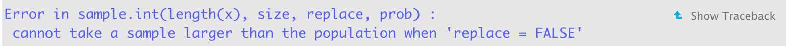

---
output:
  pdf_document: default
  html_document: default
---
# (PART) Doing Statistics {-} 

# Building Simulations

The previous chapters have shown the basics of tidying, transforming, and visualizing data using R and the tidyverse. Armed with these tools, this unit turns to how we can extract insights from our data. Key to this investigation is statistics and inherent to that is the notion of *randomness*. 

We use the word _random_ all the time on a regular basis. For instance, you may be familiar with the concept of *gachapon* or [loot boxes](https://en.wikipedia.org/wiki/Loot_box) in PC and mobile games which gives players a chance to obtain prized items using real-world currency. While they have recently [stirred up much controversy](https://doi.org/10.1371/journal.pone.0206767), the basic idea boils down to how to leverage *randomness*.  

We often speak of randomly picking a number between 1 and 100. If someone chooses the number by adding the day of the month plus the minute of the hour showing on the clock of her smart watch, her choice is not random; once you have learned what she has chosen previously, you know what she will choose again. Therefore, anything generated by a systematic, predetermined, and deterministic procedure is not random.

Randomness is so essential to conducting experiments in statistics because it is what allows us to *simulate* physical processes in the real world, often thousands and hundreds-of-thousands of times.  All this at zero cost of coordinating an actual physical experiment, which may not be feasible depending on the circumstances.   

This chapter begins by exploring randomness using R. We will then leverage randomness to build out simulations of real life phenomena -- like *birthdays!* -- and how we may extract insights from them. 

<!--We also may notice that there can be *levels* of randomness. We sometimes say "almost random", "very random", or "fairly random". When we use these words, we are probably thinking of an ideal randomness and how far the actions in question are from when they occur with the ideal randomness. --> 


## The `sample` Function

We begin our study by learning how to generate random numbers using R. There are many functions that R has which involve random selection; one of these is called `sample()`. It picks one item at random from a list (i.e., vector), where the choice will likely occur at all positions. A prime example of randomness is tossing a coin with chance of heads 50% and chance of tails 50%. 

```{r}
fair_coin <- c("heads", "tails")
sample(fair_coin, size = 1)
```

Run the cell a few times and observe how the output changes. The unpredictable nature makes the code, though short, stand out from all the R code we have written so far. 

Note that the function has the form `sample(vector_name, size)`, where `vector_name` is the name of the vector from which we will select an item and `size` is how many items we want to select from the vector.

Here is another example: a football game ("American football" for non-US readers) begins each half by kicking a football from the 20-yard line of a team toward the goal of the opponent. The decision of which team gets to kick the ball is through a ritual that takes place three minutes prior to the "kick off". In the ritual, a referee tosses a coin and the visiting team calls "heads" or "tails".

If the visiting team calls correctly, the team gets to decide whether the team will kick or receive; otherwise, the home team makes the decision. Note that the ritual is somewhat redundant.

Suppose that the referee throwing the coin is not clairvoyant and has no powers to foretell "heads" or "tails" and that the coin is the same fair coin from our previous example. Then, the referee can simply throw the coin and make the visiting team kick the ball if the coin turns "heads" (or "tails" for what's its worth).

Thus, the action of choosing the team boils down to selecting from a two-element vector consisting of "kick" and "receive" with chance of 50% for each. 

```{r}
two_groups <- c("kick", "receive")
sample(two_groups, size = 1)
```

A nice feature of `sample` is that we can instruct it to repeat its element-choice action multiple times in sequence without influence from the outcome from the previous runs. For instance, we can select the kicking teams for 8 games. 

```{r}
sample(two_groups, size = 8, replace = TRUE)
```

Note that a third argument `replace` is specified here. By setting it to `TRUE`, we allow the same selection (say, `receive`) from the `two_groups` vector to be made more than once. We call this method sampling *with replacement*. In contrast, toggling this argument to be `FALSE` would make choices from the previous executions unavailable. We call this way sampling *without replacement*. R does this by default. 

What happens if the size of the vector is smaller than the number of repetitions? 

```{r eval=FALSE}
sample(two_groups, size = 8)
```

{width=100%}

There are not enough elements to choose from! 

Note that we have made an implicit interpretation of the code: we wrote the code assuming that it will tell the role that the visiting team will play at the kick off; that is, if the value the code generates is `kick` then the visiting team will kick and if it is `receive` they will receive. We must not mistake this interpretation. That is, the output the code produces is NOT the role the home team will play; it is for selecting the action of the *visiting* team. Implicit interpretations we make on the code often play an important role.

If the visiting team is very keen to start by kicking, we may choose to instead translate the outcome as `Yes` when it is `kick` and `No` otherwise. If we choose such a Yes/No interpretation, we view the random scheme producing `kick` as an "event" and interpret the output being `kick` as the event "occurring".


## `if` Conditionals 

Often times in programming work we need to take a certain action based on the outcome of an event. For instance, if a coin turns up heads, a friend wins a $5 bet or a visiting team in football is designated as the "kicker". Such *conditional* statements and how to use them in programming are the subject for this section. 

### Remember logical data types? 

We saw in an earlier chapter that one of the core data types is logical data. These were the easiest to remember of the bunch because logical data types can only have one of two values: `TRUE` and `FALSE`. We also often call such values *booleans*.    

A major use of logical data is to direct computation based on the value of a boolean. In other words, we can write code that has two choices for some part of its action where which of the two actions actually occurs depends on the value of the boolean.

If we draw the choice-inducing boolean value from random generation, say using `sample`, we can randomly select among possible actions. We call such an "action selection" based on the value of a boolean _conditional execution_.

### The `if` statement

A program unit in a conditional execution is a *conditional statement*. A *conditional statement* is one that allows selection of an action from multiple possibilities. In R and in many other languages, we usually write a conditional statement as a multi-line statement. It is entirely possible to put everything in one, but such style is confusing and prone to errors.

Conditional statements usually reside inside a function. This allows us to express alternative behavior depending on argument values. 

In R, and in many programming languages, a conditional statement begins with an `if` header. What appears after the keyword is a pair of parentheses, in which a condition to examine appears. After the condition part appears an action to perform, which is a series of statements flanked by a pair of curly braces.

The syntax specifies that if the condition inside the pair of parentheses is true, the program executes the statements appearing in the ensuing pair of braces. We call a statement in this form an *if statement*.

Let us see our first example of an if statement, which is a function that returns the sign of a number.

```{r}
sign <- function(x) {
  if (x > 0) {
    return("positive")
  }
}
sign(3)
```

The function `sign` receives a number and returns a string representing the sign of the number.
Actually, the return value of the function exists only if the number is strictly positive; otherwise, the function does not return anything.

```{r}
print(sign(-3))
```

What is the boundary separating `positive` and nothing? We know that the condition is `x > 0` so we can say that the boundary is the point `0`, but `0` falls on the side that produces no return.

Can we make the return `positive` when x is equal 0? Sure can! 

```{r}
sign <- function(x) {
  if (x >= 0) {
    return("positive")
  }
}
sign(0)
sign(0.1)
print(sign(-0.1))  # force a print
```

We can put a series of conditional statements in a function. If a conditional statement contains a `return` statement and R executes that statement, R skips the remainder of the code in the function.

```{r}
sign <- function(x) {
  if (x > 0) {
    return("positive")
  }
  if (x < 0) {
    return("negative")
  }
}
sign(2)
sign(-2)
print(sign(0))  # force a print
```

Instead of saying "if `x` is less than 0, it is negative", it would be more natural to say "*otherwise*, if `x` is less than 0, it is negative". We can express "otherwise" using the keyword `else`. Let's revise the above code. 

```{r}
sign <- function(x) {
  if (x > 0) {
    return("positive")
  } else if (x < 0) {
    return("negative")
  }
}
sign(3)
sign(-3)
print(sign(0))  # force a print
```

What do we do about 0? By adding another `else if` block to the code, we can make the function return something in the case when the number is 0.

```{r}
sign <- function(x) {
  if (x > 0) {
    return("positive")
  } else if (x < 0) {
    return("negative")
  } else if (x == 0) {
    return("neither positive nor negative")
  }
}
```

```{r}
sign(0)
```

Since the condition `x == 0` is exactly the condition `x` satisfies when the execution reaches the second `else if` block, we can jettison the `if` and the condition. The resulting block is what we call an `else` block. 

```{r}
sign <- function(x) {
  if (x > 0) {
    return("positive")
  } else if (x < 0) {
    return("negative")
  } else {
    return("neither positive nor negative")
  }
}
```

```{r}
sign(0)
```

### The `if` statement: a general description  

We are now ready to present a more general form of the `if` statement. 

```
if (<expression>) {
    <body>
} else if (<expression>) {
    <body>
} else if (<expression>) {
    <body>
...
} else {
    <body>
}
```

The keyword `else` means "otherwise" and the keyword `else if` is a combination of `else` and `if`.
We can stack up `else if` blocks after an initial `if` to define a series of alternative options.

Following are some notes to keep in mind:

* An `if`-block cannot begin with an `else` in the series.  
* There must exist one `if` clause.
* When a series of `else if` blocks appear after an `if`, this represents a series of alternatives. 
  We call this an `if` sequence. 
* An `if` without a preceding `else` begins a new `if` sequence.
* R scans all the conditions appearing in an `if` sequence takes an action when it finds a
  condition that evaluates to `TRUE`. All other actions before and after the matching one are ignored. 
* The `else` block is optional; it takes care of everything that does not have a match. 

### One more example: comparing strings 

We end this section with another example, this time comparing strings. 

```{r}
get_capital <- function(x) {
  if (x == "Florida") {
    return("Talahassee")
  } else if (x == "Georgia") {
    return("Atlanta")
  } else if (x == "Alabama") {
    return("Montgomery")
  } else {
    return("Oops, don't know where that is")
  }
}
```

Here is a dataset containing some students and their state of residence. 

```{r}
some_students <- tibble(
  name = c("Xiao", "Renji", "Timmy", "Christina"), 
  state = c("Florida", "Florida", "Alabama", "California")
)
some_students
```

We can annotate the tibble with a new column containing the capital information for each state using a `purrr` map.  

```{r}
some_students |>
  mutate(capitol = map_chr(state, get_capital))
```
Note how Christina's capital information defaults to the result of the `else` condition. 

## `for` Loops 

Let us now use conditional execution to simulate a simple betting game on a coin. 

### Prerequisites

We will need some functions from the tidyverse in this section, so let us load it in. 

```{r, message = FALSE, warning = FALSE}
library(tidyverse)
```

### Feeling lucky

We will use the same fair coin from the kick-off we saw in the football example. However, feeling lucky, you wager that you can make some money off this coin by betting a few dollars on heads -- can we tell if your intuition is right? Let's find out! 

We imagine a function that will receive a string argument representing the side the coin is showing, and returns the result of the bet. If the coin shows up `heads` you get 2 dollars. But, if it shows `tails` you lose 1 dollar.

```{r}
one_flip <- function(x) {
  if (x == "heads") {
    return(2)
  } else if (x == "tails") {
    return(-1)
  } 
}
```

<!-- @JB: let's keep this as an exercise for them; Since a string may take a value other than the two we are anticipating as the possibilities, we may the program complete (or _overcomplete_, if you dare to say) by attaching the last `else` block. --> 

<!-- In this manner, the program returns one of 1, -1, and 0 given any argument.
The flow to determine the return value is: (a) check if `x` is equal to "Head", and if so, return 1 and terminate the execution of `one_flip`; (b) otherwise check if `x` is equal to "Tail", and if so, return -1 and terminate the execution of `one_flip`; (c) otherwise, return 0 and terminate the execution of `one_flip`. --> 

Let us see how the function works.

```{r}
c(one_flip("heads"), one_flip("tails"))
```

To play the game based on one flip of a coin, we can use `sample` again.   

```{r}
sides <- c("heads","tails")
one_flip(sample(sides, size = 1))
```

We can avoid having to create a `sides` variable by including the vector directly as an argument. 

```{r}
one_flip(sample(c("heads","tails"), size = 1))
```

Now let us expand this and develop a multi-round betting game.

### A multi-round betting game

Previously, we split the game into two actions: a function `one_flip` computing the gain/loss and a `sample` call simulating one round of the game using the gain/loss function. We now combine these two into one.

```{r}
betting_one_round <- function() {
  # Net gain on one bet
  x <- sample(c("heads","tails"), size = 1) 
  if (x == "heads") {
    return(2)
  } else if (x == "tails") {
    return(-1)
  } 
}
```

Betting on one round is easy -- just call the function!

```{r}
betting_one_round()
```

Run the cell several times and observe how the value is sometimes 2 and sometimes -1. How often do we get to see 2 and how often do we get to see -1? Will your wager come out on top? 

You could run this function multiple times and tally, of the runs you observed, how many times you won 2 dollars and how many times you lost a dollar. You could then compare the difference between the gains and losses. This is quite a tedious process and we still don't have a sense of how variable the results are. For that, we would need to run this process thousands or millions of times. Should we grab a good pencil and get tallying? No way! Let's use the power of R. 

<!--`betting_one_round` relies upon an equal possible selection between the two elements in the vector `c("heads","tails"), and the selections result in 1 and -1, respectively. We thus anticipate to see 2 as often as we see -1. -->

We can instruct R to take care of the repetitive work by repeating some action a number of times with  specific instruction such as, "for round X, use this information". *Iteration* is the name we use in programming to refer to things that repeat. In R and in many other languages, a keyword that leads a code in *iteration* is `for`. We also use the word *loop* to refer to a process that repeats. 

So a code that repeats a process with `for` as the header is a `for`-loop.

In R, the way to specify a `for`-loop is to say: "for each item appearing in the following sequence, starting from the first and towards its end, do this."

```{r}
for (hand in c("rock", "paper", "scissors")) {
  print(hand)
}
```

```{r}
for (season in c("spring", "summer", "fall", "winter")) {
  print(season)
}
```

In the two `for` loops, `hand` and `season` are the names we use to refer to the elements that the iteration picks from the lists. In other words, the first `for`-loop picks an item from the three-element sequence and we use the name `hand` to access the item. The same is true for the second `for`-loop.

Our present interest is in writing a program that repeats the betting game many times.
To repeat an action a number of times, we use a pair of numbers with a colon in between.
The expression is `X:Y`, where `X` represents the start and `Y` the end.
The expression represents the series of integers starting from `X` and ending with `Y`.

```{r, error=TRUE}
1:5
30:20
a <- 18
b <-  7
a:b
b:a
```

Wow! R is so smart that when the second number is smaller than the first number, it decreases the number by 1, instead of increasing it by 1.

Now we can use the sequence generation to write a for-loop. This one prints 1 through 5.

```{r}
for (i in 1:5) {
  print(i)
}
```

We can apply this to the betting game. 

```{r}
for (i in 1:10) {
  print(betting_one_round())
}
```

Note that the function `better_one_round` is self-contained, meaning not requiring an argument, and so the code that R runs is identical among the ten iterations. However, `betting_one_round` has a call to `sample` and that introduces randomness in the execution and, therefore, the results we see in the ten lines are not uniform and can be different each time we run the `for` loop.

### Recording outcomes

You may have realized "the results of the ten runs disappear each time I run it; is there a way to record them?" The answer: yes! 

We create an integer vector to store the results, where the vector has the same length as the number of times we issue a bet; each element in the vector stores the result of one bet.  

```{r}
rounds <- 10
outcomes <- vector("integer", rounds)
for (i in 1:rounds) {
  outcomes[i] <- betting_one_round()
}
```

```{r}
outcomes
```

This will do the job. The body of this `for` loop contains two actions: (1) run the betting function `betting_one_round()`, and (2) store the result into `i`th slot of the `outcomes` vector. Both actions are executed for each item in the sequence `1:rounds`.

You may have noticed how stepping through the `outcomes` vector this way, individually assigning each element the result of one bet, can be cumbersome to write. If so, you would be in good company. The philosophy of R, and especially the tidyverse, prefers to eliminate the need to write many common `for` loops. We saw one example of this already when we used *map* from the `purrr` package to apply a function to a column of data. Here, we will use the function `replicate` to repeat a simulation many times.    

Here is how we can rewrite our simulation using just two lines of code. 

```{r}
rounds <- 10
outcomes <- replicate(n = 10, betting_one_round())
```

```{r}
outcomes
```

We can use `sum` to count the number of times money changed hands.

```{r}
sum(outcomes)
```

Looks like we made some money! 

Note that while `replicate` eliminates the need to write `for` loops in common situations, R internally must still perform a `for` loop, i.e., the code for `replicate` contains a `for` loop and it is not directly visible to us as the programmer who wrote the code. Therefore, the chief benefit of using constructs like `replicate` and map is not for its speed, but clarity: it is much easier to read (and write!).

If you are still not convinced, we defer to a prominent data scientist and an authority on tidyverse for an explanation. 

> Of course, someone has to write loops. It doesn’t have to be you. — Jenny Bryan

### Example: 1,000 tosses

Iteration using `replicate` is a handy technique. For example, we can see the variation in the results of 1,000 bets by running exactly the same code for 1,000 bets instead of ten.

```{r}
rounds <- 1000
outcomes <- replicate(n = rounds, betting_one_round())
```

The vector `outcomes` contains the results of all 1000 bets.

```{r}
length(outcomes)
```

How much money did we make?

```{r}
sum(outcomes)
```

To see how often the two different possible results appeared, we can create a tibble from `outcomes` and then use `ggplot2`.

```{r dpi=80,  fig.align="center", message = FALSE}
outcome_df <- tibble(outcomes)
ggplot(outcome_df, aes(x = outcomes)) + 
  geom_bar() + 
  coord_flip()
```

As we would expect, each of the two outcomes 2 and -1 appeared about 500 of the 1000 times. And, because we bet an extra dollar for every heads we get, we come out on top. Not bad!  


## A Recipe for Simulation

Simulation, in data science, refers to the use of programming to imitate a physical process.
Sometimes we call it "computer simulation" to articulate that the a computer is the author of such simulation. A simulation consists of three main steps.

### Prerequisites

As before, let us load in the tidyverse.

```{r, message = FALSE, warning = FALSE}
library(tidyverse)
```

### Step 1: Determine what to simulate 

The first step is to figure out which part of the physical process we want to imitate using computation and decide how we will represent that part numerically.

### Step 2: Figure out how to simulate one value

The second step is to figure out how to generate values for the numerical representation from the first step using a computer program. If some numbers require updating during the simulation procedure, we will figure out how to update them. Randomness is often a key ingredient in this step. This is usually the most difficult part of the simulation to complete.   

### Step 3: Run the simulation and visualize!

The fourth step is to run the simulation and develop insights from the result, often using visualization. During this step we also must decide the number of times to simulate the quantity from the second step. To get a sense of how variable a quantity is, we must run step 2 a large number of times. We saw that in the previous section with simulating bet wins/losses we ran the experiment 1,000 times. But we may need to run a simulation even more, say hundreds of thousands or millions of times.

### Putting the steps together in R 

Note that we have followed these same steps in the betting experiment from the previous section. We can write the steps more generally here:

* Create a "rounds" variable, that is, an integer containing the number of desired repetitions. 

* Create an "experiment" function to simulate one value based on the code we developed.

* Call the function `replicate` to replicate the experiment function a great number of times. 
  * Store the results to a variable. We call this the "outcomes" vector.
  * A general format takes the form: `outcomes <- replicate(n = rounds, experiment_func())`

The outcomes vector will contain all the simulated values. A good next step would be to visualize the distribution of the simulated values by counting the number of simulated values that fall into some category or, perhaps more directly, by using `ggplot`! 

We now turn to some examples. 

### Difference in the number of heads and tails in 100 coin tosses

Let us return to the coin tosses. As we see powers of 10 as the easiest kind of numbers to deal with, let us back down from 300 to 100. If the coin is fair, we anticipate a half of the tosses we make is "Head".
The simulation we have written receives as the number of repetitions, and returns a vector representing the results of the simulated coin tosses with an added interpretation of "heads" as 1 and "tails" as -1.
We can go back to the process of flipping a coin and develop an insight as to when we flip a coin 300 times, how the number of "heads" is likely to look.

In this example we will simulate the number of heads in 300 tosses of a coin. The histogram of our results will give us some insight into how many heads are likely.

Let's get started on the simulation, following the steps above.

### Step 1: Determine what to simulate 

We want to simulate the process of tossing 300 fair coins, where each coin toss generates "heads" or "tails" as the outcome. There is only one number we are interested in the physical process - the number of "heads".

### Step 2: Figure out how to simulate one value

Now we know that we want to know the number of "heads" in 100 coin tosses, we have to figure out how to make one set of 100 tosses and count the number of heads. Let's start by creating a coin.
We eliminate the gain/loss calculation from the previous program in the ensuing simulation program.
We start by stating the two possible outcomes of toss.
What we define is a two-element vector, as before, and we call it `sides`.

```{r}
sides <- c("heads", "tails")
```

We use `sample()` to sample from the two-element vector. Recall that we can specify the number of samples and if we want to replenish the vector with the item that the sample has chosen.
The code below shows how we sample from `sides` 8 times with replacement.

```{r}
tosses <- sample(sides, size = 8, replace = TRUE)
tosses
```

We can count the number of heads by using `sum()` as before:

```{r}
sum(tosses == "heads")
```

Our goal is to simulate the number of heads in 100 tosses. We have only to replace the 8 with 100.

```{r}
outcomes <- sample(sides, size = 100, replace = TRUE)
num_heads <- sum(outcomes == "heads")
num_heads
```

Play with the code a few times to see how close the number gets to the expected one half, 150.

```{r}
one_trial <- function() {
  outcomes <- sample(sides, size = 100, replace = TRUE)
  num_heads <- sum(outcomes == "heads")
  return(num_heads)
} 
```

You can simply call this function to generate an outcome of one experiment.

```{r}
one_trial()
```

### Step 3: Run and visualize!

Here we face a critical question, "for our goal of developing an insight about coin tosses, how many times do we want to repeat it?" We can easily run the code 10,000 times, so let's choose 10,000 times. 

We have programmed `one_trial` so that it executes 100 coin tosses and returns the number of "Heads".
We now need a loop to repeat `one_trial` as many times we want.

To do that, we use the `replicate` construct.

```{r}
# Number of repetitions
num_repetitions <- 10000

# simulate the experiment!
heads <- replicate(n = num_repetitions, one_trial())
```

By executing `heads` after this produces all elements of `heads `.
That will be a lot of lines on the screen, so you may not want to do it!
Instead, we can ask `heads` how many elements it has, using the `length` function we have seen before.

```{r}
length(heads)
```

Aha! It has the desired number of elements. We can peek at some of the elements in the vector.

```{r}
heads[1]
heads[2]
```

Using `tibble` we can collect the results as a table. Recall that `tibble` needs the index values and the data.

```{r}
results <- tibble(
  repetition = 1:num_repetitions,
  num_heads = heads
)
```

```{r}
results
```

```{r dpi=80, fig.align="center", message = FALSE}
ggplot(results) + 
  geom_histogram(aes(x = num_heads, y = after_stat(density)), 
                 color = "gray", fill = "darkcyan", 
                 breaks = seq(30.5, 69.6, 1))
```

In this histogram, each bin has width 1 and we place it centered on the value.
For example, the vertical bar on 50 is the number of times the simulation generated 50 as the result.
We see that the histogram looks symmetric with 50 as the center, which is a good sign.
Why?
Our expectation is that the number 50 is the ideal number of "Heads" in 100 tosses of a fair coin.
If the coin is fair, for all number $d$, the event that we see $50-d$ "Heads" is as likely to happen as the event that we see $50+d$ Heads.
The symmetry that we observe confirms the hypothesis.
We also see that about 8% (i.e., 0.08 on the y-axis) of the simulation results produced 50.
Furthermore, we see that very few times we see occurrences of numbers less than 35 or greater than 65.
We thus conclude from the experiment that the range of the number is likely to reside in the range $[35,65]$.

### Not-so-doubling rewards

There is a famous story of a king awarding a minister with doubling amount of grains. There are many versions of the story, but the gist is like this: one day a king has decided to award a minister for his great work.

* The king asks, "Great work, what do you want from me as a reward? You name it, I will make your wish come true."
* The minister says, "Your Majestry, what an honor! If you are so kind as to indulge me, may I ask to receive grains of rice on a board of chess. We will start with one grain on a space on the board, given one day. The next day, I would like two grains on the next space. The following day, I would like four grains on the third space. Each day, I would like twice as many grains as you have given me on the previous day. In this manner, for the next 64 days, you would be so generous to give me grains of rice. Would that be too imposing to ask?"
* The king says, "You ask so little. That would be so easy to do. Of course, this great King will grant you your request."

The question is how many grains of rice will the minister receive at the end of the 64 day period?

We know the answer to the question. The daily amount doubles each day starting from 1.
He would thus receive:


\[
1 + 2 + 4 + 8 + 16  + \cdots = 2^0 + 2^1 + 2^2 + 2^3 + 2^4 + \cdots+ 2^{63}
\]


We can express this quantity more compactly as $2^{64} - 1$.

Why? Suppose he has one more grain in his pocket to add to the piles at the end of the 64th day. We have


\[
1 + 1 + 2 + 4 + 8 + \cdots + 2^{63} - 1
\]


as the same total amount. The first two occurrences of 1 are equal to 2. So we can simplify the sum as


\[
2 + 2 + 4 + 8 + \cdots + 2^{63} - 1
\]


We have got rid of the twos.
By joining the first two 2's, we get


\[
4 + 4 + 8 + \cdots + 2^{63} - 1
\]


At the end of calculation, we get 


\[
2^{63} + 2^{63} - 1 
\]


and this is equal to $2^{64}-1$, which is, by the way, an obscenely large number.

We know the story as a fable that tells us we must think before promising something. This story took place hundreds of years ago, where there were no computers. For the king to provide the grains he had promised to give to the minister, he would have ordered a clerk to do the calculation.

If the clerk is super-human, her calculation would be perfect, and so the total amount she would provide would be exactly what we had anticipated. But, since she is human, she is prone to error. In the process of writing down numbers, there may be various errors, such as skipping a digit or writing a wrong digit.

If she does not notice an error, the minister would get a different amount of grains at the end of the 64 days. Suppose we want to mimic the process of her calculation using a computer, with the chance factor in mind. This is how "randomness" comes in to play.

Let us consider two different scenarios for the source of error: 

* The errors are __independent__. That is, the error the clerk makes on a day does __not__ affect the bookkeeping the next day.  
* The errors are __dependent__. That is, the error the clerk makes affects the next day's counting and has a lasting effect on the bookkeeping for the remaining days. 

The first scenario is easier, so we will develop a simulation scheme for this first. Also, to simplify the number crunching, we consider the number of grains the minister receives at the end of 10th day. We know that this number should equal $2^{10} - 1$.

#### Step 1: Determine what to simulate 

We are interested in simulating the number of grains the minister receives at the end of the 10th day, assuming independent errors in bookkeeping. We hypothesize that the number of grains should cluster around $2^{10} - 1 = 1023$. 

#### Step 2: Figure out how to simulate one value

We imagine the variability in the clerk's calculation for the number of grains a minister receives. Based on what we know from the story, three actions are possible:

* The clerk counts one less grain. 
* The clerk counts the right amount of grains.
* The clerk counts one extra grain.

We will assume that "getting it right" has a slightly higher chance of occurring ($2/4$) with the other two actions having an equal chance of occurring ($1/4$). We can simulate the clerk's action using `sample` and setting the `prob` argument.  

```{r}
sample(c(-1, 0, 1), 1, prob=c(1/4, 2/4, 1/4))
```

The following function receives a number of grains as an argument and returns the number of grains after the clerk's calculation. This is the amount the minister would receive after some day. 

```{r}
after_clerk_calculation <- function(grains) {
  grains + sample(c(-1, 0, 1), 1, prob=c(1/4, 2/4, 1/4))
}
```

We can try the function with some arbitrary number of grains, say, 10. 

```{r}
after_clerk_calculation(10)
```

Try running this a few times to observe the different outcomes. Sometimes the clerk gets it right (10), counts one less (9), or counts one more (11). 

The expected amount the minister should receive each day follows the form $2^{\text{ day number} - 1}$. We can write the following sequence for the amounts starting at day 1 and ending after day 10.

```{r}
2 ** (0:9)
```

Using a `purrr` map, we can simulate the amounts after the clerk's calculation by applying the function `after_clerk_calculation` to each of the elements in the above sequence.

```{r echo=FALSE}
set.seed(2)
```

```{r}
map_dbl(2 ** (0:9), after_clerk_calculation)
```

```{r echo=FALSE}
set.seed(2)
```

Therefore, the total number of grains the minister receives is the sum of these amounts. 

```{r}
map_dbl(2 ** (0:9), after_clerk_calculation) |>
  sum()
```

We now have enough machinery to write a function for simulating one value. This functions receives the number of days as an argument and returns the total grains received by the minister after the given number of days is over. 

```{r}
total_grains_received <- function(num_days) {
  map_dbl(2 ** (0:(num_days - 1)), after_clerk_calculation) |> 
    sum()
}
```

For a 10-day scheme, we call the function as follows. 

```{r}
total_grains_received(10)
```

Run the cell a few times and observe the variability in the number of grains.

#### Step 3: Run and visualize!

We will use 10,000 repetitions of the simulation this time to get a sense of the variability. Each element of the `grains` vector stores the resulting number of grains at the end of the 10th day in each simulation of the story. 

```{r}
# Number of repetitions
num_repetitions <- 10000

# simulate the experiment!
grains <- replicate(n = num_repetitions, total_grains_received(10))
```

As before, we collect our results into a tibble. 

```{r}
results <- tibble(
  repetition = 1:num_repetitions,
  num_grains = grains
)
results
```

Finally, we visualize our results.

```{r dpi=80, fig.align="center", message = FALSE}
ggplot(results) + 
  geom_histogram(aes(x = num_grains, y = after_stat(density)), 
                 color = "gray", fill = "darkcyan", bins = 18) + 
  geom_point(aes(x = 1023, y = 0), color = "salmon", size = 3)
```

We observe that the number of grains cluster around 1023, as expected (see the orange dot). In general, each round after the first can create a difference of at most 1, so with $N$ rounds, the difference is at most $N - 1$. Our simulation confirms this fact. 

### Accumulation

We now turn to the second scenario in the doubling grains story. Because the calculation for the next day *depends* on what happened the previous day, we will not be able to use the `map` or `replicate` operations as we did when assuming the errors were independent. We need a programming construct that allows us to update some value as we go along. We could use the `for` loop construct shown in [Section 6.3](https://ds4world.cs.miami.edu/building-simulations.html#for-loops) to achieve this work easily, but we would like to eliminate the need to write a loop as much as possible. 

`purrr` offers another construct called `accumulate` that sequentially applies a 2-argument function to elements of a vector. A key aspect of its operation is that each application of the function uses the *result* of the previous application as the first argument.

Let's see an example. Consider the following character vector of fruits.  

```{r}
delicious_fruits <- c("apple", "banana", "pineapple", "mango")
```

We can use `accumulate` to implement string concatenation. Here, we provide an anonymous function that receives two arguments `acc` (an accumulator) and `nxt` (the next element in the input vector). The `str_c` function is called using the two arguments using the colon as a separator.  The effect achieved is the joining, or "concatenation", of all strings in the vector `delicious_fruits` into a single string. 

```{r}
accumulate(delicious_fruits, \(acc, nxt) str_c(acc, nxt, sep = ":"))
```

There is a good deal of technical detail here so let us unpack what we just did. The accumulator (stored in the argument `acc`) stores the resulting string after concatenation with each element in the vector `delicious_fruits`. The accumulation begins with the first element, the string `"apple"`. After concatenation with the argument `nxt` ( containing the string `"banana"`), the resulting string is `"apple:banana"` and the accumulator is updated with this value in the next step of the iteration, available in the argument `acc`.

The process continues until each element of the input vector has been exhausted. The result of the accumulation at each step is shown in the vector returned by the `accumulate` function. This vector has the same length as the input vector and the final result appears at the last index (index 4), a single string containing each fruit separated by a colon. 

We could discard the intermediate results and extract just the final product by applying the function `last` from `dplyr`. Observe how this is equivalent to `str_c` when used with the collapse setting. 

```{r}
# str_c from stringr with collapse
str_c(delicious_fruits, collapse = ":")

# using accumulate!
accumulate(delicious_fruits, \(acc, nxt) str_c(acc, nxt, sep = ":")) |>
  last()
```

We can also set an initial value to use to begin the accumulation. 

```{r}
accumulate(delicious_fruits, \(acc, nxt) str_c(acc, nxt, sep = ":"), 
           .init = "a")
```

This has the effect of extending the resulting vector length by 1. 

In some cases, it is desirable to use the accumulator and ignore the elements in the input vector given (in the argument `nxt`). This can be useful when you care only about the accumulation and repeating this for some number of steps. 

For instance, the following `accumulate` continuously adds 10 to an initial value 10. The length of the input vector controls the number of steps taken, but the vector contents are ignored.

```{r}
accumulate(541:546, \(acc, nxt) acc + 10, .init = 10)
```

It is also possible to terminate the accumulation early based on some condition being met using the `done` sentinel. This can also be useful depending on the simulation scheme. Question 4 from the exercise set explores this feature in greater depth. 

__Pop quiz:__ In the above `accumulate` example, would you expect the resulting vector to change if we had used the sequence `1:6` as the input vector? Why or why not?  

### Lasting effects of errors

We can use the `accumulate` construct in the doubling grains simulation. Recall that, under the second scenario, the error the clerk makes on some day *affects* the bookkeeping for the remaining days. That is, the amount the clerk gives on a day after the initial day is two times the amount she gave in the previous with a possible error of $\pm$ 1 grain. 

We write a function `grains_after_day` that receives a single argument containing the current number of grains. It returns the sum of the current grains and the calculated grains after `after_clerk_calculation` is called. When things go right, this has the desired effect of *doubling* the current number of grains. 

```{r}
grains_after_day <- function(current_grains) {
  new_amount <- current_grains + after_clerk_calculation(current_grains)
  return(max(1, new_amount))
}
```

The second line is added as a sanity check to ensure the resulting grain amounts do not ever go negative. 

We can use this function within an `accumulate` call to simulate one value in this experiment. Here we provide an initial value 1 to begin the accumulation with and use the input vector only to step the simulation 10 times.  

```{r}
accumulate(1:10, \(acc, nxt) grains_after_day(acc), .init = 1)
```

We rewrite the function `total_grains_received` to use the `accumulate` call and retrieve the final value.  

```{r}
total_grains_received <- function(num_days) {
  accumulate(1:10, \(acc, nxt) grains_after_day(acc), .init = 1) |> 
    last()
}
```

We can now call this function a large number of times, say, 10,000, to gauge the amount of variability. Each element of the `grains` vector stores the resulting number of grains after the 10th day, assuming *dependent* errors. 

```{r}
num_repetitions <- 10000
grains <- replicate(n = num_repetitions, total_grains_received(10))
```

Finally, we visualize the result. 

```{r}
grains |>
  tibble() |> 
  ggplot() + 
  geom_histogram(aes(x = grains, y = after_stat(density)), 
                 bins = 18, color = "gray", fill = "darkcyan") +
  geom_point(aes(x = 1023, y = 0), color = "salmon", size = 3)
```

Sometimes the minister received few to no grains at the end of the 10th day and sometimes he received much more than he asked for! Like the first scenario, we see the simulated values cluster again around the expected amount. 

### Simulation round-up 

This section discussed multiple iteration constructs for building simulations. The following list clarifies when to use each.  

* `map_*` 
    + __Arguments:__ (1) a sequence (2) a function that receives as an argument an element from that sequence
    + __Returns:__ List or vector the same length as the input sequence
    + __When to use?__ Applying a function to a sequence or a tibble column
* `replicate` 
    + __Arguments:__ (1) Number of repetitions (`reps`) (2) a function to repeat
    + __Returns:__ Vector of length `reps` that can be stored for later analysis
    + __When to use?__ *Repeating* a function some fixed number of times
* `accumulate` 
    + __Arguments:__ (1) a sequence (2) a two-argument function; first argument is an *accumulator* and the second argument an element from the sequence
    + __Returns:__ Vector the same length as the input sequence that contains the results of the accumulation at each step (or one longer if `.init` argument is set)
    + __When to use?__ Applying a function where some value needs to be updated through the duration of the simulation

## The Birthday Paradox

Happy birthday! Someone in your class has a birthday today! Or, should we say happy *birthdays*? 

The *Birthday Paradox* states that if 23 students are in a class, the chances are 50/50 that there are two students among the 23 who have the same birthday. There are 365 days in a year. How is it possible that among just 23 students, we can find two of them that have the same birthday? 

### Prerequisites

As before, let us load in the tidyverse.

```{r, message = FALSE, warning = FALSE}
library(tidyverse)
```

### A quick theoretical exploration 

We answer the question first by analysis.

Assume that we will consider only a non-leap year (no February 29th -- sorry leap year babies!) and each of the 365 birthdays are likely to occur. Since each birthday is likely to occur as any other birthday, we can look at the question at hand by counting the number of possible birthday combinations.

We have 23 students in the class. Each student gets to choose her birthday freely without considering the birthdays of the other 22 students. The 23 students make their choices and then check whether the choices fall into one of the no-duplicate selections.

With no restriction, the number of possible choices of birthdays for the 23 students is


\[
365 * 365 * 365 * \dots * 365 = 365^{23}
\]


These possibilities contain the cases where birthdays may be shared among the people.

In comparison, the number of possibilities for selecting 23 birthdays so that no two are equal to each other requires a bit complicated analysis. We can view the counting problem using the following hypothetical process.

The 23 students in the class will pick their birthdays in order so that there will be no duplicates.

* The first student has complete freedom in her choice. She chooses one from the 365 possibilities.
* The next student has almost complete freedom. She can pick any birthday but the one the first student has chosen. There are now 364 possibilities.
* The third student has again almost complete freedom. She can pick any birthday but the ones the first two students have chosen. Since the first two students picked different birthdays, there are 363 possibilities for the third student. 

We can generalize the action. The $k$-th person has $365 - k + 1$ choices.

By combining all of these for the 23 students, we have that the number of possibilities for choosing all-distinct birthdays is


\[
365 \cdot 364 \cdot 363 \cdot \cdots \cdot 343.
\]


Thus, the chances for the 23 students to make the selections so there are no duplicates are thus


\[
(365 \cdot 364 \cdot 363 \cdot \cdots \cdot 343) / 365^{23}.
\]


Moving terms, we get that the chances are


\[
\frac{365}{365} \cdot \frac{364}{365} \cdots \frac{343}{365}.
\]


The quantity is approximately $0.4927$. The chances we find a duplicate are 1 minus this quantity, which is approximately $0.5073$. Pretty interesting, isn't it?

### Simulating the paradox

The second method, an alternative to the formal mathematical analysis, is to use simulation to mimic the process of selecting 23 birthdays independently from each other. This simulation is slightly more difficult than the ones we have seen in the previous section. 

### Step 1: Determine what to simulate 

In this simulation, we are interested in obtaining the *chance* or probability that two students in the class have the same birthday among a group of 23 individuals. 

### Step 2: Figure out how to simulate one value

We start by using `sample` to draw 23 random birthdays. The vector represented by the sequence `1:365` contains the days in the year one can pick from.  

```{r}
chosen_birthdays <- sample(1:365, size=23, replace=TRUE)
chosen_birthdays 
```

We now check how many duplicates there are in the class. 

```{r}
sum(duplicated(chosen_birthdays))
```

Let's pull these pieces together into a function we can use. The function returns `TRUE` if there are any duplicates in the class; `FALSE` otherwise. 

```{r}
any_duplicates_in_class <- function() {
  chosen_bdays <- sample(1:365, size=23, replace=TRUE)
  num_duplicates <- sum(duplicated(chosen_bdays))
  if (num_duplicates > 0) {
    return(1)
  } else {
    return(0)
  }
}
```

```{r}
any_duplicates_in_class()
```

We now imagine multiple classrooms that each have 23 students. We will survey each of the classes for any birthday duplicates in the class. Luckily, we can use `any_duplicates_in_class` to help us with the surveying work. Once the surveying is done, we will calculate the *proportion* of duplicates among all the classrooms we surveyed. Let's assume there are 100 classrooms in the school. 

```{r}
one_birthday_trial <- function() {
  classrooms <- 100
  num_duplicates <- replicate(n = classrooms, any_duplicates_in_class())
  return(sum(num_duplicates) / classrooms)
}
```

We can check how we did after one survey. 

```{r}
one_birthday_trial()
```

Run this cell a few times. Observe how this value is somewhat close to the theoretical 0.51. We now have one trial of our simulation.  

### Step 3: Run and visualize!

We generate 10,000 simulations and store the results in a vector.
Since the value `one_birthday_trial` returns is a nonnegative integer, we create its simplified version, where we reduce all positive values to 1 and retain 0 as 0.

```{r}
# Number of repetitions 
num_repetitions <- 10000

# simulate the experiment!
bday_proportions <- replicate(n = num_repetitions, one_birthday_trial())

# and done!
```

As before, we collect our results into a tibble. 

```{r}
results <- tibble(
  repetition = 1:num_repetitions,
  proportions = bday_proportions
)
results
```

Finally, we visualize our results.

```{r dpi=80, fig.align="center", message = FALSE}
ggplot(results) + 
  geom_histogram(aes(x = proportions, y = after_stat(density)), 
                 color = "gray", fill = "darkcyan", 
                 breaks = seq(0.35, 0.65, 0.01)) + 
  geom_point(aes(x = 0.51, y = 0), color = "salmon", size = 3)
```

We see that the histogram looks symmetric and centered around 0.51 (see the orange dot), as expected. Neat!

## Exercises 

Be sure to install and load the following packages into your R environment before beginning this exercise set.

```{r eval=FALSE}
library(tidyverse)
library(edsdata)
library(gapminder)
```

**Question 1.** Every day Alana, an amateur [transcendentalist](https://en.wikipedia.org/wiki/Transcendentalism) and photographer, walks by a pond for one hour, rain or shine. During the walk she sometimes sees some animals. Notable ones among them: jumping fish, great blue heron, and squirrels. Over the past 80 days she has witnessed these 40 times, 40 times, and 40 times, respectively.

* **Question 1.1** What are the probabilities that she witnesses jumping fish, that she witnesses a blue heron, and that she witnesses a squirrel on any particular day individually? Write down three expressions that provide these probabilities and assign them to names `wit_fish`, `wit_heron`, and `wit_squirrel` respectively.

  Alana is suspect that when she observes a jumping fish on a given day, she is more likely to also encounter the other two animals on the same day. Likewise if she first sees a great blue heron or a squirrel.    
  
  The tibble `alana` from the `edsdata` package is the actual record of Alana's witnessing events. 
  
  ```{r message=FALSE, warning=FALSE}
  alana
  ```
  
  The rows are the 80 days and the columns are witness (1) or non-witness (0) of the three animals. 

* **Question 1.2**  If the observational unit is an individual observation made by Alana during her walk, then the tidy data guidelines tell us that each row contains multiple observations. Let us tidy the `alana` tibble using a `tidyr` function so that the three variables become materialized: `day`, `animal_observed`, and `witness`. Call the resulting tibble `alana_tidy`.

* **Question 1.3**  Form a tibble called `summarized_observations` that gives the total number of times that Alana saw each of the three animals during her trip (or, more technically, the total number of `1` witnessing events for each animal). The tibble should have two variables named `animal_observed` and `n`. Do the values match the stated counts of 40? 

* **Question 1.4** From your tibble `alana_tidy`, extract the number of days in which Alana witnessed *all* three animals. Store your answer (a single double value) in the name `observed_witness3`. 

**Question 2** We can now apply *simulation* to help address Alana's question. That is, we will assume that the true probability of observing any of the three animals follows what you found in **Question 1** and that the observation of one animal has no influence on the observation of any of the other two animals (i.e., each observation is *independent* of the other). 

We can then simulate Alana's 80-day trip a great number of times. More specifically, we will simulate the number of days Alana saw all three animals during the said "artificial" trip. If the actual record of observing all three animals is different from what our simulation shows, we have evidence that supports Alana's claim that the probability of observing some animal may be *dependent* on the probability of first observing any of the other two. That would be welcome news -- no more waiting around for the great blue heron! 

Let us approach this simulation in parts, using the same recipe for simulation we learned. Be sure you have read and understood the examples from the textbook before proceeding.  

* **Question 2.1** Write a function `findings_from_one_walk` that takes a double `day` as an argument and returns a tibble giving the results after one simulated walk in Alana's trip. Here is what this tibble looks like after one possible run for day 5. 

  | day | animal_observed | witness |
  |-----|-----------------|---------|
  | 5   | heron           | 1       |
  | 5   | fish            | 0       |
  | 5   | squirrel        | 1       |
  
  __NOTE:__ The values in the `witness` column should be different every time this function is called! How to generate these values? See the `sample` function we saw in class.

  ```{r eval=FALSE, message=FALSE, warning=FALSE}
  
  
  findings_from_one_walk(5) # an example call for a simulated "day 5"
  ```

  Using your function `findings_from_one_walk`, we can simulate a full 80-day trip as follows: 
  
  ```{r eval=FALSE, message=FALSE, warning=FALSE}
  map(1:80, findings_from_one_walk) |>
    bind_rows()
  ```

* **Question 2.2** Write a function `one_alana_trial` that takes no arguments, simulates a full 80-day trip, and returns the number of days that all three animals were witnessed. The result should vary each time it is run.

  __HINT:__ To complete this, you can re-use code you have already written, i.e., from Question 4 in Part I.   

  ```{r eval=FALSE, message=FALSE, warning=FALSE}
  
  
  one_alana_trial() # an example call
  ```

  The returned value from your function `one_alana_trial()` composes one simulated value in our simulation. 

* **Question 2.3** We are now ready to put everything together and run the simulation. Set a name `num_repetitions` to 1,000. Run your function `one_alana_trial()` `num_repetitions` number of times and store the simulated values in a vector named `witness3_trials`.

  __NOTE:__ This may take a few seconds to run. 

* **Question 2.4**  Construct a tibble named `results` by aligning `num_repetitions` (create a sequence from 1 to `num_repetitions`) and `witness3_trials` with the column names `repetition` and `witness3_trial`, respectively. 

* **Question 2.5** Using `ggplot2`, generate a histogram of `witness3_trial` from the tibble `results`. Remember to plot in density scale; you may also wish to lower the number of bins to a smaller value, say, 10. Your plots should label all axes appropriately and include a title informing what is being visualized.   

* **Question 2.6** Compare your histogram with the value `observed_witness3` computed earlier. Where does it fall in this histogram? Is it close to the center where the "bulk" of the simulated values are?  

  ```{r eval=FALSE, message=FALSE, warning=FALSE}
  observed_witness3
  ```

* **Question 2.7**  Based on what you see in the above histogram and how it compares with `observed_witness3`, what would you say to the following statement: "since each animal is observed 40 out of 80, the chance of seeing all three animals after first seeing one of them is still 50-50, about the same as the chance of heads or tails after a fair coin toss"?

**Question 3.** A friend recently gave Cathy a replica dollar-coin. Cathy noticed that the coin has a slight bias towards "Heads". She tossed it a few times to find that the Heads/Tails ratio is like 3 to 2; that is, if she tosses the coin five times, she would observe three Heads and two Tails among the five outcomes. Noticing the curious behavior, Cathy asked a friend Jodie to play the following game with her. For preparation, Cathy and Jodie each prepare a pile of ten lollipops. Then they would repeat the following __ten times__.

* Jodie predicts Heads or Tails and Cathy tosses the coin. If the prediction matches the outcome, Jodie takes one lollipop from Cathy's pile; if the prediction does not match the outcome, Cathy takes one lollipop from Jodie's pile.

Let us do some analysis of the game.

* **Question 3.1** We have collected the results from one round of the game in the vectors `jodie_predictions` and `outcomes`. How many lollipops does Jodie have now? 

  ```{r eval=FALSE, message=FALSE, warning=FALSE}
  jodie_predictions <- c("Tails", "Tails", "Heads", 
                         "Heads", "Tails", "Tails", 
                         "Heads", "Tails", "Tails", 
                         "Heads")
  outcomes          <- c("Tails", "Heads", "Heads", 
                         "Heads", "Heads", "Tails", 
                         "Heads", "Heads", "Heads", 
                         "Tails")
  ```

* **Question 3.2** Suppose Jodie selects either side of the coin with equal chance, i.e., she does not favor "Heads" anymore than she does "Tails" and vice versa. Based on the observation that Cathy's coin follows a "Heads"/"Tails" ratio of 3:2, after one round of the game how many lollipops is Jodie expected to lose to Cathy?    

  Let us use simulation to check our analysis of the problem. We will define two functions, `simulate_cathy_coin()` and `simulate_jodie_prediction()`, that simulates a single flip of Cathy's coin and Jodie's prediction of the side a coin lands on, respectively. 

  ```{r eval=FALSE, message=FALSE, warning=FALSE}
  simulate_jodie_prediction <- function() {
    # Jodie chooses either side of a coin with equal chance. 
    sample(c("Heads", "Tails"), prob = c(1/2, 1/2), size = 1)
  }
  simulate_cathy_coin <- function() {
    # Cathy's coin is known to be biased towards "Heads" in a 3:2 ratio. 
    sample(c("Heads", "Tails"), prob = c(3/5, 2/5), size = 1)
  }
  ```

* **Question 3.3** Write a function called `one_flip_lollipop_wins` that simulates the number of lollipops Jodie wins after one flip of Cathy's coin. The function receives two arguments, a prediction function `coin_flip_func` and a coin flip function `prediction_func`; these should be called in the duration of the function to simulate a flip of Cathy's coin and Jodie's prediction of that coin. The function returns either `1` or `-1`. We can interpret `1` to be Jodie winning one lollipop and `-1` to be Jodie losing one lollipop.

  ```{r eval=FALSE, message=FALSE, warning=FALSE}
  
  
  # An example call using the functions corresponding 
  # to the game Cathy and Jodie are playing. 
  one_flip_lollipop_wins(simulate_cathy_coin, simulate_jodie_prediction)
  ```

* **Question 3.4** One round of the game Cathy and Jodie are playing consists of 10 coin flips. Write a function named `gains_after_one_round()` that simulates the number of lollipops Jodie wins after one round of the game. The function receives three arguments, `flips`, the number of flips in a round, `coin_flip_func`, and `prediction_func`. The function returns the number of lollipops Jodie wins after the round is over. Use the `replicate` construct to call `one_flip_lollipop_wins()` a number of times. 

  ```{r eval=FALSE, message=FALSE, warning=FALSE}
  
  # One round consists of 10 coin flips. 
  gains_after_one_round(10, simulate_cathy_coin, 
                        simulate_jodie_prediction)
  ```

* **Question 3.5** Let us now simulate the game a large number of times. Using the `replicate` construct with the function `gains_after_one_round()`, simulate 10,000 games. Collect the lollipops won from each simulated game in a vector named `simulated_gains`.  

  The following function `hist_from_simulation()` produces a histogram of the simulated gains you generated. 

  ```{r eval=FALSE, message=FALSE, warning=FALSE}
  hist_from_simulation <- function(simulated_results) {
    wins_tibble <- tibble(
      repetition = 1:length(simulated_results),
      gain = simulated_results
    )
    
    g <- ggplot(wins_tibble) +
      geom_histogram(aes(x = gain, y = after_stat(density)),
                     bins=12,
                     color = "gray", fill = "darkcyan")
    return(g)
  }
  
  hist_from_simulation(simulated_gains)
  ```

* **Question 3.6** What value does the bulk of the data center around? Does this agree with or contradict our earlier analysis in **Question 3.2**? 

* **Question 3.7** Cathy proposes to switch roles. In other words, Jodie will toss the coin, and Cathy will predict. Knowing about the bias of her coin, Cathy bets on predicting "Tails" every time. Write a function `simulate_cathy_prediction` that receives no arguments and simulates Cathy's prediction under this scheme.

* **Question 3.8** Repeat **Question 3.5** but now using `simulate_cathy_prediction()`. Assign your simulated values to the name `simulated_gains_switched_roles`. Then generate a histogram of the results using `hist_from_simulation()`. 

* **Question 3.9** Where is the bulk of the data centered around now? Is the prior knowledge of the coin's bias helpful for winning more lollipops in the long run? Or does Cathy come out the same regardless of who is making the predictions? Explain your reasoning. 

* **Question 3.10** It will be helpful to visualize the two histograms in the same plot. Using `simulated_gains` and `simulated_gains_switched_roles`, generate an overlaid histogram showing the simulated results when Jodie predicts the coin flip together with the results when Cathy predicts the coin flip. Your plot should include a legend showing which histogram corresponds to which player making the predictions. 

  __HINT:__ Before writing any `ggplot2` code, you will need to develop a tibble that contains the results from both. See the code in `hist_from_simulation()` for some hints on how to accomplish this.

**Question 4** This question is a continuation of **Question 3**. 

Suppose we make a further change to the rule of the game so that the game will continue until either player loses all their lollipops. If one round is defined as a single coin toss, how many rounds will it take for them to complete the game? Let us compute the number of rounds by simulation.

Suppose that Jodie and Cathy each begin with 10 lollipops in their pile. There are two different ways the game ends.

* One is by Jodie losing all her lollipops, 
* The other is by Cathy losing all her lollipops.

We have seen that the present strategy (Cathy always predicts "Tails") slightly favors Cathy winning. The histogram that follows this strategy clusters around a small negative value, approximately `-2`. We thus use a positive round number if Jodie loses the lollipops and the round number with the sign flipped if Cathy loses the lollipops.

We can accomplish the simulation scheme using the incantation:

```{r eval=FALSE}
gains_after_one_round(1, simulate_cathy_coin, simulate_cathy_prediction)
```

We can then use the `accumulate` construct shown in Sections 6.3 and 6.4. Recall that we can use this to call some function repeatedly, each time using the result of the previous application as the argument. 

* **Question 4.1** First, write a function `total_lollipops_after_play` that takes a single argument `jodie_lollipops` that gives the current number of lollipops __in Jodie's pile__. This function:

  * Checks if Jodie lost all her lollipops (Jodie's pile contains 0 lollipops) or Cathy lost all her lollipops (Jodie's pile contains 20 lollipops). If this condition succeeds, the game should be terminated by calling `done()` in a return call, i.e., `return(done())`
  * Otherwise, simulate one round of the game as shown above. Save the result to a name `gains`. The function returns the addition of `gains` and the argument `lollipops`.

  ```{r}
  total_lollipops_after_play <- function(jodie_lollipops) {
  
  }
  ```

* **Question 4.2** Write another function `play_until_empty_pile` that takes no arguments. This function will: 

  * Simulate `total_lollipops_after_play` using the `accumulate` function. Call `accumulate` for a maximum of 1,000 rounds (e.g., using the input sequence `1:1000`) using the number of lollipops Jodie starts with as the initial value. 
  * Determine how many lollipops remain in Jodie's pile after the game is over. This can be done by inspecting the *last* value in the vector returned by `accumulate`. Call this `num_remaining`.
  * If Jodie lost (how can you tell?), the function returns the number of rounds played. 
  * Otherwise, if Jodie won (how can you tell?), then the functions the *negative* of the round number. 

  ```{r eval=FALSE}
  play_until_empty_pile <- function() {
  
  }
  ```

  The following is an example call of your function. The total number of rounds played will be different each time the function is called. Most of the time you will observe a positive value.
  
  ```{r eval=FALSE}
  play_until_empty_pile()
  ```

* **Question 4.3** Simulate the game 10,000 times and collect the results into a vector named `simulated_durations`.

* **Question 4.4**  What are the maximum and the minimum of `simulated_durations`? How about the mean? According to these results, who is the winner in the long run? Is it true that Cathy always wins when she predicts "Tails"? 

* **Question 4.5** Plot a histogram of the simulated duration values. Set the number of bins equal to 25.

* **Question 4.6** What does the shape of the distribution you found tell you about who wins in the long run? Can this histogram be used to draw such a conclusion? 

**Question 5: The Paradox of the Chevalier De Méré** French people used to love (maybe still do) gambling with dice. In the 17th century, Antoine Gombaud Chevalier De Méré stated that the following two events are equally probable.

* throwing a dice four times in a row and `1` turning up at least once, and 
* throwing a pair of dice 24 times in a row and two `1`'s simultaneously turning up at least once.

His logic was as follows:

* There are six faces to a dice. The chance of observing the first event is $4*(1/6) = 2/3$ because there is a $1/6$ probability of a `1` turning up on a single roll and the dice is rolled 4 times. 
* There are six faces to each dice. The chance of observing the second event is $24*(1/36) = 2/3$ because there is a $1/36$ probability of two `1`'s turning up after a single roll and the pair is rolled 24 times.   
Unfortunately, there is a flaw in his logic. Using a bit of probability analysis, we have:

* There are six faces to a dice, so the chances of observing the first event is the *opposite* of seeing anything but `1` four times in a row, which is $1 - (5^4 / 6^4) = 0.517746...$.
* There are 35 outcomes that are not a double 1's when rolling a pair of dice (out of 36 possible). Thus, the chance of observing the second event is the *opposite* of seeing any of those 35 outcomes 24 times. So we have: $1 - (35^24/36^24) = 0.491403...$.

Not only the two values are different from each other, but also they are different from $2/3$. 

We are lucky that the theoretical analysis here has been straightforward. That is because we are able to take advantage of the fact that the events "at least one `1` turns up" and "no `1`s turns up" are *complementary*. This is also sometimes called the "rule of subtraction" or the "1 minus rule".

However, theoretical analysis can be cumbersome and, depending on the problem, is not always possible. Sometimes it is easier to find the answer using *simulation*! Let us try to disprove the Chevalier's estimation by means of simulation. 

Following is a function `simulate_dice_roll` that simulates one dice roll: 

```{r eval=FALSE, message=FALSE, warning=FALSE}
simulate_dice_roll <- function() {
  sample(1:6, size = 1)
}
simulate_dice_roll()
```

* **Question 5.1** Write a function `has_one_appeared` that simulates whether a `1` appears after a six-sided dice roll. The function takes no arguments and returns `TRUE` if the simulated roll turns up 1 and `FALSE` otherwise.

  ```{r eval=FALSE, message=FALSE, warning=FALSE}
  
  has_one_appeared() # an example call 
  ```


* **Question 5.2** Write another function called `has_double_ones_appeared` that simulates whether two `1`s appear after rolling a pair of six-sided dice. The function takes no arguments and returns `TRUE` if double `1`s turn up after the simulated rolls and `FALSE` otherwise. 

  ```{r eval=FALSE, message=FALSE, warning=FALSE}
  
  
  has_double_ones_appeared() # an example call
  ```


* **Question 5.3** Write a function `chavalier_first_event` that simulates the Chavalier's first event. The function takes no arguments. It should execute `has_one_appeared` four times and return a *Boolean* indicating whether a `1` has appeared.

  ```{r eval=FALSE, message=FALSE, warning=FALSE}
  
  chavalier_first_event() # example call
  ```

* **Question 5.4** Write a function `chavalier_second_event` that simulates the Chavalier's second event. This function takes no arguments. It should execute `has_double_ones_appeared` 24 times and return a *Boolean* indicating whether a pair of dice both turned up `1`. 

* **Question 5.5** Simulate each of the Chavalier's two events 10,000 times. Store the resulting values from each of the simulations into two vectors named `simulated_values_first_event` and  `simulated_values_second_event`, respectively. 

  The following code chunk puts together your results into a tibble named `sim_results`.

  ```{r eval=FALSE, message=FALSE, warning=FALSE}
  sim_results <- tibble(
    first_event = simulated_values_first_event, 
    second_event = simulated_values_second_event)
  sim_results
  ```

* **Question 5.6** Tidy the tibble `sim_results` using a `tidyr` function so that each observation in the tibble refers to the outcome of a single simulation and materializes two variables: `event` (referring to either the first or second event) and `outcome` (the outcome of that event). The resulting tibble should contain 20,000 observations. Assign this tibble to the name `sim_results_tidy`.  

* **Question 5.7** Generate a bar chart using `sim_results_tidy`. Fill your bars according to the event in the variable `event`. We recommend using the "dodge" positional adjustment so that comparisons are easier to make.

  Repeat **Question 5.5** through **Question 5.7** to observe differences in the resulting histogram, if any. Then proceed to the following question:

* **Question 5.8** A fellow classmate claims that the above simulation is unable to disprove the Chavalier's flawed reasoning. He cites two reasons for his claim:

  * The "first event" and "second event" bars are too close to each other to say anything with confidence. 
  * Because we repeated the simulation a large number of times, there is too much variability in the results. 

  Which of his reasons, if any, are valid? Explain your reasoning. 

<!--

## The Monty Hall Problem

This [problem](https://en.wikipedia.org/wiki/Monty_Hall_problem) has flummoxed many people over the years, [mathematicians included](https://web.archive.org/web/20140413131827/http://www.decisionsciences.org/DecisionLine/Vol30/30_1/vazs30_1.pdf). Let's see if we can work it out by simulation.

The setting is derived from a television game show called "Let's Make a Deal". Monty Hall hosted this show in the 1960's, and it has since led to a number of spin-offs. An exciting part of the show was that while the contestants had the chance to win great prizes, they might instead end up with "zonks" that were less desirable. This is the basis for what is now known as the *Monty Hall problem*.

The setting is a game show in which the contestant is faced with three closed doors. Behind one of the doors is a fancy car, and behind each of the other two there is a goat. The contestant doesn't know where the car is, and has to attempt to find it under the following rules.

* The contestant makes an initial choice, but that door isn't opened.

* At least one of the other two doors must have a goat behind it. Monty opens one of these doors to reveal a goat, displayed in all its glory in [Wikipedia](https://en.wikipedia.org/wiki/Monty_Hall_problem):

```{r, echo=FALSE, fig.align="center", fig.asp=1/2}
knitr::include_graphics('images/monty_hall_goat.png')
```

* There are two doors left, one of which was the contestant's original choice. One of the doors has the car behind it, and the other one has a goat. The contestant now gets to choose which of the two doors to open.

The contestant has a decision to make. Which door should she choose to open, if she wants the car? Should she stick with her initial choice, or switch to the other door? That is the Monty Hall problem.

### Prerequisites

As usual, we will make use of the tidyverse. 

```{r, message = FALSE, warning = FALSE}
library(tidyverse)
```

### The Solution

In any problem involving chances, the assumptions about randomness are important. It's reasonable to assume that there is a 1/3 chance that the contestant's initial choice is the door that has the car behind it.

The solution to the problem is quite straightforward under this assumption, though the straightforward solution doesn't convince everyone. Here it is anyway.

* The chance that the car is behind the originally chosen door is 1/3.
* The car is behind either the originally chosen door or the door that remains. It can't be anywhere else.
* Therefore, the chance that the car is behind the door that remains is 2/3.
* Therefore, the contestant should switch.

That's it. End of story.

Another way of viewing the problem is as follows. For simplicity, suppose that the contestant has chosen Door 1. The car can be behind Door 1, Door 2, or Door 3, each of the three possibility event occurring with 1/3 of chance.

* Suppose that the car is behind Door 1. Monty may open either Door 2 or Door 3. Either way, by switching the choice, the contestant loses.
* Suppose that the car is behind Door 2. Monty is forced to open Door 3. By switching the choice, the contestant wins.
* Suppose that the car is behind Door 3. Monty is forced to open Door 2. By switching the choice, the contestant wins.
* Thus, if the contestant switches the door  after Monty's revealing a goat behind a door not chosen, the chance that she wins is 2/3. Also, if she chooses to keep her original choice, the chance that she wins is 1/3. 

Not convinced? Then let's simulate the game and see how the results turn out.

### Simulation

The simulation will be more complex that those we have done so far. Let's break it down.

#### Step 1: What to Simulate {-#my-step1}

For each play we will simulate what's behind all three doors:

* the one the contestant first picks
* the one that Monty opens
* the remaining door

So we will be keeping track of three quantities, not just one.

#### Step 2: Simulating One Play {-#my-step2}

The bulk of our work consists of simulating one play of the game. This involves several pieces.

__The Goats__ 

We start by setting up a vector `goats` that contains unimaginative names for the two goats.

```{r}
goats <- c("goat1", "goat2")
```

To help Monty conduct the game, we are going to have to identify which goat is selected and which one is revealed behind the open door. The function `other_goat` takes one goat and returns the other.

```{r}
other_goat <- function(x) {
  if (x == "goat1") {
    return("goat2")
  } else if (x == "goat2") {
    return("goat1")
  }
} 
```

Let's confirm that the function works.

```{r}
other_goat("goat1")
other_goat("goat2")
print(other_goat("goose"))
```

The string `"goose"` is not the name of one of the goats, so when `"goose"` is the input then the function does nothing and returns NULL.

__The Options__

The vector `hidden_behind_doors` contains the set of things that could be behind the doors.

```{r}
hidden_behind_doors <- c("goat1", "goat2", "car")
```

We are now ready to simulate one play. To do this, we will define a function `monty_hall_game` that takes no arguments. When the function is called, it plays Monty's game once and returns a list consisting of:

* the contestant's guess
* what Monty reveals when he opens a door
* what remains behind the other door

The game starts with the contestant choosing one door at random. In doing so, the contestant makes a random choice from among the car, the first goat, and the second goat.

If the contestant happens to pick one of the goats, then the other goat is revealed and the car is behind the remaining door.

If the contestant happens to pick the car, then Monty reveals one of the goats and the other goat is behind the remaining door.

```{r}
monty_hall_game <- function(x) {
  # Returns (contestant's guess, what Monty reveals, what remains behind the other door)
  pick <- sample(hidden_behind_doors, size = 1) 
  if (pick == "goat1") {
    return(c(pick, "goat2", "car"))
  } 
  
  if (pick == "goat2") {
    return(c(pick, "goat1", "car"))
  } 
  
  if (pick == "car") { 
    revealed <- sample(goats, size = 1)
    return(c(pick, revealed, other_goat(revealed)))
  }
}
```

Let's play! Run the function several times and see how the results change.

```{r}
monty_hall_game()
```

#### Step 3: Number of Repetitions {-#my-step3}

To gauge the frequency with which the different results occur, we have to play the game many times and collect the results. Let's run 10,000 repetitions.

#### Step 4: Coding the Simulation {-#my-step4}

It's time to run the whole simulation.

We will play the game 10,000 times and collect the results in a vector called `games` using the map construct. However, our application of map this time is not as straightforward. That is, the experiment function `monty_hall_game()` returns a character vector of size 3, where each element is a string. So far the experiment functions we have seen have returned vectors of size 1. 

We can overcome this complexity by using a more general version of `map` which behaves exactly the same way, but returns a *list* rather than a vector. Let's run the simulation first; we'll take care of the output afterward.  

```{r}
num_repetitions <- 10000
games <- map(1:num_repetitions, monty_hall_game)
```

The simulation is done. It would be best to transform `games` into a table which makes it easier to analyze and visualize the results. Let's first inspect some elements inside `games`.  

```{r}
games[[1]]
games[[2]]
games[[3]]
```

Each element of this list contains one game play, represented by a character vector. That character vector has 3 elements: (1) the guess, (2) the door Monty reveals, and (3) the remaining door. We can use another map to extract each piece, i.e., taking the first element of each character vector in the list will give us all the guesses, the second all the revealed doors, and so on. This will directly form a column of data for our table. 

Let's try this first for the guess column. Note how the functional here returns the first element of each vector in the list. 

```{r}
guess_column = map_chr(games, function(x) x[1])
head(guess_column)
```

Let's do this for the other two columns. 

```{r}
revealed_column = map_chr(games, function(x) x[2])
remaining_column = map_chr(games, function(x) x[3])
```

We are now ready to present the results of the simulation in a tibble called `game_results`. Each row of the table will contain the result of one play of Monty's game. Notice that we have chosen the order of the columns to be the same as the order in which `monty_hall_game()` returns the result of one game.

```{r}
game_results <- tibble(
  guess = guess_column,
  revealed = revealed_column,
  remaining = remaining_column
)
game_results
```

### Visualization

To see whether the contestant should stick with her original choice or switch, let's see how frequently the car is behind each of her two options.

```{r}
original_choice <- game_results |> 
  group_by(guess) |>
  count() |>
  mutate(which_door = "original")
original_choice
```

```{r}
remaining_doors <- game_results |> 
  group_by(remaining) |>
  count() |>
  mutate(which_door = "remaining")
remaining_doors
```

As our earlier solution said, the car is behind the remaining door two-thirds of the time, to a pretty good approximation. The contestant is twice as likely to get the car if she switches than if she sticks with her original choice. 

To see this graphically, we can "stick" these two tables together and draw a stacked bar chart.

```{r}
original_choice <- original_choice |> rename(item = guess)
remaining_doors <- remaining_doors |> rename(item = remaining)
stuck_together <- bind_rows(original_choice, remaining_doors)
stuck_together
```

```{r dpi=80,  fig.align="center", message = FALSE}
ggplot(stuck_together, aes(x = item, y = n, fill = which_door)) + 
  geom_bar(position="dodge", stat = "identity") + 
  coord_flip()
```

Notice how the three reddish bars are almost equal – the original choice is equally likely to be any of the three available items. But the cyan bar corresponding to `Car` is twice as long as the red.

The simulation confirms that the contestant is twice as likely to win if she switches!

## Finding Probabilities 

Over the centuries, there has been considerable philosophical debate about what probabilities are. Some people think that probabilities are relative frequencies; others think they are long run relative frequencies; still others think that probabilities are a subjective measure of their own personal degree of uncertainty.

In this course, most probabilities will be relative frequencies, though many will have subjective interpretations. Regardless, the ways in which probabilities are calculated and combined are consistent across the different interpretations.

By convention, probabilities are numbers between 0 and 1, or, equivalently, 0% and 100%. Impossible events have probability 0. Events that are certain have probability 1.

Math is the main tool for finding probabilities exactly, though computers are useful for this purpose too. Simulation can provide excellent approximations, with high probability. In this section, we will informally develop a few simple rules that govern the calculation of probabilities. In subsequent sections we will return to simulations to approximate probabilities of complex events.

We will use the standard notation $P(event)$ to denote the probability that "event" happens, and we will use the words "chance" and "probability" interchangeably.

### Prerequisites

As usual, we will make use of the tidyverse. 

```{r, message = FALSE, warning = FALSE}
library(tidyverse)
```

### When an Event Doesn't Happen 

If the chance that event happens is 40%, then the chance that it doesn't happen is 60%. This natural calculation can be described in general as follows:

\[ P(\text{an event doesn't happen}) = 1 - P(\text{the event happens})\]

### When All Outcomes are Equally Likely

If you are rolling an ordinary die, a natural assumption is that all six faces are equally likely. Then probabilities of how one roll comes out can be easily calculated as a ratio. For example, the chance that the die shows an even number is

\[ \frac{\text{number of even faces}}{\text{number of all faces}} = \frac{\#\{2,4,6\}}{\#\{1,2,3,4,5,6\} } = \frac{3}{6}\]

Similarly, 

\[ P(\text{die shows a multiple of 3}) = \frac{\#\{3, 6\}}{\#\{1,2,3,4,5,6\} } = \frac{2}{6}\]

In general,

\[ P(\text{an event happens}) = \frac{\#\{\text{outcomes that make the event happen}\}}{\#\{\text{all outcomes}\} }\]

provided all the outcomes are equally likely.

Not all random phenomena are as simple as one roll of a die. The two main rules of probability, developed below, allow mathematicians to find probabilities even in complex situations.

### When Two Events Must Both Happen 

Suppose you have a box that contains three tickets: one red, one blue, and one green. Suppose you draw two tickets at random without replacement; that is, you shuffle the three tickets, draw one, shuffle the remaining two, and draw another from those two. What is the chance you get the green ticket first, followed by the red one?

There are six possible pairs of colors: RB, BR, RG, GR, BG, GB (we've abbreviated the names of each color to just its first letter). All of these are equally likely by the sampling scheme, and only one of them (GR) makes the event happen. So

\[ P(\text{green first, then red}) = \frac{\#\{\text{GR}\}}{\#\{\text{RB, BR, RG, GR, BG, GB}\} } = \frac{1}{6}\]

But there is another way of arriving at the answer, by thinking about the event in two stages. First, the green ticket has to be drawn. That has chance $1/3$, which means that the green ticket is drawn first in about $1/3$ of all repetitions of the experiment. But that doesn't complete the event. *Among the 1/3 of repetitions when green is drawn first*, the red ticket has to be drawn next. That happens in about $1/2$ of those repetitions, and so:

\[ P(\text{green first, then red}) = \frac{1}{2} \text{ of } \frac{1}{3} = \frac{1}{6}\]

This calculation is usually written "in chronological order," as follows.

\[ P(\text{green first, then red}) = \frac{1}{2} \text{ × } \frac{1}{3} = \frac{1}{6}\]

The factor of $1/2$ is called "the conditional chance that the red ticket appears second, given that the green ticket appeared first."

In general, we have the __multiplication rule__:

\[P(\text{two events both happen}) \]
\[= P(\text{one event happens}) × P(\text{the other event happens, given that the first one happened}) \]

Thus, when there are two conditions – one event must happen, as well as another – the chance is a *fraction of a fraction*, which is smaller than either of the two component fractions. The more conditions that have to be satisfied, the less likely they are to all be satisfied.

### When an Event Can Happen in Two Different Ways 

Suppose instead we want the chance that one of the two tickets is green and the other red. This event doesn't specify the order in which the colors must appear. So they can appear in either order.

A good way to tackle problems like this is to partition the event so that it can happen in exactly one of several different ways. The natural partition of "one green and one red" is: GR, RG.

Each of GR and RG has chance $1/6$ by the calculation above. So you can calculate the chance of "one green and one red" by adding them up.

\[P(\text{one green and one red}) = P(\text{GR}) + P(\text{RG}) = \frac{1}{6} + \frac{1}{6} = \frac{2}{6} \]

In general, we have the __addition rule__:

\[P(\text{an event happens}) = P(\text{first way it can happen}) + P(\text{second way it can happen})\]

provided the event happens in exactly one of the two ways.

Thus, when an event can happen in one of two different ways, the chance that it happens is a sum of chances, and hence bigger than the chance of either of the individual ways.

The multiplication rule has a natural extension to more than two events, as we will see below. So also the addition rule has a natural extension to events that can happen in one of several different ways.

We end the section with examples that use combinations of all these rules.

### At Least One Success

Data scientists often work with random samples from populations. A question that sometimes arises is about the likelihood that a particular individual in the population is selected to be in the sample. To work out the chance, that individual is called a "success," and the problem is to find the chance that the sample contains a success.

To see how such chances might be calculated, we start with a simpler setting: tossing a coin two times.

If you toss a coin twice, there are four equally likely outcomes: HH, HT, TH, and TT. We have abbreviated "Heads" to H and "Tails" to T. The chance of getting at least one head in two tosses is therefore 3/4.

Another way of coming up with this answer is to work out what happens if you *don't* get at least one head: both the tosses have to land tails. So

\[P(\text{at least one head in two tosses}) = 1 - P(\text{both tails}) = 1 - \frac{1}{4} = \frac{3}{4}  \]

Notice also that

\[P(\text{both tails}) = \frac{1}{4} = \frac{1}{2} * \frac{1}{2} = (\frac{1}{2})^2  \]

by the multiplication rule.

These two observations allow us to find the chance of at least one head in any given number of tosses. For example,

\[P(\text{at least one head in 17 tosses}) = 1 - P(\text{all 17 are tails}) = 1 - (\frac{1}{2})^{17} \]

And now we are in a position to find the chance that the face with six spots comes up at least once in rolls of a die.

For example,

\[P(\text{a single roll is not 6}) = P(1) + P(2) + P(3) + P(4) + P(5) = \frac{5}{6} \]

Therefore,

\[P(\text{at least one 6 in two rolls}) = 1 - P(\text{both rolls are not 6}) = 1 - (\frac{5}{6})^2 \]

and

\[P(\text{at least one 6 in 17 rolls}) = 1 - (\frac{5}{6})^{17} \]

The table below shows these probabilities as the number of rolls increases from 1 to 50.

```{r}
rolls <- 1:51
results <- tibble(rolls = rolls,
                  prob_of_at_least_one_six = 1 - (5/6) ** rolls)
results
```

The chance that a 6 appears at least once rises rapidly as the number of rolls increases.

```{r dpi=80,  fig.align="center", message = FALSE}
ggplot(results) + 
  geom_point(aes(x = rolls, y = prob_of_at_least_one_six))
```

In 50 rolls, you are almost certain to get at least one 6.

```{r}
filter(results, rolls == 50) |> as.data.frame()
```

If you have ever played games that rely heavily on "RNG" (*r*andom *n*umber *g*enerator), chances are you intuitively exploited this finding: just keep "rolling" until you find that rare item! 

Calculations like these can be used to find the chance that a particular individual is selected in a random sample. The exact calculation will depend on the sampling scheme. But what we have observed above can usually be generalized: increasing the size of the random sample increases the chance that an individual is selected.

-->
