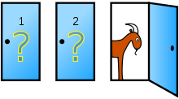

---
output:
  pdf_document: default
  html_document: default
---
# (PART) Doing Statistics {-} 

# What Is Randomness?

The previous chapters have shown the basics of tidying, transforming, and visualizing data using R and the tidyverse. Armed with these tools, this unit turns to how we can extract insights from our data. Key to this investigation is statistics and inherent to that is the notion of *randomness*. 

We use the word _random_ all the time on a regular basis. For instance, you may be familiar with the concept of *gachapon* or [loot boxes](https://en.wikipedia.org/wiki/Loot_box) in PC and mobile games which gives players a chance to obtain prized items using real-world currency. While they have recently [stirred up much controversy](https://doi.org/10.1371/journal.pone.0206767), the basic idea boils down to how to leverage *randomness*.  

We often speak of randomly picking a number between 1 and 100. If someone chooses the same number every time she enters such a situation, her choice is not random; once you have learned what she has chosen previously, you know what she will choose again. Therefore, anything generated by a systematic, predetermined, and deterministic procedure is not random.

If someone chooses her number according to some algorithm, the number she generates is not always the same.
However, if she chooses her number in a systematic manner, say the day of the month plus the minute of the hour showing on the clock of her smart watch, you can make a pretty good guess about how she will answer. 
Thus, her choices are *still* not random.

Randomness is something that defeats such guessing attempts.

We also may notice that there can be *levels* of randomness. We sometimes say "almost random", "very random", or "fairly random". When we use these words, we are probably thinking of an ideal randomness and how far the actions in question are from when they occur with the ideal randomness.

In this chapter, we explore randomness.

## Introduction 

We begin our study by learning how to generate random numbers using R. There are many functions that R has which involve random selection; one of these is called `sample()`. It picks one item at random from a list (i.e., vector), where the choice will likely occur at all positions. A prime example of randomness is tossing a coin with chance of heads 50% and chance of tails 50%. 

```{r}
fair_coin <- c("heads", "tails")
sample(fair_coin, size = 1)
```

Run the cell a few times and observe how the output changes. The unpredictable nature makes the code, though short, stand out from all the R code we have written so far. 

Note that the function has the form `sample(vector_name, size)`, where `vector_name` is the name of the vector from which we will select an item and `size` is how many items we want to select from the vector.

Here is another example: a football game ("American football" for non-US readers) begins each half by kicking a football from the 20-yard line of a team toward the goal of the opponent. The decision of which team gets to kick the ball is through a ritual that takes place three minutes prior to the "kick off". In the ritual, a referee tosses a coin and the visiting team calls "heads" or "tails".

If the visiting team calls correctly, the team gets to decide whether the team will kick or receive; otherwise, the home team makes the decision. Note that the ritual is somewhat redundant.

Suppose that the referee throwing the coin is not clairvoyant and has no powers to foretell "heads" or "tails" and that the coin is the same fair coin from our previous example. Then, the referee can simply throw the coin and make the visiting team kick the ball if the coin turns "heads" (or "tails" for what's its worth).

Thus, the action of choosing the team boils down to selecting from a two-element vector consisting of "kick" and "receive" with chance of 50% for each. 

```{r}
two_groups <- c("kick", "receive")
sample(two_groups, size = 1)
```

A nice feature of `sample` is that we can instruct it to repeat its element-choice action multiple times in sequence without influence from the outcome from the previous runs. For instance, we can select the kicking teams for 8 games. 

```{r}
sample(two_groups, size = 8, replace = TRUE)
```

Note that a third argument `replace` is specified here. By setting it to `TRUE`, we allow the same selection (say, `receive`) from the `two_groups` vector to be made more than once. We call this method sampling *with replacement*. In contrast, toggling this argument to be `FALSE` would make choices from the previous executions unavailable. We call this way sampling *without replacement*. R does this by default. 

What happens if the size of the vector is smaller than the number of repetitions? 

```{r error=TRUE}
sample(two_groups, size = 8)
```

There are not enough elements to choose from! 

Note that we have made an implicit interpretation of the code: we wrote the code assuming that it will tell the role that the visiting team will play at the kick off; that is, if the value the code generates is `kick` then the visiting team will kick and if it is `receive` they will receive. We must not mistake this interpretation. That is, the output the code produces is NOT the role the home team will play; it is for selecting the action of the *visiting* team. Implicit interpretations we make on the code often play an important role.

If the visiting team is very keen to start by kicking, we may choose to instead translate the outcome as `Yes` when it is `kick` and `No` otherwise. If we choose such a Yes/No interpretation, we view the random scheme producing `kick` as an "event" and interpret the output being `kick` as the event "occurring".

### Booleans and Generating Booleans with Comparisons

In data science (and also in computer science), we use the pair of values `TRUE` and `FALSE` to represent worlds of dichotomy, such as the world consisting solely of kicking the ball and receiving the ball.
The idea of using the two values to represent the worlds of dichotomy comes from the mathematician [George Boole](https://en.wikipedia.org/wiki/George_Boole). We honor his contribution and call the data with two possible values _Boolean_.

Digital computer systems employ bits as their information unit. Bits have only two values, 0 and 1.
By convention, we interpret 1 as `TRUE` and 0 as `FALSE`.

How can we generate Boolean values? An explicit way is to type its value in the code: `TRUE` and `FALSE`.
Another way is to use a comparison, e.g., "is a value equal to another" and "is a value greater than another"? For instance, `9` is not greater than `7 + 2`. 

```{r}
9 > 7 + 2
```

In the programming world, there is no single symbol for "not equal", "greater than or equal to", or "less than or equal to". These comparisons requires two characters: `!=`, `>=`, and `<=`. The table below shows the six comparisons and some examples.

```{r, message = FALSE, warning = FALSE, echo=FALSE}
library(tidyverse)
table <- tribble(~Comparison, ~Operator, ~True.Example, ~False.Example, 
                 "Less than", "<", "4 < 5", "4 < 4",
                 "Greater than", ">", "5 > 4", "4 > 4",
                 "Less than or equal", "<=", "4 <= 4", "5 <= 4",
                 "Greater or equal", ">=", "5 >= 5", "4 >= 5",
                 "Equal", "==", "4 == 4", "3 == 4",
                 "Not equal", "!=", "3 != 4", "3 != 3")
knitr::kable(table, col.names = gsub("[.]", " ", names(table)))
```

The use of `>` where you intend to use `>=` produces an unexpected result because of the difference in the result on boundary cases. Be careful!

### Comparing Strings

Like numbers we can compare strings with the usual six operations. The comparisons are case sensitive and subject to the dictionary order, where the alphabet contains not only the English alphabets but also the numerals and other symbols.

```{r}
print("Darth Vader" > "Dark Chocolate")
print("Bach" > "Back")
print("09:00 AM" > "Nine in the morning")
print("data science" < "Data Science")
print("abc" < "ABC" )
```

### Element-wise Comparison Between an Array and a Value

Recall that we can perform arithmetic operations on many numbers in a vector at once. For example: 

```{r}
c(0, 2, 3) * 2
```

This creates a new vector by multiplying each element by 2. This is equivalent to the vector `c(0, 4, 6)`.

In a similar manner, when we compare a vector and a value, R compares each element of the vector with the value we provide and produces a vector consisting of the results of the element-wise comparison. What we get back is a vector of Booleans. 

```{r, error = TRUE}
visiting_team <- c("kick", "receive", "receive", "kick", "kick")
visiting_team == "kick"
```

Exploiting the convention of interpreting `TRUE` as 1 and `FALSE` as 0, we can count the number of games where the visiting team kicks the ball. 

```{r}
sum(visiting_team == "kick")
```

## Conditional Executions

A major use of Boolean values in programming is to direct computation based on the value of a Boolean.
In other words, we can write code that has two choices for some part of its action where which of the two actions actually occurs depends on the value of the Boolean.

If we draw the choice-inducing Boolean value from random generation, say using `sample`, we can randomly select among possible actions. We call such an "action selection" based on the value of a Boolean _conditional execution_.

Using conditional execution, we can examine possible outcomes from a series of actions induced by random events. We will now turn to how to write conditional executions.

### The `if` statement

A program unit in a conditional execution is a *conditional statement*. A *conditional statement* is one that allows selection of an action from multiple possibilities. In R and in many other languages, we usually write a conditional statement as a multi-line statement. It is entirely possible to put everything in one, but such style is confusing and prone to errors. Therefore, it is strictly forbidden in CSC100 :-) 

Conditional statements usually reside inside a function. This allows us to express alternative behavior depending on argument values. 

In R, and in many programming languages, a conditional statement begins with an `if` header. What appears after the keyword is a pair of parentheses, in which a condition to examine appears. After the condition part appears an action to perform, which is a series of statements flanked by a pair of curly braces.

The syntax specifies that if the condition inside the pair of parentheses is true, the program executes the statements appearing in the ensuing pair of braces. We call a statement in this form an *if statement*.

Let us see our first example of an if statement, which is a function that returns the sign of a number.

```{r}
sign <- function(x) {
  if (x > 0) {
    return("positive")
  }
}
sign(3)
```

The function `sign` receives a number and returns a string representing the sign of the number.
Actually, the return value of the function exists only if the number is strictly positive; otherwise, the function does not return anything.

```{r}
print(sign(-3))
```

What is the boundary separating `positive` and nothing? We know that the condition is `x > 0` so we can say that the boundary is the point `0`, but `0` falls on the side that produces no return.

Can we make the return `positive` when x is equal 0? Sure can! 

```{r}
sign <- function(x) {
  if (x >= 0) {
    return("positive")
  }
}
sign(0)
sign(0.1)
print(sign(-0.1))  # force a print regardless whether the return value exists
```

We can put a series of conditional statements in a function. If a conditional statement contains a `return` statement and R executes that statement, R skips the remainder of the code in the function.

```{r}
sign <- function(x) {
  if (x > 0) {
    return("positive")
  }
  if (x < 0) {
    return("negative")
  }
}
sign(2)
sign(-2)
print(sign(0))  # force a print
```

Instead of saying "if `x` is less than 0, it is negative", it would be more natural to say "*otherwise*, if `x` is less than 0, it is negative". We can express "otherwise" using the keyword `else`. Let's revise the above code. 

```{r}
sign <- function(x) {
  if (x > 0) {
    return("positive")
  } else if (x < 0) {
    return("negative")
  }
}
sign(3)
sign(-3)
print(sign(0))  # force a print
```

What do we do about 0? By adding another `else if` block to the code, we can make the function return something in the case when the number is 0.

```{r}
sign <- function(x) {
  if (x > 0) {
    return("positive")
  } else if (x < 0) {
    return("negative")
  } else if (x == 0) {
    return("neither positive nor negative")
  }
}
```

```{r}
sign(0)
```

Since the condition `x == 0` is exactly the condition `x` satisfies when the execution reaches the second `else if` block, we can jettison the `if` and the condition. The resulting block is what we call an `else` block. 

```{r}
sign <- function(x) {
  if (x > 0) {
    return("positive")
  } else if (x < 0) {
    return("negative")
  } else {
    return("neither positive nor negative")
  }
}
```

```{r}
sign(0)
```

### The General Form

The keyword `else` means "otherwise" and the keyword `else if` is a combination of `else` and `if`.
We can stack up `else if` blocks after an initial `if` to define a series of alternative options.

```
if (<if expression>) {
    <if body>
} else if (<elif expression 0>) {
    <elif body 0>
} else if (<elif expression 1>) {
    <elif body 1>
...
} else {
    <else body>
}
```

Following are some notes to keep in mind:

* An `if`-block cannot begin with an `else` in the series.  
* There must exist one `if` clause.
* When a series of `else if` blocks appear after an `if`, this represents a series of alternatives. 
  We call this an `if` sequence. 
* An `if` without a preceding `else` begins a new `if` sequence.
* R scans all the conditions appearing in an `if` sequence takes an action when it finds a
  condition that evaluates to `TRUE`. All other actions before and after the matching one are ignored. 
* The `else` block is optional; it takes care of everything that does not have a match. 

We end this section with another example, this time comparing strings. 

```{r}
capitol <- function(x) {
  if (x == "Florida") {
    return("Talahassee")
  } else if (x == "Georgia") {
    return("Atlanta")
  } else if (x == "Alabama") {
    return("Montgomery")
  } else {
    return("oops, don't know where that is")
  }
}
```


```{r}
print(capitol("Florida"))
print(capitol("Massachusetts"))
print(capitol("Georgia"))
print(capitol("North Dakota"))
```

## Betting with Iteration

Let us now use conditional execution to simulate a simple betting game on a coin. However, unlike the fair coin from the kick-off we saw in football, this coin is slightly *biased*. Heads has a 55% chance of happening while tails has a 45% chance. Here is the coin:

```{r}
biased_coin <- c(0.55, 0.45)
```


Feeling lucky, you wager that you can make some money off this coin by betting on heads -- can we tell if your intuition is right? Let's find out! 

We imagine a function that will receive a string argument representing the side the coin is showing, and returns the result of the bet. If the coin shows up `heads` you get a dollar. But, if it shows `tails` you lose a dollar.

```{r}
one_flip <- function(x) {
  if (x == "heads") {
    return(1)
  } else if (x == "tails") {
    return(-1)
  } 
}
```

<!-- @JB: let's keep this as an exercise for them; Since a string may take a value other than the two we are anticipating as the possibilities, we may the program complete (or _overcomplete_, if you dare to say) by attaching the last `else` block. --> 

<!-- In this manner, the program returns one of 1, -1, and 0 given any argument.
The flow to determine the return value is: (a) check if `x` is equal to "Head", and if so, return 1 and terminate the execution of `one_flip`; (b) otherwise check if `x` is equal to "Tail", and if so, return -1 and terminate the execution of `one_flip`; (c) otherwise, return 0 and terminate the execution of `one_flip`. --> 

Let us see how the function works.

```{r}
c(one_flip("heads"), one_flip("tails"))
```

To play the game based on one flip of a coin, we can use `sample` again. This time, however, we pass the `biased_coin` vector as an argument specifying the probabilities of this (strange) coin.   

```{r}
sides <- c("heads","tails")
one_flip(sample(sides, prob = biased_coin, size = 1))
```

We can avoid having to create a `sides` variable by including the vector directly as an argument. 

```{r}
one_flip(sample(c("heads","tails"), prob = biased_coin, size = 1))
```

Now let us expand this and develop a multi-round betting game.

### A Betting Game Program

Previously, we split the game into two actions: a function computing the gain/loss and a program simulating one-round of the game using the gain/loss function. We now combine the two into one.

```{r}
betting_one_round <- function(x) {
  # Net gain on one bet
  x <- sample(c("Head","Tail"), prob = biased_coin, size = 1) # flip a fair coin once and record the side
  if (x == "Head") {
    return(-1)
  } else if (x == "Tail") {
    return(1)
  } 
}
```

Betting on one round is easy -- just call the function!

```{r}
betting_one_round()
```

You can run the code several times to see (a) the value is sometimes 1 and sometimes -1 and (b) the value is never 0.

How often do we get to see 1 and how often do we get to see -1?
Well, the program relies upon an equal possible selection between the two elements in the vector `c("Head","Tail"), and the selections result in 1 and -1, respectively.
We thus anticipate to see 1 as often as we see -1.
You can click the "Run" button a few times to and check, of the runs you have clicked, how many times you have seen 1.
The number of times you have seen -1 is the total number of clicks you have made minus the number of 1's.
You can then compare how big a difference the two numbers have between them.

That would be kind of cumbersome.

We can task R to take care of the cumbersome action.
We can instruct a computer program to repeat some action a number of times with a specific instruction with/without some round-specific information, such as, "for round X, use this information".
*Iteration* is the name we use to refer to repeating things with computer programs.
In R and in many other programs, a keyword that leads a code for *iteration* is `for`.
Also, *loop* is the word we use to refer to repeating a process.
So, a code that repeats a process with `for` as the header is a *for-loop*.
In R, the way to specify a for-loop is to say: "for each item appearing in the following sequence, starting from the first and towards its end, do this, as we illustrate in the next code.

```{r}
for (hand in c("rock", "paper", "scissors")) {
  print(hand)
}
```

```{r}
for (season in c("spring", "summer", "fall", "winter")) {
  print(season)
}
```

In the two programs, `hand` and `season` are the names we use to refer to the elements that the item iteration picks from the lists.
In other words, the first for-loop picks an item from the three-element sequence and we use the name `hand` to access the item.
The same deal is for the second for-loop.

Our present interest is in writing a program that repeats the betting game many times.
To repeat an action a number of times, we use a pair of numbers with a colon in between.
The expression is `X:Y`, where `X` represents the start and `Y` the end.
The expression represents the series of integers starting from `X` and ending with `Y`.
Here are some examples.
```{r, error=TRUE}
1:5
30:20
a = 18
b = 7
a:b
b:a
```

Wow!
R is so smart that when the second number is smaller than the first number, decreases the number by 1, instead of increasing it by 1.

Now we can use the sequence generation to write a for-loop.
Here is a one that prints 1 through 5.

```{r}
for (i in 1:5) {
  print(i)
}
```

Using this idea, we can repeat the 
```{r}
for (i in 1:10) {
  print(betting_one_round())
}
```

Note that the program `better_one_round()' is self-contained, meaning not requiring an argument, and so the code that R runs is identical among the ten iterations.
However, `betting_one_round` has `sample` that we embedded, and that introduces randomness in the execution, and therefore the results we see in the ten lines are not uniform and can be different each time we run the for-loop.

### Fetching the Outcomes

Having the program in the above a number of times, you may have wondered "the results of the ten runs disappear; is there a way to record them?"
The answer is in the positive, and it is not too complicated.
We create a series of empty boxes to store the results, where the series has the same length as the number of times we will run the betting, and then in the boxes, we will store the results one after another.


```{r}
num_rounds <- 10
outcomes <- vector("integer", num_rounds)  # create a vector with length num_flips
for (i in 1:num_rounds) {
  outcomes[i] <- betting_one_round()
}
```

```{r}
outcomes
```

This will do the job. The body of this `for` statement contains two actions: (1) run the betting function `betting_one)_round()`, and (2) store the result into `i`th slot of the `outcomes` vector. Both actions are executed for each item in the sequence `1:num_rounds`.

You may have noticed how cycling through the `outcomes` vector this way, individually assigning each element the result of one bet, can be cumbersome. If so, you would be in good company. The philosophy of R prefers to operate on vectors in whole, rather than in pieces as in the code we saw just above. In this way, we can eliminate the need for many common `for` statements. To demonstrate this, we introduce the idea of *maps* and *functionals*. 

### Maps and Functionals

*Your midterm asks you to write code to capitalize the elements in a character vector.* 

```{r}
some_characters <- c("b", "a", "N", "a", "N", "A", "!")
```

How can we do this with a computer? We know that the `toupper()` function can be used to capitalize a character (actually, it can do all of the work for us but let's not spoil the fun). We can try solving the problem using this function... 

```{r}
capitalized <- vector("character", length(some_characters))
capitalized[1] <- toupper(some_characters[1])
capitalized[2] <- toupper(some_characters[2])
capitalized[3] <- toupper(some_characters[3])
capitalized[4] <- toupper(some_characters[4])
capitalized[5] <- toupper(some_characters[5])
capitalized[6] <- toupper(some_characters[6])
capitalized[7] <- toupper(some_characters[7])
capitalized
```

This would earn full marks. But what if the vector given was bigger? There wouldn't be any time left to work on the other problems! One way out of this jam is to observe the repetition in the code we have just written. We just learned that `for` statements are useful for performing the same action multiple times. In a ray of brilliance, the following revised code is produced.

```{r}
my_upper_function <- function(x) {
  capitalized <- vector("character", length(x))
  for (i in 1:length(x)) {
    capitalized[i] <- toupper(x[i])
  }
  return(capitalized)
}
my_upper_function(some_characters)
``` 

Much better! Moving on, you realize the next question asks you to convert the characters in the vector to *lowercase*. Another dilemma -- the function we wrote only works for capitalization! We need another for converting to lowercase. In a haste, you come up the following.  

```{r}
my_lower_function <- function(x) {
  lowered <- vector("character", length(x))
  for (i in 1:length(x)) {
    lowered[i] <- tolower(x[i])
  }
  return(lowered)
}
my_lower_function(some_characters)
``` 

Does this do the job? Yes. Full marks? Not a chance! We did not learn our lesson from last time: there is repetition in the code again! Besides name changes, a brand new function was written to make only one change: adjust the `toupper()` function call to `tolower()`. Moreover, there is ample room for introducing mistakes. If you were writing this on a computer and copy-and-pasting your capitalization code, it is all too easy to forget changing `toupper()` to `tolower()`, especially if we needed to call these functions more than once.       

The better approach here is to leverage the power of R and make use of *functionals*. Instead of writing two separate functions, recycle one function and pass it an additional *functional* argument. That is, 

```{r}
my_map_function <- function(x, func) {
  transformed <- vector("character", length(x))
  for (i in 1:length(x)) {
    transformed[i] <- func(x[i])
  }
  return(transformed)
}
```

We can call this new function by passing in the same vector `some_characters` and a functional argument `func` that will be either `tolower()` or `toupper()`. 

```{r}
my_map_function(some_characters, toupper)
my_map_function(some_characters, tolower)
```

By passing in different functional arguments, we are effectively transforming this *generalized* function into the lower and uppercase versions in our first draft. The grader is sure to be content with this solution (as well as the R gurus :-). 

The idea of passing a function to another function is an extremely powerful idea. However, the careful reader would beg to differ: how can this be used to *eliminate* writing `for` statements?  

To this end, we will make use of the [purrr](https://github.com/rstudio/cheatsheets/blob/master/purrr.pdf) package available in tidyverse, which provides many functions that can be used to replace common `for` statements. The goal of using `purrr` functions is to break up common list manipulation challenges into smaller pieces by solving first the problem for a single element in the vector. From this, we can build up solutions to more complex problems. 

The main construct we will be using from `purrr` is the *map*. The `my_map_function()` we just wrote is one such example of a map: it applies a function (in this case, `toupper()` or `tolower()`) to each element of a vector or list. `purrr` offers many flavors of map, depending on what the output vector should look like: 

* `map_lgl()` outputs a logical vector.
* `map_int()` outputs an integer vector.
* `map_dbl()` outputs a double vector.
* `map_chr()` outputs a character vector.
* `map()` outputs a list.

We could easily have replaced our `my_map_function()` with a `purrr` version. 

```{r}
map_chr(some_characters, toupper)
map_chr(some_characters, tolower)
```

Here are some more examples of using map. Note how we can define a function and pass it in on the spot. We call these *anonymous functions*. The following is an *identity function*: it simply outputs what it takes in. 

```{r}
map_int(1:5, function(x) x)
```

> A catch here is that the code after the comma, i.e., `function(x) x` specifies *in place* the function to apply to each element of the series preceding the comma `1:5`. The function in question `function(x) x` specifies that the function will receive a value named `x` and *returns* the value of `x` without modification. Thus we call it an identity function. The external function `map_int` states that the result of applying the identify function thus specified with `function(x) x` to each element of the sequence `1:5` will be presented as an integer.

The next one is perhaps more useful than the identify function. It computes the square of each element, i.e., $x^2$. 

```{r}
map_dbl(1:5, function(x) x ** 2)
```

> __Why use map_dbl() instead of map_int()?__ By default, R treats numbers as doubles. While `1:5` is a vector of integers, each element is subject to the expression `x ** 2`, where `x` is an integer and `2` is a double. To make this operation compatible, R will "promote" `x` to a double, making the output of this expression a double as well.  

The next one will always return a vector of 5's, regardless of the input. Can you see why? Do you also see why there are six elements, unlike five elements in the previous examples?

```{r}
map_dbl(1:6, function(x) 5)
```

While map eliminates the need to write `for` statements in common situations, keep in mind that R internally must still perform a `for` loop, i.e., the code for map contains a `for` loop and it is not directly visible to those who use map. Therefore, the chief benefit of using constructs like map is not for its speed, but clarity: it is much easier to read and write (once you wrap your head around it :-).

We now have all the pieces we need to take on the die roll simulation. 

### Example: Betting on 10 Coin Tosses (revisited)

Let's recall the code we wrote earlier to perform the simulation.

```{r}
num_rounds <- 10
outcomes <- vector("integer", num_rounds)  # create a vector with length num_roundds
for (i in 1:num_rounds) {
  outcomes[i] <- betting_one_round()
}
```

Using what we have learned about map, we can rewrite this simulation to just two lines. 

```{r}
num_rounds <- 10
outcomes <- map_dbl(1:num_rounds, betting_one_round)
```

```{r}
outcomes
```

Note how the input vector `1:num_rounds` serves as a placeholder here. Meaning, the values in this vector do not matter as they will be overwritten with the results from the bet; only the length of the vector is important. 

We can use `sum()` to count the number of times money changed hands.

```{r}
sum(outcomes)
```

### Example: Betting on 300 Tosses

Iteration using maps is a powerful technique. For example, we can see the variation in the results of 300 bets by running exactly the same code for 300 bets instead of five.

```{r}
num_rounds <- 300
outcomes <- map_dbl(1:num_rounds, betting_one_round)
```

The vector `outcomes` contains the results of all 300 bets.

```{r}
length(outcomes)
```

To see how often the two different possible results appeared, we can create a tibble from `outcomes` and then use `ggplot2`.

```{r dpi=80,  fig.align="center", message = FALSE}
outcome_df <- tibble(outcomes)
ggplot(outcome_df, aes(x = outcomes)) + 
  geom_bar() + 
  coord_flip()
```

Not surprisingly, each of the two outcomes -1 and 1 appeared about about 150 of the 300 times, give or take. We will examine the "give or take" amounts more closely in later chapters.

## Simulation

Simulation, in data science, refers to the use of computer programs to imitate a physical process.
Sometimes we call it "computer simulation" to articulate that the a computer is the do-er of the simulation.
A simulation consists of multiple steps.
The first step is to figure out which part of the physical process we want to imitate using computation and decide how we will represent the part numerically.
The second step is to figure out how to generate values for the numerical representation from the first step using a computer program.
If some numbers require updates during the imitation procedure, we will figure out how we will update them.
Also, we often need to incorporate "chances" in the imitation procedure.
Think of the famous the story of a king awarding a minister with doubling amount of grains.
There are many versions of the story, but the gist is like this:
<!-- Please add some formatting -->
One day a king has decided to award a minister for his great work.
The kind asks, "Great work, what do you want from me as a reward? You name it, I will make you wish come true."
The minister says, "Your Majestry, what an honor! If you are so kind as to indulge me, may ask to receive grains of rice on a board chess. We will start with one grain on a space on the board, given one day. The next day, I would like two grains on the next space. The following day, I would like four grains on the third space. Each day, I would like twice as many grains as you have given me on the previous day. In this manner, for the next 64 days, you would be so generous to give me grains of rice. Would that be too imposing to ask?"
The king says, "You ask so little. That would be so easy to do. Of course, this great King will grant you your request."

The question is how many grains of rice will this minister would receive at the end of the 64 day period?

We know the answer to the question.
The daily amount doubles each day starting from 1.
He would thus receive:
\[
1 + 2 + 4 + 8 + \cdots + 2^{63}
\]
This quantity is equal to $2^{64} - 1$.
Why? Suppose he has one more grain in his pocket to add to the piles at the end of the 64th day.
We have
\[
1 + 1 + 2 + 4 + 8 + \cdots + 2^{63} - 1
\]
as the same total amount.
The first two occurrences of 1 are equal to 2. So we can simplify the sum as
\[
2 + 2 + 4 + 8 + \cdots + 2^{63} - 1
\]
We have got rid of the twos.
By joining the first two 2's, we get
\[
4 + 4 + 8 + \cdots + 2^{63} - 1
\]
At the end of calculation, we get to
\[
2^{63} + 2^{63} - 1
\]
and this is equal to $2^{64}-1$, which is by the way an obscenely large number.
We know the story as a fable that tells us we must think before promising something, and the assume that the story took place hundreds of years ago, where there were no computers.
For the king to provide the grains he had promised to give to the minister, he would have ordered a clerk to do the calculation.
If the clerk is super-human, her calculation would be perfect, and so the total amount she would provide exactly what we had anticipated.
But, hey, she is human, and the humans are to err.
In the process of writing down numbers, they may be various errors, such as skipping a digit or writing a wrong digit.
If she does not notice an error, the minister would get a different error at the end of the 64 days.
Suppose we want to mimic the process of her calculation using a computer, with the chance factor in mind.
This is where "randomness" comes in to play.

The third process of simulation is to run the simulation program and develop insights from the result, possibly using visualization.

Note that we have followed these steps in our 300 coin tosses experiment.
What we did in the development of the code is:
* Create a "repetitions sequence," that is, a sequence whose length is the number of repetitions you specified in Step 3. For n repetitions we will almost always use the sequence `1:n`.

* Create an "experiment" function to simulate one value based on the code we developed.

* Create a `map` where the first argument is the repetition sequence and the 
second argument is the experiment function to simulate one value. 
  * Choose the correct map function depending on the resulting data type.
  * Store the resulting to a variable. We call this the "outcomes" vector.
  * A general format takes the form: `outcomes <- map_*(1:n, experiment_func)`

That's it! Once you have carried out the steps above, your simulation is done. The outcomes vector contains all the simulated values.

At this point you can use the outcomes vector as you would any other vector. You can visualize the distribution of the simulated values, count how many simulated values fall into a particular category, and so on.

### Difference Between the Number of Heads and the Number of Tails in 100 Coin Tosses

Let us now return to the coin tosses.
As we see powers of 10 as the easiest kind of numbers to deal with, let us back down from 300 to 100.
If the coin is fair, we anticipate a half of the tosses we make is "Head".
The program we have written receives as the number of repetitions, and returns a vector representing the results of the simulated coin tosses with an added interpretation of "Head" as 1 and "Tail" as -1.
We can go back to the process of flopping a coin and develop an insight as to when we flip a coin 300 times, how the number of "Heads" is likely to look.

In this example we will simulate the number of heads in 300 tosses of a coin. The histogram of our results will give us some insight into how many heads are likely.

Let's get started on the simulation, following the steps above.

### Step 1: Determining What We Want to Simulate

We want to simulate the process of tossing 300 fair coins, where each coin toss generates "Head" or "Tail" as the outcome.
There is only one number we are interested in the physical process - the number of "Heads".

### Step 2: Figuring our How to Make a Computer Program to Run the Simulation

Now we know that we want to know the number of "Heads" in 100 coin tosses, we have to figure out how to make one set of 100 tosses and count the number of heads. Let's start by creating a coin.
We eliminate the gain/loss calculation from the previous program in the ensuing simulation program.
We start by stating the two possible outcomes of toss.
What we define is a two-element vector, as before, and we call it `sides`.

```{r}
sides <- c("Heads", "Tails")
sides
```

We use `sample()` to sample from the two-element vector.
Recall that we can specify the number of samples and if we want to replenish the array with the item that the sample has chosen.
The code below shows how we sample from `sides` 8 times with "replenishment".

```{r}
tosses <- sample(sides, size = 8, replace = TRUE)
tosses
```

We can count the number of heads by using `sum()` as before:

```{r}
sum(tosses == "Heads")
```

Our goal is to simulate the number of heads in 100 tosses.
We have only to replace the 8 with 100 and then apply `sum` with the argument checking whether the element is equal to "Heads".

```{r}
outcomes <- sample(sides, size = 100, replace = TRUE)
num_heads <- sum(outcomes == "Heads")
num_heads
```

Play with the code a few times to see how close the number gets to the expected one half, 150.

```{r}
one_trial <- function(x) {
  outcomes <- sample(sides, size = 100, replace = TRUE)
  num_heads <- sum(outcomes == "Heads")
  return(num_heads)
} 
```

You can simply call this function to generate an outcome of one experiment.

```{r}
one_trial(x)
```

### Step 3: Running a Simulation

We have programmed `one_trial` so that it executes 100 coin tosses and returns the number of "Heads".
We can use a for-loop to repeat `one_trial` as many times we want.
Here we face a critical question, "for our goal of developing an insight about coin tosses, how many times do we want to repeat it?"
Since R is pretty fast at running the code for `one_trial`.
We can easily run the code 10,000 times.
To do that, we use the map.

```{r}
# Number of repetitions
num_repetitions <- 10000

# simulate the experiment!
heads <- map_dbl(1:num_repetitions, one_trial)

# That's it! The simulation is done.

```

By executing `heads` after this produces all elements of `heads `.
That will be a lot of lines on the scree, so you may not want to do it!
Instead, we can ask `heads` how many elements it has, using the `length` function we have seen before.

```{r}
length(heads)
```

Aha! It has the desired number of elements.
We can peek at some of the elements in the vector.

```{r}
heads[1]
heads[2]
```

Now using `tibble` we can collect the results as a table.
Recall that `tibble` needs the index values and the data.

```{r}
results <- tibble(
  repetition = 1:num_repetitions,
  num_heads = heads
)
```

```{r}
results
```

```{r dpi=80, fig.align="center", message = FALSE}
ggplot(results) + 
  geom_histogram(aes(x = num_heads, y = ..density..), breaks = seq(30.5, 69.6, 1))
```

In this histogram, each bin has width 1 and we place it centered on the value.
For example, the vertical bar on 50 is the number of times the simulation generated 50 as the result.
We see that the histogram looks symmetric with 50 as the center, which is a good sign.
Why?
Our expectation is that the number 50 is the ideal number of "Heads" in 100 tosses of a fair coin.
If the coin is fair, for all number $d$, the event that we see $50-d$ "Heads" is as likely to happen as the event that we see $50+d$ Heads.
The symmetry that we observe confirms the hypothesis.
We also see that about 8% (i.e., 0.08 on the y-axis) of the simulation results produced 50.
Furthermore, we see that very few times we see occurrences of numbers less than 35 or greater than 65.
We thus conclude from the experiment that the range of thew number is likely to reside in the rnage [35,65].

<!--
### Moves in Monopoly

Each move in the game Monopoly is determined by the total number of spots of two rolls of a die. If you play Monopoly, what should you expect to get when you roll the die two times?

We can explore this by simulating the sum of two rolls of a die. We will run the simulation 10,000 times as we did in the previous example. Notice that is this paragraph we have completed Steps 1 and 3 of our simulation process.

Step 2 is the one in which we simulate one pair of rolls and add up the number of spots.

```{r}
pair_of_rolls_experiment <- function(x) {
  dice <- 1:6
  num_spots <- sum(sample(dice, size = 2, replace = TRUE))
  return(num_spots)
} 
```

```{r}
pair_of_rolls_experiment()
```

That simulates one value of the sum of two rolls. We are now all set to run the simulation according to the steps that are now familiar.

```{r}
num_repetitions <- 10000

moves <- map_dbl(1:num_repetitions, pair_of_rolls_experiment)
```

Here is a histogram of the results.

```{r dpi=80, fig.align="center", message = FALSE}

results <- tibble(
  repetition = 1:num_repetitions,
  sum_of_two_rolls = moves
)

ggplot(results) + 
  geom_histogram(aes(x = sum_of_two_rolls, y = ..density..), color = "gray",
                 breaks = seq(1.5, 12.6, 1))
```

Seven is the most common value, with the frequencies falling off symmetrically on either side.

-->

## The Birthday Paradox

The *Birthday Paradox* states that if 23 people are in a room, the chances are 50:50 that there are two people among the 23 who have the same birthdays.
There are 365 days in a year.
How come is it possible for just 23 people to find two among them having the same birthdays?

We answer the question first by analysis.

Assume that we will consider only a non-leap year (that is, no February 29th) and each of the 365 birthdays are likely to occur in a person.
Since each birthday is likely to occur as any other birthday, we can look at the question at hand by counting the number of possible birthday combinations.
We have 23 people in the room.
Each person gets to choose her birthday freely without considering the birthdays of other 22 people.
The 23 people make their choices and then check whether the choices fall into one of the no-duplicate selections.

With no restriction, the number of possible choices of birthdays for the 23 people is
\[
365^{23}
\]
These possibilities contain the cases where a birthday coincindence occurs.

In comparison, the number of possibilities for selecting 23 birthdays so that no two are equal to each other requires a bit complicated analysis.
We can view the counting problem using the following hypothetical process.
The 23 people in the room will pick their birthdays in order so that there will be no duplicates.
The first person has complete freedom in her choice.
She chooses one from the 365 possibilities.

The next person has almost complete freedom.
She can pick any birthday but the one the first person has chosen.
There are 364 possibilities.

The third person has again almost complete freedom.
She can pick any birthday but the ones the first two persons have chosen.
Since the first two people picked different birthdays.
There are 363 possibilities.

We can generalize the action.
The $k$-th person has $365 - k + 1$ choices.

By combining all these for the 23 people, we have that the number of possibilities for chosing all-distinct birthdays is
\[
365 \cdot 364 \cdot 363 \cdot \cdots \cdot 353.
\]
Thus, the chances for the 23 people to make the selections so there are no duplicates are thus
\[
(365 \cdot 364 \cdot 363 \cdot \cdots \cdot 343) / 365^{23}.
\]
Moving terms, we get that the chances are
\[
\frac{365}{365} \cdot \frac{364}{365} \cdots \frac{343}{365}.
\]
The quantity is approximately 0.4927.
The chances we find a duplicate are 1 minus this quantity, which is approximately 0.5073.
Pretty interesting, isn't it?

The second method, an alternative to analyzing mathematically, is to use simulation.
We can mimic the process of selecting 23 birthdays independently from each other.
We start by generating a vector having length 365 whose elements represent the birthdays.
Naturally, we assign numbers 1 through 365 to the birthdays, create the following vector.

```{r}
base <- vector("integer", 365)
for (i in 1:365) {
  base[i] = i
}
base 
```

As you can see the 365 elements of the vector are 1 through 365.

Next, using `sample` we draw 23 random values from the vector.

```{r}
chosen <- sample(base, size=23, replace=TRUE)
chosen 
```

We then check whether there are any duplicates in it.
One way to do the checking is to reorder the elements so the numbers appear in the non-decreasing order and then examine whether any two neighboring numbers are equal to each other.
The code for doing the check is this.
We can accomplish the task of reordering using the function `sort`.
The code reorders `chosen`, stores the result of reordering in another vector `sorted`, and then for each `i` in the range [1,22], check whether the element at position `i` is equal to its next element. 


```{r}
sorted <- sort(chosen)
for (i in 1:22) {
  if (sorted[i] == sorted[i+1]) print("identical")
} 
```

 We can encapsulate the idea as a pair of functions. The first one is to generate samples and the other is to perform the check.
 The first function `generate_birthdays` takes the number of peopls as its argument `x`.
Calling `generate_birthdays(23)` produces an array of 23 random birthdays.
Note that we use the argument `x` in the execution of `sample`, where `x` appears in `size=x`. 

```{r}
generate_birthdays <- function(x) {
  base <- vector("integer", 365)
  for (i in 1:365) {
    base[i] = i
  }
  chosen <- sample(base, size=x, replace=TRUE)
  return(chosen)
} 
```

The duplicate checking function receives an argument, which it expects to be a vector.
It sorts the argument and stores it in `y`.
It obtains `l` as the number of elements in `x` minus 1.
Since `x` and `y` have identical lengths, `l` is also the number of elements in `y` minus 1.
Then the program iterates over the sequence `1:l` using an item index `i` to compare the values at position `i` and `i+1`.
Since we need to examine the position `i+1` for each value of `i`, the maximum value we want to assign to `i` is the length of the sequence minus 1, and that is the reason we subtract one when calculating the value for `l`.
During the iteration, each time the program encounters a pair of identical values, it adds 1 to `num_duplicates`.
The program initially stores 0 to `num_duplicates`, and so when the loop completes, the value of `num_duplicates` is equal to the number of times it encountered an identical pair.

```{r}
check_duplicate <- function(x) {
  y <- sort(x)
  l <- length(x) - 1
  num_duplicates <- 0
  for (i in 1:l) {
    if (y[i] == y[i+1]) num_duplicates = num_duplicates + 1
  }
  return (num_duplicates)
} 
```

The function returns the number of pairs.
If there is a trio of people having the same birthdays and no other duplicate, the return value is 2.
If there distinct pairs having the same birthdays, the return value is still 2.


```{r}
birthdays <- generate_birthdays(30)
print(check_duplicate(birthdays))
```

If we want to compute the number of people with unique birthdays, we need a bit different calculation, which can be a bit more complex.
For now, we will just need to know whether `num_duplicates` is 0 or not, and so we will not worry about it.
The above calculation using iteration is a bit cumbersome.
Fortunately, there is a way to obtain the number of unique values appearing in a vector.
The method is `unique`.
It receives a vector and returns the unique number of elements in it.
We thus start by writing a code for generating the result of one experiment with a number of people as an argument. 

<!--
```{r}
one_birthday_trial <- function(x) {
  birthdays <- generate_birthdays(x)
  y <- sort(birthdays)
  l <- length(birthdays) - 1
  num_duplicates <- 0
  for (i in 1:l) {
    if (y[i] == y[i+1]) num_duplicates = num_duplicates + 1
  }
  return (num_duplicates)
} 
```
-->

```{r}
one_birthday_trial <- function(x) {
  birthdays <- generate_birthdays(x)
  return(x - length(unique(birthdays)))
} 
```

The function `one_birthday_trial` generates a random birthday sequence of length `x` and then return `x` minus the length of the `unique` version of the birthday sequence.

```{r}
one_birthday_trial(23)
```

We generate 10000 simulations and store the results in a vector.
Since the value `one_birthday_trial` returns is a nonnegative integer, we create its simplified version, where we reduce all positive values to 1 and retain 0 as 0.

```{r}
many_trials <- function(x) {
  # Number of repetitions
  num_repetitions <- 100
  results <- vector("integer",num_repetitions)
  resultsSimple <- vector("integer",num_repetitions)

  # simulate the experiment!
  for (i in 1:num_repetitions) {
    results[i] <- one_birthday_trial(x)
    if (results[i] > 0 ) resultsSimple[i] <- 1
    else resultsSimple[i] <- 0
  }
  return(sum(resultsSimple)/num_repetitions)

}
```


The return statement of the program comutes the proportion of the trials that generated duplicates.
Run a few times to see how the ratios the program prints are close to the ideal 0.5073.


```{r}
many_trials(23)
```

We run `many_trials(23)` a number of times and generate a histogram.

```{r dpi=80,  fig.align="center", message = FALSE}
num_reps <- 1000
outcomes <- vector("double",num_reps)
for (i in 1:num_reps) {
  outcomes[i] <- many_trials(23)
}
outcome_df <- tibble(outcomes)
ggplot(outcome_df, aes(x = outcomes)) + 
  geom_bar() + 
  coord_flip()
```
We see that the histogram looks symnmetric and centered around 0.51.

<!--

## The Monty Hall Problem

This [problem](https://en.wikipedia.org/wiki/Monty_Hall_problem) has flummoxed many people over the years, [mathematicians included](https://web.archive.org/web/20140413131827/http://www.decisionsciences.org/DecisionLine/Vol30/30_1/vazs30_1.pdf). Let's see if we can work it out by simulation.

The setting is derived from a television game show called "Let's Make a Deal". Monty Hall hosted this show in the 1960's, and it has since led to a number of spin-offs. An exciting part of the show was that while the contestants had the chance to win great prizes, they might instead end up with "zonks" that were less desirable. This is the basis for what is now known as the *Monty Hall problem*.

The setting is a game show in which the contestant is faced with three closed doors. Behind one of the doors is a fancy car, and behind each of the other two there is a goat. The contestant doesn't know where the car is, and has to attempt to find it under the following rules.

* The contestant makes an initial choice, but that door isn't opened.

* At least one of the other two doors must have a goat behind it. Monty opens one of these doors to reveal a goat, displayed in all its glory in [Wikipedia](https://en.wikipedia.org/wiki/Monty_Hall_problem):

```{r, echo=FALSE, fig.align="center", fig.asp=1/2}

```

* There are two doors left, one of which was the contestant's original choice. One of the doors has the car behind it, and the other one has a goat. The contestant now gets to choose which of the two doors to open.

The contestant has a decision to make. Which door should she choose to open, if she wants the car? Should she stick with her initial choice, or switch to the other door? That is the Monty Hall problem.

### Prerequisites

As usual, we will make use of the tidyverse. 

```{r, message = FALSE, warning = FALSE}
library(tidyverse)
```

### The Solution

In any problem involving chances, the assumptions about randomness are important. It's reasonable to assume that there is a 1/3 chance that the contestant's initial choice is the door that has the car behind it.

The solution to the problem is quite straightforward under this assumption, though the straightforward solution doesn't convince everyone. Here it is anyway.

* The chance that the car is behind the originally chosen door is 1/3.
* The car is behind either the originally chosen door or the door that remains. It can't be anywhere else.
* Therefore, the chance that the car is behind the door that remains is 2/3.
* Therefore, the contestant should switch.

That's it. End of story.

Another way of viewing the problem is as follows. For simplicity, suppose that the contestant has chosen Door 1. The car can be behind Door 1, Door 2, or Door 3, each of the three possibility event occurring with 1/3 of chance.

* Suppose that the car is behind Door 1. Monty may open either Door 2 or Door 3. Either way, by switching the choice, the contestant loses.
* Suppose that the car is behind Door 2. Monty is forced to open Door 3. By switching the choice, the contestant wins.
* Suppose that the car is behind Door 3. Monty is forced to open Door 2. By switching the choice, the contestant wins.
* Thus, if the contestant switches the door  after Monty's revealing a goat behind a door not chosen, the chance that she wins is 2/3. Also, if she chooses to keep her original choice, the chance that she wins is 1/3. 

Not convinced? Then let's simulate the game and see how the results turn out.

### Simulation

The simulation will be more complex that those we have done so far. Let's break it down.

#### Step 1: What to Simulate {-#my-step1}

For each play we will simulate what's behind all three doors:

* the one the contestant first picks
* the one that Monty opens
* the remaining door

So we will be keeping track of three quantities, not just one.

#### Step 2: Simulating One Play {-#my-step2}

The bulk of our work consists of simulating one play of the game. This involves several pieces.

__The Goats__ 

We start by setting up a vector `goats` that contains unimaginative names for the two goats.

```{r}
goats <- c("goat1", "goat2")
```

To help Monty conduct the game, we are going to have to identify which goat is selected and which one is revealed behind the open door. The function `other_goat` takes one goat and returns the other.

```{r}
other_goat <- function(x) {
  if (x == "goat1") {
    return("goat2")
  } else if (x == "goat2") {
    return("goat1")
  }
} 
```

Let's confirm that the function works.

```{r}
other_goat("goat1")
other_goat("goat2")
print(other_goat("goose"))
```

The string `"goose"` is not the name of one of the goats, so when `"goose"` is the input then the function does nothing and returns NULL.

__The Options__

The vector `hidden_behind_doors` contains the set of things that could be behind the doors.

```{r}
hidden_behind_doors <- c("goat1", "goat2", "car")
```

We are now ready to simulate one play. To do this, we will define a function `monty_hall_game` that takes no arguments. When the function is called, it plays Monty's game once and returns a list consisting of:

* the contestant's guess
* what Monty reveals when he opens a door
* what remains behind the other door

The game starts with the contestant choosing one door at random. In doing so, the contestant makes a random choice from among the car, the first goat, and the second goat.

If the contestant happens to pick one of the goats, then the other goat is revealed and the car is behind the remaining door.

If the contestant happens to pick the car, then Monty reveals one of the goats and the other goat is behind the remaining door.

```{r}
monty_hall_game <- function(x) {
  # Returns (contestant's guess, what Monty reveals, what remains behind the other door)
  pick <- sample(hidden_behind_doors, size = 1) 
  if (pick == "goat1") {
    return(c(pick, "goat2", "car"))
  } 
  
  if (pick == "goat2") {
    return(c(pick, "goat1", "car"))
  } 
  
  if (pick == "car") { 
    revealed <- sample(goats, size = 1)
    return(c(pick, revealed, other_goat(revealed)))
  }
}
```

Let's play! Run the function several times and see how the results change.

```{r}
monty_hall_game()
```

#### Step 3: Number of Repetitions {-#my-step3}

To gauge the frequency with which the different results occur, we have to play the game many times and collect the results. Let's run 10,000 repetitions.

#### Step 4: Coding the Simulation {-#my-step4}

It's time to run the whole simulation.

We will play the game 10,000 times and collect the results in a vector called `games` using the map construct. However, our application of map this time is not as straightforward. That is, the experiment function `monty_hall_game()` returns a character vector of size 3, where each element is a string. So far the experiment functions we have seen have returned vectors of size 1. 

We can overcome this complexity by using a more general version of `map` which behaves exactly the same way, but returns a *list* rather than a vector. Let's run the simulation first; we'll take care of the output afterward.  

```{r}
num_repetitions <- 10000
games <- map(1:num_repetitions, monty_hall_game)
```

The simulation is done. It would be best to transform `games` into a table which makes it easier to analyze and visualize the results. Let's first inspect some elements inside `games`.  

```{r}
games[[1]]
games[[2]]
games[[3]]
```

Each element of this list contains one game play, represented by a character vector. That character vector has 3 elements: (1) the guess, (2) the door Monty reveals, and (3) the remaining door. We can use another map to extract each piece, i.e., taking the first element of each character vector in the list will give us all the guesses, the second all the revealed doors, and so on. This will directly form a column of data for our table. 

Let's try this first for the guess column. Note how the functional here returns the first element of each vector in the list. 

```{r}
guess_column = map_chr(games, function(x) x[1])
head(guess_column)
```

Let's do this for the other two columns. 

```{r}
revealed_column = map_chr(games, function(x) x[2])
remaining_column = map_chr(games, function(x) x[3])
```

We are now ready to present the results of the simulation in a tibble called `game_results`. Each row of the table will contain the result of one play of Monty's game. Notice that we have chosen the order of the columns to be the same as the order in which `monty_hall_game()` returns the result of one game.

```{r}
game_results <- tibble(
  guess = guess_column,
  revealed = revealed_column,
  remaining = remaining_column
)
game_results
```

### Visualization

To see whether the contestant should stick with her original choice or switch, let's see how frequently the car is behind each of her two options.

```{r}
original_choice <- game_results %>% 
  group_by(guess) %>%
  count() %>%
  mutate(which_door = "original")
original_choice
```

```{r}
remaining_doors <- game_results %>% 
  group_by(remaining) %>%
  count() %>%
  mutate(which_door = "remaining")
remaining_doors
```

As our earlier solution said, the car is behind the remaining door two-thirds of the time, to a pretty good approximation. The contestant is twice as likely to get the car if she switches than if she sticks with her original choice. 

To see this graphically, we can "stick" these two tables together and draw a stacked bar chart.

```{r}
original_choice <- original_choice %>% rename(item = guess)
remaining_doors <- remaining_doors %>% rename(item = remaining)
stuck_together <- bind_rows(original_choice, remaining_doors)
stuck_together
```

```{r dpi=80,  fig.align="center", message = FALSE}
ggplot(stuck_together, aes(x = item, y = n, fill = which_door)) + 
  geom_bar(position="dodge", stat = "identity") + 
  coord_flip()
```

Notice how the three reddish bars are almost equal  the original choice is equally likely to be any of the three available items. But the cyan bar corresponding to `Car` is twice as long as the red.

The simulation confirms that the contestant is twice as likely to win if she switches!

## Finding Probabilities 

Over the centuries, there has been considerable philosophical debate about what probabilities are. Some people think that probabilities are relative frequencies; others think they are long run relative frequencies; still others think that probabilities are a subjective measure of their own personal degree of uncertainty.

In this course, most probabilities will be relative frequencies, though many will have subjective interpretations. Regardless, the ways in which probabilities are calculated and combined are consistent across the different interpretations.

By convention, probabilities are numbers between 0 and 1, or, equivalently, 0% and 100%. Impossible events have probability 0. Events that are certain have probability 1.

Math is the main tool for finding probabilities exactly, though computers are useful for this purpose too. Simulation can provide excellent approximations, with high probability. In this section, we will informally develop a few simple rules that govern the calculation of probabilities. In subsequent sections we will return to simulations to approximate probabilities of complex events.

We will use the standard notation $P(event)$ to denote the probability that "event" happens, and we will use the words "chance" and "probability" interchangeably.

### Prerequisites

As usual, we will make use of the tidyverse. 

```{r, message = FALSE, warning = FALSE}
library(tidyverse)
```

### When an Event Doesn't Happen 

If the chance that event happens is 40%, then the chance that it doesn't happen is 60%. This natural calculation can be described in general as follows:

\[ P(\text{an event doesn't happen}) = 1 - P(\text{the event happens})\]

### When All Outcomes are Equally Likely

If you are rolling an ordinary die, a natural assumption is that all six faces are equally likely. Then probabilities of how one roll comes out can be easily calculated as a ratio. For example, the chance that the die shows an even number is

\[ \frac{\text{number of even faces}}{\text{number of all faces}} = \frac{\#\{2,4,6\}}{\#\{1,2,3,4,5,6\} } = \frac{3}{6}\]

Similarly, 

\[ P(\text{die shows a multiple of 3}) = \frac{\#\{3, 6\}}{\#\{1,2,3,4,5,6\} } = \frac{2}{6}\]

In general,

\[ P(\text{an event happens}) = \frac{\#\{\text{outcomes that make the event happen}\}}{\#\{\text{all outcomes}\} }\]

provided all the outcomes are equally likely.

Not all random phenomena are as simple as one roll of a die. The two main rules of probability, developed below, allow mathematicians to find probabilities even in complex situations.

### When Two Events Must Both Happen 

Suppose you have a box that contains three tickets: one red, one blue, and one green. Suppose you draw two tickets at random without replacement; that is, you shuffle the three tickets, draw one, shuffle the remaining two, and draw another from those two. What is the chance you get the green ticket first, followed by the red one?

There are six possible pairs of colors: RB, BR, RG, GR, BG, GB (we've abbreviated the names of each color to just its first letter). All of these are equally likely by the sampling scheme, and only one of them (GR) makes the event happen. So

\[ P(\text{green first, then red}) = \frac{\#\{\text{GR}\}}{\#\{\text{RB, BR, RG, GR, BG, GB}\} } = \frac{1}{6}\]

But there is another way of arriving at the answer, by thinking about the event in two stages. First, the green ticket has to be drawn. That has chance $1/3$, which means that the green ticket is drawn first in about $1/3$ of all repetitions of the experiment. But that doesn't complete the event. *Among the 1/3 of repetitions when green is drawn first*, the red ticket has to be drawn next. That happens in about $1/2$ of those repetitions, and so:

\[ P(\text{green first, then red}) = \frac{1}{2} \text{ of } \frac{1}{3} = \frac{1}{6}\]

This calculation is usually written "in chronological order," as follows.

\[ P(\text{green first, then red}) = \frac{1}{2} \text{  } \frac{1}{3} = \frac{1}{6}\]

The factor of $1/2$ is called "the conditional chance that the red ticket appears second, given that the green ticket appeared first."

In general, we have the __multiplication rule__:

\[P(\text{two events both happen}) \]
\[= P(\text{one event happens})  P(\text{the other event happens, given that the first one happened}) \]

Thus, when there are two conditions  one event must happen, as well as another  the chance is a *fraction of a fraction*, which is smaller than either of the two component fractions. The more conditions that have to be satisfied, the less likely they are to all be satisfied.

### When an Event Can Happen in Two Different Ways 

Suppose instead we want the chance that one of the two tickets is green and the other red. This event doesn't specify the order in which the colors must appear. So they can appear in either order.

A good way to tackle problems like this is to partition the event so that it can happen in exactly one of several different ways. The natural partition of "one green and one red" is: GR, RG.

Each of GR and RG has chance $1/6$ by the calculation above. So you can calculate the chance of "one green and one red" by adding them up.

\[P(\text{one green and one red}) = P(\text{GR}) + P(\text{RG}) = \frac{1}{6} + \frac{1}{6} = \frac{2}{6} \]

In general, we have the __addition rule__:

\[P(\text{an event happens}) = P(\text{first way it can happen}) + P(\text{second way it can happen})\]

provided the event happens in exactly one of the two ways.

Thus, when an event can happen in one of two different ways, the chance that it happens is a sum of chances, and hence bigger than the chance of either of the individual ways.

The multiplication rule has a natural extension to more than two events, as we will see below. So also the addition rule has a natural extension to events that can happen in one of several different ways.

We end the section with examples that use combinations of all these rules.

### At Least One Success

Data scientists often work with random samples from populations. A question that sometimes arises is about the likelihood that a particular individual in the population is selected to be in the sample. To work out the chance, that individual is called a "success," and the problem is to find the chance that the sample contains a success.

To see how such chances might be calculated, we start with a simpler setting: tossing a coin two times.

If you toss a coin twice, there are four equally likely outcomes: HH, HT, TH, and TT. We have abbreviated "Heads" to H and "Tails" to T. The chance of getting at least one head in two tosses is therefore 3/4.

Another way of coming up with this answer is to work out what happens if you *don't* get at least one head: both the tosses have to land tails. So

\[P(\text{at least one head in two tosses}) = 1 - P(\text{both tails}) = 1 - \frac{1}{4} = \frac{3}{4}  \]

Notice also that

\[P(\text{both tails}) = \frac{1}{4} = \frac{1}{2} * \frac{1}{2} = (\frac{1}{2})^2  \]

by the multiplication rule.

These two observations allow us to find the chance of at least one head in any given number of tosses. For example,

\[P(\text{at least one head in 17 tosses}) = 1 - P(\text{all 17 are tails}) = 1 - (\frac{1}{2})^{17} \]

And now we are in a position to find the chance that the face with six spots comes up at least once in rolls of a die.

For example,

\[P(\text{a single roll is not 6}) = P(1) + P(2) + P(3) + P(4) + P(5) = \frac{5}{6} \]

Therefore,

\[P(\text{at least one 6 in two rolls}) = 1 - P(\text{both rolls are not 6}) = 1 - (\frac{5}{6})^2 \]

and

\[P(\text{at least one 6 in 17 rolls}) = 1 - (\frac{5}{6})^{17} \]

The table below shows these probabilities as the number of rolls increases from 1 to 50.

```{r}
rolls <- 1:51
results <- tibble(rolls = rolls,
                  prob_of_at_least_one_six = 1 - (5/6) ** rolls)
results
```

The chance that a 6 appears at least once rises rapidly as the number of rolls increases.

```{r dpi=80,  fig.align="center", message = FALSE}
ggplot(results) + 
  geom_point(aes(x = rolls, y = prob_of_at_least_one_six))
```

In 50 rolls, you are almost certain to get at least one 6.

```{r}
filter(results, rolls == 50) %>% as.data.frame()
```

If you have ever played games that rely heavily on "RNG" (*r*andom *n*umber *g*enerator), chances are you intuitively exploited this finding: just keep "rolling" until you find that rare item! 

Calculations like these can be used to find the chance that a particular individual is selected in a random sample. The exact calculation will depend on the sampling scheme. But what we have observed above can usually be generalized: increasing the size of the random sample increases the chance that an individual is selected.

-->
