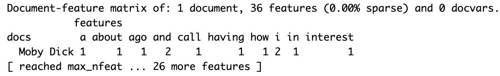

---
output:
  html_document: default
  pdf_document: default
---

# Text Analysis

A lot of the data that data scientists deal with daily tends to be *quantitative*, that is, data that is numerical. We have seen many examples of this throughout the text: the miles per gallon of car makes, the diameter of oak trees, the height and yardage of top football players, and the number of minutes flight were delayed for departure. We also applied methods from statistical analysis like *resampling* to estimate how much a value can vary and *regression* to make predictions about unknown quantities. All of this has been in the context of data that is quantitative. 

Data scientists prefer quantitative data because computing and reasoning with them is straightforward. If we wish to develop an understanding of a numerical sample at hand, we can simply compute a statistic such as its mean or median or visualize its distribution using a histogram. We could also go further and look at confidence intervals to quantify the uncertainty in any statistic we may be interested in. 

However, these methods are no longer useful when the data handed to us is *qualitative*. Qualitative data comes in many different kinds -- like speech recordings and images -- but perhaps the most notorious among them: *textual* data. With text data, it becomes impossible to go straight to the statistic. For instance, can you say what the *mean* or *median* is of this sentence: "I found queequeg's arm thrown over me"? Probably not! 

If we cannot compute anything from the text directly, how can we possibly extract any kind of insight? The trick: transform it! This idea should not seem unfamiliar. Chapter 1 gave us a hint when we plotted word relationships in Herman Melville's *Moby Dick*. There, we transformed the text into *word counts* and recorded the number of times a word occurred in each chapter which allowed us to visualize word relationships. Word counts are quantitative, which means we know how to work with it very well. 

This chapter turns to such transformations and builds up our understanding of how to deal with and build models for text data so that we may gain some insight from it. We begin with the idea of *tidy text*, an extension of tidy data, which sets us up for a study in frequency analysis. We then turn to an advanced technique called *topic modeling* which is a powerful modeling tool that gives us a sense of the "topics" that are present in a collection of text documents.  

These methods have important implications in an area known as the [Digital Humanities](https://en.wikipedia.org/wiki/Digital_humanities), where a dominant line of its research is dedicated to the study of text by means of computation.   

## Tidy Text 

We begin this chapter by studying what tidy text looks like, which is an extension of the tidy data principles we saw earlier when working with `dplyr`. Recall that tidy data has four principles:

|       1. Each *variable* forms a column. 
|       2. Each *observation* forms a row. 
|       3. Each value must have its own cell.
|       4. Each type of observational unit forms a table. 


Much like what we saw when keeping tibbles tidy, tidy text provides a way to deal with text data in a straightforward and consistent manner.   

### Prerequisites

We will continue making use of the tidyverse in this chapter, so let us load that in as usual. We will also require two new packages this time: 

* The `tidytext` package, which contains the functions we need for working with tidy text and to make text tidy. 
* The `gutenbergr` package, which allows us to search and download public domain works from the [Project Gutenberg](http://www.gutenberg.org/) collection. 

```{r message = FALSE, warning = FALSE}
library(tidyverse)
library(tidytext)
library(gutenbergr)
```

### Downloading texts using `gutenbergr`

To learn about tidy text, we need a subject for study. We will return to Herman Melville's epic novel [*Moby Dick*](http://www.gutenberg.org/ebooks/15), which we worked with briefly in Chapter 1. Since this work is in the public domain, we can use the `gutenbergr` package to download the text from the Project Gutenberg database and load it into R. 

We can use the function `gutenberg_works` to confirm that [*Moby Dick*](http://www.gutenberg.org/ebooks/15) is indeed in the database and fetch its corresponding Gutenberg ID. 

```{r}
gutenberg_works(title == "Moby Dick")
```

Using its ID `15`, we can proceed with retrieving the text into a variable called `moby_dick`. Observe how the data returned is in the form of a tibble -- a format we are well familiar with -- with one row per each line of the text.  

```{r message=FALSE}
moby_dick <- gutenberg_download(gutenberg_id = 15, 
                  mirror = "http://mirrors.xmission.com/gutenberg/")
moby_dick
```

The function `gutenberg_download` will do its best to strip any irrelevant header or footer information from the text. However, we still see a lot of preface material like the table of contents which is also unnecessary for analysis. To remove these, we will first split the text into its corresponding chapters using a call to the mutate `dplyr` verb. While we are at it, let us also drop the column `gutenberg_id`. 

```{r}
by_chapter <- moby_dick |>
  select(-gutenberg_id) |>
  mutate(document = 'Moby Dick', 
         linenumber = row_number(),
         chapter = cumsum(str_detect(text, regex('^CHAPTER '))))
by_chapter
```

There is a lot going on in this `mutate` call. Let us unpack the important parts:  

* The `str_detect` checks if the pattern `CHAPTER` occurs at the beginning of the line, which returns `TRUE` if found and `FALSE` otherwise. This is done using the regular expression `^CHAPTER ` (note the white space at the end). To understand this expression, compare the following examples and try to explain why only the first example (a proper line signaling the start of a new chapter) yields a match. 

```{r}
regex <- "^CHAPTER "
```

```{r message=FALSE}
str_view_all("CHAPTER CXVI. THE DYING WHALE", regex) # match
```

```{r message=FALSE}
str_view_all("Beloved shipmates, clinch the last verse of the
first chapter of Jonah—", regex)  # no match
```

* The function `cumsum` is a cumulative sum over the boolean values returned by `str_detect` indicating a match. The overall effect is that we can assign a row which chapter it belongs to. 

Eliminating the preface material becomes straightforward as we need only to filter any rows pertaining to chapter 0.  

```{r}
by_chapter <- by_chapter |>
  filter(chapter > 0)
by_chapter
```

Looks great! We are now ready to define what tidy text is. 

### Tokens and the principle of tidy text

The basic meaningful unit in text analysis is the *token*. It is usually a word, but it can be more or less granular depending on the context, e.g., sentence units or vowel units. For us, the token will always represent the word unit. 

*Tokenization* is the process of splitting text into tokens. Here is an example using the first few lines from *Moby Dick*. 

```{r}
some_moby_df <- by_chapter |>
  slice(4:6)
some_moby_df
```

```{r}
tokenized <- some_moby_df |>
  pull(text) |>
  str_split(" ")
tokenized
```

Note how in each line the text has been split into tokens, and we can access any of them using list and vector notation. 

```{r}
tokenized[[1]][3]
```

Text that is tidy is a table with one token per row. Assuming that the text is given to us in tabular form (like `text_df`), we can break text into tokens and transform it to a tidy structure in one go using the function `unnest_tokens`. 

```{r}
tidy_df <- some_moby_df |>
  unnest_tokens(word, text)
tidy_df
```

Note how each row of this table contains just one token, unlike `text_df` which had a row per line. When text is in this form, we say it follows a __one-token-per-row__ structure and, therefore, is tidy.     

### Stopwords

Let us return to the full `by_chapter` tibble and make it tidy using `unnest_tokens`. 

```{r}
tidy_moby <- by_chapter |>
  unnest_tokens(word, text)
tidy_moby
```

With our text in this form, we can start answering some basic questions about the text. For example: what are the most popular words in *Moby Dick*? We can answer this by piping `tidy_moby` into the function `count`, which lets us count the number of times each word occurs.

```{r}
tidy_moby |>
  count(word, sort = TRUE)
```

The result is disappointing: top-ranking words that appear are so obivous and do not clue us as to the language used in *Moby Dick*. It obstructs from any kind of analysis being made.  

These common words (e.g., "this", "his", "that", "in") that appear in almost every written English sentence are known as *stopwords*. It is a typical preprocessing step in text analysis studies to remove such stopwords before proceeding with the analysis.  

The tibble `stop_words` is a table provided by `tidytext` that contains a list of English stopwords. 

```{r}
stop_words
```

Using the function `anti_join` (think: the opposite of a join), we can filter any rows in `tidy_moby` that match with a stopword in the tibble `stop_words`. 

```{r message=FALSE}
tidy_moby_filtered <- tidy_moby |>
  anti_join(stop_words)
tidy_moby_filtered
```

Observe how the total number of rows has decreased dramatically. Let us redo the most popular word list again. 

```{r}
tidy_moby_filtered |>
  count(word, sort = TRUE)
```

Much better! We can even visualize the spread using a bar geom in `ggplot2`. 

```{r}
tidy_moby_filtered |>
  count(word, sort = TRUE) |>
  filter(n > 200) |>
  mutate(word = reorder(word, n)) |>
  ggplot() +
  geom_bar(aes(x=n, y=word), stat="identity")
```

From this visualization, we can clearly see that the story has a lot to do with whales, the sea, ships, and a character named "Ahab". Some readers may point out that "ye" should also be considered a stopword, which raises an important point about standard stopword lists: they do not do well with lexical variants. For this, a custom list should be specified.  

### Tidy text and non-tidy forms 

Before we end this section, let us further our understanding of tidy text by comparing it to other non-tidy forms. 

This first example should seem familiar. Does it follow the one-token-per-word structure? If not, how is this table structured? 

```{r echo=FALSE}
some_moby_df
```

Here is another example:

```{r eval=FALSE, message=FALSE, warning=FALSE}
some_moby_df |>
  unnest_tokens(word, text) |>
  count(document, word) |>
  cast_dfm(document, word, n)
```

{width=100%}

This table is structured as one token per *column*, where the value shown is its frequency. This is sometimes called a *document-feature matrix* (do not worry about the technical jargon). Would this be considered tidy text?  

Tidy text is useful in that it plays well with other members of the tidyverse like `ggplot2`, as we just saw earlier. However, just because text may come in a form that is not tidy does not make it useless. In fact, some machine learning and text analysis models like *topic modeling* will only accept text that is in a non-tidy form. The beauty of tidy text is the ability to move fluidly between tidy and non-tidy forms.     

As an example, here is how we can convert tidy text to a format known as a *document term matrix* which is how topic modeling receives its input. Don't worry if all that seems like nonsense jargon -- the part you should care about is that we can convert tidy text to a document term matrix with just one line! 

```{r message=FALSE}
tidy_moby_filtered |>
  count(document, word) |>
  cast_dtm(document, word, n)
```

Disclaimer: the document term matrix expects word frequencies so we actually need to pipe into `count` before doing the `cast_dtm`.  

## Frequency Analysis 

In this section we use tidy text principles to carry out a first study in text analysis: frequency (or word count) analysis. While looking at word counts may seem like a simple idea, they can be helpful in exploring text data and informing next steps in research. 

### Prerequisites

We will continue making use of the tidyverse in this chapter, so let us load that in as usual. Let us also load in the `tidytext` and `gutenbergr` packages. 

```{r message = FALSE, warning = FALSE}
library(tidyverse)
library(tidytext)
library(gutenbergr)
```

### An oeuvre of Melville's prose 

We will study Herman Melville's works again in this section. However, unlike before, we will include many more texts from his oeuvre of prose. We will collect: *Moby Dick*, *Bartleby, the Scrivener: A Story of Wall-Street*, *White Jacket*, and *Typee: A Romance of the South Seas*. 

```{r message=FALSE}
melville <- gutenberg_download(c(11231, 15, 10712, 1900), 
              mirror = "http://mirrors.xmission.com/gutenberg/")
```

We will tidy it up as before and filter the text for stopwords. We will also add one more step to the preprocessing where we extract words that are strictly alphabetical. This is accomplished with a `mutate` call using `str_extract` and the regular expression `[a-z]+`.  

```{r message=FALSE}
tidy_melville <- melville |>
  unnest_tokens(word, text) |>
  anti_join(stop_words) |>
  mutate(word = str_extract(word, "[a-z]+"))
```

We will not concern ourselves this time with dividing the text into chapters and removing preface material. But it would be helpful to add a column to `tidy_melville` with the title of the work a line comes from, rather than a ID which is hard to understand.  

```{r}
tidy_melville <- tidy_melville |>
  mutate(title = recode(gutenberg_id, 
                    '15' = 'Moby Dick', 
                    '11231' = 'Bartleby, the Scrivener',
                    '10712' = 'White Jacket',
                    '1900' = 'Typee: A Romance of the South Seas'))
```

As a quick check, let us count the number of words that appear in each of the texts. 

```{r}
tidy_melville |>
  group_by(title) |>
  count(word, sort = TRUE) |>
  summarize(num_words = sum(n)) |>
  arrange(desc(num_words))
```

*Moby Dick* is a mammoth of a book (178 pages!) so it makes sense that it would rank highest in the list in terms of word count.

### Visualizing popular words  

Let us find the most popular words in each of the titles. 

```{r}
tidy_melville <- tidy_melville |>
  group_by(title) |>
  count(word, sort = TRUE) |>
  ungroup()
tidy_melville
```

This lends itself well to a bar geom in `ggplot`. We will select out around the 10 most popular, which correspond to words that occur over 300 times.

```{r}
tidy_melville |>
  filter(n > 250) |>
  mutate(word = reorder(word, n)) |>
  ggplot() +
  geom_bar(aes(x=n, y=word, fill=title), stat="identity")
```

Something is odd about this plot. These top words are mostly coming from *Moby Dick*! As we just saw, *Moby Dick* is the most massive title in our collection so any of its popular words would dominate the overall popular list of words in terms of word count. 

Instead of looking at word counts, a better approach is to look at word *proportions*. Even though the word "whale" may have over 1200 occurrences, the proportion in which it appears may be much less when compared to other titles.  

Let us add a new column containing these proportions in which a word occurs with respect to the total number of words in the corresponding text.  

```{r}
tidy_melville_prop <- tidy_melville |>
  group_by(title) |>
  mutate(proportion = n / sum(n)) |>
  ungroup()
tidy_melville_prop
```

Let us redo the plot. 

```{r}
tidy_melville_prop |>
  filter(proportion > 0.005) |>
  mutate(word = reorder(word, proportion)) |>
  ggplot() +
  geom_bar(aes(x=proportion, y=word, fill=title), 
           stat="identity")
```

Interesting! In terms of proportions, we see that Melville uses the word "bartleby" much more in *Bartleby, the Scrivener* than he does "whale" in *Moby Dick*. Moreover, *Moby Dick* no longer dominates the popular words list and, in fact, it turns out that *Bartleby, the Scrivener* contributes the most highest-ranking words from the collection. 

### Just how popular was *Moby Dick*'s vocabulary? 

A possible follow-up question is whether the most popular words in *Moby Dick* also saw significant usage across other texts in the collection. That is, for the most popular words that appear in *Moby Dick*, how often do they occur in the other titles in terms of word proportions? This would suggest elements in those texts that are laced with some of the major thematic components in *Moby Dick*. 

We first extract the top 10 word proportions from *Moby Dick* to form a "popular words" list. 

```{r}
top_moby <- tidy_melville |>
  filter(title == "Moby Dick") |>
  mutate(proportion = n / sum(n)) |>
  arrange(desc(proportion)) |>
  slice(1:10) |>
  select(word)
top_moby
```

We compute the word proportions with respect to each of the titles and then join the `top_moby` words list with `tidy_melville` to extract only the top *Moby Dick* words from the other three texts.  

```{r}
top_moby_words_other_texts <- tidy_melville |>
  group_by(title) |>
  mutate(proportion = n / sum(n)) |>
  inner_join(top_moby, by="word") |>
  ungroup()
top_moby_words_other_texts
```

Now, the plot. Note that the `factor` in the `y` aesthetic mapping allows us to preserve the order of popular words in `top_moby` so that we can observe an upward trend in the *Moby Dick* bar heights.  

```{r}
ggplot(top_moby_words_other_texts) + 
  geom_bar(aes(x=proportion, 
               y=factor(word, level=pull(top_moby, word)), 
               fill=title), 
           position="dodge",stat="identity") +
  labs(y="word")
```

We see that most of the popular words that appear in *Moby Dick* are actually quite unique. The words "whale", "ahab", and even dialects like "ye" appear almost exclusively in *Moby Dick*. There are, however, some notable exceptions, e.g., the words "captain" and "time" appear much more in other titles than they do in *Moby Dick*.  

## Topic Modeling 

We end this chapter with a preview of an advanced technique in text analysis known as *topic modeling*. In technical terms, topic modeling is an unsupervised method of classification that allows users to find clusters (or "topics") in a collection of documents even when it is not clear to us how the documents should be divided. It is for this reason that we say topic modeling is "unsupervised." We do not say how the collection should be organized into groups; the algorithm simply learns how to without any guidance.   

### Prerequisites

Let us load in the main packages we have been using throughout this chapter. We will also need one more package this time, `topicmodels`, which has the functions we need for topic modeling. 

```{r message = FALSE, warning = FALSE}
library(tidyverse)
library(tidytext)
library(gutenbergr)
library(topicmodels)
```

We will continue with our running example of Herman Melville's *Moby Dick*. Let us load it in. 

```{r message=FALSE}
melville <- gutenberg_download(15, 
              mirror = "http://mirrors.xmission.com/gutenberg/")
```

We will tidy the text as usual and, this time, partition the text into chapters. 

```{r}
melville <- melville |>
  select(-gutenberg_id) |>
  mutate(title = 'Moby Dick', 
         linenumber = row_number(),
         chapter = cumsum(str_detect(text, regex('^CHAPTER ')))) |>
  filter(chapter > 0)
```

### Melville in perspective: The American Renaissance

Scope has been a key element of this chapter's trajectory. We began exploring tidy text with specific attention to Herman Melville's *Moby Dick* and then "zoomed out" to examine his body of work at large by comparing four of his principal works with the purpose of discovering elements that may be in common among the texts. We will go even more macro-scale in this section by putting Melville in perspective with some of his contemporaries. We will study Nathaniel Hawthorne's *The Scarlet Letter* and Walt Whitman's *Leaves of Grass*. 

Since topic modeling is the subject of this section, let us see if we can apply this technique to cluster documents according to the author who wrote them. The documents will be the individual chapters in each of the books and the desired clusters the three works: *Moby Dick*, *The Scarlet Letter*, and *Leaves of Grass*. 

We begin as always: loading the texts, tidying them, splitting according to chapter, and filtering out preface material. Let us start with Whitman's *Leaves of Grass*.

```{r}
whitman <- gutenberg_works(title == "Leaves of Grass") |>
  gutenberg_download(meta_fields = "title", 
    mirror = "http://mirrors.xmission.com/gutenberg/")
```

```{r}
whitman <- whitman |>
  select(-gutenberg_id) |>
  mutate(linenumber = row_number(),
         chapter = cumsum(str_detect(text, regex('^BOOK ')))) |>
  filter(chapter > 0)
```

Note that we have adjusted the regular expression here so that it is appropriate for the text. 

On to Hawthorne's *The Scarlet Letter*. 

```{r}
hawthorne <- gutenberg_works(title == "The Scarlet Letter") |>
  gutenberg_download(meta_fields = "title", 
    mirror = "http://mirrors.xmission.com/gutenberg/")
```

```{r}
hawthorne <- hawthorne |>
  select(-gutenberg_id) |>
  mutate(linenumber = row_number(),
         chapter = cumsum(str_detect(text, regex('^[XIV]+\\.')))) |>
  filter(chapter > 0)
```

Now that the three texts are available in tidy form, we can merge the three tibbles into one by stacking the rows. We call the merged tibble `books`. 

```{r}
books <- bind_rows(whitman, melville, hawthorne) 
books
```

As a quick check, we can have a look at the number of chapters in each of the texts. 

```{r}
books |>
  group_by(title) |>
  summarize(num_chapters = max(chapter))
```

### Preparation for topic modeling

Before we can create a topic model, we need to do some more preprocessing. Namely, we need to create the documents that will be used as input to the model. 

As mentioned earlier, these documents will be every chapter in each of the books, which we will give a name like `Moby Dick_12` or `Leaves of Grass_1`. This information is already available in `books` in the columns `title` and `chapter`, but we need to unite the two columns together into a single column. The `dplyr` function `unite()` will do the job for us. 

```{r}
chapter_documents <- books |>
  unite(document, title, chapter)
```

We can then tokenize words in each of the documents as follows. 
 
```{r}
documents_tokenized <- chapter_documents |>
  unnest_tokens(word, text)
documents_tokenized
```

We will filter stopwords as usual, and proceed with adding a column containing word counts. 

```{r message=FALSE}
document_counts <- documents_tokenized |>
  anti_join(stop_words) |>
  count(document, word, sort = TRUE) |>
  ungroup()
document_counts
```

This just about completes all the tidying we need. The final step is to convert this tidy tibble into a document-term-matrix (DTM) object. 

```{r}
chapters_dtm <- document_counts |>
  cast_dtm(document, word, n)
chapters_dtm
```

### Creating a three-topic model 

We are now ready to create the topic model. Ours is a three-topic model since we expect a topic for each of the books. We will use the function `LDA()` to create the topic model, where LDA is an acronym that stands for Latent Dirichlet Allocation. LDA is one such algorithm for creating a topic model. 

The best part about this step: we can create the model in just one line!  

```{r}
lda_model <- LDA(chapters_dtm, k = 3, control = list(seed = 50))
```

Note that the `k` argument given is the desired number of clusters. 

### A bit of LDA vocabulary 

Before we get to seeing what our model did, we need to cover some basics on LDA. While the mathematics of this algorithm is beyond the scope of this text, learning some of its core ideas are important for understanding its results. 

LDA follows three key ideas: 

* __Every document is a mixture of topics__, e.g., it may be 70% topic "Moby Dick", 20% topic "The Scarlet Letter", and 10% topic "Leaves of Grass".
* __Every topic is a mixture of words__, e.g., we would expect a topic "Moby Dick" to have words like "captain", "sea", and "whale". 
* __LDA is a "fuzzy clustering" algorithm__, that is, it is possible for a word to be generated by multiple topics, e.g., "whale" may be generated by both the topics "Moby Dick" and "The Scarlet Letter". 

Finally, keep in mind the following definitions:  

> $\beta$ (or "beta") is the probability that a *word* is generated by some topic $N$. These are also sometimes called *per-topic-per-word* probabilities. 

> $\gamma$ (or "gamma") is the probability that a *document* is generated by some topic $N$. These are also sometimes called *per-topic-per-document* probabilities.

Generally speaking, the more words in a document that are generated by a topic gives "weight" to the document's $\gamma$ so that the document is also generated by that same topic. We can say then that $\beta$ and $\gamma$ are associated. 

### Visualizing top per-word probabilities

Let us begin by unpacking the $\beta$ probabilities. At the moment we have an LDA object, which needs to be transformed back into a tidy tibble so that we can begin examining it. We can do this using the function `tidy` and referencing the $\beta$ matrix.   

```{r}
chapter_beta <- tidy(lda_model, matrix = "beta")
chapter_beta
```

The format of this tidy tibble is one-topic-per-term-per-row. While the probabilities shown are tiny, we can see that the term "whale" has the greatest probability of being generated by topic 2 and the lowest by topic 3. "pioneers" has even tinier probabilities, but when compared relatively we see that it is most likely to be generated by topic 1. 

What are the top terms within each topic? Let us use `dplyr` to retrieve the top 5 terms with the highest $\beta$ values in each topic.

```{r}
top_terms <- chapter_beta |>
  group_by(topic) |>
  arrange(topic, -beta) |>
  slice(1:5) |>
  ungroup() 
top_terms
```

It will be easier to visualize this using `ggplot`. Note that the function `reorder_within()` is not one we have used before. It is a handy function that allows us to order the bars *within* a group according to some other value, e.g., its $\beta$ value. For an explanation of how it works, we defer to [this helpful blog post](https://juliasilge.com/blog/reorder-within/) written by Julia Silge.  

```{r}
top_terms |>
  mutate(term = reorder_within(term, beta, topic)) |>
  ggplot() +
  geom_bar(aes(beta, term, fill = factor(topic)), 
           stat="identity", show.legend = FALSE) +
  facet_wrap(~topic, scales = "free") +
  scale_y_reordered()
```

We conclude that our model is a success! The words "love", "life", and "soul" correspond closest to Whitman's *Leaves of Grass*; the words "whale", "ahab", and "ship" with Melville's *Moby Dick*; and the words "hester", "pearl", and "minister" with Hawthorne's *The Scarlet Letter*. 

As we noted earlier, this is quite a success for the algorithm since it is possible for some words, say "whale", to be in common with more than one topic.

### Where the model goes wrong: per-document misclassifications 

Each document in our model corresponds to a single chapter in a book, and each document is associated with some topic. It would be interesting then to see how many chapters are associated with its corresponding book, and which chapters are associated with something else and, hence, are "misclassified." The per-document probabilities, or $\gamma$, can help address this question.     

We will transform the LDA object into a tidy tibble again, this time referencing the $\gamma$ matrix.

```{r}
chapters_gamma <- tidy(lda_model, matrix = "gamma")
chapters_gamma
```

Let us separate the document "name" back into its corresponding title and chapter columns. We will do so using the `separate()` dplyr verb. 

```{r}
chapters_gamma <- chapters_gamma |>
  separate(document, c("title", "chapter"), sep = "_", 
           convert = TRUE)
chapters_gamma
```

We can find the topic that is most associated with each chapter by taking the topic with the highest $\gamma$ value. For instance:

```{r}
chapters_gamma |>
  filter(title == "The Scarlet Letter", chapter == 17)
```

That $\gamma$ for this chapter corresponds to topic 3, so we will take this to be its "classification" or label". 

Let us do this process for all of the chapters. 

```{r}
chapter_label <- chapters_gamma |>
  group_by(title, chapter) |>
  slice_max(gamma) |>
  ungroup()
chapter_label
```

How were the documents labeled? The dplyr verb `summarize` can tell us. 

```{r message=FALSE}
labels_summarized <- chapter_label |>
  group_by(title, topic) |>
  summarize(num_chapters = n()) |>
  ungroup()
labels_summarized
```

This lends itself well to a nice bar geom with `ggplot`.

```{r message=FALSE}
ggplot(labels_summarized) + 
  geom_bar(aes(x = num_chapters, 
               y = title, fill = factor(topic)), 
           stat = "identity") +
  labs(fill = "topic")
```

We can see that all of the chapters in *The Scarlet Letter* and *Leaves of Grass* were sorted out completely into its associated topic. While the same is overwhelmingly true for *Moby Dick*, this title did have some chapters that were misclassified into one of the other topics. Let us see if we can pick out which chapters these were. 

To find out, we will label each book with the topic that had a majority of its chapters classified as that topic. 

```{r}
book_labels <- labels_summarized |>
  group_by(title) |>
  slice_max(num_chapters) |>
  ungroup() |> 
  transmute(label = title, topic)
book_labels
```

We can find the misclassifications by joining `book_labels` with the `chapter_label` table and then filtering chapters where the label does not match the title.  

```{r}
chapter_label |>
  inner_join(book_labels, by = "topic") |>
  filter(title != label) 
```

### The glue: Digital Humanities 

Sometimes "errors" when a model goes wrong can be more revealing than where it found success. The conflation we see in some of the *Moby Dick* chapters with *The Scarlet Letter* and *Leaves of Grass* points to a connection among the three authors. In fact, Melville and Hawthorne shared [such a close writing relationship](https://scholarworks.boisestate.edu/cgi/viewcontent.cgi?article=1164&context=mcnair_journal) that it was Hawthorne's influence on Melville that led him to evolve *Moby Dick* from adventure tale into a creative, philosophically rich story. So it is interesting to see so many of the *Moby Dick* chapters mislabeled as *The Scarlet Letter*.  

This connection between data and interpretation is the impetus for a field of study known as [Digital Humanities](https://en.wikipedia.org/wiki/Digital_humanities) (DH). While the text analysis techniques we have covered in this chapter can produce exciting results, they are worth little without context. That context, the authors would argue, is made possible by the work of DH scholars.    

### Further reading

This chapter has served as a preview of the analyses that are made possible by text analysis tools. If you are interested in taking a deeper dive into any of the methods discussed here, we suggest the following resources:  

* [__"Text Mining with R: A Tidy Approach"__](https://www.tidytextmining.com/index.html) by Julia Silge and David Robinson. The tutorials in this book inspired most of the code examples seen in this chapter. The text also goes into much greater depth than what we have presented here. Check it out if you want to take your R text analysis skills to the next level!

* [__Distant Reading__](https://www.google.com/books/edition/Distant_Reading/YKMCy9I3PG4C?hl=en) by Franco Moretti. This is a seminal work by Moretti, a literary historian, which expounds on the purpose and tools for literary history. He attempts to redefine the lessons of literature with confident reliance on computational tools. It has been consequential in shaping the methods that form research in Digital Humanities today.      

## Exercises 

Answering questions for the exercises in Chapter 12 requires some additional packages beyond the tidyverse. Let us load them. Make sure you have installed them before loading them.

```{r eval=FALSE, message=FALSE, warning=FALSE}
library(tidytext)
library(gutenbergr)
library(topicmodels)
```

**Question 1. Jane Austen Letters** Jane Austen (December 17, 1775 - July 18, 1817) was an English novelist. Her well-known novels include "Pride and Prejudice" and "Sense and Sensibility". The Project Gutenberg has all her novels as well as a collection of her letters. The collection, "The Letters of Jane Austen, " is from the compilation by her great nephew "Edward Lord Bradbourne".

```{r eval=FALSE, message=FALSE, warning=FALSE}
gutenberg_works(author == "Austen, Jane")
```

The project ID for the letter collection is 42078. Using the ID, load the project text as `austen_letters`.

```{r eval=FALSE, message=FALSE, warning=FALSE}
austen_letters <- gutenberg_download(gutenberg_id = 42078,
  "http://mirrors.xmission.com/gutenberg/")
austen_letters
```

The tibble has only two variables, `gutenberg_id`, which is 42078 for all rows, and `text`, which is the line-by-line text.

Let us examine some rows of the tibble. First, unlike "Moby Dick," each letter in the collection appears with Greek numerals as the header. The sixth line of the segment below shows the first letter with the header "I." 

```{r eval=FALSE, message=FALSE, warning=FALSE}
(austen_letters |> pull(text))[241:250]
```

Next, some letters contain a footnote, which is not part of the original letter. The fifth and the seventh lines of the segment below show the header for a footnote and a footnote with a sequential number "[39]"

```{r eval=FALSE, message=FALSE, warning=FALSE}
(austen_letters |> pull(text))[6445:6454]
```

Footnotes can appear in groups. The segment below shows two footnotes. Thus, the header is "FOOTNOTES:" instead of "FOOTNOTE:".

```{r eval=FALSE, message=FALSE, warning=FALSE}
(austen_letters |> pull(text))[3216:3225]
```

The letter sequence concludes with the header "THE END." as shown below.

```{r eval=FALSE, message=FALSE, warning=FALSE}
(austen_letters |> pull(text))[8531:8540]
```

* **Question 1.1** Suppose we have the the following vector `test_vector`:

  ```{r eval=FALSE, message=FALSE, warning=FALSE}
  test_vector <- c( "I.", "    I.", "VII.", 
                    "THE END.", "FOOTNOTE:", 
                    "FOOTNOTES:", 
                    "ds", "    world")
  ```

  Let us filter out the unwanted footnote headers from this vector. Create a regular expression `regex_foot` that detects any line starting with "FOOTNOTE". Test the regular expression on `test_vector` using `str_detect` function and ensure that your regular expression functions correctly.

* **Question 1.2** Using the regular expression `regex_foot`, remove all lines matching the regular expression in the tibble `austen_letters`. Also, remove the variable `gutenberg_id`. Store the result in `letters`. Check out the rows 351-360 of the original and then in the revised version.

* **Question 1.3** Next, find out the location of the start line and the end line. The start line is the one that begins with "I.", and the end line is the one that begins with "THE END.". Create a regular expression `regex_start` for the start and a regular expression `regex_end` for the end. Test the expression on `test_vector`.

* **Question 1.4** Apply the regular expressions to the variable `text` of `letters` using the `stringr` function `str_which`. The result of the first is the start line. The result of the second minus 1 is the very end. Store these indices in `start_no` and `end_no`, respectively. 

  The following code chunk filters the text tibble to select only those lines between `start_no` and `end_no`. 

  ```{r eval=FALSE, message=FALSE, warning=FALSE}
  letters_clean <- letters |> 
    slice(start_no:end_no)
  letters_clean
  ```

* **Question 1.5** Now, as with the textbook example using "Moby Dick", accumulate the lines that correspond to each individual letter. The following regular expression can be used to detect a letter index. 

  ```{r eval=FALSE, message=FALSE, warning=FALSE}
  regex_index <- regex('^[IVXLCDM]++\\.')
  str_which(letters$text, regex_index)
  ```

  Apply this regular expression, as we did for "Moby Dick", to `letters_clean`. Add the letter index as `letter` and the `row_number()` as `linenumber`. Store the result in `letters_with_num`.

**Question 2.** This is a continuation from the previous question. The previous question has prepared us to investigate the letters in `letters_with_num`.

* **Question 2.1** First, extract tokens from `letters_with_num` using `unnest_tokens`, and store it in `letter_tokens`. Then, from `letter_tokens` remove `stop_words` using `anti_join` and store it in a name `letter_tokens_nostop`.

* **Question 2.2** Let us obtain the counts of the words in these two tibbles using `count`. Store the result in `letter_tokens_ranked` and `letter_tokens_nostop_ranked`, respectively.

* **Question 2.3** As in the textbook, use a lower bound of 60 to collect the words and show a bar plot.

* **Question 2.4** Now generate word counts with respect to each letter. The source is `letter_tokens_nostop`. The counting is by executing `count(letter, word, sort = TRUE)`. Store the result in `word_counts`.

* **Question 2.5** Generate, from the letter-wise word counts `word_counts`, a document-term matrix `letters_dtm`.

* **Question 2.6** From the document-term matrix, generate an LDA model with 2 classes. Store it in `lda_model`.

* **Question 2.7** Transform the model output into a tibble. Use the function `tidy()` and set the variable "beta" using the matrix entries.

* **Question 2.8** Select the top 15 terms from each topic as we did for "Moby Dick". Store it in `top_terms`.

* **Question 2.9** Now plot the top terms as we did in the textbook.

**Question 3.** The previous attempt to create topic models may not have worked well, possibly because of the existence of frequent non-stop-words that may dominate the term-frequency matrix. Here we attempt to revise the analysis after removing such non-stop-words.

* **Question 3.1** We generated a ranked tibble of words, `letter_tokens_nostop_ranked`.

  ```{r eval=FALSE, message=FALSE, warning=FALSE}
  letter_tokens_nostop_ranked
  ```

  The first few words on the list appear generic, so let us remove these words from consideration.
  Let us form a character vector named `add_stop` that captures the first 10 words that appear in the tibble `letter_tokens_nostop_ranked`. You can use the `slice()` and `pull()` `dplyr` verbs to accomplish this.

* **Question 3.2** Let us remove the rows of `word_counts` where the `word` is one of the words in `add_stop`. Store it in `word_counts_revised`.

* **Question 3.3** Generate, from the letter-wise word counts `word_counts_revised`, a document-term matrix `letters_dtm_revised`.

* **Question 3.4** From this document-term matrix, generate an LDA model with 2 classes. Store it in `lda_model_revised`.

* **Question 3.5** Transform the model output back into a tibble. Use the function `tidy()` and set the variable "beta" using the matrix entries.

* **Question 3.6** Select the top 15 terms and store it in `top_terms_revised`.

* **Question 3.7** Now plot the top terms of the two classes. Also, show the plot without excluding the common words. In that matter, we should be able to compare the two topic models side by side.

* **Question 3.8** What differences do you observe between the two topics in the bar plot for `top_terms_revised`? Are these differences more or less apparent (or about the same) when comparing the differences in the original bar plot for `top_terms`?

**Question 4. Chesterton Essays** G. K. Chesterton (29 May 1874 – 14 June 1936) was a British writer, who is the best known for his "Father Brown" works. The Gutenbrerg Project ID 8092 is a collection of his essays "Tremendous Trifles".

* **Question 4.1** Load the work in `trifles`. Then remove the unwanted variable and store the result in `trifles0`.

* **Question 4.2** Each essay in the collection has a Greek number header. As we did before, using the Greek number header to capture the start of an essay and add that index as the variable `letter`. Store the mutated table in `tifles1`.

* **Question 4.3** First, extract tokens from `trifles1` using `unnest_tokens`, and store it in `trifles_tokens`. Then, from `trifles_tokens` remove `stop_words` using `anti_join` and store it in `trifles_tokens_nostop`.

* **Question 4.4** Let us obtain the counts of the words in the two token lists using `count`. Store the result in `trifles_tokens_ranked` and `trifles_tokens_nostop_ranked`, respectively.

* **Question 4.5** Use a lower bound of 35 to collect the words and show a bar plot.

* **Question 4.6** Now generate word counts letter-wise. The source is `trifles_tokens_nostop`. The counting is by executing `count(letter, word, sort = TRUE)`. Store the result in `trifles_word_counts`.

* **Question 4.7** Generate, from the letter-wise word counts `trifles_word_counts`, a document-term matrix `trifles_dtm`.

* **Question 4.8** From the document-term matrix, generate an LDA model with 4 classes. Store it in `trifles_lda_model`.

* **Question 4.9** Take the model and turn it into a data frame. Use the function `tidy()` and set the variable "beta" using the matrix entries.

* **Question 4.10** If you run the top-term map, you notice that the words are much similar among the four classes. So, let us skip the first 5 and select the words that are ranked 6th to the 15th. Select the top 10 terms from each topic and store it in `trifles_top_terms`.

* **Question 4.11** Now plot the top terms.

* **Question 4.12** What differences do you observe, if any, among the above four topics? 

**Question 5** In this question, we explore the relationship between the Chesterton essays and the Jane Austen letter collection. This question assumes you have already formed the tibbles `word_counts_revised` and `trifles_word_counts`. 

* **Question 5.1** Using `bind_rows`, merge the datasets `word_counts_revised` and `trifles_word_counts`. However, before merging, discard the `letter` variable present in each tibble and create a new column `author` that gives the author name together with each word count. Assign the resulting tibble to the name `merged_frequencies`. 

* **Question 5.2** The current word counts given in `merged_frequencies` are with respect to each letter/essay, but we would like to obtain these counts with respect to each *author*. Using `group_by` and `summarize` from `dplyr`, obtain updated counts for each word by summing the counts over its respective texts. The resulting tibble should contain three variables: `author`, `word`, and `n` (the updated word count). 

* **Question 5.3** Instead of reporting word counts, we would like to report word *proportions* so that we can make comparisons between the two authors. Create a new variable `prop` that, with respect to each *author*, reports the proportion of times a word appears over the total count of words for that author. The resulting tibble should contain three variables: `author`, `word`, and `prop`. Assign the resulting tibble to the name `freq_by_author_prop`.

* **Question 5.4** Apply a pivot transformation so that three variables materialize in the `freq_by_author_prop` tibble: `word`, `G. K. Chesterton` (giving the word proportion for Chesterton essays), and `Jane Austen` (giving the word proportion for Jane Austen letters). Drop any resulting missing values after the transformation. Assign the resulting tibble to the name `freq_by_author_prop_long`.

* **Question 5.5** Using `freq_by_author_prop_long`, fit a linear regression model of the G. K. Chesterton proportions on the Jane Austen proportions. 

* **Question 5.6** How significant is the estimated slope of the regression line you found? Use `confint()` with the linear model you developed. 

* **Question 5.7** The following scatter plot shows the Chesterton word proportions against the Jane Austen word proportions; the color shown is the absolute difference between the two. Also given is a dashed line that follows $y = x$. 

  Amend this `ggplot` visualization by adding another geom layer that visualizes the equation of the linear model you found. 
  
  ```{r eval=FALSE, message=FALSE, warning=FALSE}
  ggplot(freq_by_author_prop_long,
         aes(x = `Jane Austen`, y = `G. K. Chesterton`, 
             color = abs(`G. K. Chesterton` - `Jane Austen`))) + 
    geom_abline(color = "gray", lty = 2) +
    geom_text(aes(label = word), check_overlap = TRUE) +
    theme(legend.position="none") 

  ```

* **Question 5.8** What does it mean for words to be close to the $y=x$ line?  Also, briefly comment on the relationship between the regression line you found and the $y=x$ line -- what does it mean that the slope of your line is relatively smaller? 


<!---

possible material for lab/hw; using correlation

```{r eval=FALSE}
tidy_melville |>
  count(word, sort=TRUE) 
```


```{r eval=FALSE}
tidy_hawthorne |>
  count(word, sort = TRUE) |> 
  filter(word == "lord")
```


the scarlet letter, the house of the seven gables, Mosses from an Old Manse, and Other Stories

```{r eval=FALSE}
hawthorne <- gutenberg_download(c(33, 77, 1900, 508))
```

```{r eval=FALSE, message=FALSE}
tidy_hawthorne <- hawthorne |>
  unnest_tokens(word, text) |>
  anti_join(stop_words) |>
  mutate(word = str_extract(word, "[a-z]+"))
```

```{r eval=FALSE}
gutenberg_works(author == "Whitman, Walt")
```

leaves of grass, drum-taps, The Patriotic Poems of Walt Whitman

```{r eval=FALSE}
whitman <- gutenberg_download(c(1322, 8801, 27494))
```


```{r eval=FALSE, message=FALSE}
tidy_whitman <- whitman |>
  unnest_tokens(word, text) |>
  anti_join(stop_words) |>
  mutate(word = str_extract(word, "[a-z]+"))
```

```{r eval=FALSE}
frequency <- bind_rows(mutate(tidy_whitman, author = "Walt Whitman"),
                       mutate(tidy_hawthorne, author = "Nathaniel Hawthorne"), 
                       mutate(tidy_melville, author = "Herman Melville")) |> 
  count(author, word) |>
  group_by(author) |>
  mutate(proportion = n / sum(n)) |> 
  select(-n) |> 
  pivot_wider(names_from = author, values_from = proportion) |> 
  pivot_longer(`Walt Whitman`:`Nathaniel Hawthorne`, 
               names_to = "author", values_to = "proportion")

```

```{r eval=FALSE}
frequency
```

```{r eval=FALSE}
library(scales)
```


```{r eval=FALSE}
# expect a warning about rows with missing values being removed
ggplot(frequency, aes(x = proportion, y = `Herman Melville`, 
                      color = abs(`Herman Melville` - proportion))) +
  geom_abline(color = "gray40", lty = 2) +
  geom_jitter(alpha = 0.1, size = 2.5, width = 0.3, height = 0.3) +
  geom_text(aes(label = word), check_overlap = TRUE) +
  scale_x_log10(labels = percent_format()) +
  scale_y_log10(labels = percent_format()) +
  scale_color_gradient(limits = c(0, max(pull(frequency, proportion))), 
                       low = "darkslategray4", high = "deeppink") +
  facet_wrap(~author, ncol = 2) +
  theme(legend.position="top") + 
  labs(y = "Herman Melville", x = NULL, color='')

```

### confirming results with correlation

```{r eval=FALSE}
cor.test(data = frequency[frequency$author == "Nathaniel Hawthorne",],
         ~ proportion + `Herman Melville`)
```


```{r eval=FALSE}
cor.test(data = frequency[frequency$author == "Walt Whitman",],
         ~ proportion + `Herman Melville`)
```

```{r eval=FALSE}
gutenberg_works(author == "Whitman, Walt")
```

```{r eval=FALSE}
gutenberg_works(title == "The Scarlet Letter")
```

---> 


      

