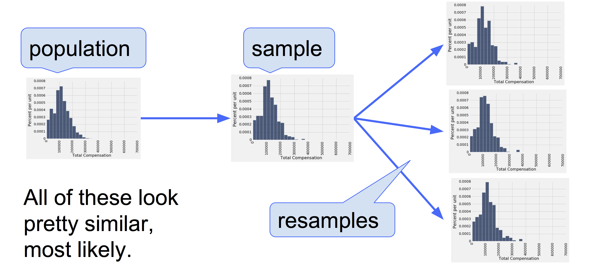

# Estimation

In the previous chapter we began to develop ways of inferential thinking. In particular, we learned how to use data to decide between two hypotheses about the world. But often we just want to know how big something is.

For example, in an earlier chapter we investigated how many warplanes the enemy might have. In an election year, we might want to know what percent of voters favor a particular candidate. To assess the current economy, we might be interested in the median annual income of households in the United States.

In this chapter, we will develop a way to *estimate* an unknown *parameter*. Remember that a parameter is a numerical value associated with a population.

To figure out the value of a parameter, we need data. If we have the relevant data for the entire population, we can simply calculate the parameter.

But if the population is very large – for example, if it consists of all the households in the United States – then it might be too expensive and time-consuming to gather data from the entire population. In such situations, data scientists rely on sampling at random from the population.

This leads to a question of inference: How to make justifiable conclusions about the unknown parameter, based on the data in the random sample? We will answer this question by using inferential thinking.

A statistic based on a random sample can be a reasonable estimate of an unknown parameter in the population. For example, you might want to use the median annual income of sampled households as an estimate of the median annual income of all households in the U.S.

But the value of any statistic depends on the sample, and the sample is based on random draws. So every time data scientists come up with an estimate based on a random sample, they are faced with a question:

__"How different could this estimate have been, if the sample had come out differently?"__

In this chapter you will learn one way of answering this question. The answer will give you the tools to estimate a numerical parameter and quantify the amount of error in your estimate.

We will start with a preliminary about percentiles. The most famous percentile is the median, often used in summaries of income data. Other percentiles will be important in the method of estimation that we are about to develop. So we will start by defining percentiles carefully.

## Percentiles

Numerical data can be sorted in increasing or decreasing order. Thus the values of a numerical data set have a *rank order*. A percentile is the value at a particular rank.

For example, if your score on a test is on the 95th percentile, a common interpretation is that only 5% of the scores were higher than yours. The median is the 50th percentile; it is commonly assumed that 50% the values in a data set are above the median.

But some care is required in giving percentiles a precise definition that works for all ranks and all lists. To see why, consider an extreme example where all the students in a class score 75 on a test. Then 75 is a natural candidate for the median, but it's not true that 50% of the scores are above 75. Also, 75 is an equally natural candidate for the 95th percentile or the 25th or any other percentile. Ties – that is, equal data values – have to be taken into account when defining percentiles.

You also have to be careful about exactly how far up the list to go when the relevant index isn't clear. For example, what should be the 87th percentile of a collection of 10 values? The 8th value of the sorted collection, or the 9th, or somewhere in between?

In this section, we will give a definition that works consistently for all ranks and all vectors.

### Prerequisites

We will make use of the tidyverse in this chapter, so let's load it in as usual.

```{r, message = FALSE, warning = FALSE}
library(tidyverse)
library(readtext)
```

### A Numerical Example

Before giving a general definition of all percentiles, we will define the 80th percentile of a collection of values to be the smallest value in the collection that is at least as large as 80% of all of the values.

For example, let's consider the sizes of the five largest continents – Africa, Antarctica, Asia, North America, and South America – rounded to the nearest million square miles.

```{r}
sizes <- c(12, 17, 6, 9, 7)
```

The 80th percentile is the smallest value that is at least as large as 80% of the elements of `sizes`, that is, four-fifths of the five elements. That's 12:

```{r}
sort(sizes)
```

We can compute this with the `quantile()` function in R. 

### The `quantile` function

The `quantile()` function gives the value that cuts off the first *n* percent of the data values when it is sorted in ascending order. Observe what happens when we just pass the vector `sizes` as an argument. 

```{r}
quantile(sizes)
```

The corresponding 0th, 25th, 50th, 75th, and 100th percentiles of the vector are returned. Since these percentiles partition the data into quarters, these are given a special name called *quartiles*. 

There are many ways to compute percentiles (see the help page for a sneak peek, with `?quantile`). The one that matches the definition used here corresponds to `type = 1`. Note that for computing quartiles, as we did before, the answer remains the same.     

```{r}
quantile(sizes, type = 1)
```

The 80th percentile is a value on the list, namely 12. We can compute this by passing in an additional parameter with the desired percentage ratios. These must be between 0 and 1. This is how  `quantile()` gets its name: *quantiles* are *percentiles* scaled to have a value between 0 and 1, e.g. `0.7` rather than `70`, `0.8` rather than `80`. 

```{r}
quantile(sizes, c(0.8), type = 1)
```

You can see that 80% of the values are less than or equal to it, and that it is the smallest value on the list for which this is true.

Analogously, the 70th percentile is the smallest value in the collection that is at least as large as 70% of the elements of `sizes`. Now 70% of 5 elements is "3.5 elements", so the 70th percentile is the 4th element on the list. That's 12, the same as the 80th percentile for these data.

```{r}
quantile(sizes, c(0.7), type = 1)
```

### The General Definition

Let $p$ be a number between 0 and 100. The $p$th percentile of a collection is the smallest value in the collection that is at least as large as p% of all the values.

By this definition, any percentile between 0 and 100 can be computed for any collection of values, and it is always an element of the collection.

In practical terms, suppose there are $n$ elements in the collection. To find the  $p$th percentile:

* Sort the collection in increasing order.
* Find p% of n:  ($p$/100)×$n$ . Call that $k$.
* If $k$ is an integer, take the $k$th element of the sorted collection.
* If $k$ is not an integer, round it up to the next integer, and take that element of the sorted collection.

### Example

The table scores_and_sections contains one row for each student in a class of 359 students. The columns are the student's discussion section and midterm score.

```{r message = FALSE, warning = FALSE}
url <- "https://raw.githubusercontent.com/data-8/materials-su19/master/materials/su19/lec/scores_by_section.csv"
scores_and_sections <- read_csv(url)
scores_and_sections
```

```{r}
scores_and_sections %>%
  select(Midterm) %>%
  ggplot(aes(x = Midterm, y = ..density..)) +
  geom_histogram(color = "gray", breaks = seq(-0.5, 25.6, 1))
``` 

What was the 85th percentile of the scores? To use the `quantile()` function, create a vector `scores` containing the midterm scores, and find the 85th percentile:

```{r}
scores <- pull(scores_and_sections, Midterm)
quantile(scores, c(0.85), type = 1)
```

According to the percentile function, the 85th percentile was 22. To check that this is consistent with our new definition, let's apply the definition directly.

First, put the scores in increasing order:

```{r}
sorted_scores <- sort(pull(scores_and_sections, Midterm))
```

There are 359 scores in the array. So next, find 85% of 359, which is 305.15.

```{r}
0.85 * 359
```

That's not an integer. By our definition, the 85th percentile is the 306th element of `sorted_scores`.

```{r}
# The 306th element of the sorted array

sorted_scores[306]
```

That's the same as the answer we got by using `quantile()`. In future, we will just use `quantile()`.

### Quartiles

We mentioned quartiles briefly earlier. The *first quartile* of a numercial collection is the 25th percentile. The terminology arises from the *first quarter*. The second quartile is the median, and the third quartile is the 75th percentile.

For our `scores` data, those values are:

```{r}
quantile(scores, c(0.25), type = 1)
```

```{r}
quantile(scores, c(0.5), type = 1)
```

```{r}
quantile(scores, c(0.75), type = 1)
```

We saw that when omitting the percentage ratios entirely, the default behavior reports the quartiles automatically. 

```{r}
quantile(scores, type = 1)
```

Distributions of scores are sometimes summarized by the "middle 50%" interval, between the first and third quartiles.

## The Bootstrap

A data scientist is using the data in a random sample to estimate an unknown parameter. She uses the sample to calculate the value of a statistic that she will use as her estimate.

Once she has calculated the observed value of her statistic, she could just present it as her estimate and go on her merry way. But she's a data scientist. She knows that her random sample is just one of numerous possible random samples, and thus her estimate is just one of numerous plausible estimates.

By how much could those estimates vary? To answer this, it appears as though she needs to draw another sample from the population, and compute a new estimate based on the new sample. But she doesn't have the resources to go back to the population and draw another sample.

It looks as though the data scientist is stuck.

Fortunately, a brilliant idea called the *bootstrap* can help her out. Since it is not feasible to generate new samples from the population, the bootstrap generates new random samples by a method called *resampling*: the new samples are drawn at random *from the original sample*.

In this section, we will see how and why the bootstrap works. In the rest of the chapter, we will use the bootstrap for inference.

### Prerequisites

We will make use of the tidyverse in this chapter, so let's load it in as usual.

```{r, message = FALSE, warning = FALSE}
library(tidyverse)
library(readtext)
```

### Employee Compensation in the City of San Francisco

[SF OpenData](https://data.sfgov.org/) is a website where the City and County of San Francisco make some of their data publicly available. One of the data sets contains compensation data for employees of the City. These include medical professionals at City-run hospitals, police officers, fire fighters, transportation workers, elected officials, and all other employees of the City.

Compensation data for the calendar year 2015 are in the table `sf2015`.

```{r message = FALSE, warning = FALSE}
url <- "https://raw.githubusercontent.com/data-8/materials-su19/master/materials/su19/lec/san_francisco_2015.csv"
sf2015 <- read_csv(url)
sf2015
```

There is one row for each of 42,979 employees. There are numerous columns containing information about City departmental affiliation and details of the different parts of the employee's compensation package. Here is the row correspoding to the late Edward Lee, the Mayor at that time.

```{r}
filter(sf2015, Job == "Mayor")
```

We are going to study the final column, `Total Compensation`. That's the employee's salary plus the City's contribution towards his/her retirement and benefit plans.

Financial packages in a calendar year can sometimes be hard to understand as they depend on the date of hire, whether the employee is changing jobs within the City, and so on. For example, the lowest values in the `Total Compensation` column look a little strange.

```{r}
sf2015 %>%
  arrange(`Total Compensation`) %>%
  select(`Total Compensation`, everything())
```

For clarity of comparison, we will focus our attention on those who had at least the equivalent of a half-time job for the whole year. At a minimum wage of about \$10 per hour, and 20 hours per week for 52 weeks, that's a salary of about \$10,000.

```{r}
sf2015 <- filter(sf2015, Salaries > 10000)
nrow(sf2015)
```

### Population and Parameter 

Let this table of just over 36,500 rows be our population. Here is a histogram of the total compensations.

```{r}
sf_bins <- seq(0, 700000, 25000)
sf2015 %>%
  select(`Total Compensation`) %>%
  ggplot(aes(x = `Total Compensation`, y = ..density..)) + 
  geom_histogram(breaks = sf_bins, color = "gray")
```

While most of the values are below $300,000, a few are quite a bit higher. For example, the total compensation of the Chief Investment Officer was almost \$650,000. That is why the horizontal axis stretches to \$700,000.

```{r}
arrange(sf2015, desc(`Total Compensation`)) %>%
  select(`Total Compensation`, everything()) %>%
  head(n = 2)
```

Now let the parameter be the median of the total compensations.

Since we have the luxury of having all of the data from the population, we can simply calculate the parameter:

```{r}
pop_median <- quantile(pull(sf2015, `Total Compensation`), c(0.50), type = 1)
pop_median
```

The median total compensation of all employees was just over $110,300.

From a practical perspective, there is no reason for us to draw a sample to estimate this parameter since we simply know its value. But in this section we are going to pretend we don't know the value, and see how well we can estimate it based on a random sample.

In later sections, we will come down to earth and work in situations where the parameter is unknown. For now, we are all-knowing.

### A Random Sample and an Estimate

Let us draw a sample of 500 employees at random without replacement, and let the median total compensation of the sampled employees serve as our estimate of the parameter.

```{r}
our_sample <- slice_sample(sf2015, n = 500)
our_sample %>%
  select(`Total Compensation`) %>%
  ggplot(aes(x = `Total Compensation`, y = ..density..)) + 
  geom_histogram(breaks = sf_bins, color = "gray")
```

```{r}
est_median <- quantile(pull(our_sample, `Total Compensation`), c(0.50), 
                       type = 1)
est_median
```

The sample size is large. By the law of averages, the distribution of the sample resembles that of the population, and consequently the sample median is not very far from the population median (though of course it is not exactly the same).

So now we have one estimate of the parameter. But had the sample come out differently, the estimate would have had a different value. We would like to be able to quantify the amount by which the estimate could vary across samples. That measure of variability will help us measure how accurately we can estimate the parameter.

To see how different the estimate would be if the sample had come out differently, we could just draw another sample from the population, but that would be cheating. We are trying to mimic real life, in which we won't have all the population data at hand.

Somehow, we have to get another random sample without sampling from the population.

### The Bootstrap: Resampling from the Sample

What we do have is a large random sample from the population. As we know, a large random sample is likely to resemble the population from which it is drawn. This observation allows data scientists to *lift themselves up by their own bootstraps*: the sampling procedure can be replicated by *sampling from the sample*.

Here are the steps of *the bootstrap method* for generating another random sample that resembles the population:

* __Treat the original sample as if it were the population.__
* __Draw from the sample__, at random __with__ replacement, __the same number of times as the original sample size__.

It is important to resample the same number of times as the original sample size. The reason is that the variability of an estimate depends on the size of the sample. Since our original sample consisted of 500 employees, our sample median was based on 500 values. To see how different the sample could have been, we have to compare it to the median of other samples of size 500.

If we drew 500 times at random *without* replacement from our sample of size 500, we would just get the same sample back. By drawing *with* replacement, we create the possibility for the new samples to be different from the original, because some employees might be drawn more than once and others not at all.

Why is this a good idea? By the law of averages, the distribution of the original sample is likely to resemble the population, and the distributions of all the "resamples" are likely to resemble the original sample. So the distributions of all the resamples are likely to resemble the population as well.

```{r, echo=FALSE, fig.align="center", out.width='50%'}

```

### A Resampled Median

Here is one new sample drawn from the original sample, and the corresponding sample median. Note how we set `n` to be the total number of rows from `our_sample` and that `replace` is set to `TRUE` to toggle sampling with replacement.  

```{r dpi=80,  fig.align="center", message = FALSE}
resample_1 <- slice_sample(our_sample, n = nrow(our_sample), replace = TRUE)
resample_1 %>%
  select(`Total Compensation`) %>%
  ggplot(aes(x = `Total Compensation`, y = ..density..)) + 
  geom_histogram(breaks = sf_bins, color = "gray")
```

```{r}
resampled_median_1 <- quantile(pull(resample_1, `Total Compensation`), 
                               c(0.50), type = 1)
resampled_median_1
```

By resampling, we have another estimate of the population median. By resampling again and again, we will get many such estimates, and hence an empirical distribution of the estimates.

```{r}
resample_2 <- slice_sample(our_sample, n = nrow(our_sample), replace = TRUE)
resampled_median_2 <- quantile(pull(resample_2, `Total Compensation`), 
                               c(0.50), type = 1)
resampled_median_2
```


### Bootstrap Empirical Distribution of the Sample Median

Let us define a function `bootstrap_median()` that takes our original sample, the label of the column containing the variable, and the number of bootstrap samples we want to take, and returns an array of the corresponding resampled medians.

Each time we resample and find the median, we *replicate* the bootstrap process. So the number of bootstrap samples will be called the number of replications.

```{r}
one_bootstrap <- function(one_column_df, x) {
  bootstrap_sample <- slice_sample(one_column_df, 
                                 n = nrow(one_column_df), replace = TRUE)
  resampled_median <- quantile(pull(bootstrap_sample, 1), c(0.50), type = 1)
}
```

```{r}
bootstrap_median <- function(original_sample, label, replications, x) {
  label <- enquo(label) # Create quosure
  
  just_one_column <- select(original_sample, !!label)
  medians <- map_dbl(.x = 1:replications, 
                     .f = one_bootstrap,
                     one_column_df = just_one_column)
  return(medians)
}
```

We now replicate the bootstrap process 5,000 times. The array bstrap_medians contains the medians of all 5,000 bootstrap samples. Notice that the code takes longer to run than our previous code. It has a lot of resampling to do!

```{r}
bstrap_medians <- bootstrap_median(our_sample, `Total Compensation`, 5000)
```

Here is the histogram of the 5000 medians. The red dot is the population parameter: it is the median of the entire population, which we happen to know but did not use in the bootstrap process.

```{r dpi=80,  fig.align="center", message = FALSE}
resampled_medians <- tibble(bstrap_medians)
ggplot(resampled_medians) +
  geom_histogram(aes(x = bstrap_medians, y = ..density..), 
                 bins = 10, color = "gray") + 
  geom_point(aes(x = pop_median, y = 0), color = "red", size = 3)
```

It is important to remember that the red dot is fixed: it is $110,305.79, the population median. The empirical histogram is the result of random draws, and will be situated randomly relative to the red dot.

Remember also that the point of all these computations is to estimate the population median, which is the red dot. Our estimates are all the randomly generated sampled medians whose histogram you see above. We want those estimates to contain the parameter – it they don't, then they are off.

### Do the Estimates Capture the Parameter?

How often does the empirical histogram of the resampled medians sit firmly over the red dot, and not just brush the dot with its tails? To answer this, we must define "sit firmly". Let's take that to mean "the middle 95% of the resampled medians contains the red dot".

Here are the two ends of the "middle 95%" interval of resampled medians:

```{r}
left <- quantile(bstrap_medians, c(0.025), type = 1)
left
```

```{r}
right <- quantile(bstrap_medians, c(0.975), type = 1)
right
```

The population median of $110,305 is between these two numbers. The interval and the population median are shown on the histogram below.

```{r dpi=80,  fig.align="center", message = FALSE}
ggplot(resampled_medians) +
  geom_histogram(aes(x = bstrap_medians, y = ..density..), 
                 bins = 10, color = "gray") + 
  geom_segment(aes(x = left, y = 0, xend = right, yend = 0), color = "yellow") +
  geom_point(aes(x = pop_median, y = 0), color = "red", size = 3)
```
The "middle 95%" interval of estimates captured the parameter in our example. But was that a fluke?

To see how frequently the interval contains the parameter, we have to run the entire process over and over again. Specifically, we will repeat the following process 100 times:

* Draw an original sample of size 500 from the population.
* Carry out 5,000 replications of the bootstrap process and generate the "middle 95%" interval of resampled medians.

We will end up with 100 intervals, and count how many of them contain the population median.

__Spoiler alert:__ The statistical theory of the bootstrap says that the number should be around 95. It may be in the low 90s or high 90s, but not much farther off 95 than that.

```{r}
mega_bootstrap_simulation <- function(x) {
  our_sample <- slice_sample(sf2015, n = 500)
  bstrap_medians <- bootstrap_median(our_sample, `Total Compensation`, 5000)
  left <- quantile(bstrap_medians, c(0.025), type = 1)
  right <- quantile(bstrap_medians, c(0.975), type = 1)
  return(c(left, right))
}
```

For each of the 100 replications, we get one interval of estimates of the median.

```{r}
# THE MEGA SIMULATION: This one takes several minutes.

# Generate 100 intervals
intervals <- map(1:100, mega_bootstrap_simulation)
```

For each of the 100 replications, we get one interval of estimates of the median.

```{r}
intervals[1]
intervals[2]
```

Let's transform `intervals` into a data frame which will make it easier to understand and visualize the results. 

```{r}
left_column = map_dbl(intervals, function(x) x[1])
right_column = map_dbl(intervals, function(x) x[2])
```

```{r}
interval_df <- tibble(
  replication = 1:100,
  left = left_column,
  right = right_column
)
interval_df
```

The good intervals are those that contain the parameter we are trying to estimate. Typically the parameter is unknown, but in this section we happen to know what the parameter is.

```{r}
pop_median
```

How many of the 100 intervals contain the population median? That's the number of intervals where the left end is below the population median and the right end is above.

```{r}
nrow(filter(interval_df, left <= pop_median & right >= pop_median))
```

It takes a few minutes to construct all the intervals, but try it again if you have the patience. Most likely, about 95 of the 100 intervals will be good ones: they will contain the parameter.

It's hard to show you all the intervals on the horizontal axis as they have large overlaps – after all, they are all trying to estimate the same parameter. The graphic below shows each interval on the same axes by stacking them vertically. The vertical axis is simply the number of the replication from which the interval was generated.

The red line is where the parameter is. Good intervals cover the parameter; there are about 95 of these, typically.

If an interval doesn't cover the parameter, it's a dud. The duds are the ones where you can see "daylight" around the red line. There are very few of them – about 5, typically – but they do happen.

Any method based on sampling has the possibility of being off. The beauty of methods based on random sampling is that we can quantify how often they are likely to be off.

```{r dpi=80,  fig.align="center", message = FALSE}
ggplot(interval_df) + 
  geom_segment(aes(x = left, y = replication, 
                   xend = right, yend = replication), color = "purple") +
  geom_vline(xintercept = pop_median, color = "red") + 
  xlab("Median (dollars)")
```

To summarize what the simulation shows, suppose you are estimating the population median by the following process:

* Draw a large random sample from the population.
* Bootstrap your random sample and get an estimate from the new random sample.
* Repeat the above step thousands of times, and get thousands of estimates.
* Pick off the "middle 95%" interval of all the estimates.

That gives you one interval of estimates. Now if you repeat __the entire process__ 100 times, ending up with 100 intervals, then about 95 of those 100 intervals will contain the population parameter.

In other words, this process of estimation captures the parameter about 95% of the time.

You can replace 95% by a different value, as long as it's not 100. Suppose you replace 95% by 80% and keep the sample size fixed at 500. Then your intervals of estimates will be shorter than those we simulated here, because the "middle 80%" is a smaller range than the "middle 95%". Only about 80% of your intervals will contain the parameter.

## Confidence Intervals

TBA

## Using Confidence Intervals

TBA


