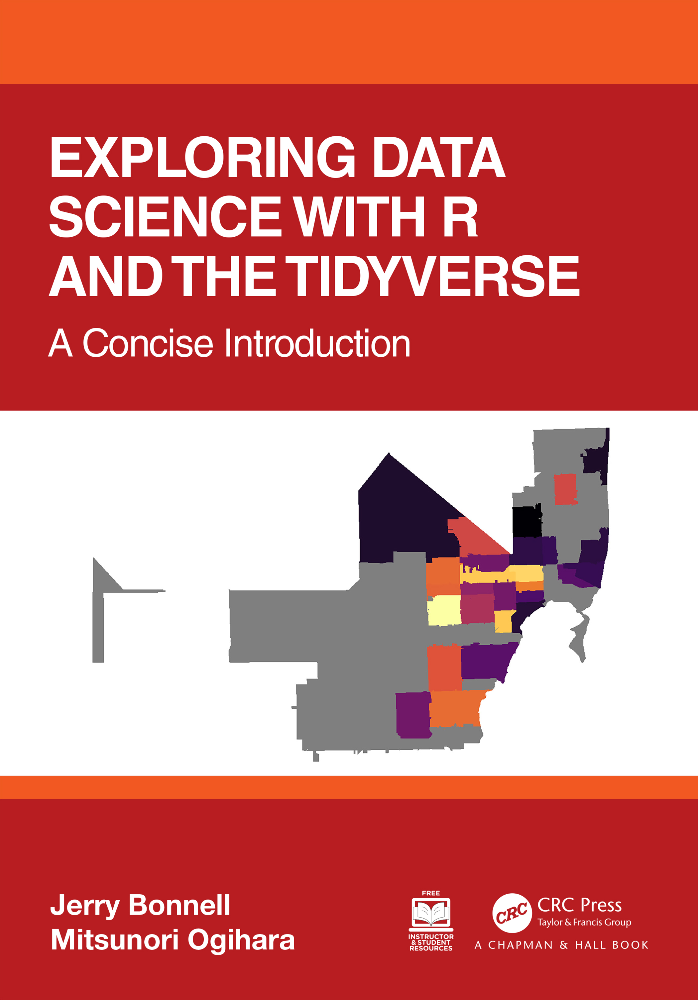

--- 
title: "Exploring Data Science with R and the Tidyverse: A Concise Introduction"
author: "Jerry Bonnell and Mitsunori Ogihara"
knit: "bookdown::render_book"
site: bookdown::bookdown_site
documentclass: krantz
bibliography: [book.bib, packages.bib]
biblio-style: apalike
link-citations: yes
colorlinks: yes
github-repo: jerrybonnell/ds4everyone
cover-image: images/cover.png
lot: no
lof: no
graphics: yes
output:
  bookdown::gitbook:
    df_print: paged
description: "Exploring Data Science with R and the Tidyverse: A Concise Introduction"
---

# Welcome {-}

This is the first edition of "Exploring Data Science with R and the Tidyverse: A Concise Introduction", published by CRC Press. 

This textbook was originally developed to teach the courses *Data Science for the World* (CSC100/CSC113) and *Introduction to Data Science in R* (CSC200) at the University of Miami in Fall 2021 and Fall 2022.

The online version of the text will be updated regularly. You don't have to wait until the next edition for errors to be resolved or new methods to be discussed. Helpful readers have let us know of any typos or errors they found. Please continue to [let us know](https://forms.gle/c3YgzCPkk3HQx7b2A) about such things.

__Colophon__

This book was written in [bookdown](http://bookdown.org/) inside [RStudio](http://www.rstudio.com/ide/). The accompanying website is hosted with [Netlify](https://www.netlify.com), and built from [source](https://github.com/jerrybonnell/ds4everyone) by [GitHub Actions](https://github.com/features/actions). It is made freely available to interested readers at https://ds4world.cs.miami.edu/. 

__License__

This work is licensed under a <a rel="license" href="http://creativecommons.org/licenses/by-nc-sa/4.0/">Creative Commons Attribution-NonCommercial-ShareAlike 4.0 International License</a>.

 

